# Question Bank

## Question 1 | [Link](https://www.examtopics.com/discussions/microsoft/view/78115-exam-dp-100-topic-1-question-1-discussion/){:target="_blank"}

DRAG DROP -

You are planning to host practical training to acquaint staff with Docker for Windows.

Staff devices must support the installation of Docker.

Which of the following are requirements for this installation? Answer by dragging the correct options from the list to the answer area.

Select and Place:

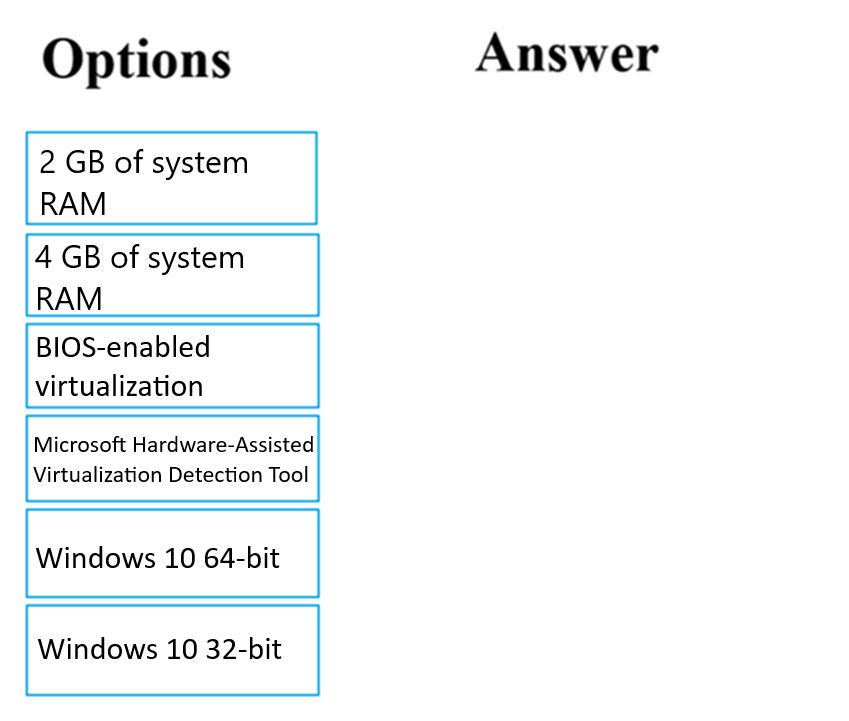

  
Show Suggested Answer

  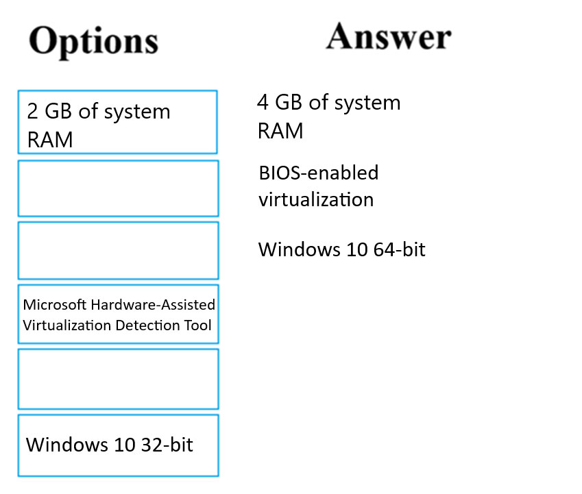

---

## Question 2 | [Link](https://www.examtopics.com/discussions/microsoft/view/70565-exam-dp-100-topic-1-question-2-discussion/){:target="_blank"}

HOTSPOT -

Complete the sentence by selecting the correct option in the answer area.

Hot Area:

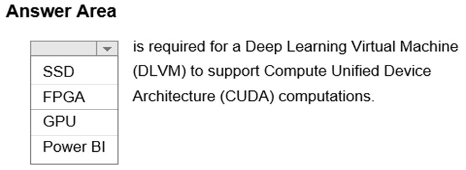

  
Show Suggested Answer

  

---

## Question 3 | [Link](https://www.examtopics.com/discussions/microsoft/view/72897-exam-dp-100-topic-1-question-3-discussion/){:target="_blank"}

You need to implement a Data Science Virtual Machine (DSVM) that supports the Caffe2 deep learning framework.

Which of the following DSVM should you create?

* A.Windows Server 2012 DSVM
* B.Windows Server 2016 DSVM
* C.Ubuntu 16.04 DSVM
* D.CentOS 7.4 DSVM

  
Show Suggested Answer

  C

---

## Question 4 | [Link](https://www.examtopics.com/discussions/microsoft/view/63900-exam-dp-100-topic-1-question-4-discussion/){:target="_blank"}

This question is included in a number of questions that depicts the identical set-up. However, every question has a distinctive result. Establish if the recommendation satisfies the requirements.

You have been tasked with employing a machine learning model, which makes use of a PostgreSQL database and needs GPU processing, to forecast prices.

You are preparing to create a virtual machine that has the necessary tools built into it.

You need to make use of the correct virtual machine type.

Recommendation: You make use of a Geo AI Data Science Virtual Machine (Geo-DSVM) Windows edition.

Will the requirements be satisfied?

* A.Yes
* B.No

  
Show Suggested Answer

  B

---

## Question 5 | [Link](https://www.examtopics.com/discussions/microsoft/view/64078-exam-dp-100-topic-1-question-5-discussion/){:target="_blank"}

This question is included in a number of questions that depicts the identical set-up. However, every question has a distinctive result. Establish if the recommendation satisfies the requirements.

You have been tasked with employing a machine learning model, which makes use of a PostgreSQL database and needs GPU processing, to forecast prices.

You are preparing to create a virtual machine that has the necessary tools built into it.

You need to make use of the correct virtual machine type.

Recommendation: You make use of a Deep Learning Virtual Machine (DLVM) Windows edition.

Will the requirements be satisfied?

* A.Yes
* B.No

  
Show Suggested Answer

  A

---

## Question 6 | [Link](https://www.examtopics.com/discussions/microsoft/view/70838-exam-dp-100-topic-1-question-6-discussion/){:target="_blank"}

This question is included in a number of questions that depicts the identical set-up. However, every question has a distinctive result. Establish if the recommendation satisfies the requirements.

You have been tasked with employing a machine learning model, which makes use of a PostgreSQL database and needs GPU processing, to forecast prices.

You are preparing to create a virtual machine that has the necessary tools built into it.

You need to make use of the correct virtual machine type.

Recommendation: You make use of a Data Science Virtual Machine (DSVM) Windows edition.

Will the requirements be satisfied?

* A.Yes
* B.No

  
Show Suggested Answer

  B

---

## Question 7 | [Link](https://www.examtopics.com/discussions/microsoft/view/76818-exam-dp-100-topic-1-question-7-discussion/){:target="_blank"}

DRAG DROP -

You have been tasked with moving data into Azure Blob Storage for the purpose of supporting Azure Machine Learning.

Which of the following can be used to complete your task? Answer by dragging the correct options from the list to the answer area.

Select and Place:

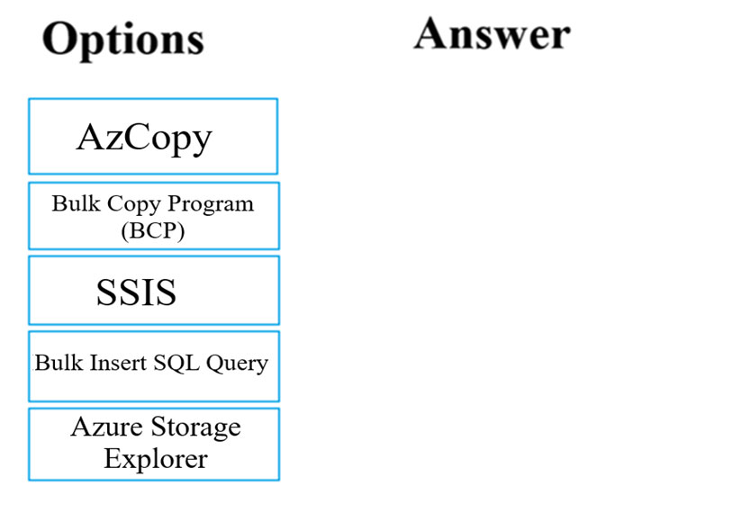

  
Show Suggested Answer

  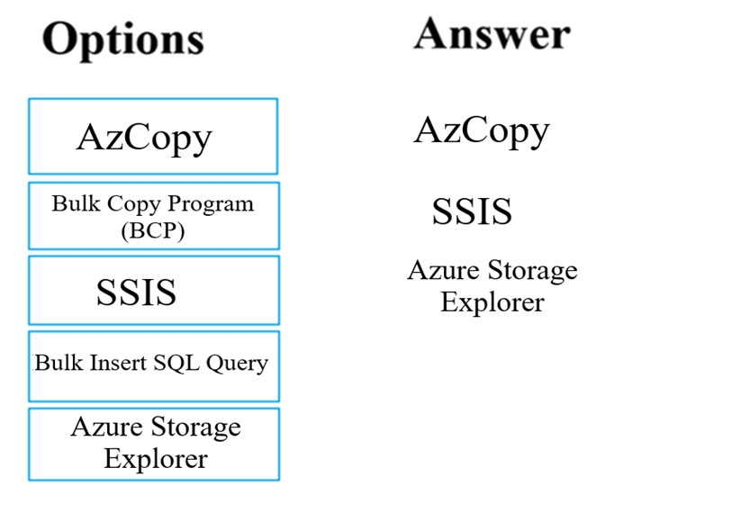

---

## Question 8 | [Link](https://www.examtopics.com/discussions/microsoft/view/71955-exam-dp-100-topic-1-question-8-discussion/){:target="_blank"}

HOTSPOT -

Complete the sentence by selecting the correct option in the answer area.

Hot Area:

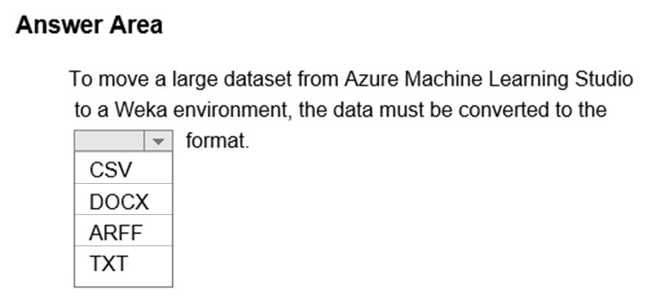

  
Show Suggested Answer

  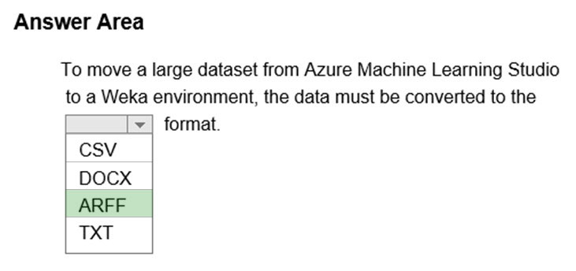

---

## Question 9 | [Link](https://www.examtopics.com/discussions/microsoft/view/78116-exam-dp-100-topic-1-question-9-discussion/){:target="_blank"}

You have been tasked with designing a deep learning model, which accommodates the most recent edition of Python, to recognize language.

You have to include a suitable deep learning framework in the Data Science Virtual Machine (DSVM).

Which of the following actions should you take?

* A.You should consider including Rattle.
* B.You should consider including TensorFlow.
* C.You should consider including Theano.
* D.You should consider including Chainer.

  
Show Suggested Answer

  B

---

## Question 10 | [Link](https://www.examtopics.com/discussions/microsoft/view/57134-exam-dp-100-topic-1-question-10-discussion/){:target="_blank"}

This question is included in a number of questions that depicts the identical set-up. However, every question has a distinctive result. Establish if the recommendation satisfies the requirements.

You have been tasked with evaluating your model on a partial data sample via k-fold cross-validation.

You have already configured a k parameter as the number of splits. You now have to configure the k parameter for the cross-validation with the usual value choice.

Recommendation: You configure the use of the value k=3.

Will the requirements be satisfied?

* A.Yes
* B.No

  
Show Suggested Answer

  B

---

## Question 11 | [Link](https://www.examtopics.com/discussions/microsoft/view/68001-exam-dp-100-topic-1-question-11-discussion/){:target="_blank"}

This question is included in a number of questions that depicts the identical set-up. However, every question has a distinctive result. Establish if the recommendation satisfies the requirements.

You have been tasked with evaluating your model on a partial data sample via k-fold cross-validation.

You have already configured a k parameter as the number of splits. You now have to configure the k parameter for the cross-validation with the usual value choice.

Recommendation: You configure the use of the value k=10.

Will the requirements be satisfied?

* A.Yes
* B.No

  
Show Suggested Answer

  A

---

## Question 12 | [Link](https://www.examtopics.com/discussions/microsoft/view/69015-exam-dp-100-topic-1-question-12-discussion/){:target="_blank"}

You construct a machine learning experiment via Azure Machine Learning Studio.

You would like to split data into two separate datasets.

Which of the following actions should you take?

* A.You should make use of the Split Data module.
* B.You should make use of the Group Categorical Values module.
* C.You should make use of the Clip Values module.
* D.You should make use of the Group Data into Bins module.

  
Show Suggested Answer

  A

---

## Question 13 | [Link](https://www.examtopics.com/discussions/microsoft/view/70173-exam-dp-100-topic-1-question-13-discussion/){:target="_blank"}

You have been tasked with creating a new Azure pipeline via the Machine Learning designer.

You have to makes sure that the pipeline trains a model using data in a comma-separated values (CSV) file that is published on a website. A dataset for the file for this file does not exist.

Data from the CSV file must be ingested into the designer pipeline with the least amount of administrative effort as possible.

Which of the following actions should you take?

* A.You should make use of the Convert to TXT module.
* B.You should add the Copy Data object to the pipeline.
* C.You should add the Import Data object to the pipeline.
* D.You should add the Dataset object to the pipeline.

  
Show Suggested Answer

  C

---

## Question 14 | [Link](https://www.examtopics.com/discussions/microsoft/view/68987-exam-dp-100-topic-1-question-14-discussion/){:target="_blank"}

This question is included in a number of questions that depicts the identical set-up. However, every question has a distinctive result. Establish if the recommendation satisfies the requirements.

You are in the process of creating a machine learning model. Your dataset includes rows with null and missing values.

You plan to make use of the Clean Missing Data module in Azure Machine Learning Studio to detect and fix the null and missing values in the dataset.

Recommendation: You make use of the Replace with median option.

Will the requirements be satisfied?

* A.Yes
* B.No

  
Show Suggested Answer

  A

---

## Question 15 | [Link](https://www.examtopics.com/discussions/microsoft/view/70839-exam-dp-100-topic-1-question-15-discussion/){:target="_blank"}

This question is included in a number of questions that depicts the identical set-up. However, every question has a distinctive result. Establish if the recommendation satisfies the requirements.

You are in the process of creating a machine learning model. Your dataset includes rows with null and missing values.

You plan to make use of the Clean Missing Data module in Azure Machine Learning Studio to detect and fix the null and missing values in the dataset.

Recommendation: You make use of the Custom substitution value option.

Will the requirements be satisfied?

* A.Yes
* B.No

  
Show Suggested Answer

  A

---

## Question 16 | [Link](https://www.examtopics.com/discussions/microsoft/view/70840-exam-dp-100-topic-1-question-16-discussion/){:target="_blank"}

This question is included in a number of questions that depicts the identical set-up. However, every question has a distinctive result. Establish if the recommendation satisfies the requirements.

You are in the process of creating a machine learning model. Your dataset includes rows with null and missing values.

You plan to make use of the Clean Missing Data module in Azure Machine Learning Studio to detect and fix the null and missing values in the dataset.

Recommendation: You make use of the Remove entire row option.

Will the requirements be satisfied?

* A.Yes
* B.No

  
Show Suggested Answer

  A

---

## Question 17 | [Link](https://www.examtopics.com/discussions/microsoft/view/72694-exam-dp-100-topic-1-question-17-discussion/){:target="_blank"}

You need to consider the underlined segment to establish whether it is accurate.

To transform a categorical feature into a binary indicator, you should make use of the Clean Missing Data module.

Select `No adjustment required` if the underlined segment is accurate. If the underlined segment is inaccurate, select the accurate option.

* A.No adjustment required.
* B.Convert to Indicator Values
* C.Apply SQL Transformation
* D.Group Categorical Values

  
Show Suggested Answer

  B

---

## Question 18 | [Link](https://www.examtopics.com/discussions/microsoft/view/73624-exam-dp-100-topic-1-question-18-discussion/){:target="_blank"}

You need to consider the underlined segment to establish whether it is accurate.

To improve the amount of low incidence cases in a dataset, you should make use of the SMOTE module.

Select `No adjustment required` if the underlined segment is accurate. If the underlined segment is inaccurate, select the accurate option.

* A.No adjustment required.
* B.Remove Duplicate Rows
* C.Join Data
* D.Edit Metadata

  
Show Suggested Answer

  A

---

## Question 19 | [Link](https://www.examtopics.com/discussions/microsoft/view/69927-exam-dp-100-topic-1-question-19-discussion/){:target="_blank"}

HOTSPOT -

You need to consider the underlined segment to establish whether it is accurate.

Hot Area:

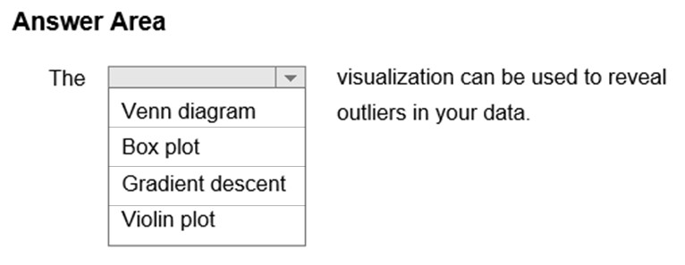

  
Show Suggested Answer

  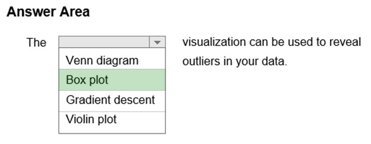

---

## Question 20 | [Link](https://www.examtopics.com/discussions/microsoft/view/69928-exam-dp-100-topic-1-question-20-discussion/){:target="_blank"}

You are planning to host practical training to acquaint learners with data visualization creation using Python. Learner devices are able to connect to the internet.

Learner devices are currently NOT configured for Python development. Also, learners are unable to install software on their devices as they lack administrator permissions. Furthermore, they are unable to access Azure subscriptions.

It is imperative that learners are able to execute Python-based data visualization code.

Which of the following actions should you take?

* A.You should consider configuring the use of Azure Container Instance.
* B.You should consider configuring the use of Azure BatchAI.
* C.You should consider configuring the use of Azure Notebooks.
* D.You should consider configuring the use of Azure Kubernetes Service.

  
Show Suggested Answer

  C

---

## Question 21 | [Link](https://www.examtopics.com/discussions/microsoft/view/70841-exam-dp-100-topic-1-question-21-discussion/){:target="_blank"}

HOTSPOT -

Complete the sentence by selecting the correct option in the answer area.

Hot Area:

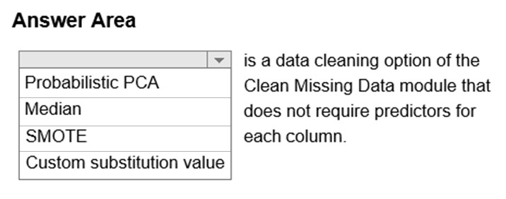

  
Show Suggested Answer

  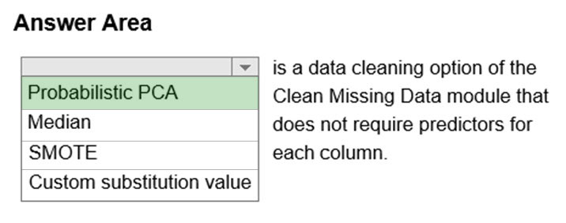

---

## Question 22 | [Link](https://www.examtopics.com/discussions/microsoft/view/59576-exam-dp-100-topic-1-question-22-discussion/){:target="_blank"}

You have recently concluded the construction of a binary classification machine learning model.

You are currently assessing the model. You want to make use of a visualization that allows for precision to be used as the measurement for the assessment.

Which of the following actions should you take?

* A.You should consider using Venn diagram visualization.
* B.You should consider using Receiver Operating Characteristic (ROC) curve visualization.
* C.You should consider using Box plot visualization.
* D.You should consider using the Binary classification confusion matrix visualization.

  
Show Suggested Answer

  D

---

## Question 23 | [Link](https://www.examtopics.com/discussions/microsoft/view/58964-exam-dp-100-topic-1-question-23-discussion/){:target="_blank"}

This question is included in a number of questions that depicts the identical set-up. However, every question has a distinctive result. Establish if the recommendation satisfies the requirements.

You have been tasked with evaluating your model on a partial data sample via k-fold cross-validation.

You have already configured a k parameter as the number of splits. You now have to configure the k parameter for the cross-validation with the usual value choice.

Recommendation: You configure the use of the value k=1.

Will the requirements be satisfied?

* A.Yes
* B.No

  
Show Suggested Answer

  B

---

## Question 24 | [Link](https://www.examtopics.com/discussions/microsoft/view/73625-exam-dp-100-topic-1-question-24-discussion/){:target="_blank"}

DRAG DROP -

You are in the process of constructing a regression model.

You would like to make it a Poisson regression model. To achieve your goal, the feature values need to meet certain conditions.

Which of the following are relevant conditions with regards to the label data? Answer by dragging the correct options from the list to the answer area.

Select and Place:

  
Show Suggested Answer

  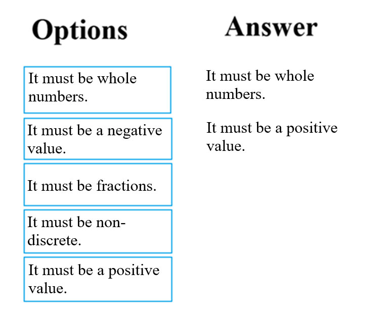

---

## Question 25 | [Link](https://www.examtopics.com/discussions/microsoft/view/65938-exam-dp-100-topic-1-question-25-discussion/){:target="_blank"}

This question is included in a number of questions that depicts the identical set-up. However, every question has a distinctive result. Establish if the recommendation satisfies the requirements.

You are in the process of carrying out feature engineering on a dataset.

You want to add a feature to the dataset and fill the column value.

Recommendation: You must make use of the Group Categorical Values Azure Machine Learning Studio module.

Will the requirements be satisfied?

* A.Yes
* B.No

  
Show Suggested Answer

  B

---

## Question 26 | [Link](https://www.examtopics.com/discussions/microsoft/view/66320-exam-dp-100-topic-1-question-26-discussion/){:target="_blank"}

This question is included in a number of questions that depicts the identical set-up. However, every question has a distinctive result. Establish if the recommendation satisfies the requirements.

You are in the process of carrying out feature engineering on a dataset.

You want to add a feature to the dataset and fill the column value.

Recommendation: You must make use of the Join Data Azure Machine Learning Studio module.

Will the requirements be satisfied?

* A.Yes
* B.No

  
Show Suggested Answer

  B

---

## Question 27 | [Link](https://www.examtopics.com/discussions/microsoft/view/57137-exam-dp-100-topic-1-question-27-discussion/){:target="_blank"}

This question is included in a number of questions that depicts the identical set-up. However, every question has a distinctive result. Establish if the recommendation satisfies the requirements.

You are in the process of carrying out feature engineering on a dataset.

You want to add a feature to the dataset and fill the column value.

Recommendation: You must make use of the Edit Metadata Azure Machine Learning Studio module.

Will the requirements be satisfied?

* A.Yes
* B.No

  
Show Suggested Answer

  B

---

## Question 28 | [Link](https://www.examtopics.com/discussions/microsoft/view/70106-exam-dp-100-topic-1-question-28-discussion/){:target="_blank"}

You have been tasked with ascertaining if two sets of data differ considerably. You will make use of Azure Machine Learning Studio to complete your task.

You plan to perform a paired t-test.

Which of the following are conditions that must apply to use a paired t-test? (Choose all that apply.)

* A.All scores are independent from each other.
* B.You have a matched pairs of scores.
* C.The sampling distribution of d is normal.
* D.The sampling distribution of x1- x2 is normal.

  
Show Suggested Answer

  BC

---

## Question 29 | [Link](https://www.examtopics.com/discussions/microsoft/view/57139-exam-dp-100-topic-1-question-29-discussion/){:target="_blank"}

You want to train a classification model using data located in a comma-separated values (CSV) file.

The classification model will be trained via the Automated Machine Learning interface using the Classification task type.

You have been informed that only linear models need to be assessed by the Automated Machine Learning.

Which of the following actions should you take?

* A.You should disable deep learning.
* B.You should enable automatic featurization.
* C.You should disable automatic featurization.
* D.You should set the task type to Forecasting.

  
Show Suggested Answer

  A

---

## Question 30 | [Link](https://www.examtopics.com/discussions/microsoft/view/73626-exam-dp-100-topic-1-question-30-discussion/){:target="_blank"}

You are preparing to train a regression model via automated machine learning. The data available to you has features with missing values, as well as categorical features with little discrete values.

You want to make sure that automated machine learning is configured as follows:

✑ missing values must be automatically imputed.

✑ categorical features must be encoded as part of the training task.

Which of the following actions should you take?

* A.You should make use of the featurization parameter with the 'auto' value pair.
* B.You should make use of the featurization parameter with the 'off' value pair.
* C.You should make use of the featurization parameter with the 'on' value pair.
* D.You should make use of the featurization parameter with the 'FeaturizationConfig' value pair.

  
Show Suggested Answer

  A

---

## Question 31 | [Link](https://www.examtopics.com/discussions/microsoft/view/56853-exam-dp-100-topic-1-question-31-discussion/){:target="_blank"}

You make use of Azure Machine Learning Studio to develop a linear regression model. You perform an experiment to assess various algorithms.

Which of the following is an algorithm that reduces the variances between actual and predicted values?

* A.Fast Forest Quantile Regression
* B.Poisson Regression
* C.Boosted Decision Tree Regression
* D.Linear Regression

  
Show Suggested Answer

  D

---

## Question 32 | [Link](https://www.examtopics.com/discussions/microsoft/view/59850-exam-dp-100-topic-1-question-32-discussion/){:target="_blank"}

This question is included in a number of questions that depicts the identical set-up. However, every question has a distinctive result. Establish if the recommendation satisfies the requirements.

You have been tasked with constructing a machine learning model that translates language text into a different language text.

The machine learning model must be constructed and trained to learn the sequence of the.

Recommendation: You make use of Convolutional Neural Networks (CNNs).

Will the requirements be satisfied?

* A.Yes
* B.No

  
Show Suggested Answer

  B

---

## Question 33 | [Link](https://www.examtopics.com/discussions/microsoft/view/70607-exam-dp-100-topic-1-question-33-discussion/){:target="_blank"}

This question is included in a number of questions that depicts the identical set-up. However, every question has a distinctive result. Establish if the recommendation satisfies the requirements.

You have been tasked with constructing a machine learning model that translates language text into a different language text.

The machine learning model must be constructed and trained to learn the sequence of the.

Recommendation: You make use of Generative Adversarial Networks (GANs).

Will the requirements be satisfied?

* A.Yes
* B.No

  
Show Suggested Answer

  B

---

## Question 34 | [Link](https://www.examtopics.com/discussions/microsoft/view/78122-exam-dp-100-topic-1-question-34-discussion/){:target="_blank"}

This question is included in a number of questions that depicts the identical set-up. However, every question has a distinctive result. Establish if the recommendation satisfies the requirements.

You have been tasked with constructing a machine learning model that translates language text into a different language text.

The machine learning model must be constructed and trained to learn the sequence of the.

Recommendation: You make use of Recurrent Neural Networks (RNNs).

Will the requirements be satisfied?

* A.Yes
* B.No

  
Show Suggested Answer

  A

---

## Question 35 | [Link](https://www.examtopics.com/discussions/microsoft/view/73627-exam-dp-100-topic-1-question-35-discussion/){:target="_blank"}

DRAG DROP -

You have been tasked with evaluating the performance of a binary classification model that you created.

You need to choose evaluation metrics to achieve your goal.

Which of the following are the metrics you would choose? Answer by dragging the correct options from the list to the answer area.

Select and Place:

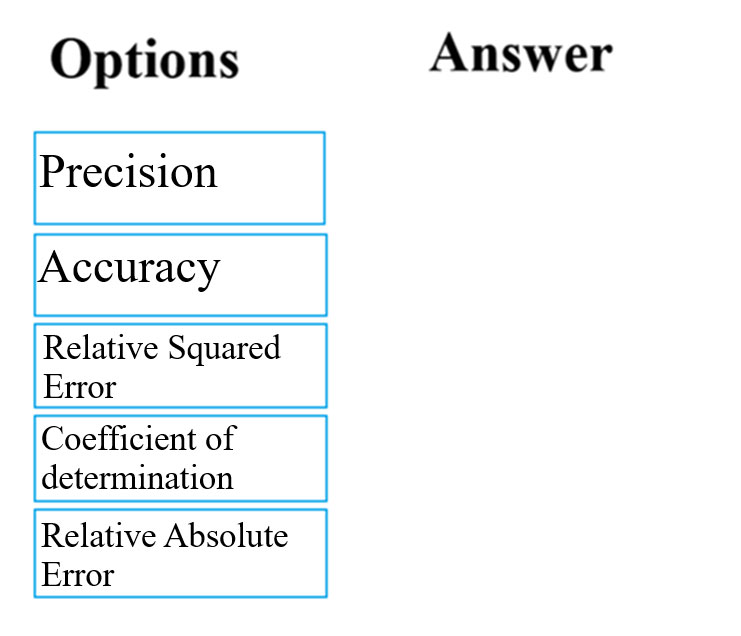

  
Show Suggested Answer

  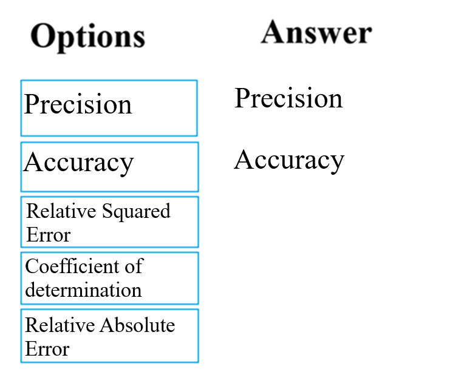

---

## Question 36 | [Link](https://www.examtopics.com/discussions/microsoft/view/76882-exam-dp-100-topic-1-question-36-discussion/){:target="_blank"}

DRAG DROP -

You build a binary classification model using the Azure Machine Learning Studio Two-Class Neural Network module.

You are preparing to configure the Tune Model Hyperparameters module for the purpose of tuning accuracy for the model.

Which of the following are valid parameters for the Two-Class Neural Network module? Answer by dragging the correct options from the list to the answer area.

Select and Place:

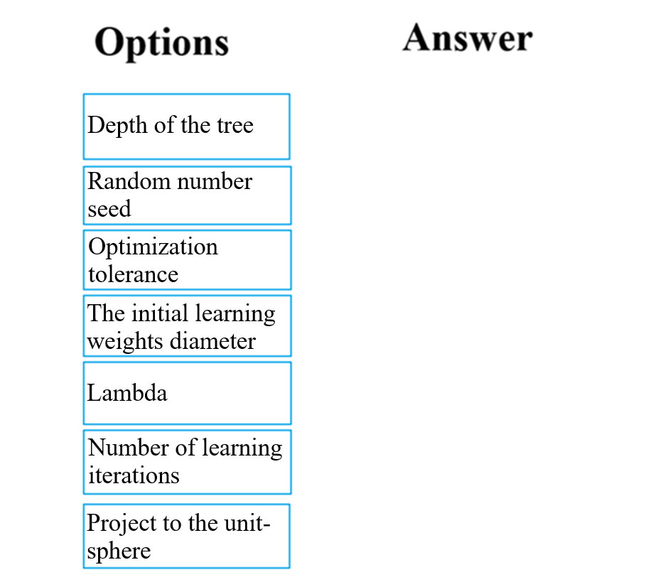

  
Show Suggested Answer

  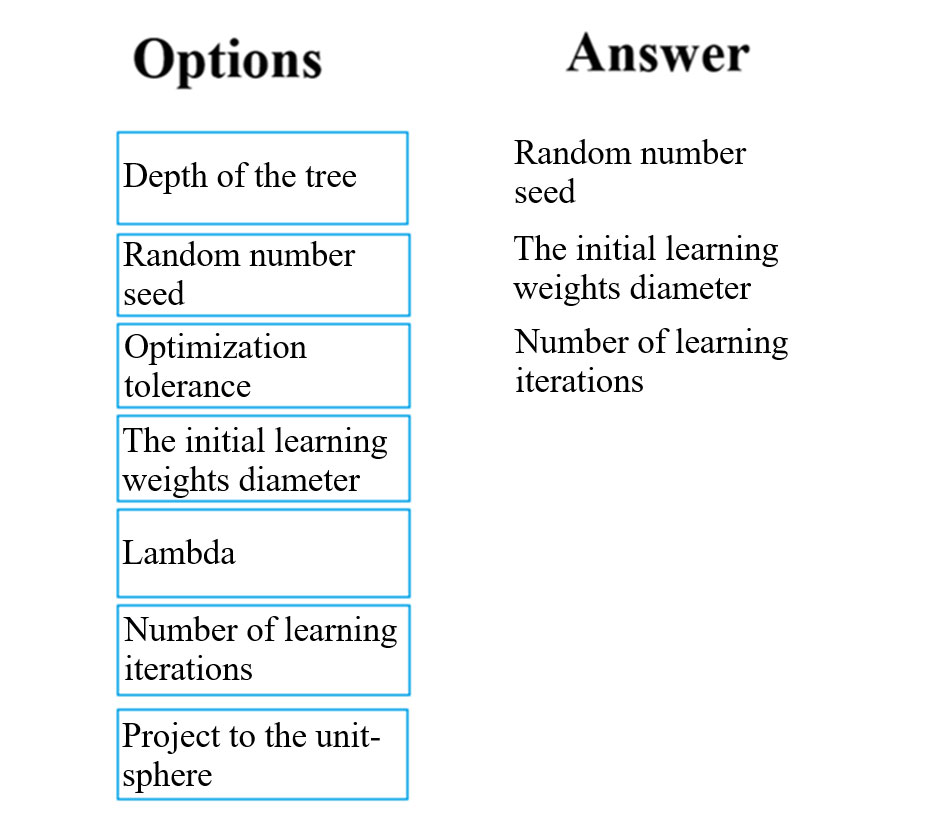

---

## Question 37 | [Link](https://www.examtopics.com/discussions/microsoft/view/57147-exam-dp-100-topic-1-question-37-discussion/){:target="_blank"}

You make use of Azure Machine Learning Studio to create a binary classification model.

You are preparing to carry out a parameter sweep of the model to tune hyperparameters. You have to make sure that the sweep allows for every possible combination of hyperparameters to be iterated. Also, the computing resources needed to carry out the sweep must be reduced.

Which of the following actions should you take?

* A.You should consider making use of the Selective grid sweep mode.
* B.You should consider making use of the Measured grid sweep mode.
* C.You should consider making use of the Entire grid sweep mode.
* D.You should consider making use of the Random grid sweep mode.

  
Show Suggested Answer

  D

---

## Question 38 | [Link](https://www.examtopics.com/discussions/microsoft/view/57154-exam-dp-100-topic-1-question-38-discussion/){:target="_blank"}

You are in the process of constructing a deep convolutional neural network (CNN). The CNN will be used for image classification.

You notice that the CNN model you constructed displays hints of overfitting.

You want to make sure that overfitting is minimized, and that the model is converged to an optimal fit.

Which of the following is TRUE with regards to achieving your goal?

* A.You have to add an additional dense layer with 512 input units, and reduce the amount of training data.
* B.You have to add L1/L2 regularization, and reduce the amount of training data.
* C.You have to reduce the amount of training data and make use of training data augmentation.
* D.You have to add L1/L2 regularization, and make use of training data augmentation.
* E.You have to add an additional dense layer with 512 input units, and add L1/L2 regularization.

  
Show Suggested Answer

  D

---

## Question 39 | [Link](https://www.examtopics.com/discussions/microsoft/view/61020-exam-dp-100-topic-1-question-39-discussion/){:target="_blank"}

This question is included in a number of questions that depicts the identical set-up. However, every question has a distinctive result. Establish if the recommendation satisfies the requirements.

You are planning to make use of Azure Machine Learning designer to train models.

You need choose a suitable compute type.

Recommendation: You choose Attached compute.

Will the requirements be satisfied?

* A.Yes
* B.No

  
Show Suggested Answer

  B

---

## Question 40 | [Link](https://www.examtopics.com/discussions/microsoft/view/59016-exam-dp-100-topic-1-question-40-discussion/){:target="_blank"}

This question is included in a number of questions that depicts the identical set-up. However, every question has a distinctive result. Establish if the recommendation satisfies the requirements.

You are planning to make use of Azure Machine Learning designer to train models.

You need choose a suitable compute type.

Recommendation: You choose Inference cluster.

Will the requirements be satisfied?

* A.Yes
* B.No

  
Show Suggested Answer

  B

---

## Question 41 | [Link](https://www.examtopics.com/discussions/microsoft/view/57729-exam-dp-100-topic-1-question-41-discussion/){:target="_blank"}

This question is included in a number of questions that depicts the identical set-up. However, every question has a distinctive result. Establish if the recommendation satisfies the requirements.

You are planning to make use of Azure Machine Learning designer to train models.

You need choose a suitable compute type.

Recommendation: You choose Compute cluster.

Will the requirements be satisfied?

* A.Yes
* B.No

  
Show Suggested Answer

  A

---

## Question 42 | [Link](https://www.examtopics.com/discussions/microsoft/view/72690-exam-dp-100-topic-1-question-42-discussion/){:target="_blank"}

You are making use of the Azure Machine Learning to designer construct an experiment.

After dividing a dataset into training and testing sets, you configure the algorithm to be Two-Class Boosted Decision Tree.

You are preparing to ascertain the Area Under the Curve (AUC).

Which of the following is a sequential combination of the models required to achieve your goal?

* A.Train, Score, Evaluate.
* B.Score, Evaluate, Train.
* C.Evaluate, Export Data, Train.
* D.Train, Score, Export Data.

  
Show Suggested Answer

  A

---

## Question 43 | [Link](https://www.examtopics.com/discussions/microsoft/view/103563-exam-dp-100-topic-1-question-43-discussion/){:target="_blank"}

DRAG DROP

-

You create an Azure Machine Learning workspace.

You must implement dedicated compute for model training in the workspace by using Azure Synapse compute resources. The solution must attach the dedicated compute and start an Azure Synapse session.

You need to implement the computer resources.

Which three actions should you perform in sequence? To answer, move the appropriate actions from the list of actions to the answer area and arrange them in the correct order.

  
Show Suggested Answer

  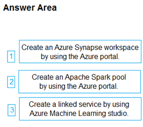

---

## Question 44 | [Link](https://www.examtopics.com/discussions/microsoft/view/21184-exam-dp-100-topic-2-question-1-discussion/){:target="_blank"}

You are developing a hands-on workshop to introduce Docker for Windows to attendees.

You need to ensure that workshop attendees can install Docker on their devices.

Which two prerequisite components should attendees install on the devices? Each correct answer presents part of the solution.

NOTE: Each correct selection is worth one point.

* A.Microsoft Hardware-Assisted Virtualization Detection Tool
* B.Kitematic
* C.BIOS-enabled virtualization
* D.VirtualBox
* E.Windows 10 64-bit Professional

  
Show Suggested Answer

  CE

---

## Question 45 | [Link](https://www.examtopics.com/discussions/microsoft/view/23701-exam-dp-100-topic-2-question-2-discussion/){:target="_blank"}

Your team is building a data engineering and data science development environment.

The environment must support the following requirements:

✑ support Python and Scala

✑ compose data storage, movement, and processing services into automated data pipelines

✑ the same tool should be used for the orchestration of both data engineering and data science

✑ support workload isolation and interactive workloads

✑ enable scaling across a cluster of machines

You need to create the environment.

What should you do?

* A.Build the environment in Apache Hive for HDInsight and use Azure Data Factory for orchestration.
* B.Build the environment in Azure Databricks and use Azure Data Factory for orchestration.
* C.Build the environment in Apache Spark for HDInsight and use Azure Container Instances for orchestration.
* D.Build the environment in Azure Databricks and use Azure Container Instances for orchestration.

  
Show Suggested Answer

  B

---

## Question 46 | [Link](https://www.examtopics.com/discussions/microsoft/view/31300-exam-dp-100-topic-2-question-3-discussion/){:target="_blank"}

DRAG DROP -

You are building an intelligent solution using machine learning models.

The environment must support the following requirements:

✑ Data scientists must build notebooks in a cloud environment

✑ Data scientists must use automatic feature engineering and model building in machine learning pipelines.

✑ Notebooks must be deployed to retrain using Spark instances with dynamic worker allocation.

✑ Notebooks must be exportable to be version controlled locally.

You need to create the environment.

Which four actions should you perform in sequence? To answer, move the appropriate actions from the list of actions to the answer area and arrange them in the correct order.

Select and Place:

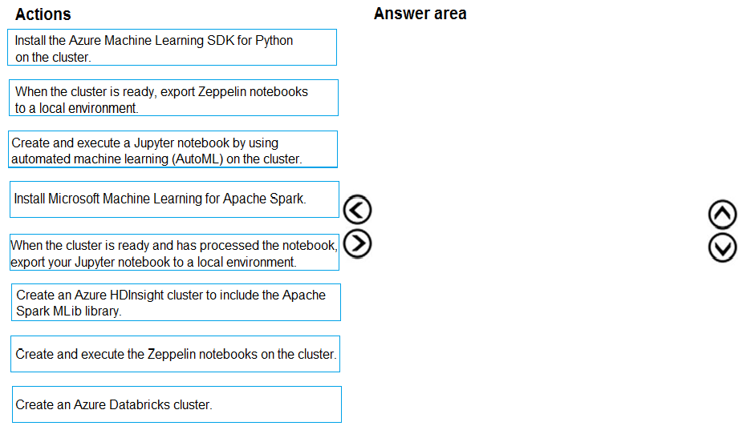

  
Show Suggested Answer

  

---

## Question 47 | [Link](https://www.examtopics.com/discussions/microsoft/view/11094-exam-dp-100-topic-2-question-4-discussion/){:target="_blank"}

You plan to build a team data science environment. Data for training models in machine learning pipelines will be over 20 GB in size.

You have the following requirements:

✑ Models must be built using Caffe2 or Chainer frameworks.

✑ Data scientists must be able to use a data science environment to build the machine learning pipelines and train models on their personal devices in both connected and disconnected network environments.

Personal devices must support updating machine learning pipelines when connected to a network.

You need to select a data science environment.

Which environment should you use?

* A.Azure Machine Learning Service
* B.Azure Machine Learning Studio
* C.Azure Databricks
* D.Azure Kubernetes Service (AKS)

  
Show Suggested Answer

  A

---

## Question 48 | [Link](https://www.examtopics.com/discussions/microsoft/view/34397-exam-dp-100-topic-2-question-5-discussion/){:target="_blank"}

You are implementing a machine learning model to predict stock prices.

The model uses a PostgreSQL database and requires GPU processing.

You need to create a virtual machine that is pre-configured with the required tools.

What should you do?

* A.Create a Data Science Virtual Machine (DSVM) Windows edition.
* B.Create a Geo Al Data Science Virtual Machine (Geo-DSVM) Windows edition.
* C.Create a Deep Learning Virtual Machine (DLVM) Linux edition.
* D.Create a Deep Learning Virtual Machine (DLVM) Windows edition.

  
Show Suggested Answer

  C

---

## Question 49 | [Link](https://www.examtopics.com/discussions/microsoft/view/11936-exam-dp-100-topic-2-question-6-discussion/){:target="_blank"}

You are developing deep learning models to analyze semi-structured, unstructured, and structured data types.

You have the following data available for model building:

✑ Video recordings of sporting events

✑ Transcripts of radio commentary about events

✑ Logs from related social media feeds captured during sporting events

You need to select an environment for creating the model.

Which environment should you use?

* A.Azure Cognitive Services
* B.Azure Data Lake Analytics
* C.Azure HDInsight with Spark MLib
* D.Azure Machine Learning Studio

  
Show Suggested Answer

  A

---

## Question 50 | [Link](https://www.examtopics.com/discussions/microsoft/view/36483-exam-dp-100-topic-2-question-7-discussion/){:target="_blank"}

You must store data in Azure Blob Storage to support Azure Machine Learning.

You need to transfer the data into Azure Blob Storage.

What are three possible ways to achieve the goal? Each correct answer presents a complete solution.

NOTE: Each correct selection is worth one point.

* A.Bulk Insert SQL Query
* B.AzCopy
* C.Python script
* D.Azure Storage Explorer
* E.Bulk Copy Program (BCP)

  
Show Suggested Answer

  BCD

---

## Question 51 | [Link](https://www.examtopics.com/discussions/microsoft/view/36484-exam-dp-100-topic-2-question-8-discussion/){:target="_blank"}

You are moving a large dataset from Azure Machine Learning Studio to a Weka environment.

You need to format the data for the Weka environment.

Which module should you use?

* A.Convert to CSV
* B.Convert to Dataset
* C.Convert to ARFF
* D.Convert to SVMLight

  
Show Suggested Answer

  C

---

## Question 52 | [Link](https://www.examtopics.com/discussions/microsoft/view/36485-exam-dp-100-topic-2-question-9-discussion/){:target="_blank"}

You plan to create a speech recognition deep learning model.

The model must support the latest version of Python.

You need to recommend a deep learning framework for speech recognition to include in the Data Science Virtual Machine (DSVM).

What should you recommend?

* A.Rattle
* B.TensorFlow
* C.Weka
* D.Scikit-learn

  
Show Suggested Answer

  B

---

## Question 53 | [Link](https://www.examtopics.com/discussions/microsoft/view/36486-exam-dp-100-topic-2-question-10-discussion/){:target="_blank"}

You plan to use a Deep Learning Virtual Machine (DLVM) to train deep learning models using Compute Unified Device Architecture (CUDA) computations.

You need to configure the DLVM to support CUDA.

What should you implement?

* A.Solid State Drives (SSD)
* B.Computer Processing Unit (CPU) speed increase by using overclocking
* C.Graphic Processing Unit (GPU)
* D.High Random Access Memory (RAM) configuration
* E.Intel Software Guard Extensions (Intel SGX) technology

  
Show Suggested Answer

  C

---

## Question 54 | [Link](https://www.examtopics.com/discussions/microsoft/view/20634-exam-dp-100-topic-2-question-11-discussion/){:target="_blank"}

You plan to use a Data Science Virtual Machine (DSVM) with the open source deep learning frameworks Caffe2 and PyTorch.

You need to select a pre-configured DSVM to support the frameworks.

What should you create?

* A.Data Science Virtual Machine for Windows 2012
* B.Data Science Virtual Machine for Linux (CentOS)
* C.Geo AI Data Science Virtual Machine with ArcGIS
* D.Data Science Virtual Machine for Windows 2016
* E.Data Science Virtual Machine for Linux (Ubuntu)

  
Show Suggested Answer

  E

---

## Question 55 | [Link](https://www.examtopics.com/discussions/microsoft/view/57095-exam-dp-100-topic-2-question-12-discussion/){:target="_blank"}

HOTSPOT -

You are performing sentiment analysis using a CSV file that includes 12,000 customer reviews written in a short sentence format. You add the CSV file to Azure

Machine Learning Studio and configure it as the starting point dataset of an experiment. You add the Extract N-Gram Features from Text module to the experiment to extract key phrases from the customer review column in the dataset.

You must create a new n-gram dictionary from the customer review text and set the maximum n-gram size to trigrams.

What should you select? To answer, select the appropriate options in the answer area.

NOTE: Each correct selection is worth one point.

Hot Area:

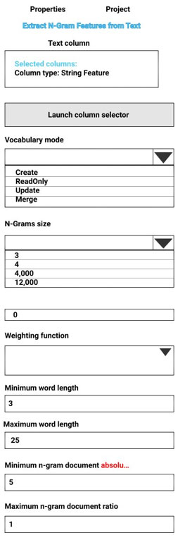

  
Show Suggested Answer

  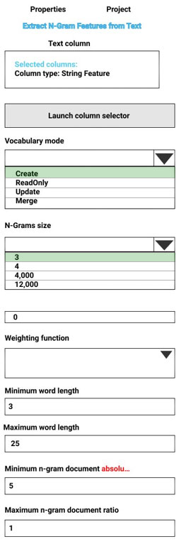

---

## Question 56 | [Link](https://www.examtopics.com/discussions/microsoft/view/23269-exam-dp-100-topic-2-question-13-discussion/){:target="_blank"}

You are developing a data science workspace that uses an Azure Machine Learning service.

You need to select a compute target to deploy the workspace.

What should you use?

* A.Azure Data Lake Analytics
* B.Azure Databricks
* C.Azure Container Service
* D.Apache Spark for HDInsight

  
Show Suggested Answer

  B

---

## Question 57 | [Link](https://www.examtopics.com/discussions/microsoft/view/36488-exam-dp-100-topic-2-question-14-discussion/){:target="_blank"}

You are solving a classification task.

The dataset is imbalanced.

You need to select an Azure Machine Learning Studio module to improve the classification accuracy.

Which module should you use?

* A.Permutation Feature Importance
* B.Filter Based Feature Selection
* C.Fisher Linear Discriminant Analysis
* D.Synthetic Minority Oversampling Technique (SMOTE)

  
Show Suggested Answer

  D

---

## Question 58 | [Link](https://www.examtopics.com/discussions/microsoft/view/20564-exam-dp-100-topic-2-question-15-discussion/){:target="_blank"}

DRAG DROP -

You configure a Deep Learning Virtual Machine for Windows.

You need to recommend tools and frameworks to perform the following:

✑ Build deep neural network (DNN) models

✑ Perform interactive data exploration and visualization

Which tools and frameworks should you recommend? To answer, drag the appropriate tools to the correct tasks. Each tool may be used once, more than once, or not at all. You may need to drag the split bar between panes or scroll to view content.

NOTE: Each correct selection is worth one point.

Select and Place:

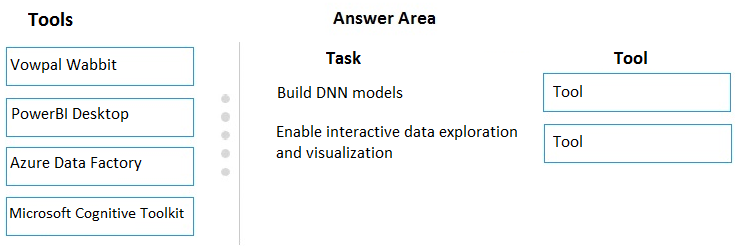

  
Show Suggested Answer

  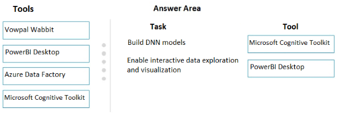

---

## Question 59 | [Link](https://www.examtopics.com/discussions/microsoft/view/13041-exam-dp-100-topic-2-question-16-discussion/){:target="_blank"}

You use Azure Machine Learning Studio to build a machine learning experiment.

You need to divide data into two distinct datasets.

Which module should you use?

* A.Assign Data to Clusters
* B.Load Trained Model
* C.Partition and Sample
* D.Tune Model-Hyperparameters

  
Show Suggested Answer

  C

---

## Question 60 | [Link](https://www.examtopics.com/discussions/microsoft/view/57096-exam-dp-100-topic-2-question-17-discussion/){:target="_blank"}

DRAG DROP -

You are creating an experiment by using Azure Machine Learning Studio.

You must divide the data into four subsets for evaluation. There is a high degree of missing values in the data. You must prepare the data for analysis.

You need to select appropriate methods for producing the experiment.

Which three modules should you run in sequence? To answer, move the appropriate actions from the list of actions to the answer area and arrange them in the correct order.

NOTE: More than one order of answer choices is correct. You will receive credit for any of the correct orders you select.

Select and Place:

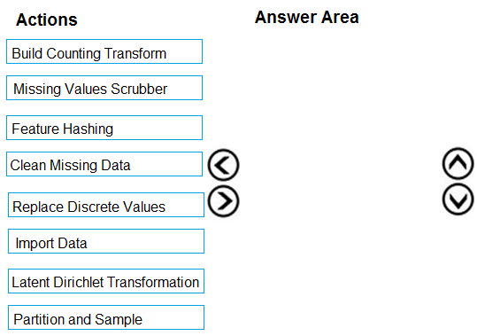

  
Show Suggested Answer

  

---

## Question 61 | [Link](https://www.examtopics.com/discussions/microsoft/view/39901-exam-dp-100-topic-2-question-18-discussion/){:target="_blank"}

HOTSPOT -

You are retrieving data from a large datastore by using Azure Machine Learning Studio.

You must create a subset of the data for testing purposes using a random sampling seed based on the system clock.

You add the Partition and Sample module to your experiment.

You need to select the properties for the module.

Which values should you select? To answer, select the appropriate options in the answer area.

NOTE: Each correct selection is worth one point.

Hot Area:

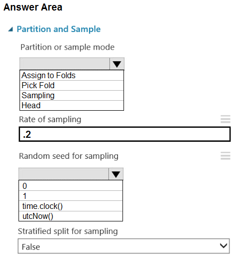

  
Show Suggested Answer

  

---

## Question 62 | [Link](https://www.examtopics.com/discussions/microsoft/view/42388-exam-dp-100-topic-2-question-19-discussion/){:target="_blank"}

You are creating a machine learning model. You have a dataset that contains null rows.

You need to use the Clean Missing Data module in Azure Machine Learning Studio to identify and resolve the null and missing data in the dataset.

Which parameter should you use?

* A.Replace with mean
* B.Remove entire column
* C.Remove entire row
* D.Hot Deck
* E.Custom substitution value
* F.Replace with mode

  
Show Suggested Answer

  C

---

## Question 63 | [Link](https://www.examtopics.com/discussions/microsoft/view/46837-exam-dp-100-topic-2-question-20-discussion/){:target="_blank"}

HOTSPOT -

The finance team asks you to train a model using data in an Azure Storage blob container named finance-data.

You need to register the container as a datastore in an Azure Machine Learning workspace and ensure that an error will be raised if the container does not exist.

How should you complete the code? To answer, select the appropriate options in the answer area.

NOTE: Each correct selection is worth one point.

Hot Area:

  
Show Suggested Answer

  

---

## Question 64 | [Link](https://www.examtopics.com/discussions/microsoft/view/44571-exam-dp-100-topic-2-question-21-discussion/){:target="_blank"}

You plan to provision an Azure Machine Learning Basic edition workspace for a data science project.

You need to identify the tasks you will be able to perform in the workspace.

Which three tasks will you be able to perform? Each correct answer presents a complete solution.

NOTE: Each correct selection is worth one point.

* A.Create a Compute Instance and use it to run code in Jupyter notebooks.
* B.Create an Azure Kubernetes Service (AKS) inference cluster.
* C.Use the designer to train a model by dragging and dropping pre-defined modules.
* D.Create a tabular dataset that supports versioning.
* E.Use the Automated Machine Learning user interface to train a model.

  
Show Suggested Answer

  ACE

---

## Question 65 | [Link](https://www.examtopics.com/discussions/microsoft/view/52696-exam-dp-100-topic-2-question-22-discussion/){:target="_blank"}

HOTSPOT -

A coworker registers a datastore in a Machine Learning services workspace by using the following code:

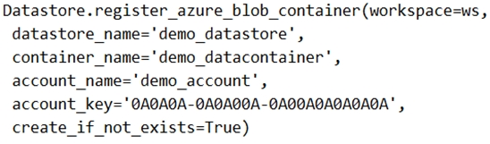

You need to write code to access the datastore from a notebook.

How should you complete the code segment? To answer, select the appropriate options in the answer area.

NOTE: Each correct selection is worth one point.

Hot Area:

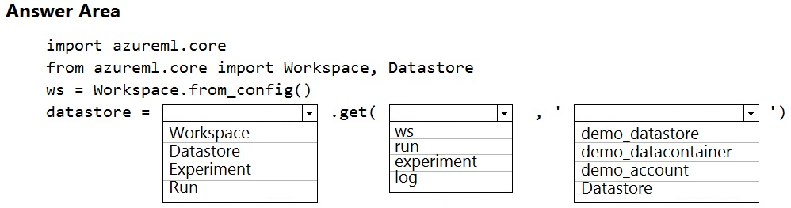

  
Show Suggested Answer

  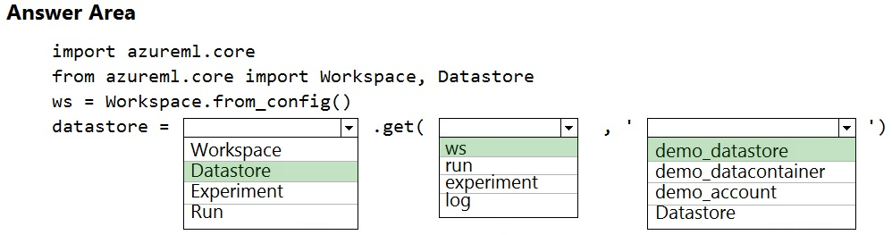

---

## Question 66 | [Link](https://www.examtopics.com/discussions/microsoft/view/47144-exam-dp-100-topic-2-question-23-discussion/){:target="_blank"}

A set of CSV files contains sales records. All the CSV files have the same data schema.

Each CSV file contains the sales record for a particular month and has the filename sales.csv. Each file is stored in a folder that indicates the month and year when the data was recorded. The folders are in an Azure blob container for which a datastore has been defined in an Azure Machine Learning workspace. The folders are organized in a parent folder named sales to create the following hierarchical structure:

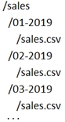

At the end of each month, a new folder with that month's sales file is added to the sales folder.

You plan to use the sales data to train a machine learning model based on the following requirements:

✑ You must define a dataset that loads all of the sales data to date into a structure that can be easily converted to a dataframe.

✑ You must be able to create experiments that use only data that was created before a specific previous month, ignoring any data that was added after that month.

✑ You must register the minimum number of datasets possible.

You need to register the sales data as a dataset in Azure Machine Learning service workspace.

What should you do?

* A.Create a tabular dataset that references the datastore and explicitly specifies each 'sales/mm-yyyy/sales.csv' file every month. Register the dataset with the name sales_dataset each month, replacing the existing dataset and specifying a tag named month indicating the month and year it was registered. Use this dataset for all experiments.
* B.Create a tabular dataset that references the datastore and specifies the path 'sales/*/sales.csv', register the dataset with the name sales_dataset and a tag named month indicating the month and year it was registered, and use this dataset for all experiments.
* C.Create a new tabular dataset that references the datastore and explicitly specifies each 'sales/mm-yyyy/sales.csv' file every month. Register the dataset with the name sales_dataset_MM-YYYY each month with appropriate MM and YYYY values for the month and year. Use the appropriate month-specific dataset for experiments.
* D.Create a tabular dataset that references the datastore and explicitly specifies each 'sales/mm-yyyy/sales.csv' file. Register the dataset with the name sales_dataset each month as a new version and with a tag named month indicating the month and year it was registered. Use this dataset for all experiments, identifying the version to be used based on the month tag as necessary.

  
Show Suggested Answer

  D

---

## Question 67 | [Link](https://www.examtopics.com/discussions/microsoft/view/47309-exam-dp-100-topic-2-question-24-discussion/){:target="_blank"}

DRAG DROP -

An organization uses Azure Machine Learning service and wants to expand their use of machine learning.

You have the following compute environments. The organization does not want to create another compute environment.

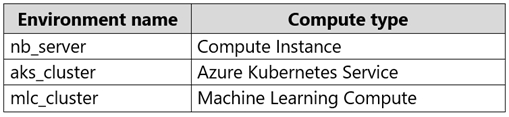

You need to determine which compute environment to use for the following scenarios.

Which compute types should you use? To answer, drag the appropriate compute environments to the correct scenarios. Each compute environment may be used once, more than once, or not at all. You may need to drag the split bar between panes or scroll to view content.

NOTE: Each correct selection is worth one point.

Select and Place:

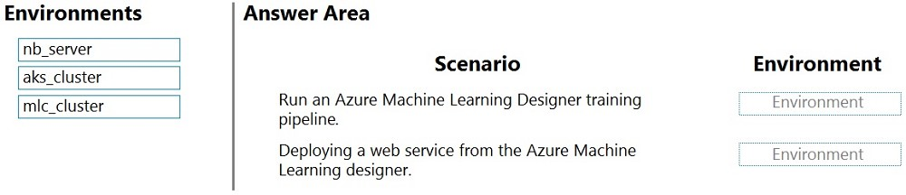

  
Show Suggested Answer

  

---

## Question 68 | [Link](https://www.examtopics.com/discussions/microsoft/view/47149-exam-dp-100-topic-2-question-25-discussion/){:target="_blank"}

HOTSPOT -

You create an Azure Machine Learning compute target named ComputeOne by using the STANDARD_D1 virtual machine image.

ComputeOne is currently idle and has zero active nodes.

You define a Python variable named ws that references the Azure Machine Learning workspace. You run the following Python code:

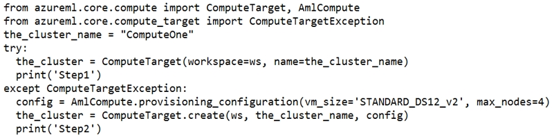

For each of the following statements, select Yes if the statement is true. Otherwise, select No.

NOTE: Each correct selection is worth one point.

Hot Area:

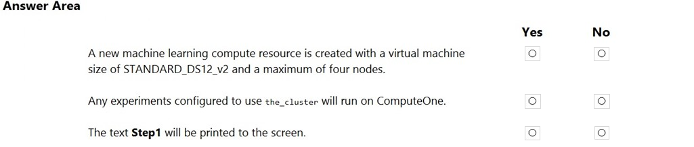

  
Show Suggested Answer

  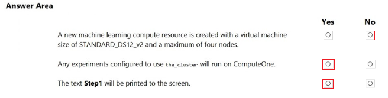

---

## Question 69 | [Link](https://www.examtopics.com/discussions/microsoft/view/51785-exam-dp-100-topic-2-question-26-discussion/){:target="_blank"}

HOTSPOT -

You are developing a deep learning model by using TensorFlow. You plan to run the model training workload on an Azure Machine Learning Compute Instance.

You must use CUDA-based model training.

You need to provision the Compute Instance.

Which two virtual machines sizes can you use? To answer, select the appropriate virtual machine sizes in the answer area.

NOTE: Each correct selection is worth one point.

Hot Area:

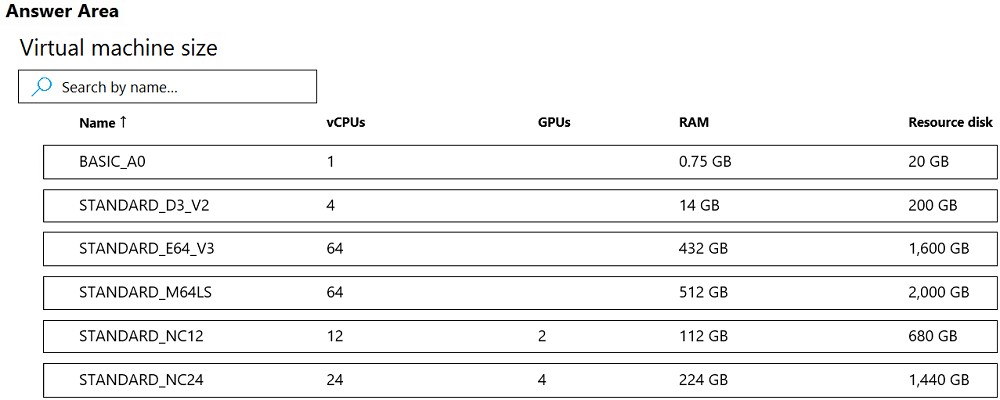

  
Show Suggested Answer

  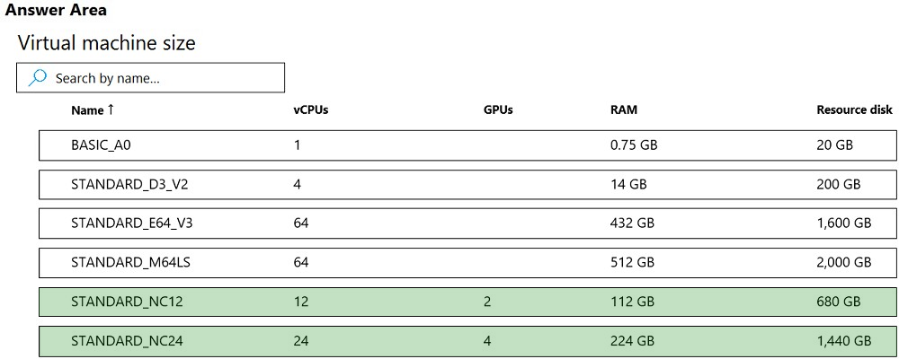

---

## Question 70 | [Link](https://www.examtopics.com/discussions/microsoft/view/55965-exam-dp-100-topic-2-question-27-discussion/){:target="_blank"}

DRAG DROP -

You are analyzing a raw dataset that requires cleaning.

You must perform transformations and manipulations by using Azure Machine Learning Studio.

You need to identify the correct modules to perform the transformations.

Which modules should you choose? To answer, drag the appropriate modules to the correct scenarios. Each module may be used once, more than once, or not at all.

You may need to drag the split bar between panes or scroll to view content.

NOTE: Each correct selection is worth one point.

Select and Place:

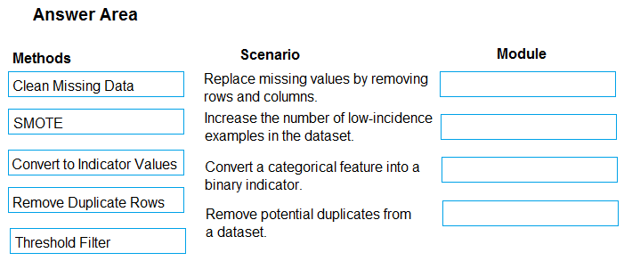

  
Show Suggested Answer

  

---

## Question 71 | [Link](https://www.examtopics.com/discussions/microsoft/view/18957-exam-dp-100-topic-2-question-28-discussion/){:target="_blank"}

Note: This question is part of a series of questions that present the same scenario. Each question in the series contains a unique solution that might meet the stated goals. Some question sets might have more than one correct solution, while others might not have a correct solution.

After you answer a question in this section, you will NOT be able to return to it. As a result, these questions will not appear in the review screen.

You are using Azure Machine Learning Studio to perform feature engineering on a dataset.

You need to normalize values to produce a feature column grouped into bins.

Solution: Apply an Entropy Minimum Description Length (MDL) binning mode.

Does the solution meet the goal?

* A.Yes
* B.No

  
Show Suggested Answer

  B

---

## Question 72 | [Link](https://www.examtopics.com/discussions/microsoft/view/51107-exam-dp-100-topic-2-question-29-discussion/){:target="_blank"}

HOTSPOT -

You are preparing to use the Azure ML SDK to run an experiment and need to create compute. You run the following code:

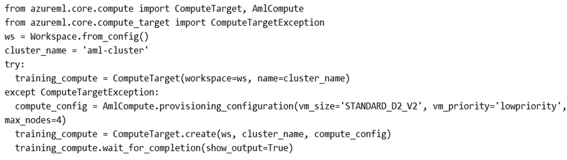

For each of the following statements, select Yes if the statement is true. Otherwise, select No.

NOTE: Each correct selection is worth one point.

Hot Area:

  
Show Suggested Answer

  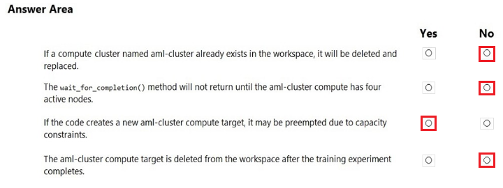

---

## Question 73 | [Link](https://www.examtopics.com/discussions/microsoft/view/40807-exam-dp-100-topic-2-question-30-discussion/){:target="_blank"}

Note: This question is part of a series of questions that present the same scenario. Each question in the series contains a unique solution that might meet the stated goals. Some question sets might have more than one correct solution, while others might not have a correct solution.

After you answer a question in this section, you will NOT be able to return to it. As a result, these questions will not appear in the review screen.

You are a data scientist using Azure Machine Learning Studio.

You need to normalize values to produce an output column into bins to predict a target column.

Solution: Apply a Quantiles normalization with a QuantileIndex normalization.

Does the solution meet the goal?

* A.Yes
* B.No

  
Show Suggested Answer

  A

---

## Question 74 | [Link](https://www.examtopics.com/discussions/microsoft/view/55967-exam-dp-100-topic-2-question-31-discussion/){:target="_blank"}

Note: This question is part of a series of questions that present the same scenario. Each question in the series contains a unique solution that might meet the stated goals. Some question sets might have more than one correct solution, while others might not have a correct solution.

After you answer a question in this section, you will NOT be able to return to it. As a result, these questions will not appear in the review screen.

You are creating a new experiment in Azure Machine Learning Studio.

One class has a much smaller number of observations than the other classes in the training set.

You need to select an appropriate data sampling strategy to compensate for the class imbalance.

Solution: You use the Scale and Reduce sampling mode.

Does the solution meet the goal?

* A.Yes
* B.No

  
Show Suggested Answer

  B

---

## Question 75 | [Link](https://www.examtopics.com/discussions/microsoft/view/24662-exam-dp-100-topic-2-question-32-discussion/){:target="_blank"}

You are analyzing a dataset by using Azure Machine Learning Studio.

You need to generate a statistical summary that contains the p-value and the unique count for each feature column.

Which two modules can you use? Each correct answer presents a complete solution.

NOTE: Each correct selection is worth one point.

* A.Computer Linear Correlation
* B.Export Count Table
* C.Execute Python Script
* D.Convert to Indicator Values
* E.Summarize Data

  
Show Suggested Answer

  CE

---

## Question 76 | [Link](https://www.examtopics.com/discussions/microsoft/view/48586-exam-dp-100-topic-2-question-33-discussion/){:target="_blank"}

Note: This question is part of a series of questions that present the same scenario. Each question in the series contains a unique solution that might meet the stated goals. Some question sets might have more than one correct solution, while others might not have a correct solution.

After you answer a question in this section, you will NOT be able to return to it. As a result, these questions will not appear in the review screen.

You are analyzing a numerical dataset which contains missing values in several columns.

You must clean the missing values using an appropriate operation without affecting the dimensionality of the feature set.

You need to analyze a full dataset to include all values.

Solution: Use the Last Observation Carried Forward (LOCF) method to impute the missing data points.

Does the solution meet the goal?

* A.Yes
* B.No

  
Show Suggested Answer

  B

---

## Question 77 | [Link](https://www.examtopics.com/discussions/microsoft/view/20099-exam-dp-100-topic-2-question-34-discussion/){:target="_blank"}

HOTSPOT -

You are creating a machine learning model in Python. The provided dataset contains several numerical columns and one text column. The text column represents a product's category. The product category will always be one of the following:

✑ Bikes

✑ Cars

✑ Vans

✑ Boats

You are building a regression model using the scikit-learn Python package.

You need to transform the text data to be compatible with the scikit-learn Python package.

How should you complete the code segment? To answer, select the appropriate options in the answer area.

NOTE: Each correct selection is worth one point.

Hot Area:

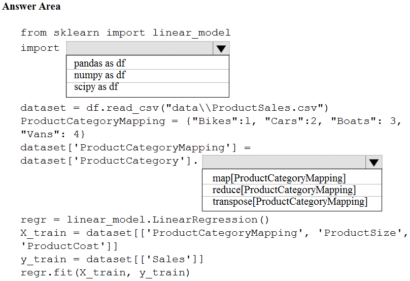

  
Show Suggested Answer

  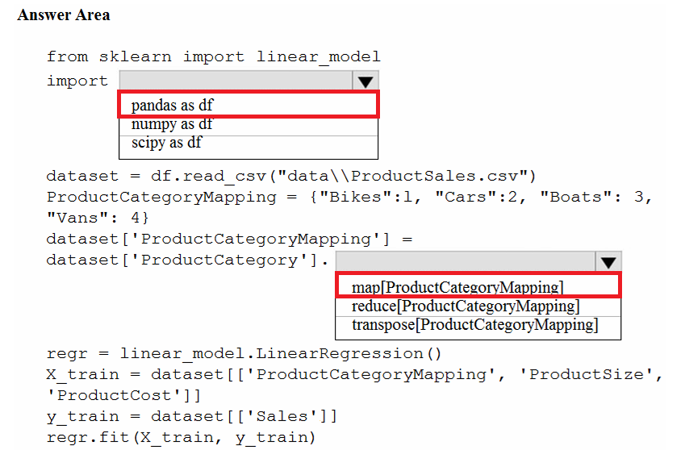

---

## Question 78 | [Link](https://www.examtopics.com/discussions/microsoft/view/33887-exam-dp-100-topic-2-question-35-discussion/){:target="_blank"}

You plan to deliver a hands-on workshop to several students. The workshop will focus on creating data visualizations using Python. Each student will use a device that has internet access.

Student devices are not configured for Python development. Students do not have administrator access to install software on their devices. Azure subscriptions are not available for students.

You need to ensure that students can run Python-based data visualization code.

Which Azure tool should you use?

* A.Anaconda Data Science Platform
* B.Azure BatchAI
* C.Azure Notebooks
* D.Azure Machine Learning Service

  
Show Suggested Answer

  C

---

## Question 79 | [Link](https://www.examtopics.com/discussions/microsoft/view/11937-exam-dp-100-topic-2-question-36-discussion/){:target="_blank"}

Note: This question is part of a series of questions that present the same scenario. Each question in the series contains a unique solution that might meet the stated goals. Some question sets might have more than one correct solution, while others might not have a correct solution.

After you answer a question in this section, you will NOT be able to return to it. As a result, these questions will not appear in the review screen.

You are analyzing a numerical dataset which contains missing values in several columns.

You must clean the missing values using an appropriate operation without affecting the dimensionality of the feature set.

You need to analyze a full dataset to include all values.

Solution: Replace each missing value using the Multiple Imputation by Chained Equations (MICE) method.

Does the solution meet the goal?

* A.Yes
* B.No

  
Show Suggested Answer

  A

---

## Question 80 | [Link](https://www.examtopics.com/discussions/microsoft/view/55504-exam-dp-100-topic-2-question-37-discussion/){:target="_blank"}

Note: This question is part of a series of questions that present the same scenario. Each question in the series contains a unique solution that might meet the stated goals. Some question sets might have more than one correct solution, while others might not have a correct solution.

After you answer a question in this section, you will NOT be able to return to it. As a result, these questions will not appear in the review screen.

You are analyzing a numerical dataset which contains missing values in several columns.

You must clean the missing values using an appropriate operation without affecting the dimensionality of the feature set.

You need to analyze a full dataset to include all values.

Solution: Remove the entire column that contains the missing data point.

Does the solution meet the goal?

* A.Yes
* B.No

  
Show Suggested Answer

  B

---

## Question 81 | [Link](https://www.examtopics.com/discussions/microsoft/view/36891-exam-dp-100-topic-2-question-38-discussion/){:target="_blank"}

You are creating a new experiment in Azure Machine Learning Studio. You have a small dataset that has missing values in many columns. The data does not require the application of predictors for each column. You plan to use the Clean Missing Data.

You need to select a data cleaning method.

Which method should you use?

* A.Replace using Probabilistic PCA
* B.Normalization
* C.Synthetic Minority Oversampling Technique (SMOTE)
* D.Replace using MICE

  
Show Suggested Answer

  A

---

## Question 82 | [Link](https://www.examtopics.com/discussions/microsoft/view/20021-exam-dp-100-topic-2-question-39-discussion/){:target="_blank"}

You use Azure Machine Learning Studio to build a machine learning experiment.

You need to divide data into two distinct datasets.

Which module should you use?

* A.Split Data
* B.Load Trained Model
* C.Assign Data to Clusters
* D.Group Data into Bins

  
Show Suggested Answer

  A

---

## Question 83 | [Link](https://www.examtopics.com/discussions/microsoft/view/51418-exam-dp-100-topic-2-question-40-discussion/){:target="_blank"}

You are a lead data scientist for a project that tracks the health and migration of birds. You create a multi-class image classification deep learning model that uses a set of labeled bird photographs collected by experts.

You have 100,000 photographs of birds. All photographs use the JPG format and are stored in an Azure blob container in an Azure subscription.

You need to access the bird photograph files in the Azure blob container from the Azure Machine Learning service workspace that will be used for deep learning model training. You must minimize data movement.

What should you do?

* A.Create an Azure Data Lake store and move the bird photographs to the store.
* B.Create an Azure Cosmos DB database and attach the Azure Blob containing bird photographs storage to the database.
* C.Create and register a dataset by using TabularDataset class that references the Azure blob storage containing bird photographs.
* D.Register the Azure blob storage containing the bird photographs as a datastore in Azure Machine Learning service.
* E.Copy the bird photographs to the blob datastore that was created with your Azure Machine Learning service workspace.

  
Show Suggested Answer

  D

---

## Question 84 | [Link](https://www.examtopics.com/discussions/microsoft/view/3117-exam-dp-100-topic-2-question-41-discussion/){:target="_blank"}

Note: This question is part of a series of questions that present the same scenario. Each question in the series contains a unique solution that might meet the stated goals. Some question sets might have more than one correct solution, while others might not have a correct solution.

After you answer a question in this section, you will NOT be able to return to it. As a result, these questions will not appear in the review screen.

You are analyzing a numerical dataset which contains missing values in several columns.

You must clean the missing values using an appropriate operation without affecting the dimensionality of the feature set.

You need to analyze a full dataset to include all values.

Solution: Calculate the column median value and use the median value as the replacement for any missing value in the column.

Does the solution meet the goal?

* A.Yes
* B.No

  
Show Suggested Answer

  A

---

## Question 85 | [Link](https://www.examtopics.com/discussions/microsoft/view/57615-exam-dp-100-topic-2-question-42-discussion/){:target="_blank"}

You create an Azure Machine Learning workspace.

You must create a custom role named DataScientist that meets the following requirements:

✑ Role members must not be able to delete the workspace.

✑ Role members must not be able to create, update, or delete compute resources in the workspace.

✑ Role members must not be able to add new users to the workspace.

You need to create a JSON file for the DataScientist role in the Azure Machine Learning workspace.

The custom role must enforce the restrictions specified by the IT Operations team.

Which JSON code segment should you use?

A.

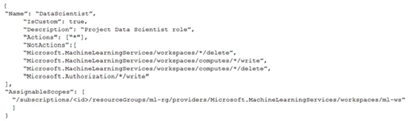

B.

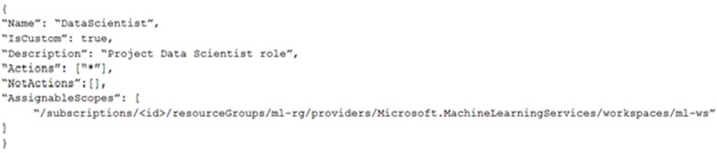

C.

D.

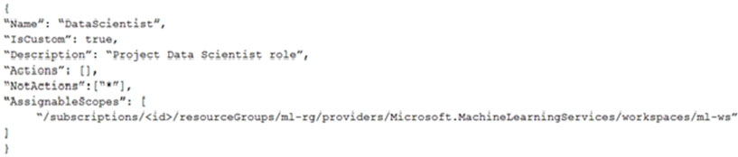

  
Show Suggested Answer

  A

---

## Question 86 | [Link](https://www.examtopics.com/discussions/microsoft/view/12362-exam-dp-100-topic-2-question-43-discussion/){:target="_blank"}

Note: This question is part of a series of questions that present the same scenario. Each question in the series contains a unique solution that might meet the stated goals. Some question sets might have more than one correct solution, while others might not have a correct solution.

After you answer a question in this section, you will NOT be able to return to it. As a result, these questions will not appear in the review screen.

You are a data scientist using Azure Machine Learning Studio.

You need to normalize values to produce an output column into bins to predict a target column.

Solution: Apply an Equal Width with Custom Start and Stop binning mode.

Does the solution meet the goal?

* A.Yes
* B.No

  
Show Suggested Answer

  B

---

## Question 87 | [Link](https://www.examtopics.com/discussions/microsoft/view/11997-exam-dp-100-topic-2-question-44-discussion/){:target="_blank"}

Note: This question is part of a series of questions that present the same scenario. Each question in the series contains a unique solution that might meet the stated goals. Some question sets might have more than one correct solution, while others might not have a correct solution.

After you answer a question in this section, you will NOT be able to return to it. As a result, these questions will not appear in the review screen.

You are a data scientist using Azure Machine Learning Studio.

You need to normalize values to produce an output column into bins to predict a target column.

Solution: Apply a Quantiles binning mode with a PQuantile normalization.

Does the solution meet the goal?

* A.Yes
* B.No

  
Show Suggested Answer

  A

---

## Question 88 | [Link](https://www.examtopics.com/discussions/microsoft/view/25511-exam-dp-100-topic-2-question-45-discussion/){:target="_blank"}

HOTSPOT -

You are evaluating a Python NumPy array that contains six data points defined as follows: data = [10, 20, 30, 40, 50, 60]

You must generate the following output by using the k-fold algorithm implantation in the Python Scikit-learn machine learning library: train: [10 40 50 60], test: [20 30] train: [20 30 40 60], test: [10 50] train: [10 20 30 50], test: [40 60]

You need to implement a cross-validation to generate the output.

How should you complete the code segment? To answer, select the appropriate code segment in the dialog box in the answer area.

NOTE: Each correct selection is worth one point.

Hot Area:

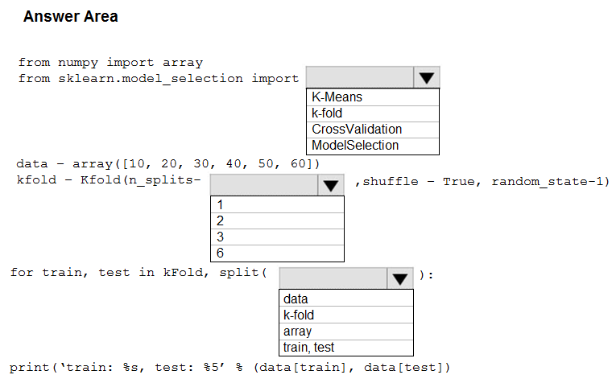

  
Show Suggested Answer

  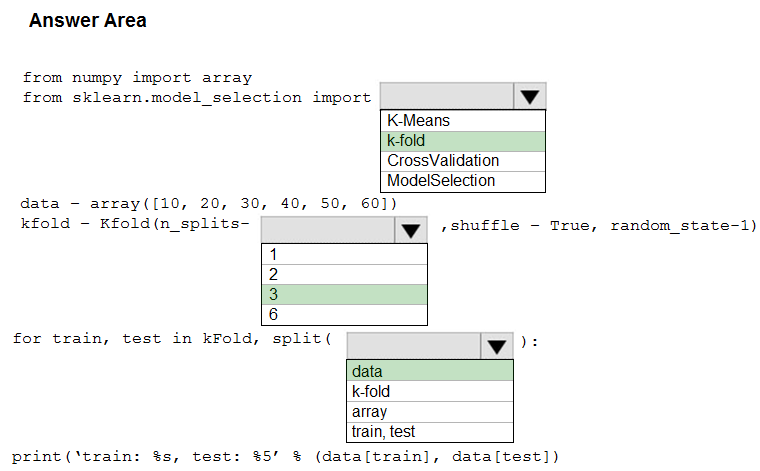

---

## Question 89 | [Link](https://www.examtopics.com/discussions/microsoft/view/20577-exam-dp-100-topic-2-question-46-discussion/){:target="_blank"}

You are with a time series dataset in Azure Machine Learning Studio.

You need to split your dataset into training and testing subsets by using the Split Data module.

Which splitting mode should you use?

* A.Recommender Split
* B.Regular Expression Split
* C.Relative Expression Split
* D.Split Rows with the Randomized split parameter set to true

  
Show Suggested Answer

  C

---

## Question 90 | [Link](https://www.examtopics.com/discussions/microsoft/view/47461-exam-dp-100-topic-2-question-47-discussion/){:target="_blank"}

HOTSPOT -

You are preparing to build a deep learning convolutional neural network model for image classification. You create a script to train the model using CUDA devices.

You must submit an experiment that runs this script in the Azure Machine Learning workspace.

The following compute resources are available:

✑ a Microsoft Surface device on which Microsoft Office has been installed. Corporate IT policies prevent the installation of additional software

✑ a Compute Instance named ds-workstation in the workspace with 2 CPUs and 8 GB of memory

✑ an Azure Machine Learning compute target named cpu-cluster with eight CPU-based nodes

✑ an Azure Machine Learning compute target named gpu-cluster with four CPU and GPU-based nodes

You need to specify the compute resources to be used for running the code to submit the experiment, and for running the script in order to minimize model training time.

Which resources should the data scientist use? To answer, select the appropriate options in the answer area.

NOTE: Each correct selection is worth one point.

Hot Area:

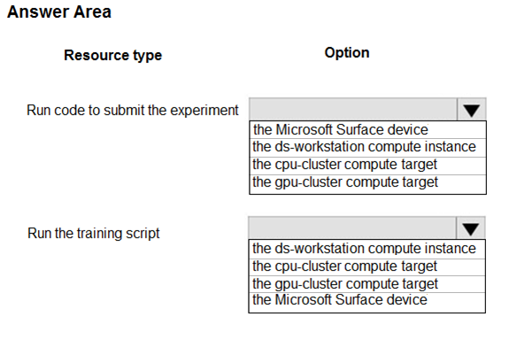

  
Show Suggested Answer

  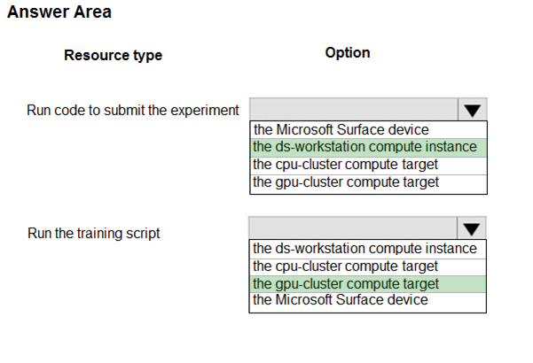

---

## Question 91 | [Link](https://www.examtopics.com/discussions/microsoft/view/61108-exam-dp-100-topic-2-question-48-discussion/){:target="_blank"}

You create an Azure Machine Learning workspace. You are preparing a local Python environment on a laptop computer. You want to use the laptop to connect to the workspace and run experiments.

You create the following config.json file.

{

"workspace_name" : "ml-workspace"

}

You must use the Azure Machine Learning SDK to interact with data and experiments in the workspace.

You need to configure the config.json file to connect to the workspace from the Python environment.

Which two additional parameters must you add to the config.json file in order to connect to the workspace? Each correct answer presents part of the solution.

NOTE: Each correct selection is worth one point.

* A.login
* B.resource_group
* C.subscription_id
* D.key
* E.region

  
Show Suggested Answer

  BC

---

## Question 92 | [Link](https://www.examtopics.com/discussions/microsoft/view/20993-exam-dp-100-topic-2-question-49-discussion/){:target="_blank"}

HOTSPOT -

You are performing a classification task in Azure Machine Learning Studio.

You must prepare balanced testing and training samples based on a provided data set.

You need to split the data with a 0.75:0.25 ratio.

Which value should you use for each parameter? To answer, select the appropriate options in the answer area.

NOTE: Each correct selection is worth one point.

Hot Area:

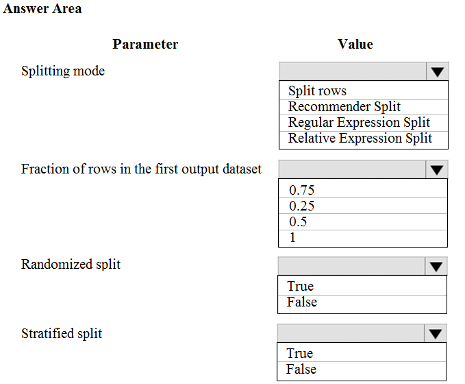

  
Show Suggested Answer

  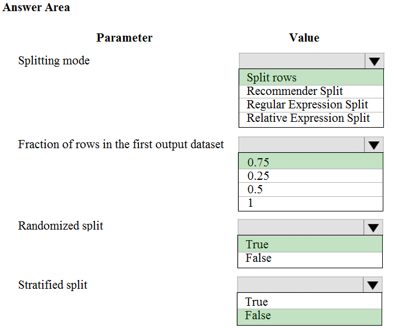

---

## Question 93 | [Link](https://www.examtopics.com/discussions/microsoft/view/47462-exam-dp-100-topic-2-question-50-discussion/){:target="_blank"}

You create an Azure Machine Learning compute resource to train models. The compute resource is configured as follows:

✑ Minimum nodes: 2

✑ Maximum nodes: 4

You must decrease the minimum number of nodes and increase the maximum number of nodes to the following values:

✑ Minimum nodes: 0

✑ Maximum nodes: 8

You need to reconfigure the compute resource.

What are three possible ways to achieve this goal? Each correct answer presents a complete solution.

NOTE: Each correct selection is worth one point.

* A.Use the Azure Machine Learning studio.
* B.Run the update method of the AmlCompute class in the Python SDK.
* C.Use the Azure portal.
* D.Use the Azure Machine Learning designer.
* E.Run the refresh_state() method of the BatchCompute class in the Python SDK.

  
Show Suggested Answer

  ABC

---

## Question 94 | [Link](https://www.examtopics.com/discussions/microsoft/view/29889-exam-dp-100-topic-2-question-51-discussion/){:target="_blank"}

HOTSPOT -

You have a dataset that contains 2,000 rows. You are building a machine learning classification model by using Azure Learning Studio. You add a Partition and

Sample module to the experiment.

You need to configure the module. You must meet the following requirements:

✑ Divide the data into subsets

✑ Assign the rows into folds using a round-robin method

✑ Allow rows in the dataset to be reused

How should you configure the module? To answer, select the appropriate options in the dialog box in the answer area.

NOTE: Each correct selection is worth one point.

Hot Area:

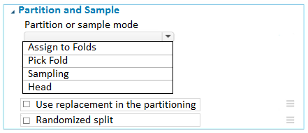

  
Show Suggested Answer

  

---

## Question 95 | [Link](https://www.examtopics.com/discussions/microsoft/view/47774-exam-dp-100-topic-2-question-52-discussion/){:target="_blank"}

You create a new Azure subscription. No resources are provisioned in the subscription.

You need to create an Azure Machine Learning workspace.

What are three possible ways to achieve this goal? Each correct answer presents a complete solution.

NOTE: Each correct selection is worth one point.

* A.Run Python code that uses the Azure ML SDK library and calls the Workspace.create method with name, subscription_id, and resource_group parameters.
* B.Navigate to Azure Machine Learning studio and create a workspace.
* C.Use the Azure Command Line Interface (CLI) with the Azure Machine Learning extension to call the az group create function with --name and --location parameters, and then the az ml workspace create function, specifying ג€"w and ג€"g parameters for the workspace name and resource group.
* D.Navigate to Azure Machine Learning studio and create a workspace.
* E.Run Python code that uses the Azure ML SDK library and calls the Workspace.get method with name, subscription_id, and resource_group parameters.

  
Show Suggested Answer

  ABC

---

## Question 96 | [Link](https://www.examtopics.com/discussions/microsoft/view/67382-exam-dp-100-topic-2-question-53-discussion/){:target="_blank"}

HOTSPOT -

You create an Azure Machine Learning workspace and set up a development environment. You plan to train a deep neural network (DNN) by using the

Tensorflow framework and by using estimators to submit training scripts.

You must optimize computation speed for training runs.

You need to choose the appropriate estimator to use as well as the appropriate training compute target configuration.

Which values should you use? To answer, select the appropriate options in the answer area.

NOTE: Each correct selection is worth one point.

Hot Area:

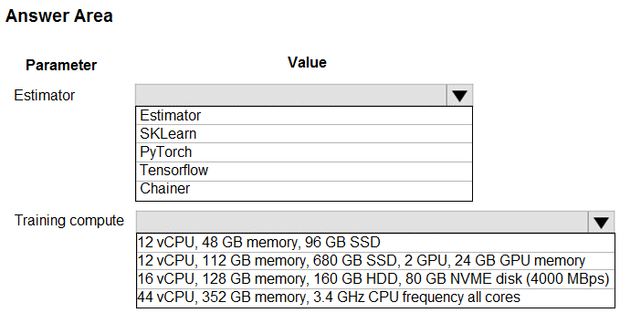

  
Show Suggested Answer

  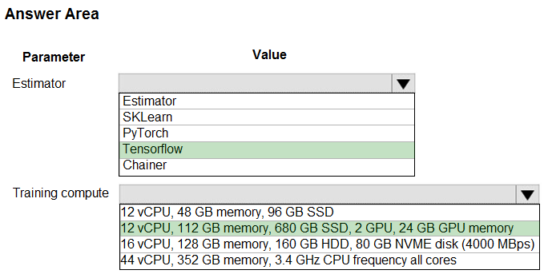

---

## Question 97 | [Link](https://www.examtopics.com/discussions/microsoft/view/71787-exam-dp-100-topic-2-question-54-discussion/){:target="_blank"}

HOTSPOT -

You have an Azure Machine Learning workspace named workspace1 that is accessible from a public endpoint. The workspace contains an Azure Blob storage datastore named store1 that represents a blob container in an Azure storage account named account1. You configure workspace1 and account1 to be accessible by using private endpoints in the same virtual network.

You must be able to access the contents of store1 by using the Azure Machine Learning SDK for Python. You must be able to preview the contents of store1 by using Azure Machine Learning studio.

You need to configure store1.

What should you do? To answer, select the appropriate options in the answer area.

NOTE: Each correct selection is worth one point.

Hot Area:

  
Show Suggested Answer

  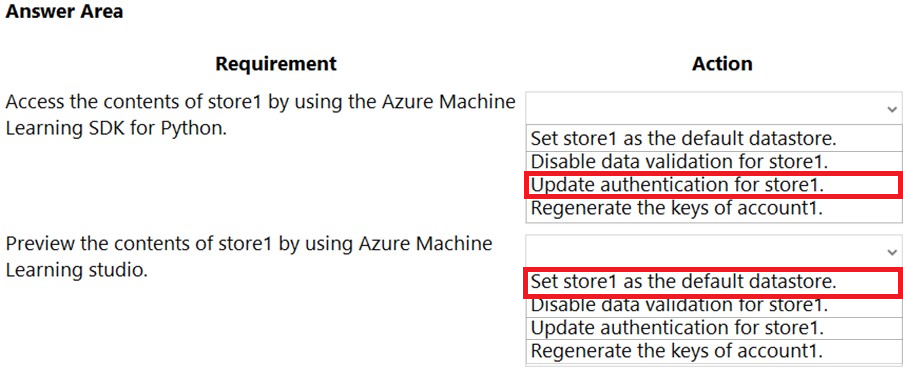

---

## Question 98 | [Link](https://www.examtopics.com/discussions/microsoft/view/79046-exam-dp-100-topic-2-question-55-discussion/){:target="_blank"}

HOTSPOT -

You are using an Azure Machine Learning workspace. You set up an environment for model testing and an environment for production.

The compute target for testing must minimize cost and deployment efforts. The compute target for production must provide fast response time, autoscaling of the deployed service, and support real-time inferencing.

You need to configure compute targets for model testing and production.

Which compute targets should you use? To answer, select the appropriate options in the answer area.

NOTE: Each correct selection is worth one point.

Hot Area:

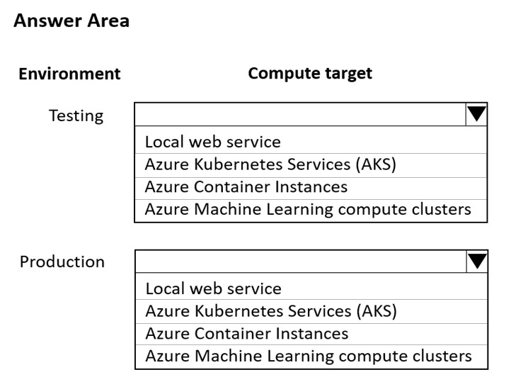

  
Show Suggested Answer

  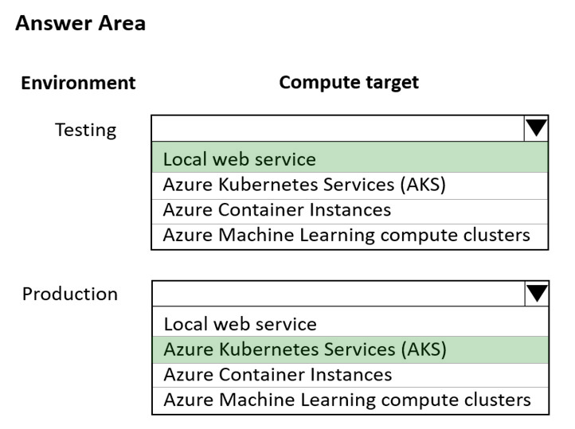

---

## Question 99 | [Link](https://www.examtopics.com/discussions/microsoft/view/81365-exam-dp-100-topic-2-question-56-discussion/){:target="_blank"}

DRAG DROP -

You are using a Git repository to track work in an Azure Machine Learning workspace.

You need to authenticate a Git account by using SSH.

Which three actions should you perform in sequence? To answer, move the appropriate actions from the list of actions to the answer area and arrange them in the correct order.

Select and Place:

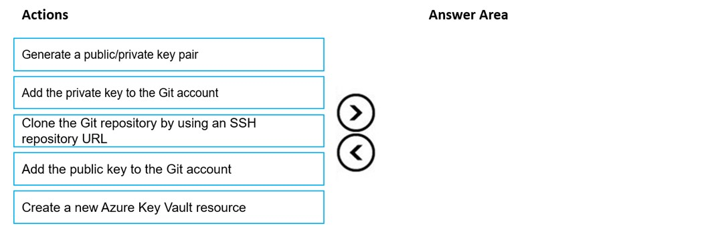

  
Show Suggested Answer

  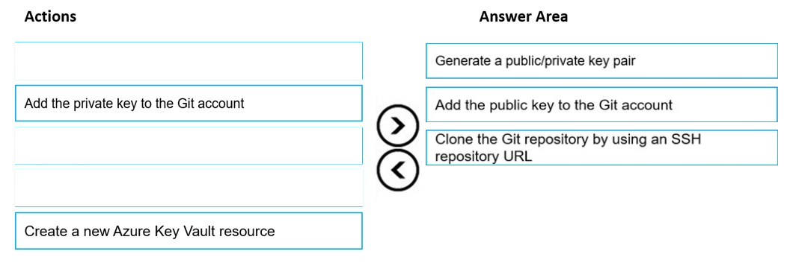

---

## Question 100 | [Link](https://www.examtopics.com/discussions/microsoft/view/79513-exam-dp-100-topic-2-question-57-discussion/){:target="_blank"}

You use Azure Machine Learning to train a model based on a dataset named dataset1.

You define a dataset monitor and create a dataset named dataset2 that contains new data.

You need to compare dataset1 and dataset2 by using the Azure Machine Learning SDK for Python.

Which method of the DataDriftDetector class should you use?

* A.run
* B.get
* C.backfill
* D.update

  
Show Suggested Answer

  A

---

## Question 101 | [Link](https://www.examtopics.com/discussions/microsoft/view/79514-exam-dp-100-topic-2-question-58-discussion/){:target="_blank"}

You use an Azure Machine Learning workspace.

You have a trained model that must be deployed as a web service. Users must authenticate by using Azure Active Directory.

What should you do?

* A.Deploy the model to Azure Kubernetes Service (AKS). During deployment, set the token_auth_enabled parameter of the target configuration object to true
* B.Deploy the model to Azure Container Instances. During deployment, set the auth_enabled parameter of the target configuration object to true
* C.Deploy the model to Azure Container Instances. During deployment, set the token_auth_enabled parameter of the target configuration object to true
* D.Deploy the model to Azure Kubernetes Service (AKS). During deployment, set the auth.enabled parameter of the target configuration object to true

  
Show Suggested Answer

  A

---

## Question 102 | [Link](https://www.examtopics.com/discussions/microsoft/view/79518-exam-dp-100-topic-2-question-59-discussion/){:target="_blank"}

HOTSPOT -

You are the owner of an Azure Machine Learning workspace.

You must prevent the creation or deletion of compute resources by using a custom role. You must allow all other operations inside the workspace.

You need to configure the custom role.

How should you complete the configuration? To answer, select the appropriate options in the answer area.

NOTE: Each correct selection is worth one point.

Hot Area:

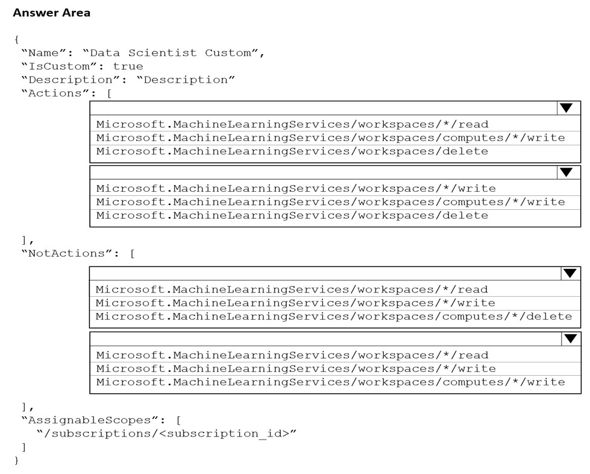

  
Show Suggested Answer

  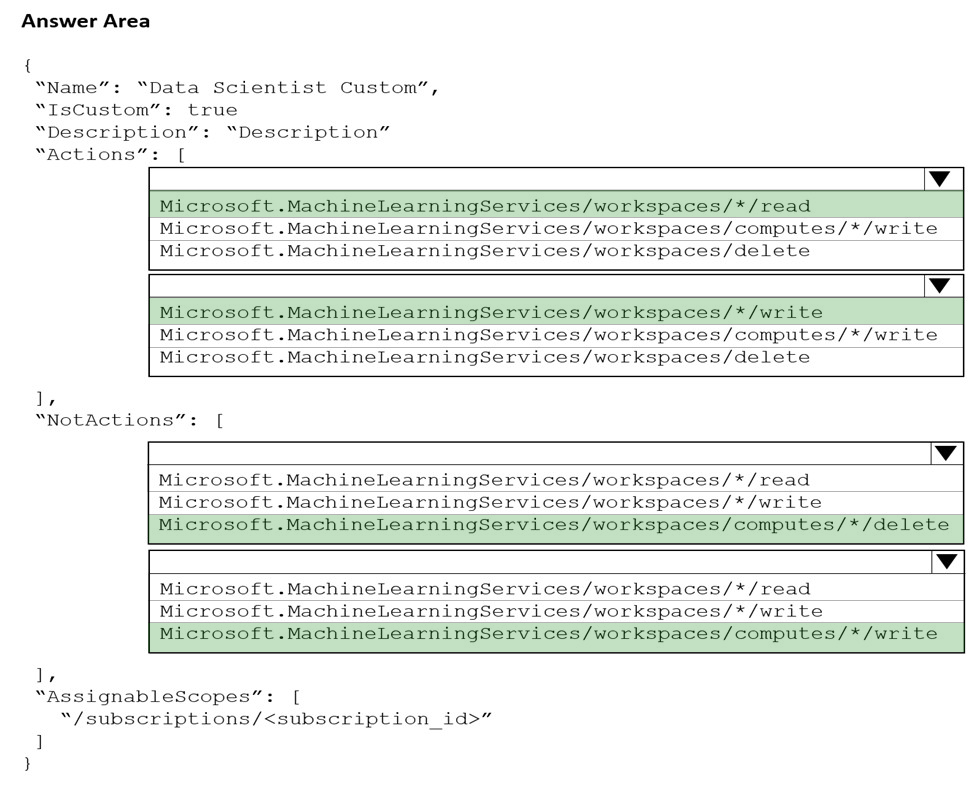

---

## Question 103 | [Link](https://www.examtopics.com/discussions/microsoft/view/87873-exam-dp-100-topic-2-question-60-discussion/){:target="_blank"}

HOTSPOT -

You create an Azure Machine Learning workspace named workspace1. You assign a custom role to a user of workspace1.

The custom role has the following JSON definition:

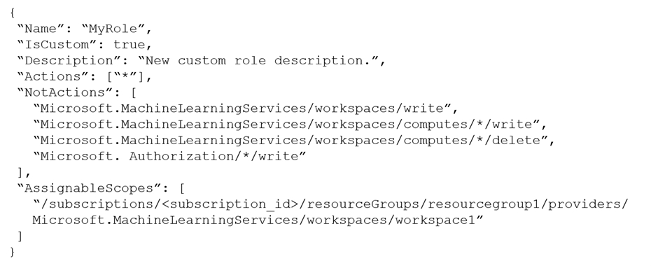

Instructions: For each of the following statements, select Yes if the statement is true. Otherwise, select No.

NOTE: Each correct selection is worth one point.

Hot Area:

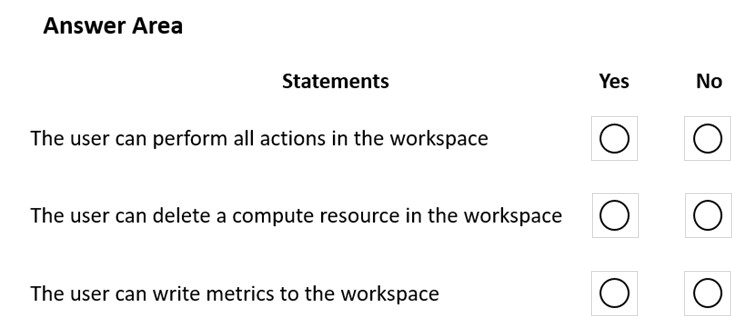

  
Show Suggested Answer

  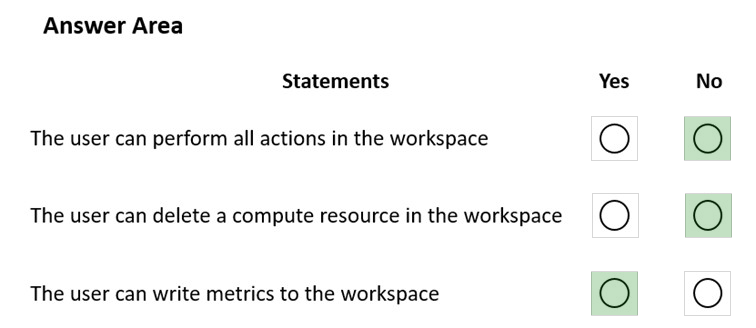

---

## Question 104 | [Link](https://www.examtopics.com/discussions/microsoft/view/89935-exam-dp-100-topic-2-question-61-discussion/){:target="_blank"}

HOTSPOT -

You create a new Azure Databricks workspace.

You configure a new cluster for long-running tasks with mixed loads on the compute cluster as shown in the image below.

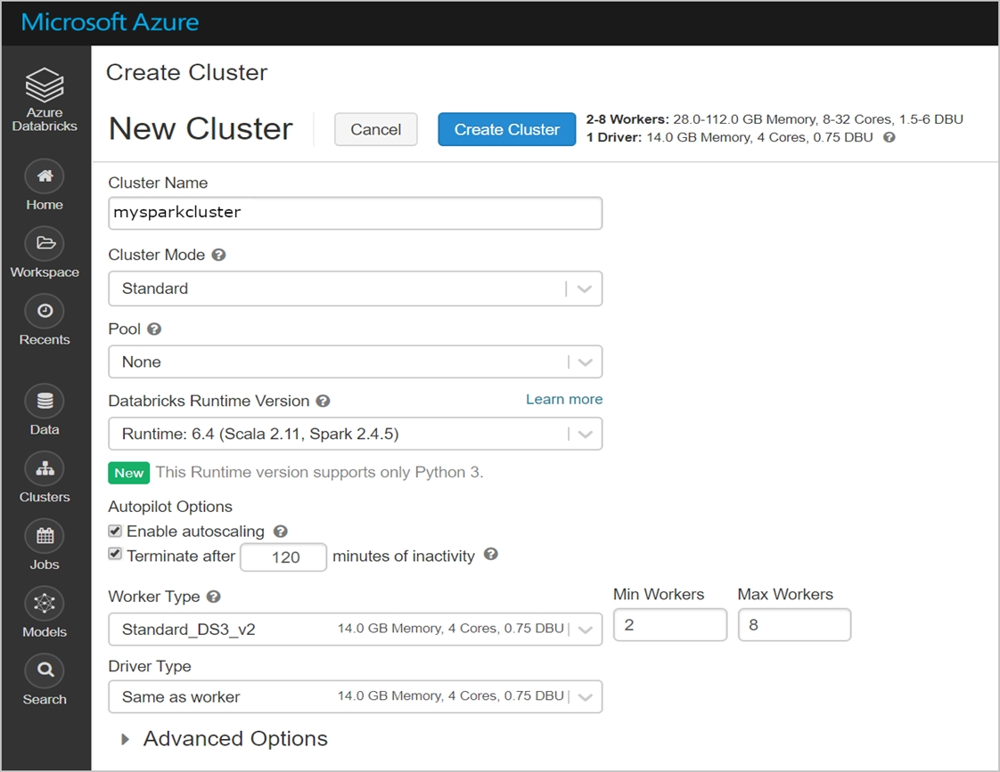

Use the drop-down menus to select the answer choice that completes each statement based on the information presented in the graphic.

NOTE: Each correct selection is worth one point.

Hot Area:

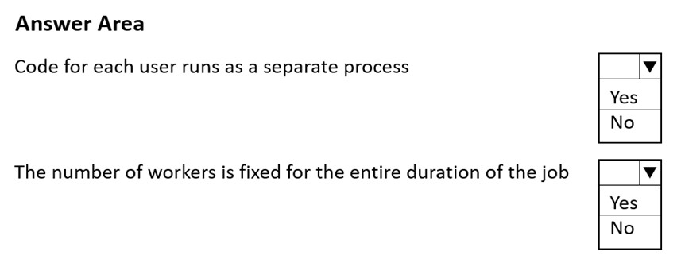

  
Show Suggested Answer

  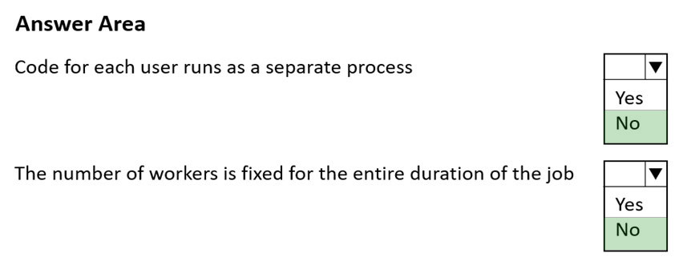

---

## Question 105 | [Link](https://www.examtopics.com/discussions/microsoft/view/105028-exam-dp-100-topic-2-question-62-discussion/){:target="_blank"}

HOTSPOT

-

You use an Azure Machine Learning workspace. The default datastore contains comma-separated values (CSV) files.

The CSV files must be made available for use in experiments and data processing pipelines. The files must be loaded directly into pandas dataframes.

How should you complete the code? To answer, select the appropriate options in the answer area.

NOTE: Each correct selection is worth one point.

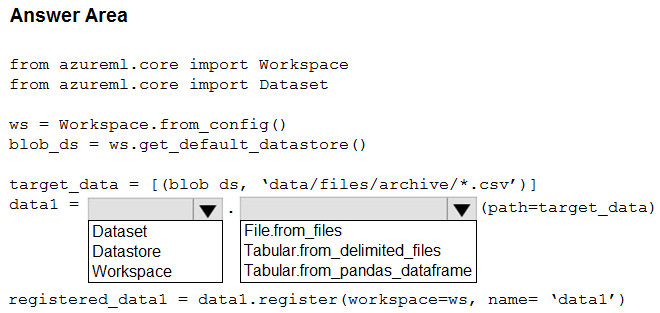

  
Show Suggested Answer

  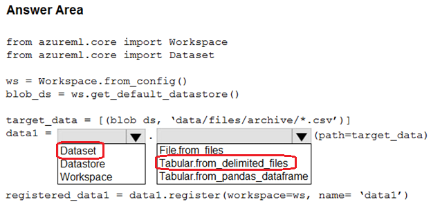

---

## Question 106 | [Link](https://www.examtopics.com/discussions/microsoft/view/109787-exam-dp-100-topic-2-question-63-discussion/){:target="_blank"}

HOTSPOT

-

You plan to use a curated environment to run Azure Machine Learning training experiments in a workspace.

You need to display all curated environments and their respective packages in the workspace.

How should you complete the code? To answer, select the appropriate options in the answer area.

NOTE: Each correct selection is worth one point.

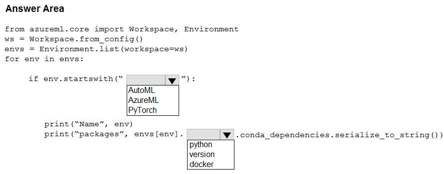

  
Show Suggested Answer

  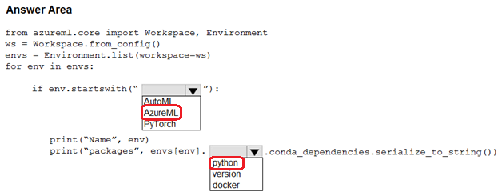

---

## Question 107 | [Link](https://www.examtopics.com/discussions/microsoft/view/103579-exam-dp-100-topic-2-question-64-discussion/){:target="_blank"}

You are profiling data by using Azure Machine Learning studio.

You need to detect columns with odd or missing values.

Which statistic should you analyze?

* A.Profile
* B.Std deviation
* C.Error count
* D.Type

  
Show Suggested Answer

  C

---

## Question 108 | [Link](https://www.examtopics.com/discussions/microsoft/view/103339-exam-dp-100-topic-2-question-65-discussion/){:target="_blank"}

You are authoring a notebook in Azure Machine Learning studio.

You must install packages from the notebook into the currently running kernel. The installation must be limited to the currently running kernel only.

You need to install the packages.

Which magic function should you use?

* A.!pip
* B.%pip
* C.!conda
* D.%load

  
Show Suggested Answer

  B

---

## Question 109 | [Link](https://www.examtopics.com/discussions/microsoft/view/103581-exam-dp-100-topic-2-question-66-discussion/){:target="_blank"}

DRAG DROP

-

You need to implement source control for scripts in an Azure Machine Learning workspace. You use a terminal window in the Azure Machine Learning Notebook tab.

You must authenticate your Git account with SSH.

You need to generate a new SSH key.

Which four actions should you perform in sequence? To answer, move the appropriate actions from the list of actions to the answer area and arrange them in the correct order.

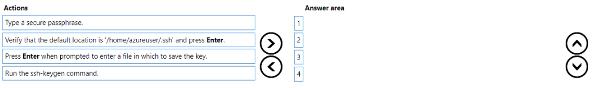

  
Show Suggested Answer

  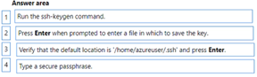

---

## Question 110 | [Link](https://www.examtopics.com/discussions/microsoft/view/103995-exam-dp-100-topic-2-question-67-discussion/){:target="_blank"}

Note: This question is part of a series of questions that present the same scenario. Each question in the series contains a unique solution that might meet the stated goals. Some question sets might have more than one correct solution, while others might not have a correct solution.

After you answer a question in this section, you will NOT be able to return to it. As a result, these questions will not appear in the review screen.

You use Azure Machine Learning designer to load the following datasets into an experiment:

Dataset1 -

Dataset2 -

You need to create a dataset that has the same columns and header row as the input datasets and contains all rows from both input datasets.

Solution: Use the Add Rows module.

Does the solution meet the goal?

* A.Yes
* B.No

  
Show Suggested Answer

  A

---

## Question 111 | [Link](https://www.examtopics.com/discussions/microsoft/view/110110-exam-dp-100-topic-2-question-68-discussion/){:target="_blank"}

Note: This question is part of a series of questions that present the same scenario. Each question in the series contains a unique solution that might meet the stated goals. Some question sets might have more than one correct solution, while others might not have a correct solution.

After you answer a question in this section, you will NOT be able to return to it. As a result, these questions will not appear in the review screen.

You use Azure Machine Learning designer to load the following datasets into an experiment:

Dataset1 -

Dataset2 -

You need to create a dataset that has the same columns and header row as the input datasets and contains all rows from both input datasets.

Solution: Use the Apply Transformation module.

Does the solution meet the goal?

* A.Yes
* B.No

  
Show Suggested Answer

  B

---

## Question 112 | [Link](https://www.examtopics.com/discussions/microsoft/view/103577-exam-dp-100-topic-2-question-69-discussion/){:target="_blank"}

Note: This question is part of a series of questions that present the same scenario. Each question in the series contains a unique solution that might meet the stated goals. Some question sets might have more than one correct solution, while others might not have a correct solution.

After you answer a question in this section, you will NOT be able to return to it. As a result, these questions will not appear in the review screen.

You use Azure Machine Learning designer to load the following datasets into an experiment:

Dataset1 -

Dataset2 -

You need to create a dataset that has the same columns and header row as the input datasets and contains all rows from both input datasets.

Solution: Use the Execute Python Script module.

Does the solution meet the goal?

* A.Yes
* B.No

  
Show Suggested Answer

  A

---

## Question 113 | [Link](https://www.examtopics.com/discussions/microsoft/view/103566-exam-dp-100-topic-2-question-70-discussion/){:target="_blank"}

HOTSPOT

-

You must use an Azure Data Science Virtual Machine (DSVM) as a compute target.

You need to attach an existing DSVM to the workspace by using the Azure Machine Learning SDK for Python.

How should you complete the following code segment? To answer, select the appropriate options in the answer area.

NOTE: Each correct selection is worth one point.

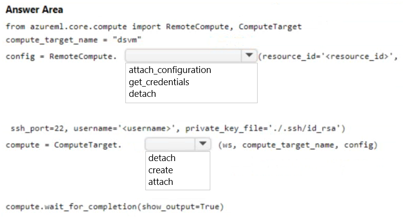

  
Show Suggested Answer

  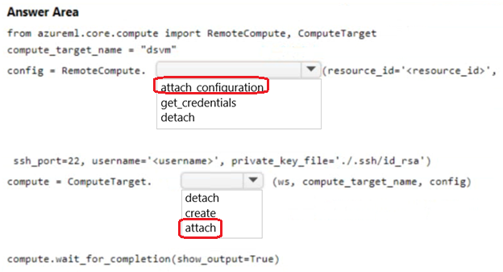

---

## Question 114 | [Link](https://www.examtopics.com/discussions/microsoft/view/103997-exam-dp-100-topic-2-question-71-discussion/){:target="_blank"}

HOTSPOT

-

You have an Azure Machine Learning workspace.

You run the following code in a Python environment in which the configuration file for your workspace has been downloaded.

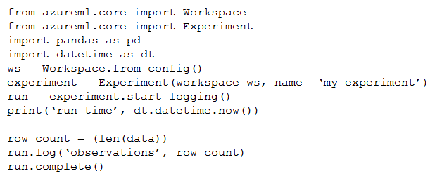

Instructions: For each of the following statements, select Yes if the statement is true. Otherwise, select No.

NOTE: Each correct selection is worth one point.

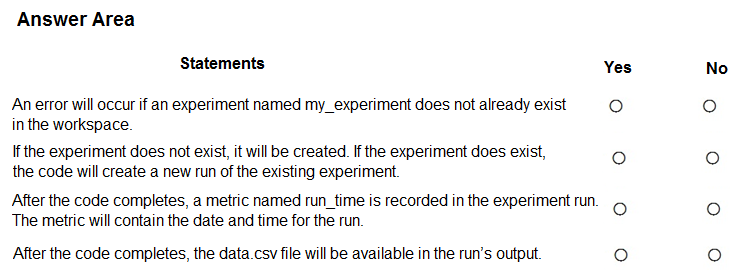

  
Show Suggested Answer

  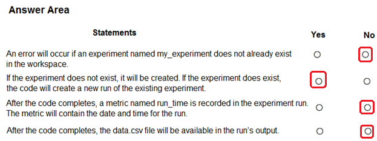

---

## Question 115 | [Link](https://www.examtopics.com/discussions/microsoft/view/107214-exam-dp-100-topic-2-question-72-discussion/){:target="_blank"}

DRAG DROP

-

You create an Azure Machine Learning workspace.

You need to use the shared file system of the workspace to store a clone of a private Git repository.

Which four actions should you perform in sequence? To answer, move the appropriate actions from the list of actions to the answer area and arrange them in the correct order.

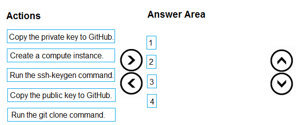

  
Show Suggested Answer

  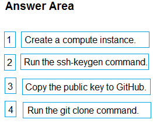

---

## Question 116 | [Link](https://www.examtopics.com/discussions/microsoft/view/107215-exam-dp-100-topic-2-question-73-discussion/){:target="_blank"}

DRAG DROP

-

You have an existing GitHub repository containing Azure Machine Learning project files.

You need to clone the repository to your Azure Machine Learning shared workspace file system.

Which four actions should you perform in sequence? To answer, move the appropriate actions from the list of actions to the answer area and arrange them in the correct order.

NOTE: More than one order of answer choices is correct. You will receive credit for any of the correct orders you select.

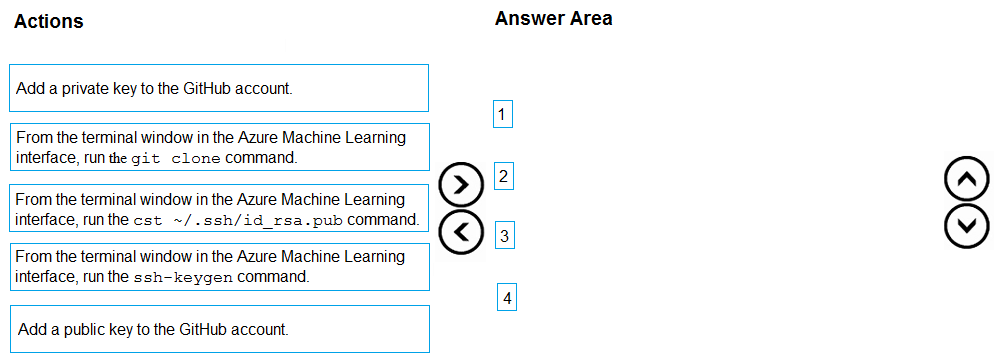

  
Show Suggested Answer

  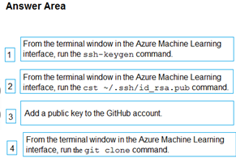

---

## Question 117 | [Link](https://www.examtopics.com/discussions/microsoft/view/105879-exam-dp-100-topic-2-question-74-discussion/){:target="_blank"}

You are creating a compute target to train a machine learning experiment.

The compute target must support automated machine learning, machine learning pipelines, and Azure Machine Learning designer training.

You need to configure the compute target.

Which option should you use?

* A.Azure HDInsight
* B.Azure Machine Learning compute cluster
* C.Azure Batch
* D.Remote VM

  
Show Suggested Answer

  B

---

## Question 118 | [Link](https://www.examtopics.com/discussions/microsoft/view/107218-exam-dp-100-topic-2-question-75-discussion/){:target="_blank"}

You manage an Azure Machine Learning workspace by using the Azure CLI ml extension v2.

You need to define a YAML schema to create a compute cluster.

Which schema should you use?

* A.https://azuremlschemas.azureedge.net/latest/computeInstance.schema.json
* B.https://azuremlschemas.azureedge.net/latest/amlCompute.schema.json
* C.https://azuremlschemas.azureedge.net/latest/vmCompute.schema.json
* D.https://azuremlschemas.azureedge.net/latest/kubernetesCompute.schema.json

  
Show Suggested Answer

  B

---

## Question 119 | [Link](https://www.examtopics.com/discussions/microsoft/view/103677-exam-dp-100-topic-2-question-76-discussion/){:target="_blank"}

Note: This question is part of a series of questions that present the same scenario. Each question in the series contains a unique solution that might meet the stated goals. Some question sets might have more than one correct solution, while others might not have a correct solution.

After you answer a question in this section, you will NOT be able to return to it. As a result, these questions will not appear in the review screen.

You have the following Azure subscriptions and Azure Machine Learning service workspaces:

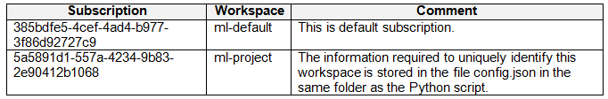

You need to obtain a reference to the ml-project workspace.

Solution: Run the following Python code:

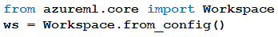

Does the solution meet the goal?

* A.Yes
* B.No

  
Show Suggested Answer

  A

---

## Question 120 | [Link](https://www.examtopics.com/discussions/microsoft/view/107926-exam-dp-100-topic-2-question-77-discussion/){:target="_blank"}

Note: This question is part of a series of questions that present the same scenario. Each question in the series contains a unique solution that might meet the stated goals. Some question sets might have more than one correct solution, while others might not have a correct solution.

After you answer a question in this section, you will NOT be able to return to it. As a result, these questions will not appear in the review screen.

You have the following Azure subscriptions and Azure Machine Learning service workspaces:

You need to obtain a reference to the ml-project workspace.

Solution: Run the following Python code:

Does the solution meet the goal?

* A.Yes
* B.No

  
Show Suggested Answer

  B

---

## Question 121 | [Link](https://www.examtopics.com/discussions/microsoft/view/103578-exam-dp-100-topic-2-question-78-discussion/){:target="_blank"}

Note: This question is part of a series of questions that present the same scenario. Each question in the series contains a unique solution that might meet the stated goals. Some question sets might have more than one correct solution, while others might not have a correct solution.

After you answer a question in this section, you will NOT be able to return to it. As a result, these questions will not appear in the review screen.

You have the following Azure subscriptions and Azure Machine Learning service workspaces:

You need to obtain a reference to the ml-project workspace.

Solution: Run the following Python code:

Does the solution meet the goal?

* A.Yes
* B.No

  
Show Suggested Answer

  B

---

## Question 122 | [Link](https://www.examtopics.com/discussions/microsoft/view/104950-exam-dp-100-topic-2-question-79-discussion/){:target="_blank"}

HOTSPOT

-

You create an Azure Machine Learning workspace. You use the Azure Machine Learning SDK for Python.

You must create a dataset from remote paths. The dataset must be reusable within the workspace.

You need to create the dataset.

How should you complete the following code segment? To answer, select the appropriate options in the answer area.

NOTE: Each correct selection is worth one point.

  
Show Suggested Answer

  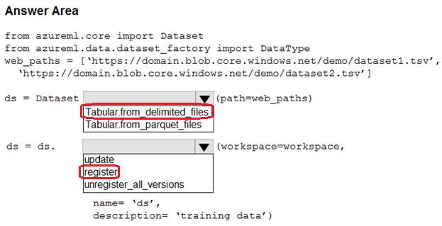

---

## Question 123 | [Link](https://www.examtopics.com/discussions/microsoft/view/107223-exam-dp-100-topic-2-question-80-discussion/){:target="_blank"}

HOTSPOT

-

You train classification and regression models by using automated machine learning.

You must evaluate automated machine learning experiment results. The results include how a classification model is making systematic errors in its predictions and the relationship between the target feature and the regression model’s predictions. You must use charts generated by automated machine learning.

You need to choose a chart type for each model type.

Which chart types should you use? To answer, select the appropriate options in the answer area.

NOTE: Each correct selection is worth one point.

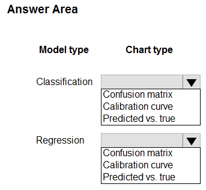

  
Show Suggested Answer

  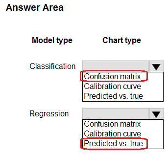

---

## Question 124 | [Link](https://www.examtopics.com/discussions/microsoft/view/105043-exam-dp-100-topic-2-question-81-discussion/){:target="_blank"}

HOTSPOT

-

You create an Azure Data Lake Storage Gen2 storage account named storage1containing a file system named fs1 and a folder named folder1.

The contents of folder1 must be accessible from jobs on compute targets in the Azure Machine Learning workspace.

You need to construct a URI to reference folder1.

How should you construct the URI? To answer, select the appropriate options in the answer area.

NOTE: Each correct selection is worth one point.

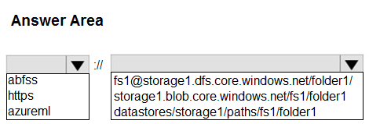

  
Show Suggested Answer

  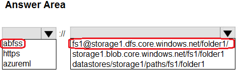

---

## Question 125 | [Link](https://www.examtopics.com/discussions/microsoft/view/103650-exam-dp-100-topic-2-question-82-discussion/){:target="_blank"}

HOTSPOT

-

You train a model by using Azure Machine Learning. You use Azure Blob Storage to store production data.

The model must be re-trained when new data is uploaded to Azure Blob Storage. You need to minimize development and coding.

You need to configure Azure services to develop a re-training solution.

Which Azure services should you use? To answer, select the appropriate options in the answer area.

NOTE: Each correct selection is worth one point.

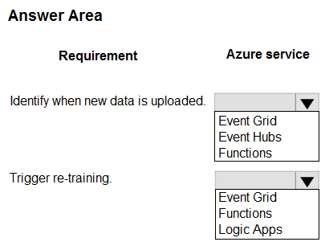

  
Show Suggested Answer

  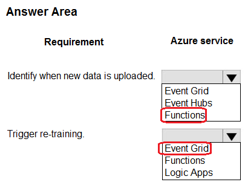

---

## Question 126 | [Link](https://www.examtopics.com/discussions/microsoft/view/106960-exam-dp-100-topic-2-question-83-discussion/){:target="_blank"}

You use the Azure Machine Learning SDK for Python v1 and notebooks to train a model. You create a compute target, an environment, and a training script by using Python code.

You need to prepare information to submit a training run.

Which class should you use?

* A.ScriptRun
* B.ScriptRunConfig
* C.RunConfiguration
* D.Run

  
Show Suggested Answer

  B

---

## Question 127 | [Link](https://www.examtopics.com/discussions/microsoft/view/106242-exam-dp-100-topic-2-question-84-discussion/){:target="_blank"}

HOTSPOT

-

You have an Azure Machine Learning workspace.

You need to use the Azure Machine Learning SDK for Python to create and register the Azure Data Lake Storage Generation 2 datastore for the workspace.

How should you complete the following code segment? To answer, select the appropriate options in the answer area.

NOTE: Each correct selection is worth one point.

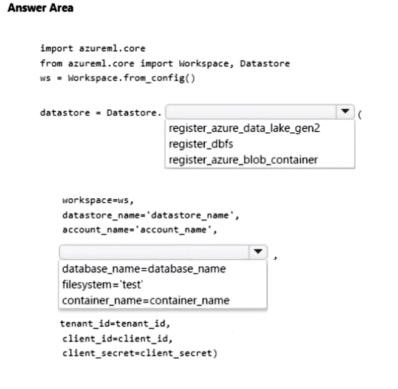

  
Show Suggested Answer

  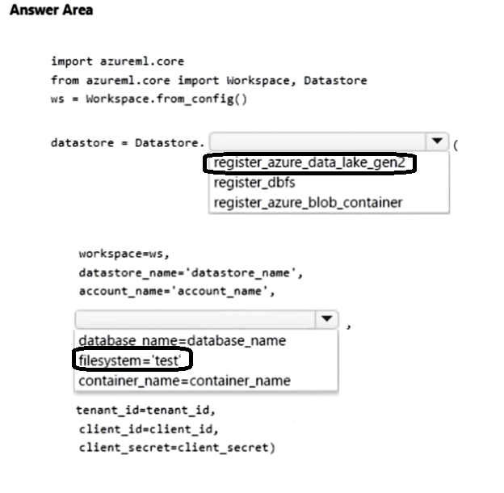

---

## Question 128 | [Link](https://www.examtopics.com/discussions/microsoft/view/106369-exam-dp-100-topic-2-question-85-discussion/){:target="_blank"}

HOTSPOT

-

You manage an Azure Machine Learning workspace. You create a training script named sample_training_script.py. The script is used to train a predictive model in the conda environment defined by a file named environment.yml.

You need to run the script as an experiment.

How should you complete the following code segment? To answer, select the appropriate options in the answer area.

NOTE: Each correct selection is worth one point.

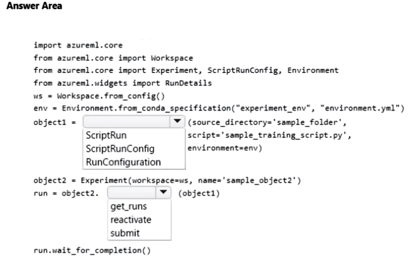

  
Show Suggested Answer

  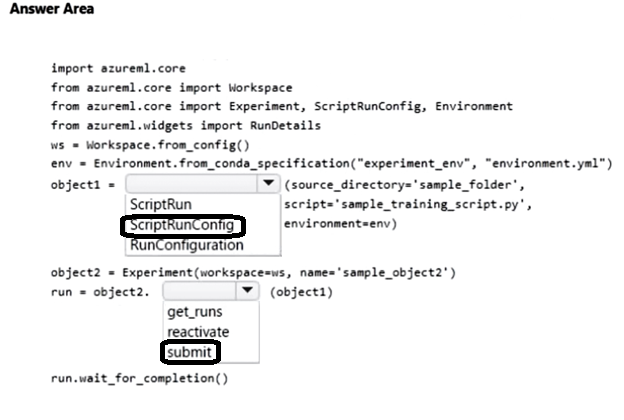

---

## Question 129 | [Link](https://www.examtopics.com/discussions/microsoft/view/106238-exam-dp-100-topic-2-question-86-discussion/){:target="_blank"}

You have an Azure Machine Learning workspace. You are connecting an Azure Data Lake Storage Gen2 account to the workspace as a data store.

You need to authorize access from the workspace to the Azure Data Lake Storage Gen2 account.

What should you use?

* A.Service principal
* B.SAS token
* C.Managed identity
* D.Account key

  
Show Suggested Answer

  A

---

## Question 130 | [Link](https://www.examtopics.com/discussions/microsoft/view/106177-exam-dp-100-topic-2-question-87-discussion/){:target="_blank"}

DRAG DROP

-

You provision an Azure Machine Learning workspace in a new Azure subscription.

You need to attach Azure Databricks as a compute resource from the Azure Machine Learning workspace.

Which four actions should you perform in sequence? To answer, move the appropriate actions from the list of actions to the answer area and arrange them in the correct order.

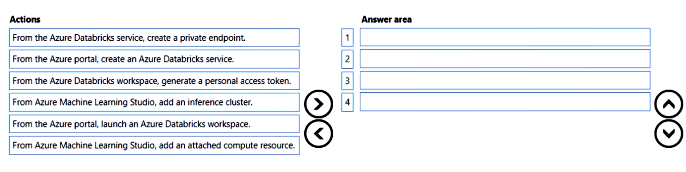

  
Show Suggested Answer

  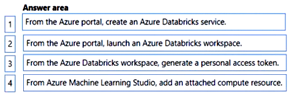

---

## Question 131 | [Link](https://www.examtopics.com/discussions/microsoft/view/107243-exam-dp-100-topic-2-question-88-discussion/){:target="_blank"}

HOTSPOT

-

You are designing a machine learning solution.

You have the following requirements:

•	Use a training script to train a machine learning model.

•	Build a machine learning proof of concept without the use of code or script.

You need to select a development tool for each requirement.

Which development tool should you use? To answer, select the appropriate options in the answer area.

NOTE: Each correct selection is worth one point.

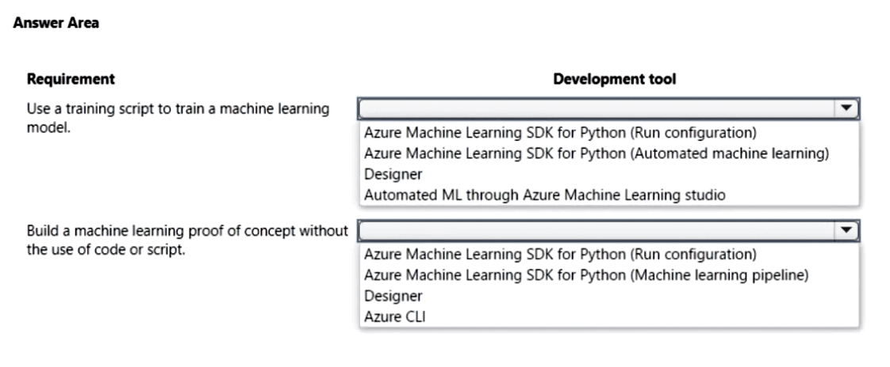

  
Show Suggested Answer

  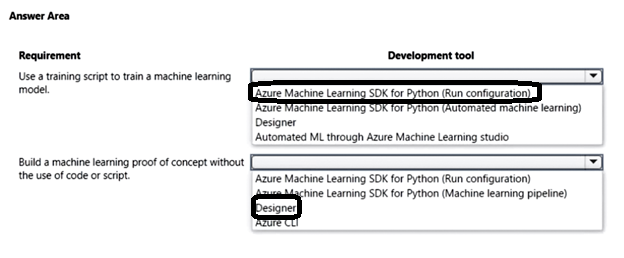

---

## Question 132 | [Link](https://www.examtopics.com/discussions/microsoft/view/112700-exam-dp-100-topic-2-question-89-discussion/){:target="_blank"}

You manage an Azure Machine Learning workspace named workspace1.

You must develop Python SDK v2 code to attach an Azure Synapse Spark pool as a compute target in workspace1. The code must invoke the constructor of the SynapseSparkCompute class.

You need to invoke the constructor.

What should you use?

* A.Synapse workspace web URL and Spark pool name
* B.resource ID of the Synapse Spark pool and a user-defined name
* C.pool URL of the Synapse Spark pool and a system-assigned name
* D.Synapse workspace name and workspace web URL

  
Show Suggested Answer

  B

---

## Question 133 | [Link](https://www.examtopics.com/discussions/microsoft/view/114979-exam-dp-100-topic-2-question-90-discussion/){:target="_blank"}

HOTSPOT

-

You manage an Azure Machine Learning workspace by using the Python SDK v2.

You must create a compute cluster in the workspace. The compute cluster must run workloads and property handle interruptions. You start by calculating the maximum amount of compute resources required by the workloads and size the cluster to match the calculations.

The cluster definition includes the following properties and values:

•	names=“mlcluster”

•	size=“STANDARD_DS3_v2”

•	min_instances=1

•	max_instances=4

•	tier=“dedicated“

The cost of the compute resources must be minimized when a workload is active or idle. Cluster property changes must not affect the maximum amount of compute resources available to the workloads run on the cluster.

You need to modify the cluster properties to minimize the cost of compute resources.

Which properties should you modify? To answer, select the appropriate options in the answer area.

NOTE: Each correct selection is worth one point.

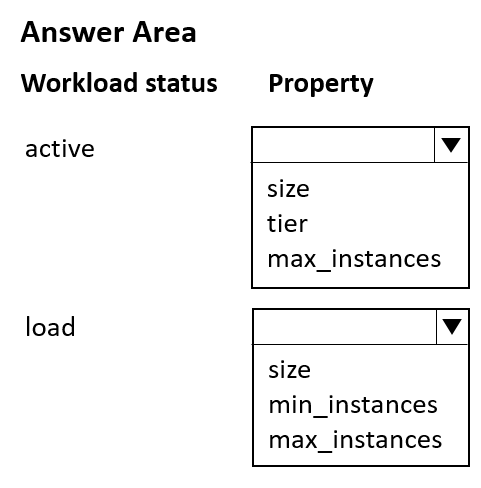

  
Show Suggested Answer

  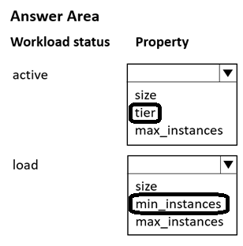

---

## Question 134 | [Link](https://www.examtopics.com/discussions/microsoft/view/112705-exam-dp-100-topic-2-question-91-discussion/){:target="_blank"}

HOTSPOT

-

You manage an Azure Machine Learning workspace. You create an experiment named experiment by using the Azure Machine Learning Python SDK v2 and MLflow.

You are reviewing the results of experiment by using the following code segment:

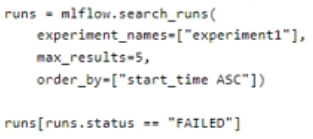

For each of the following statements, select Yes if the statement is true. Otherwise, select No.

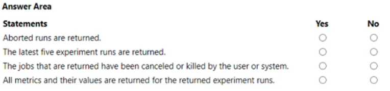

  
Show Suggested Answer

  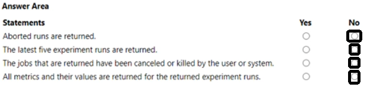

---

## Question 135 | [Link](https://www.examtopics.com/discussions/microsoft/view/112706-exam-dp-100-topic-2-question-92-discussion/){:target="_blank"}

You manage an Azure Machine Learning workspace. You have an environment for training jobs which uses an existing Docker image.

A new version of the Docker image is available.

You need to use the latest version of the Docker image for the environment configuration by using the Azure Machine Learning SDK v2.

What should you do?

* A.Modify the conda_file to specify the new version of the Docker image.
* B.Use the Environment class to create a new version of the environment.
* C.Use the create_or_update method to change the tag of the image.
* D.Change the description parameter of the environment configuration.

  
Show Suggested Answer

  B

---

## Question 136 | [Link](https://www.examtopics.com/discussions/microsoft/view/112708-exam-dp-100-topic-2-question-93-discussion/){:target="_blank"}

HOTSPOT

-

You manage an Azure Machine Learning workspace by using the Python SDK v2.

You must create an automated machine learning job to generate a classification model by using data files stored in Parquet format.

You must configure an autoscaling compute target and a data asset for the job.

You need to configure the resources for the job.

Which resource configuration should you use? To answer, select the appropriate options in the answer area.

NOTE: Each correct selection is worth one point.

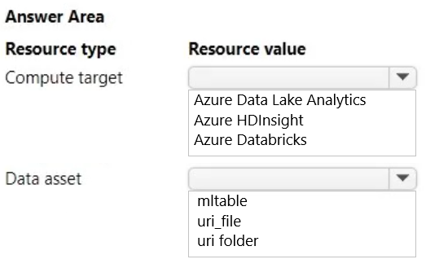

  
Show Suggested Answer

  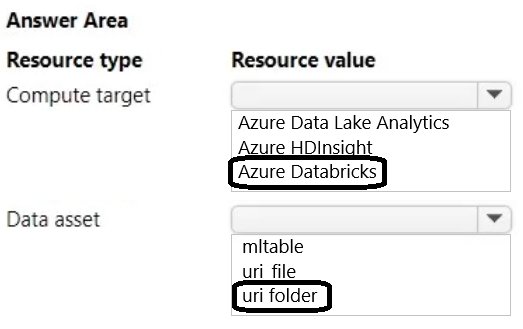

---

## Question 137 | [Link](https://www.examtopics.com/discussions/microsoft/view/112710-exam-dp-100-topic-2-question-94-discussion/){:target="_blank"}

HOTSPOT

-

You manage an Azure Machine Learning workspace named workspace1 with a compute instance named compute1.

You must remove a kernel named kernel1 from compute1. You connect to compute1 by using a terminal window from workspace1.

You need to enter a command in the terminal window to remove kernel.

Which command should you use? To answer, select the appropriate options in the answer area.

NOTE: Each correct selection is worth one point.

  
Show Suggested Answer

  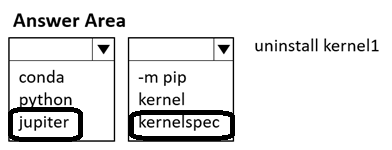

---

## Question 138 | [Link](https://www.examtopics.com/discussions/microsoft/view/112720-exam-dp-100-topic-2-question-95-discussion/){:target="_blank"}

You manage an Azure Machine Learning workspace. The workspace includes an Azure Machine Learning Kubernetes compute target configured as an Azure Kubernetes Service (AKS) cluster named AKS1. AKS1 is configured to enable the targeting of different nodes to train workloads.

You must run a command job on AKS1 by using the Azure ML Python SDK v2. The command job must select different types of compute nodes. The compute node types must be specified by using a command parameter.

You need to configure the command parameter.

Which parameter should you use?

* A.environment
* B.compute
* C.limits
* D.instance_type

  
Show Suggested Answer

  D

---

## Question 139 | [Link](https://www.examtopics.com/discussions/microsoft/view/114990-exam-dp-100-topic-2-question-96-discussion/){:target="_blank"}

HOTSPOT

-

You create a new Azure Machine Learning workspace with a compute cluster.

You need to create the compute cluster asynchronously by using the Azure Machine Learning Python SDK v2.

How should you complete the code segment? To answer, select the appropriate options in the answer area.

NOTE: Each correct selection is worth one point.

  
Show Suggested Answer

  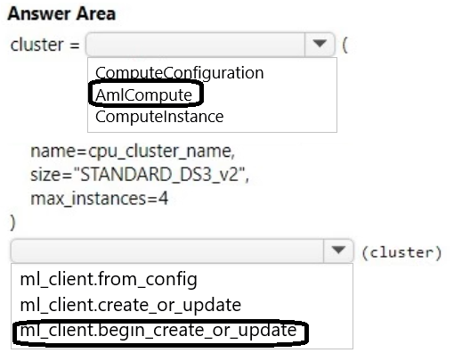

---

## Question 140 | [Link](https://www.examtopics.com/discussions/microsoft/view/112721-exam-dp-100-topic-2-question-97-discussion/){:target="_blank"}

DRAG DROP

-

You manage an Azure Machine Learning workspace named workspace1 by using the Python SDK v2.

You must register datastores in workspace1 for Azure Blob storage and Azure Files storage to meet the following requirements:

•	Azure Active Directory (Azure AD) authentication must be used for access to storage when possible.

•	Credentials and secrets stored in workspace1 must be valid for a specified time period when accessing Azure Files storage.

You need to configure a security access method used to register the Azure Blob and Azure Files storage in workspace1.

Which security access method should you configure? To answer, select the appropriate options in the answer area.

NOTE: Each correct selection is worth one point.

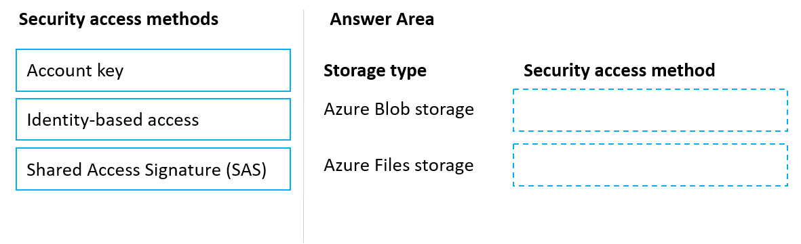

  
Show Suggested Answer

  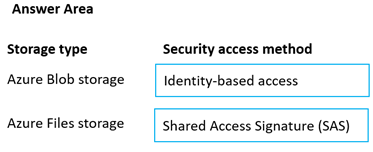

---

## Question 141 | [Link](https://www.examtopics.com/discussions/microsoft/view/112722-exam-dp-100-topic-2-question-98-discussion/){:target="_blank"}

You manage an Azure Machine Learning workspace named workspace1.

You must develop Python SDK v2 code to add a compute instance to workspace1. The code must import all required modules and call the constructor of the ComputeInstance class.

You need to add the instantiated compute instance to workspace1.

What should you use?

* A.constructor of the azure.ai.ml.ComputeSchedule class
* B.constructor of the azure.ai.ml.ComputePowerAction enum
* C.begin_create_or_update method of an instance of the azure.ai.ml.MLCIient class
* D.set_resources method of an instance of the azure.ai.ml.Command class

  
Show Suggested Answer

  C

---

## Question 142 | [Link](https://www.examtopics.com/discussions/microsoft/view/112725-exam-dp-100-topic-2-question-99-discussion/){:target="_blank"}

HOTSPOT

-

You manage an Azure Machine Learning workspace.

You must define the execution environments for your jobs and encapsulate the dependencies for your code.

You need to configure the environment from a Docker build context.

How should you complete the code segment? To answer, select the appropriate option in the answer area.

NOTE: Each correct selection is worth one point.

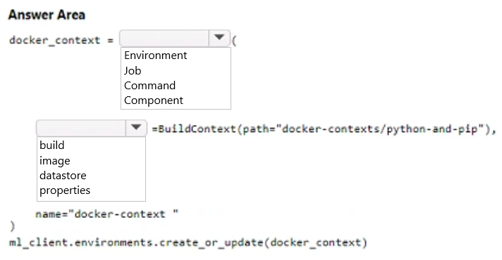

  
Show Suggested Answer

  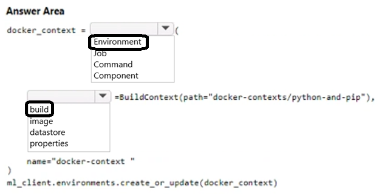

---

## Question 143 | [Link](https://www.examtopics.com/discussions/microsoft/view/112726-exam-dp-100-topic-2-question-100-discussion/){:target="_blank"}

HOTSPOT

-

You create an Azure Machine Learning workspace. You use the Azure Machine Learning Python SDK v2 to create a compute cluster.

The compute cluster must run a training script. Costs associated with running the training script must be minimized.

You need to complete the Python script to create the compute cluster.

How should you complete the script? To answer, select the appropriate options in the answer area.

NOTE: Each correct selection is worth one point.

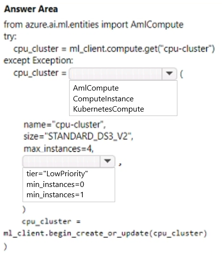

  
Show Suggested Answer

  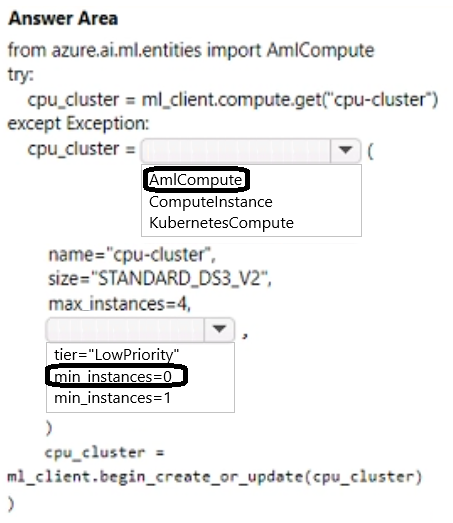

---

## Question 144 | [Link](https://www.examtopics.com/discussions/microsoft/view/112727-exam-dp-100-topic-2-question-101-discussion/){:target="_blank"}

You create a workspace to include a compute instance by using Azure Machine Learning Studio. You are developing a Python SDK v2 notebook in the workspace.

You need to use Intellisense in the notebook.

What should you do?

* A.Stop the compute instance.
* B.Start the compute instance.
* C.Run a %pip magic function on the compute instance.
* D.Run a !pip magic function on the compute instance.

  
Show Suggested Answer

  B

---

## Question 145 | [Link](https://www.examtopics.com/discussions/microsoft/view/112729-exam-dp-100-topic-2-question-102-discussion/){:target="_blank"}

DRAG DROP

-

You manage an Azure Machine Learning workspace named workspace1 with a compute instance named compute1. You connect to compute1 by using a terminal window from workspace1. You create a file named "requirements.txt” containing Python dependencies to include Jupyter.

You need to add a new Jupyter kernel to compute1.

Which four commands should you use? To answer, move the appropriate actions from the list of actions to the answer area and arrange them in the correct order.

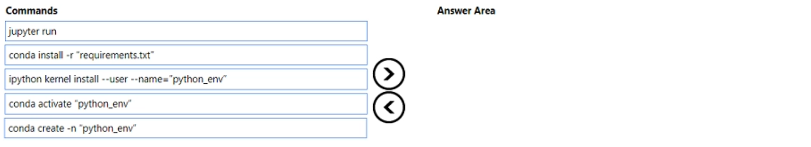

  
Show Suggested Answer

  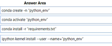

---

## Question 146 | [Link](https://www.examtopics.com/discussions/microsoft/view/112731-exam-dp-100-topic-2-question-103-discussion/){:target="_blank"}

HOTSPOT

-

You are creating data wrangling and model training solutions in an Azure Machine Learning workspace.

You must use the same Python notebook to perform both data wrangling and model training.

You need to use the Azure Machine Learning Python SDK v2 to define and configure the Synapse Spark pool asynchronously in the workspace as dedicated compute.

How should you complete the code segment? To answer, select the appropriate options in the answer area.

NOTE: Each correct selection is worth one point.

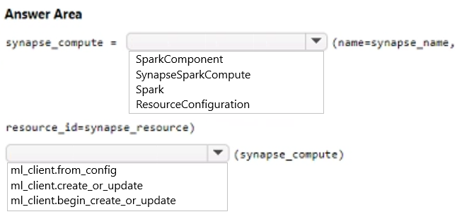

  
Show Suggested Answer

  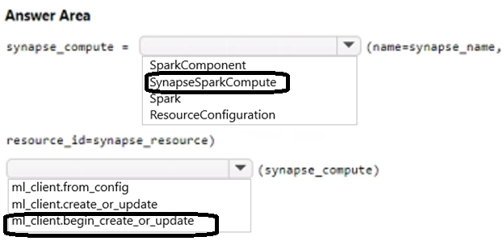

---

## Question 147 | [Link](https://www.examtopics.com/discussions/microsoft/view/112733-exam-dp-100-topic-2-question-104-discussion/){:target="_blank"}

HOTSPOT

-

You manage an Azure Machine Learning workspace named workspace1 by using the Python SDK v2.

You must register datastores in workspace1 for Azure Blob and Azure Data Lake Gen2 storage to meet the following requirements:

•	Data scientists accessing the datastore must have the same level of access.

•	Access must be restricted to specified containers or folders.

You need to configure a security access method used to register the Azure Blob and Azure Data Lake Gen2 storage in workspace1.

Which security access method should you configure? To answer, select the appropriate options in the answer area.

NOTE: Each correct selection is worth one point.

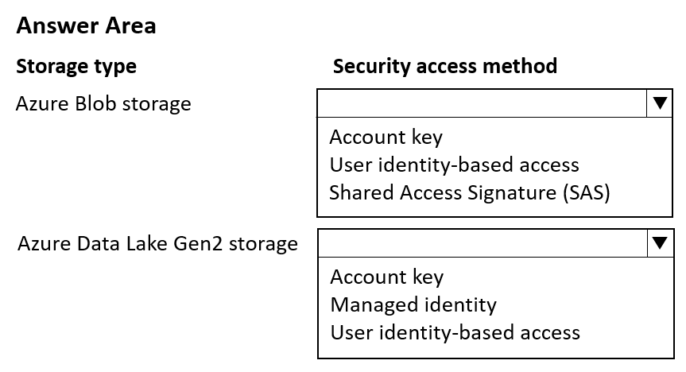

  
Show Suggested Answer

  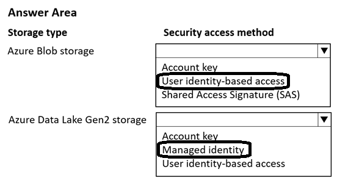

---

## Question 148 | [Link](https://www.examtopics.com/discussions/microsoft/view/117174-exam-dp-100-topic-2-question-105-discussion/){:target="_blank"}

DRAG DROP

-

You create an Azure Machine Learning workspace and an Azure Synapse Analytics workspace with a Spark pool. The workspaces are contained within the same Azure subscription.

You must manage the Synapse Spark pool from the Azure Machine Learning workspace.

You need to attach the Synapse Spark pool in Azure Machine Learning by using the Python SDK v2.

Which three actions should you perform in sequence? To answer, move the appropriate actions from the list of actions to the answer area and arrange them in the correct order.

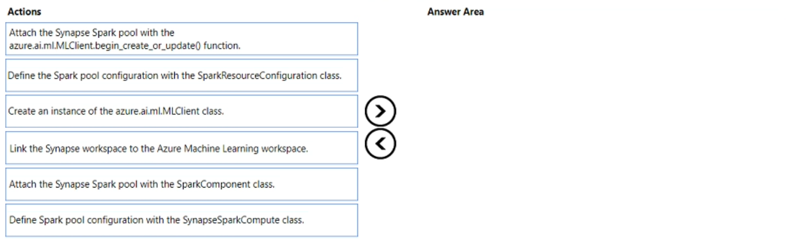

  
Show Suggested Answer

  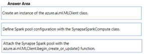

---

## Question 149 | [Link](https://www.examtopics.com/discussions/microsoft/view/114993-exam-dp-100-topic-2-question-106-discussion/){:target="_blank"}

You manage an Azure Machine Learning workspace.

You need to define an environment from a Docker image by using the Azure Machine Learning Python SDK v2.

Which parameter should you use?

* A.properties
* B.image
* C.build
* D.conda_file

  
Show Suggested Answer

  B

---

## Question 150 | [Link](https://www.examtopics.com/discussions/microsoft/view/114632-exam-dp-100-topic-2-question-107-discussion/){:target="_blank"}

You create an Azure Machine Learning managed compute resource. The compute resource is configured as follows:

•	Minimum nodes: 2

•	Maximum nodes: 4

You must decrease the minimum number of nodes and increase the maximum number of nodes to the following values:

•	Minimum nodes: 0

•	Maximum nodes: 8

You need to reconfigure the compute resource.

Which three methods can you use? Each correct answer presents a complete solution.

NOTE: Each correct selection is worth one point.

* A.Azure Machine Learning designer
* B.MLClient class in Python SDK v2
* C.Azure Machine Learning studio
* D.Azure CLI ml extension v2
* E.BuildContext class in Python SDK v2

  
Show Suggested Answer

  BCD

---

## Question 151 | [Link](https://www.examtopics.com/discussions/microsoft/view/117175-exam-dp-100-topic-2-question-108-discussion/){:target="_blank"}

You plan to use automated machine learning by using Azure Machine Learning Python SDK v2 to train a regression model. You have data that has features with missing values, and categorical features with few distinct values.

You need to control whether automated machine learning automatically imputes missing values and encode categorical features as part of the training task.

Which enum of the automl package should you use?

* A.ForecastHorizonMode
* B.RegressionModels
* C.FeaturizationMode
* D.RegressionPrimaryMetrics

  
Show Suggested Answer

  C

---

## Question 152 | [Link](https://www.examtopics.com/discussions/microsoft/view/114636-exam-dp-100-topic-2-question-109-discussion/){:target="_blank"}

Note: This question is part of a series of questions that present the same scenario. Each question in the series contains a unique solution that might meet the stated goals. Some question sets might have more than one correct solution, while others might not have a correct solution.

After you answer a question in this section, you will NOT be able to return to it. As a result, these questions will not appear in the review screen.

You use Azure Machine Learning designer to load the following datasets into an experiment:

Dataset1 -

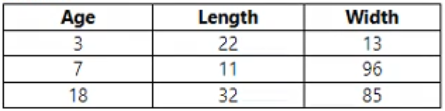

Dataset2 -

You need to create a dataset that has the same columns and header row as the input datasets and contains all rows from both input datasets.

Solution: Use the Join Data module.

Does the solution meet the goal?

* A.Yes
* B.No

  
Show Suggested Answer

  B

---

## Question 153 | [Link](https://www.examtopics.com/discussions/microsoft/view/114651-exam-dp-100-topic-2-question-110-discussion/){:target="_blank"}

HOTSPOT -

You collect data from a nearby weather station. You have a pandas dataframe named weather_df that includes the following data:

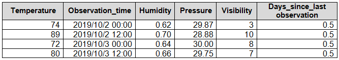

The data is collected every 12 hours: noon and midnight.

You plan to use automated machine learning to create a time-series model that predicts temperature over the next seven days. For the initial round of training, you want to train a maximum of 50 different models.

You must use the Azure Machine Learning SDK v2 to run an automated machine learning experiment to train these models.

You need to configure the automated machine learning job and its settings.

How should you configure parameters of the classes that implement the job? To answer, select the appropriate options in the answer area.

NOTE: Each correct selection is worth one point.

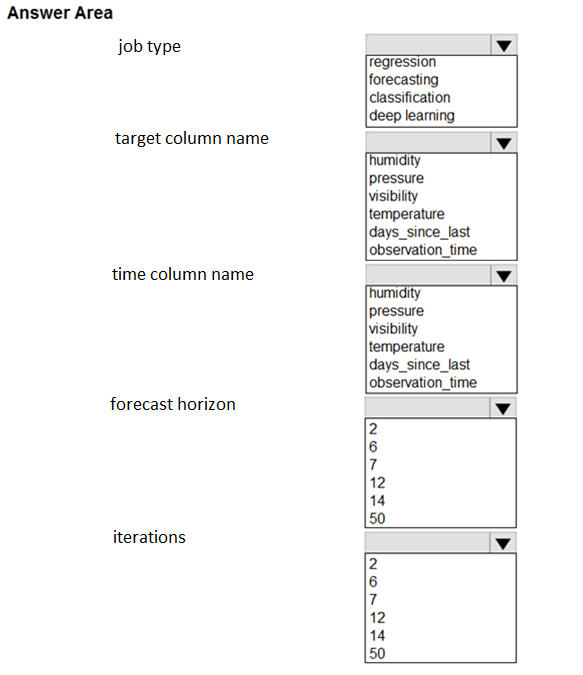

  
Show Suggested Answer

  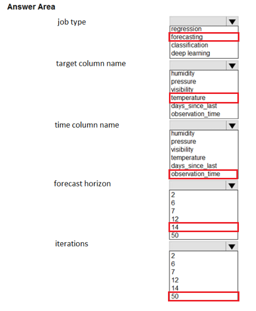

---

## Question 154 | [Link](https://www.examtopics.com/discussions/microsoft/view/134107-exam-dp-100-topic-2-question-111-discussion/){:target="_blank"}

Note: This question is part of a series of questions that present the same scenario. Each question in the series contains a unique solution that might meet the stated goals. Some question sets might have more than one correct solution, while others might not have a correct solution.

After you answer a question in this section, you will NOT be able to return to it. As a result, these questions will not appear in the review screen.

You have the following Azure subscriptions and Azure Machine Learning service workspaces:

You need to obtain a reference to the ml-project workspace.

Solution: Run the following Python code:

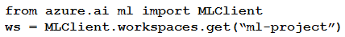

Does the solution meet the goal?

* A.Yes
* B.No

  
Show Suggested Answer

  B

---

## Question 155 | [Link](https://www.examtopics.com/discussions/microsoft/view/133601-exam-dp-100-topic-2-question-112-discussion/){:target="_blank"}

Note: This question is part of a series of questions that present the same scenario. Each question in the series contains a unique solution that might meet the stated goals. Some question sets might have more than one correct solution, while others might not have a correct solution.

After you answer a question in this section, you will NOT be able to return to it. As a result, these questions will not appear in the review screen.

You have the following Azure subscriptions and Azure Machine Learning service workspaces:

You need to obtain a reference to the ml-project workspace.

Solution: Run the following Python code:

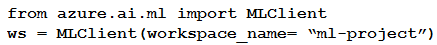

Does the solution meet the goal?

* A.Yes
* B.No

  
Show Suggested Answer

  B

---

## Question 156 | [Link](https://www.examtopics.com/discussions/microsoft/view/133925-exam-dp-100-topic-2-question-113-discussion/){:target="_blank"}

Note: This question is part of a series of questions that present the same scenario. Each question in the series contains a unique solution that might meet the stated goals. Some question sets might have more than one correct solution, while others might not have a correct solution.

After you answer a question in this section, you will NOT be able to return to it. As a result, these questions will not appear in the review screen.

You have the following Azure subscriptions and Azure Machine Learning service workspaces:

You need to obtain a reference to the ml-project workspace.

Solution: Run the following Python code:

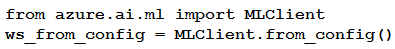

Does the solution meet the goal?

* A.Yes
* B.No

  
Show Suggested Answer

  B

---

## Question 157 | [Link](https://www.examtopics.com/discussions/microsoft/view/133615-exam-dp-100-topic-2-question-114-discussion/){:target="_blank"}

HOTSPOT

-

You manage an Azure Machine Learning workspace named workspace1.

You must register an Azure Blob storage datastore in workspace1 by using an access key. You develop Python SDK v2 code to import all modules required to register the datastore.

You need to complete the Python SDK v2 code to define the datastore.

How should you complete the code? To answer, select the appropriate options in the answer area.

NOTE: Each correct selection is worth one point.

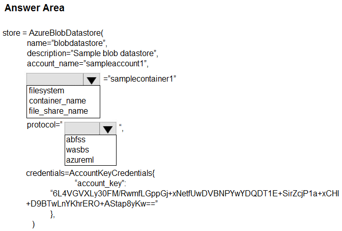

  
Show Suggested Answer

  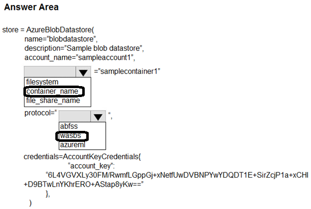

---

## Question 158 | [Link](https://www.examtopics.com/discussions/microsoft/view/134658-exam-dp-100-topic-2-question-115-discussion/){:target="_blank"}

You manage an Azure Machine Learning workspace.

You plan to import data from Azure Data Lake Storage Gen2.

You need to build a URI that represents the storage location.

Which protocol should you use?

* A.https
* B.adl
* C.abfss
* D.wasbs

  
Show Suggested Answer

  C

---

## Question 159 | [Link](https://www.examtopics.com/discussions/microsoft/view/135771-exam-dp-100-topic-2-question-116-discussion/){:target="_blank"}

You manage an Azure Machine Learning workspace. You have a folder that contains a CSV file. The folder is registered as a folder data asset.

You plan to use the folder data asset for data wrangling during interactive development.

You need to access and load the folder data asset into a Pandas data frame.

Which method should you use to achieve this goal?

* A.mltable.from_parquet_files()
* B.mltable.from_delimited_files()
* C.mltable.from_data_lake()
* D.mltable.load()

  
Show Suggested Answer

  B

---

## Question 160 | [Link](https://www.examtopics.com/discussions/microsoft/view/147297-exam-dp-100-topic-2-question-117-discussion/){:target="_blank"}

You manage an Azure Machine Learning workspace named proj1.

You plan to use assets defined in proj1 to create a pipeline in the Machine Learning studio designer.

You need to set the Registry name filter to display only the list of assets defined in proj1.

What should you set the Registry name filter to?

* A.proj1
* B.azureml-meta
* C.azureml
* D.workspace

  
Show Suggested Answer

  A

---

## Question 161 | [Link](https://www.examtopics.com/discussions/microsoft/view/142644-exam-dp-100-topic-2-question-118-discussion/){:target="_blank"}

DRAG DROP

-

You have an Azure Machine Learning workspace named WS1 and a GitHub account named account1 that hosts a private repository named repo1.

You need to clone repo1 to make it available directly from WS1. The configuration must maximize the performance of the repo1 clone.

Which four actions should you perform in sequence?

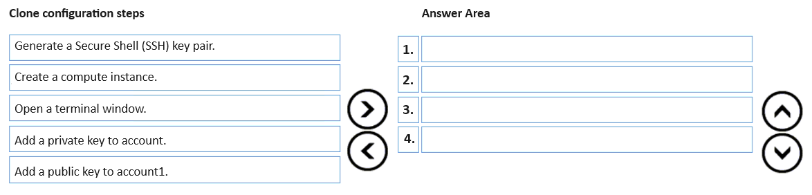

  
Show Suggested Answer

  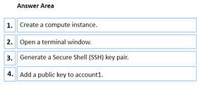

---

## Question 162 | [Link](https://www.examtopics.com/discussions/microsoft/view/148421-exam-dp-100-topic-2-question-119-discussion/){:target="_blank"}

You manage an Azure Machine Learning workspace. You design a training job that is configured with a serverless compute.

The serverless compute must have a specific instance type and count.

You need to configure the serverless compute by using Azure Machine Learning Python SDK v2.

What should you do?

* A.Specify the compute name by using the compute parameter of the command job.
* B.Configure the tier parameter to Dedicated VM.
* C.Initialize and specify the ResourceConfiguration class.
* D.Initialize AmiCompute class with size and type specification.

  
Show Suggested Answer

  C

---

## Question 163 | [Link](https://www.examtopics.com/discussions/microsoft/view/149361-exam-dp-100-topic-2-question-120-discussion/){:target="_blank"}

HOTSPOT

-

You manage an Azure subscription that contains the following resources:

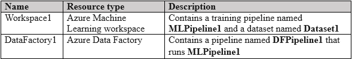

You plan to implement a solution that will automatically trigger the retraining of the model implemented by MLPipeline1. The trigger must be invoked if data drift is detected in Dataset1.

You need to select the components to invoke and run the solution. The solution must minimize coding implementation and maintenance efforts.

Which components should you select? To answer, select the appropriate options in the answer area.

NOTE: Each correct selection is worth one point.

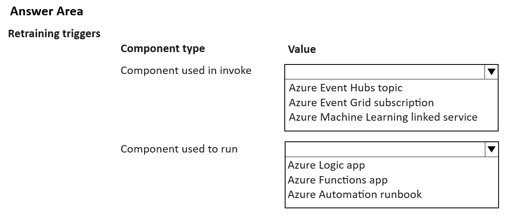

  
Show Suggested Answer

  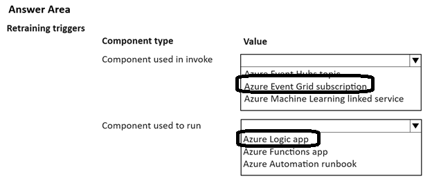

---

## Question 164 | [Link](https://www.examtopics.com/discussions/microsoft/view/148760-exam-dp-100-topic-2-question-121-discussion/){:target="_blank"}

You manage an Azure Machine Learning workspace.

You must create and configure a compute cluster for a training job by using Python SDK v2.

You need to create a persistent Azure Machine Learning compute resource, specifying the fewest possible properties.

Which two properties should you define? Each correct answer presents part of the solution.

NOTE: Each correct selection is worth one point.

* A.size
* B.win_instances
* C.type
* D.name
* E.max_instances

  
Show Suggested Answer

  AE

---

## Question 165 | [Link](https://www.examtopics.com/discussions/microsoft/view/148761-exam-dp-100-topic-2-question-122-discussion/){:target="_blank"}

You manage an Azure Machine Learning workspace named Workspace1.

You plan to create a pipeline in the Azure Machine Learning Studio designer. The pipeline must include a custom component.

You need to ensure the custom component can be used in the pipeline.

What should you do first?

* A.Create a pipeline endpoint.
* B.Add a linked service to Workspace1.
* C.Upload a .json file to Workspace1.
* D.Create a datastore.
* E.Upload a .yaml file to Workspace1.

  
Show Suggested Answer

  E

---

## Question 166 | [Link](https://www.examtopics.com/discussions/microsoft/view/151181-exam-dp-100-topic-2-question-123-discussion/){:target="_blank"}

You have an Azure Machine Learning workspace and a serverless Spark compute resource.

You plan to run the same Spark session every 40 minutes. Each session runs for 15 minutes.

During testing, you observe a 15-minute delay at the start of the Spark sessions.

You need to reduce the delay to less than 1 minute.

What should you do?

* A.Configure the session timeout to be 25 minutes.
* B.Increase the number of nodes to 16.
* C.Enable dynamically allocated executors.
* D.Enable an isolated compute.

  
Show Suggested Answer

  A

---

## Question 167 | [Link](https://www.examtopics.com/discussions/microsoft/view/150797-exam-dp-100-topic-2-question-124-discussion/){:target="_blank"}

Note: This question is part of a series of questions that present the same scenario. Each question in the series contains a unique solution that might meet the stated goals. Some question sets might have more than one correct solution, while others might not have a correct solution.

After you answer a question in this section, you will NOT be able to return to it. As a result, these questions will not appear in the review screen.

You manage an Azure Machine Learning workspace. The development environment for managing the workspace is configured to use Python SDK v2 in Azure Machine Learning Notebooks.

A Synapse Spark Compute is currently attached and uses system-assigned identity.

You need to use Python code to update the Synapse Spark Compute to use a user-assigned identity.

Solution: Create an instance of the MLClient class.

Does the solution meet the goal?

* A.Yes
* B.No

  
Show Suggested Answer

  B

---

## Question 168 | [Link](https://www.examtopics.com/discussions/microsoft/view/151507-exam-dp-100-topic-2-question-125-discussion/){:target="_blank"}

Note: This question is part of a series of questions that present the same scenario. Each question in the series contains a unique solution that might meet the stated goals. Some question sets might have more than one correct solution, while others might not have a correct solution.

After you answer a question in this section, you will NOT be able to return to it. As a result, these questions will not appear in the review screen.

You manage an Azure Machine Learning workspace. The development environment for managing the workspace is configured to use Python SDK v2 in Azure Machine Learning Notebooks.

A Synapse Spark Compute is currently attached and uses system-assigned identity.

You need to use Python code to update the Synapse Spark Compute to use a user-assigned identity.

Solution: Initialize the DefaultAzureCredential class.

Does the solution meet the goal?

* A.Yes
* B.No

  
Show Suggested Answer

  B

---

## Question 169 | [Link](https://www.examtopics.com/discussions/microsoft/view/151564-exam-dp-100-topic-2-question-126-discussion/){:target="_blank"}

Note: This question is part of a series of questions that present the same scenario. Each question in the series contains a unique solution that might meet the stated goals. Some question sets might have more than one correct solution, while others might not have a correct solution.

After you answer a question in this section, you will NOT be able to return to it. As a result, these questions will not appear in the review screen.

You manage an Azure Machine Learning workspace. The development environment for managing the workspace is configured to use Python SDK v2 in Azure Machine Learning Notebooks.

A Synapse Spark Compute is currently attached and uses system-assigned identity.

You need to use Python code to update the Synapse Spark Compute to use a user-assigned identity.

Solution: Configure the IdentityConfiguration class with the appropriate identity type.

Does the solution meet the goal?

* A.Yes
* B.No

  
Show Suggested Answer

  A

---

## Question 170 | [Link](https://www.examtopics.com/discussions/microsoft/view/150333-exam-dp-100-topic-2-question-127-discussion/){:target="_blank"}

Note: This question is part of a series of questions that present the same scenario. Each question in the series contains a unique solution that might meet the stated goals. Some question sets might have more than one correct solution, while others might not have a correct solution.

After you answer a question in this section, you will NOT be able to return to it. As a result, these questions will not appear in the review screen.

You have an Azure Machine Learning workspace that includes an AmlCompute cluster and a batch endpoint.

You clone a repository that contains an MLflow model to your local computer.

You need to ensure that you can deploy the model to the batch endpoint.

Solution: Add a compute resource to the workspace.

Does the solution meet the goal?

* A.Yes
* B.No

  
Show Suggested Answer

  A

---

## Question 171 | [Link](https://www.examtopics.com/discussions/microsoft/view/149364-exam-dp-100-topic-2-question-128-discussion/){:target="_blank"}

Note: This question is part of a series of questions that present the same scenario. Each question in the series contains a unique solution that might meet the stated goals. Some question sets might have more than one correct solution, while others might not have a correct solution.

After you answer a question in this section, you will NOT be able to return to it. As a result, these questions will not appear in the review screen.

You have an Azure Machine Learning workspace that includes an AmlCompute cluster and a batch endpoint.

You clone a repository that contains an MLflow model to your local computer.

You need to ensure that you can deploy the model to the batch endpoint.

Solution: Register the model in the workspace.

Does the solution meet the goal?

* A.Yes
* B.No

  
Show Suggested Answer

  A

---

## Question 172 | [Link](https://www.examtopics.com/discussions/microsoft/view/304239-exam-dp-100-topic-2-question-129-discussion/){:target="_blank"}

Note: This question is part of a series of questions that present the same scenario. Each question in the series contains a unique solution that might meet the stated goals. Some question sets might have more than one correct solution, while others might not have a correct solution.

After you answer a question in this section, you will NOT be able to return to it. As a result, these questions will not appear in the review screen.

You have an Azure Machine Learning workspace that includes an AmlCompute cluster and a batch endpoint.

You clone a repository that contains an MLflow model to your local computer.

You need to ensure that you can deploy the model to the batch endpoint.

Solution: Create a datastore in the workspace.

Does the solution meet the goal?

* A.Yes
* B.No

  
Show Suggested Answer

  B

---

## Question 173 | [Link](https://www.examtopics.com/discussions/microsoft/view/149365-exam-dp-100-topic-2-question-130-discussion/){:target="_blank"}

HOTSPOT

-

You design a data processing strategy for a machine learning project.

The data that must be processed includes unstructured flat files that must be processed in real time.

The data transformation must be executed on a serverless compute and optimized for big data analytical workloads.

You need to select the Azure services for the data science team.

Which storage and data processing service should you use? To answer, select the appropriate option in the answer area.

NOTE: Each correct selection is worth one point.

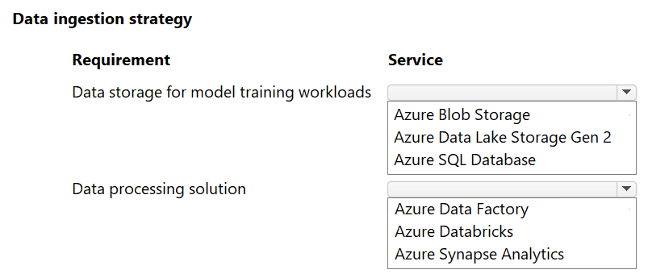

  
Show Suggested Answer

  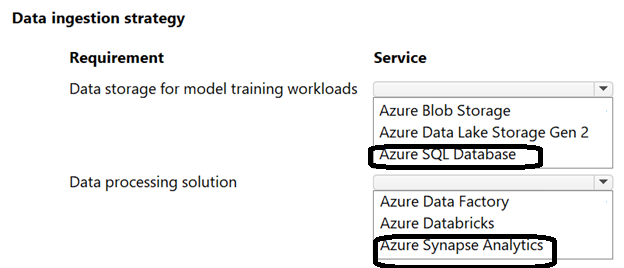

---

## Question 174 | [Link](https://www.examtopics.com/discussions/microsoft/view/149366-exam-dp-100-topic-2-question-131-discussion/){:target="_blank"}

DRAG DROP -

You manage an Azure Machine Learning workspace named workspace1.

You plan to create a registry named registry01 with the help of the following registry.yml (line numbers are used for reference only):

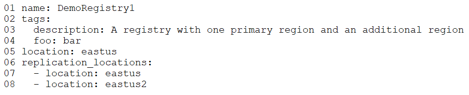

You need to use Azure Machine Learning Python SDK v2 with Python 3.10 in a notebook to interact with workspace1.

Which three actions should you perform in sequence? To answer, move the appropriate actions from the list of actions to the answer area and arrange them in the correct order.

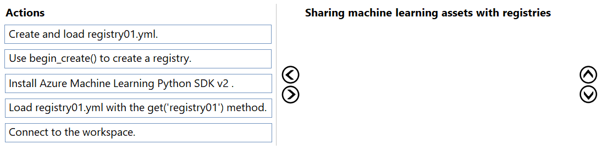

  
Show Suggested Answer

  

---

## Question 175 | [Link](https://www.examtopics.com/discussions/microsoft/view/149367-exam-dp-100-topic-2-question-132-discussion/){:target="_blank"}

DRAG DROP

-

You have an Azure Machine Learning workspace.

You plan to use the terminal to configure a compute instance to run a notebook.

You need to add a new R kernel to the compute instance.

In which order should you perform the actions? To answer, move all actions from the list of actions to the answer area and arrange them in the correct order.

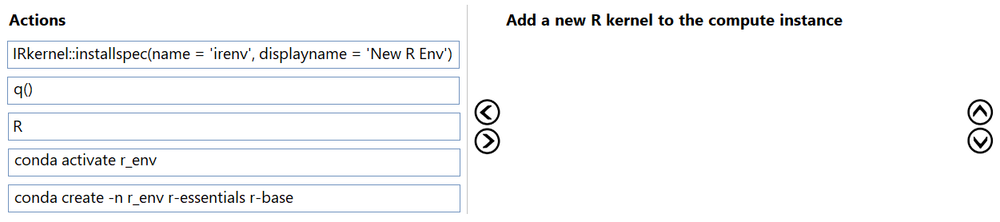

  
Show Suggested Answer

  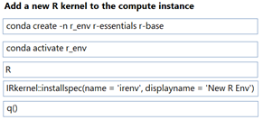

---

## Question 176 | [Link](https://www.examtopics.com/discussions/microsoft/view/150799-exam-dp-100-topic-2-question-133-discussion/){:target="_blank"}

HOTSPOT

-

You manage an Azure Machine Learning workspace named Workspace1 and an Azure Blob Storage accessed by using the URL https://storage1.blob.core.windows.net/data1.

You plan to create an Azure Blob datastore in Workspace1. The datastore must target the Blob Storage by using Azure Machine Learning Python SDK v2. Access authorization to the datastore must be limited to a specific amount of time.

You need to select the parameters of the AzureBlobDatastore class that will point to the target datastore and authorize access to it.

Which parameters should you use? To answer, select the appropriate options in the answer area.

NOTE: Each correct selection is worth one point.

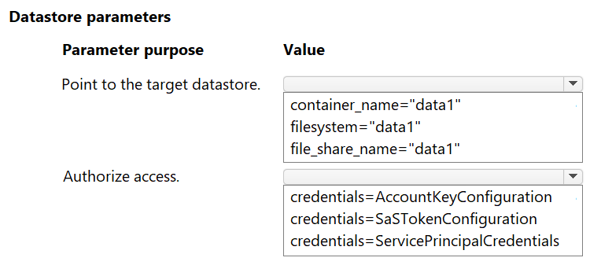

  
Show Suggested Answer

  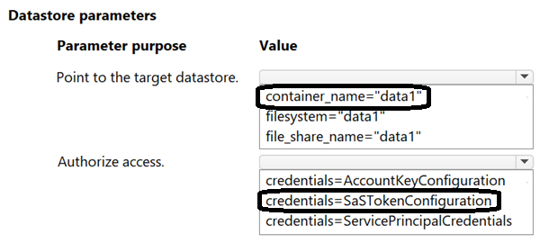

---

## Question 177 | [Link](https://www.examtopics.com/discussions/microsoft/view/150337-exam-dp-100-topic-2-question-134-discussion/){:target="_blank"}

Note: This question is part of a series of questions that present the same scenario. Each question in the series contains a unique solution that might meet the stated goals. Some question sets might have more than one correct solution, while others might not have a correct solution.

After you answer a question in this section, you will NOT be able to return to it. As a result, these questions will not appear in the review screen.

You manage an Azure Machine Learning workspace. The development environment for managing the workspace is configured to use Python SDK v2 in Azure Machine Learning Notebooks.

A Synapse Spark Compute is currently attached and uses system-assigned identity.

You need to use Python code to update the Synapse Spark Compute to use a user-assigned identity.

Solution: Pass the UserAssignedIdentity class object to the SynapseSparkCompute class.

Does the solution meet the goal?

* A.Yes
* B.No

  
Show Suggested Answer

  A

---

## Question 178 | [Link](https://www.examtopics.com/discussions/microsoft/view/150338-exam-dp-100-topic-2-question-135-discussion/){:target="_blank"}

DRAG DROP

-

You have an Azure Machine Learning workspace named WS1.

You plan to use WS1 to train two models named model1 and model2. For model1, you plan to use automated machine learning. For model2, you plan to use Azure Machine Learning designer.

You need to determine the compute targets you should use to train each model. Your solution must ensure the following:

•	The compute target for model1 supports auto-shutdown/auto-start based on a schedule.

•	The compute target for model2 supports the use of low-priority Azure Virtual Machines.

Which compute targets should you use? To answer, move the appropriate compute targets to the correct model. You may use each compute target once, more than once, or not at all. You may need to move the split bar between panes or scroll to view content.

NOTE: Each correct selection is worth one point.

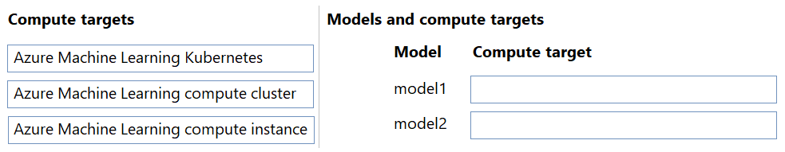

  
Show Suggested Answer

  

---

## Question 179 | [Link](https://www.examtopics.com/discussions/microsoft/view/149368-exam-dp-100-topic-2-question-136-discussion/){:target="_blank"}

You manage an Azure Machine Learning Workspace named Workspase1 and an Azure Files share named Share1.

You plan to create an Azure Files datastore in Workspace1 to target Share1.

You need to configure permanent access to Share1 from the Azure Files datastore.

Which authorization method should you use?

* A.Secondary access key
* B.Anonymous access
* C.Account SAS key
* D.Service SAS key

  
Show Suggested Answer

  A

---

## Question 180 | [Link](https://www.examtopics.com/discussions/microsoft/view/305046-exam-dp-100-topic-2-question-139-discussion/){:target="_blank"}

HOTSPOT

-

You have an Azure subscription that contains a resource group named rg-ml.

You plan to create an Azure Machine Learning workspace named workspace1 in rg-ml by using Azure Machine Learning Python SDK v2.

You need to ensure workspace is configured to prevent the collection of potentially sensitive data by Microsoft diagnostics.

How should you complete the provided code? To answer, select the appropriate options in the answer area.

NOTE: Each correct selection is worth one point.

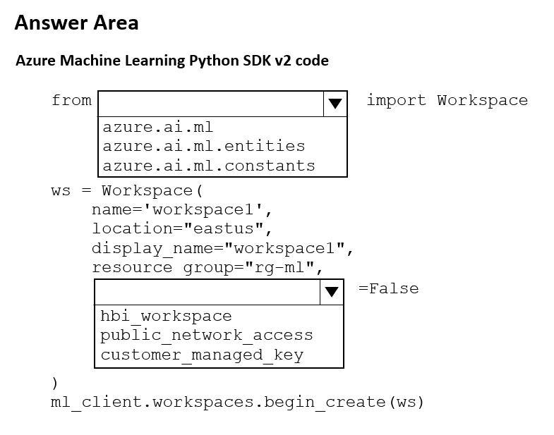

  
Show Suggested Answer

  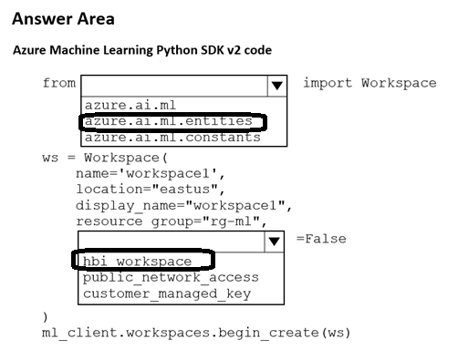

---

## Question 181 | [Link](https://www.examtopics.com/discussions/microsoft/view/36489-exam-dp-100-topic-3-question-1-discussion/){:target="_blank"}

You are analyzing a dataset containing historical data from a local taxi company. You are developing a regression model.

You must predict the fare of a taxi trip.

You need to select performance metrics to correctly evaluate the regression model.

Which two metrics can you use? Each correct answer presents a complete solution?

NOTE: Each correct selection is worth one point.

* A.a Root Mean Square Error value that is low
* B.an R-Squared value close to 0
* C.an F1 score that is low
* D.an R-Squared value close to 1
* E.an F1 score that is high
* F.a Root Mean Square Error value that is high

  
Show Suggested Answer

  AD

---

## Question 182 | [Link](https://www.examtopics.com/discussions/microsoft/view/46833-exam-dp-100-topic-3-question-2-discussion/){:target="_blank"}

Note: This question is part of a series of questions that present the same scenario. Each question in the series contains a unique solution that might meet the stated goals. Some question sets might have more than one correct solution, while others might not have a correct solution.

After you answer a question in this section, you will NOT be able to return to it. As a result, these questions will not appear in the review screen.

You are using Azure Machine Learning to run an experiment that trains a classification model.

You want to use Hyperdrive to find parameters that optimize the AUC metric for the model. You configure a HyperDriveConfig for the experiment by running the following code:

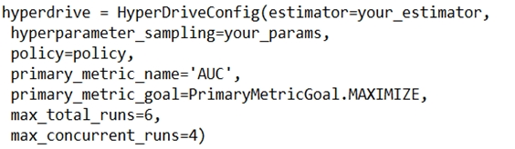

You plan to use this configuration to run a script that trains a random forest model and then tests it with validation data. The label values for the validation data are stored in a variable named y_test variable, and the predicted probabilities from the model are stored in a variable named y_predicted.

You need to add logging to the script to allow Hyperdrive to optimize hyperparameters for the AUC metric.

Solution: Run the following code:

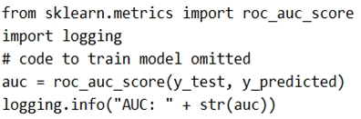

Does the solution meet the goal?

* A.Yes
* B.No

  
Show Suggested Answer

  B

---

## Question 183 | [Link](https://www.examtopics.com/discussions/microsoft/view/51172-exam-dp-100-topic-3-question-3-discussion/){:target="_blank"}

Note: This question is part of a series of questions that present the same scenario. Each question in the series contains a unique solution that might meet the stated goals. Some question sets might have more than one correct solution, while others might not have a correct solution.

After you answer a question in this section, you will NOT be able to return to it. As a result, these questions will not appear in the review screen.

You are using Azure Machine Learning to run an experiment that trains a classification model.

You want to use Hyperdrive to find parameters that optimize the AUC metric for the model. You configure a HyperDriveConfig for the experiment by running the following code:

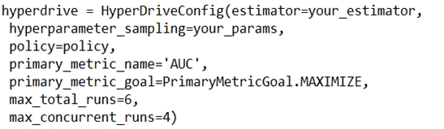

You plan to use this configuration to run a script that trains a random forest model and then tests it with validation data. The label values for the validation data are stored in a variable named y_test variable, and the predicted probabilities from the model are stored in a variable named y_predicted.

You need to add logging to the script to allow Hyperdrive to optimize hyperparameters for the AUC metric.

Solution: Run the following code:

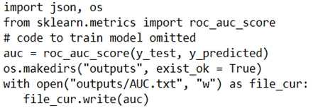

Does the solution meet the goal?

* A.Yes
* B.No

  
Show Suggested Answer

  B

---

## Question 184 | [Link](https://www.examtopics.com/discussions/microsoft/view/46834-exam-dp-100-topic-3-question-4-discussion/){:target="_blank"}

Note: This question is part of a series of questions that present the same scenario. Each question in the series contains a unique solution that might meet the stated goals. Some question sets might have more than one correct solution, while others might not have a correct solution.

After you answer a question in this section, you will NOT be able to return to it. As a result, these questions will not appear in the review screen.

You are using Azure Machine Learning to run an experiment that trains a classification model.

You want to use Hyperdrive to find parameters that optimize the AUC metric for the model. You configure a HyperDriveConfig for the experiment by running the following code:

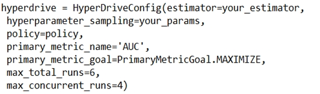

You plan to use this configuration to run a script that trains a random forest model and then tests it with validation data. The label values for the validation data are stored in a variable named y_test variable, and the predicted probabilities from the model are stored in a variable named y_predicted.

You need to add logging to the script to allow Hyperdrive to optimize hyperparameters for the AUC metric.

Solution: Run the following code:

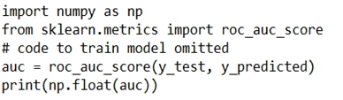

Does the solution meet the goal?

* A.Yes
* B.No

  
Show Suggested Answer

  B

---

## Question 185 | [Link](https://www.examtopics.com/discussions/microsoft/view/54859-exam-dp-100-topic-3-question-5-discussion/){:target="_blank"}

You use the following code to run a script as an experiment in Azure Machine Learning:

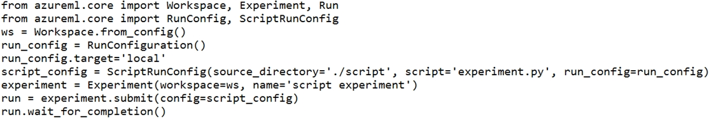

You must identify the output files that are generated by the experiment run.

You need to add code to retrieve the output file names.

Which code segment should you add to the script?

* A.files = run.get_properties()
* B.files= run.get_file_names()
* C.files = run.get_details_with_logs()
* D.files = run.get_metrics()
* E.files = run.get_details()

  
Show Suggested Answer

  B

---

## Question 186 | [Link](https://www.examtopics.com/discussions/microsoft/view/50510-exam-dp-100-topic-3-question-6-discussion/){:target="_blank"}

You write five Python scripts that must be processed in the order specified in Exhibit A `" which allows the same modules to run in parallel, but will wait for modules with dependencies.

You must create an Azure Machine Learning pipeline using the Python SDK, because you want to script to create the pipeline to be tracked in your version control system. You have created five PythonScriptSteps and have named the variables to match the module names.

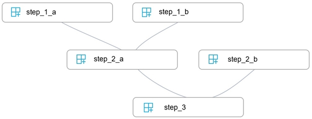

You need to create the pipeline shown. Assume all relevant imports have been done.

Which Python code segment should you use?

A.

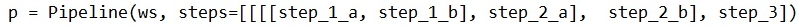

B.

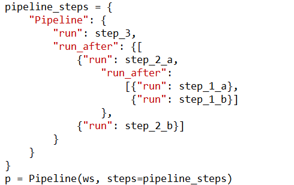

C.

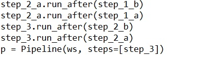

D.

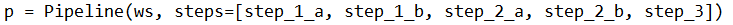

  
Show Suggested Answer

  A

---

## Question 187 | [Link](https://www.examtopics.com/discussions/microsoft/view/51412-exam-dp-100-topic-3-question-7-discussion/){:target="_blank"}

You create a datastore named training_data that references a blob container in an Azure Storage account. The blob container contains a folder named csv_files in which multiple comma-separated values (CSV) files are stored.

You have a script named train.py in a local folder named ./script that you plan to run as an experiment using an estimator. The script includes the following code to read data from the csv_files folder:

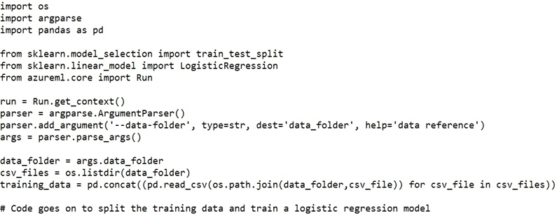

You have the following script.

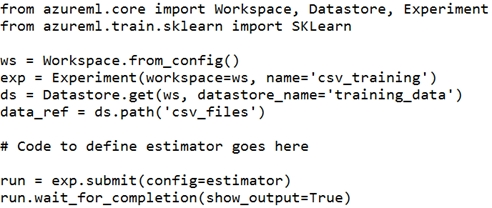

You need to configure the estimator for the experiment so that the script can read the data from a data reference named data_ref that references the csv_files folder in the training_data datastore.

Which code should you use to configure the estimator?

A.

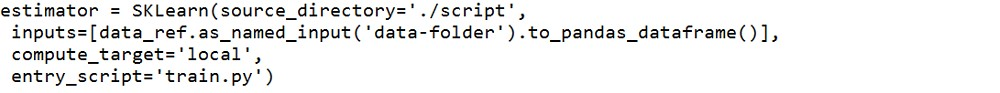

B.

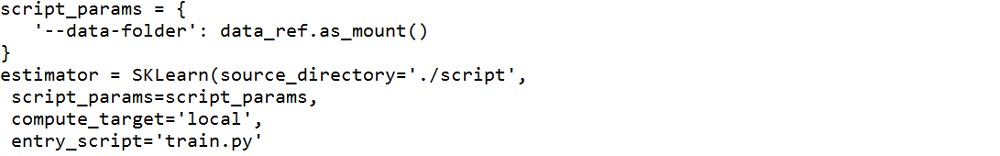

C.

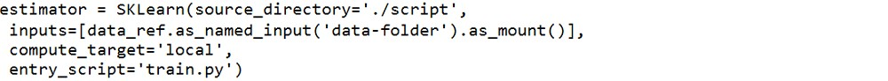

D.

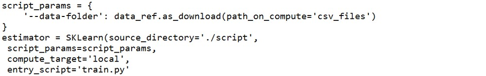

E.

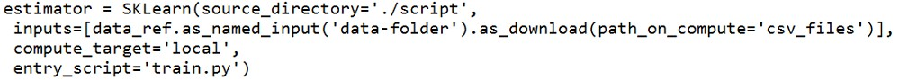

  
Show Suggested Answer

  B

---

## Question 188 | [Link](https://www.examtopics.com/discussions/microsoft/view/51798-exam-dp-100-topic-3-question-8-discussion/){:target="_blank"}

DRAG DROP -

You create a multi-class image classification deep learning experiment by using the PyTorch framework. You plan to run the experiment on an Azure Compute cluster that has nodes with GPU's.

You need to define an Azure Machine Learning service pipeline to perform the monthly retraining of the image classification model. The pipeline must run with minimal cost and minimize the time required to train the model.

Which three pipeline steps should you run in sequence? To answer, move the appropriate actions from the list of actions to the answer area and arrange them in the correct order.

Select and Place:

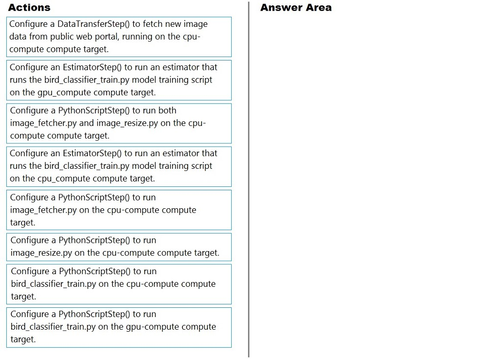

  
Show Suggested Answer

  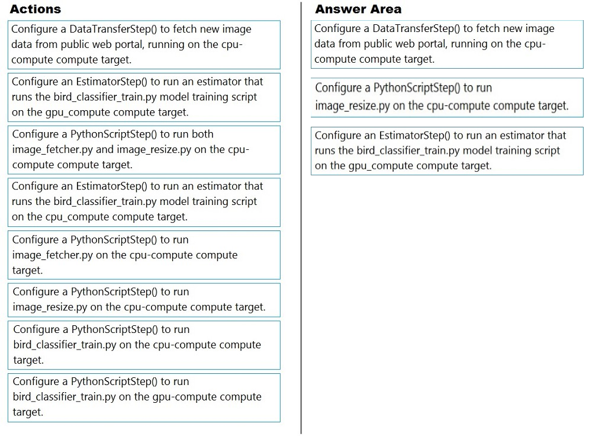

---

## Question 189 | [Link](https://www.examtopics.com/discussions/microsoft/view/55368-exam-dp-100-topic-3-question-9-discussion/){:target="_blank"}

Note: This question is part of a series of questions that present the same scenario. Each question in the series contains a unique solution that might meet the stated goals. Some question sets might have more than one correct solution, while others might not have a correct solution.

After you answer a question in this section, you will NOT be able to return to it. As a result, these questions will not appear in the review screen.

An IT department creates the following Azure resource groups and resources:

The IT department creates an Azure Kubernetes Service (AKS)-based inference compute target named aks-cluster in the Azure Machine Learning workspace.

You have a Microsoft Surface Book computer with a GPU. Python 3.6 and Visual Studio Code are installed.

You need to run a script that trains a deep neural network (DNN) model and logs the loss and accuracy metrics.

Solution: Attach the mlvm virtual machine as a compute target in the Azure Machine Learning workspace. Install the Azure ML SDK on the Surface Book and run

Python code to connect to the workspace. Run the training script as an experiment on the mlvm remote compute resource.

Does the solution meet the goal?

* A.Yes
* B.No

  
Show Suggested Answer

  A

---

## Question 190 | [Link](https://www.examtopics.com/discussions/microsoft/view/47460-exam-dp-100-topic-3-question-10-discussion/){:target="_blank"}

Note: This question is part of a series of questions that present the same scenario. Each question in the series contains a unique solution that might meet the stated goals. Some question sets might have more than one correct solution, while others might not have a correct solution.

After you answer a question in this section, you will NOT be able to return to it. As a result, these questions will not appear in the review screen.

An IT department creates the following Azure resource groups and resources:

The IT department creates an Azure Kubernetes Service (AKS)-based inference compute target named aks-cluster in the Azure Machine Learning workspace.

You have a Microsoft Surface Book computer with a GPU. Python 3.6 and Visual Studio Code are installed.

You need to run a script that trains a deep neural network (DNN) model and logs the loss and accuracy metrics.

Solution: Install the Azure ML SDK on the Surface Book. Run Python code to connect to the workspace and then run the training script as an experiment on local compute.

Does the solution meet the goal?

* A.Yes
* B.No

  
Show Suggested Answer

  A

---

## Question 191 | [Link](https://www.examtopics.com/discussions/microsoft/view/50581-exam-dp-100-topic-3-question-11-discussion/){:target="_blank"}

Note: This question is part of a series of questions that present the same scenario. Each question in the series contains a unique solution that might meet the stated goals. Some question sets might have more than one correct solution, while others might not have a correct solution.

After you answer a question in this section, you will NOT be able to return to it. As a result, these questions will not appear in the review screen.

An IT department creates the following Azure resource groups and resources:

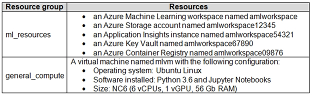

The IT department creates an Azure Kubernetes Service (AKS)-based inference compute target named aks-cluster in the Azure Machine Learning workspace.

You have a Microsoft Surface Book computer with a GPU. Python 3.6 and Visual Studio Code are installed.

You need to run a script that trains a deep neural network (DNN) model and logs the loss and accuracy metrics.

Solution: Install the Azure ML SDK on the Surface Book. Run Python code to connect to the workspace. Run the training script as an experiment on the aks- cluster compute target.

Does the solution meet the goal?

* A.Yes
* B.No

  
Show Suggested Answer

  B

---

## Question 192 | [Link](https://www.examtopics.com/discussions/microsoft/view/46917-exam-dp-100-topic-3-question-12-discussion/){:target="_blank"}

HOTSPOT -

You plan to use Hyperdrive to optimize the hyperparameters selected when training a model. You create the following code to define options for the hyperparameter experiment:

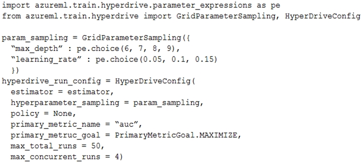

For each of the following statements, select Yes if the statement is true. Otherwise, select No.

NOTE: Each correct selection is worth one point.

Hot Area:

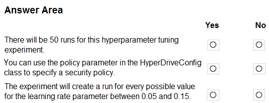

  
Show Suggested Answer

  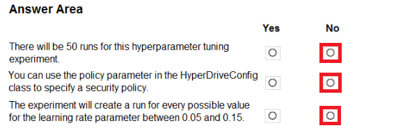

---

## Question 193 | [Link](https://www.examtopics.com/discussions/microsoft/view/50883-exam-dp-100-topic-3-question-13-discussion/){:target="_blank"}

HOTSPOT -

You are using Azure Machine Learning to train machine learning models. You need a compute target on which to remotely run the training script.

You run the following Python code:

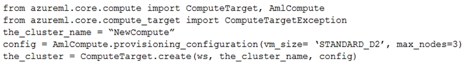

For each of the following statements, select Yes if the statement is true. Otherwise, select No.

NOTE: Each correct selection is worth one point.

Hot Area:

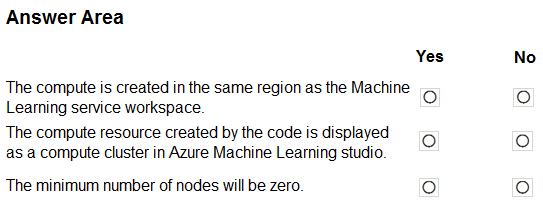

  
Show Suggested Answer

  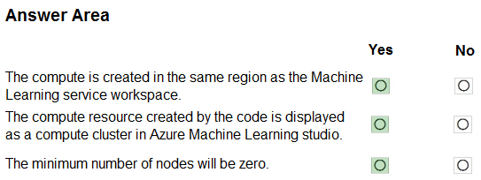

---

## Question 194 | [Link](https://www.examtopics.com/discussions/microsoft/view/54939-exam-dp-100-topic-3-question-14-discussion/){:target="_blank"}

HOTSPOT -

You have an Azure blob container that contains a set of TSV files. The Azure blob container is registered as a datastore for an Azure Machine Learning service workspace. Each TSV file uses the same data schema.

You plan to aggregate data for all of the TSV files together and then register the aggregated data as a dataset in an Azure Machine Learning workspace by using the Azure Machine Learning SDK for Python.

You run the following code.

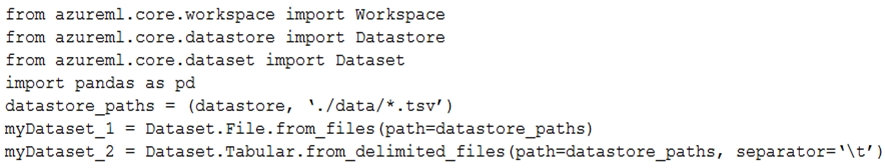

For each of the following statements, select Yes if the statement is true. Otherwise, select No.

NOTE: Each correct selection is worth one point.

Hot Area:

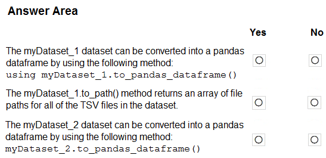

  
Show Suggested Answer

  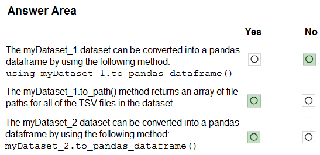

---

## Question 195 | [Link](https://www.examtopics.com/discussions/microsoft/view/57617-exam-dp-100-topic-3-question-15-discussion/){:target="_blank"}

You create a batch inference pipeline by using the Azure ML SDK. You configure the pipeline parameters by executing the following code:

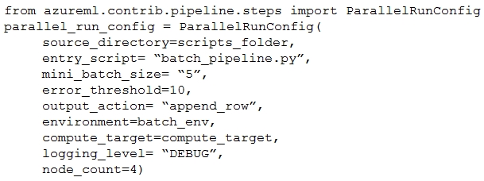

You need to obtain the output from the pipeline execution.

Where will you find the output?

* A.the digit_identification.py script
* B.the debug log
* C.the Activity Log in the Azure portal for the Machine Learning workspace
* D.the Inference Clusters tab in Machine Learning studio
* E.a file named parallel_run_step.txt located in the output folder

  
Show Suggested Answer

  E

---

## Question 196 | [Link](https://www.examtopics.com/discussions/microsoft/view/48363-exam-dp-100-topic-3-question-16-discussion/){:target="_blank"}

DRAG DROP -

You create a multi-class image classification deep learning model.

The model must be retrained monthly with the new image data fetched from a public web portal. You create an Azure Machine Learning pipeline to fetch new data, standardize the size of images, and retrain the model.

You need to use the Azure Machine Learning SDK to configure the schedule for the pipeline.

Which four actions should you perform in sequence? To answer, move the appropriate actions from the list of actions to the answer area and arrange them in the correct order.

Select and Place:

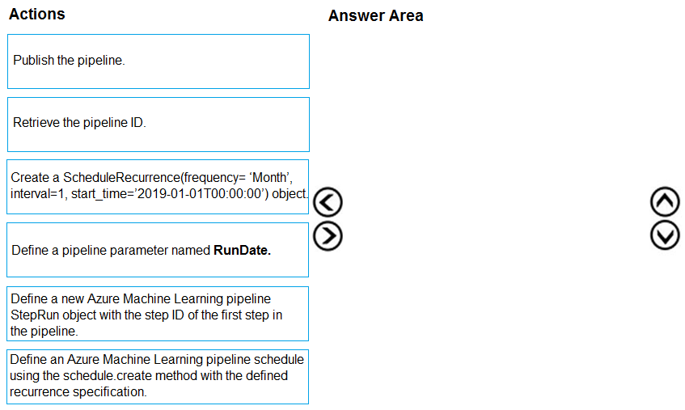

  
Show Suggested Answer

  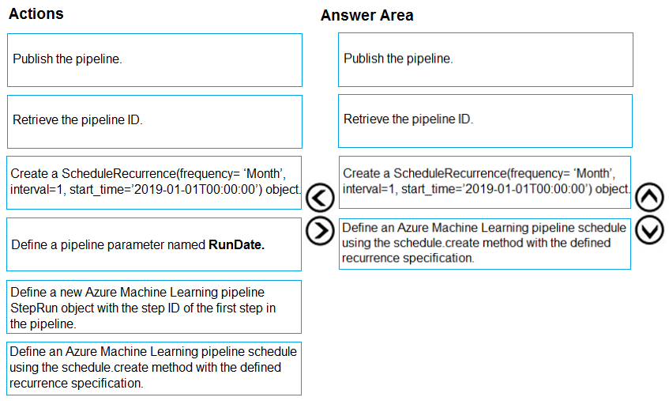

---

## Question 197 | [Link](https://www.examtopics.com/discussions/microsoft/view/48083-exam-dp-100-topic-3-question-17-discussion/){:target="_blank"}

HOTSPOT -

You create a script for training a machine learning model in Azure Machine Learning service.

You create an estimator by running the following code:

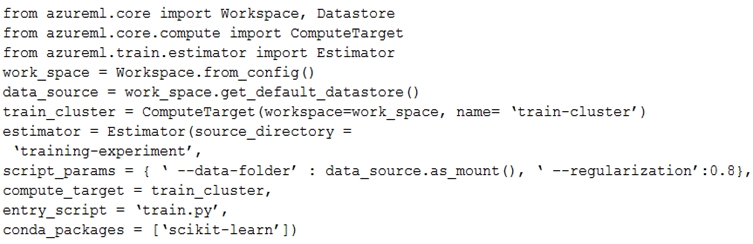

For each of the following statements, select Yes if the statement is true. Otherwise, select No.

NOTE: Each correct selection is worth one point.

Hot Area:

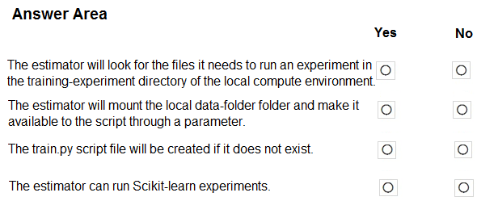

  
Show Suggested Answer

  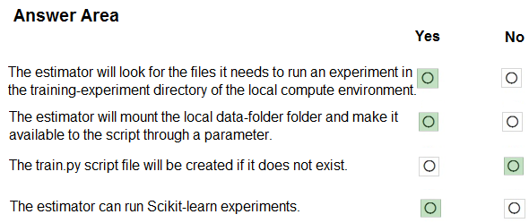

---

## Question 198 | [Link](https://www.examtopics.com/discussions/microsoft/view/20058-exam-dp-100-topic-3-question-18-discussion/){:target="_blank"}

HOTSPOT -

You have a Python data frame named salesData in the following format:

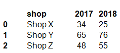

The data frame must be unpivoted to a long data format as follows:

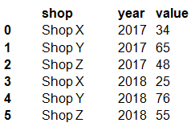

You need to use the pandas.melt() function in Python to perform the transformation.

How should you complete the code segment? To answer, select the appropriate options in the answer area.

NOTE: Each correct selection is worth one point.

Hot Area:

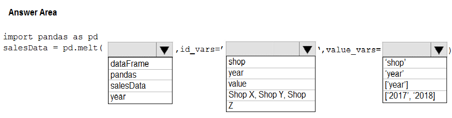

  
Show Suggested Answer

  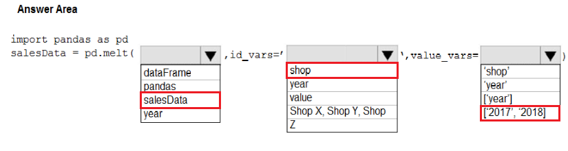

---

## Question 199 | [Link](https://www.examtopics.com/discussions/microsoft/view/54856-exam-dp-100-topic-3-question-19-discussion/){:target="_blank"}

HOTSPOT -

You are working on a classification task. You have a dataset indicating whether a student would like to play soccer and associated attributes. The dataset includes the following columns:

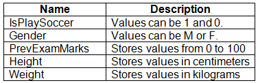

You need to classify variables by type.

Which variable should you add to each category? To answer, select the appropriate options in the answer area.

NOTE: Each correct selection is worth one point.

Hot Area:

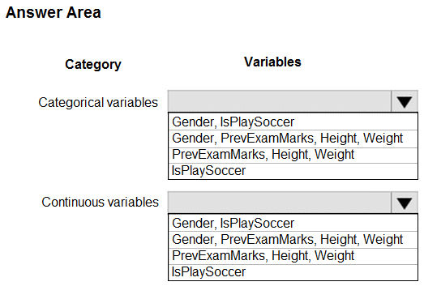

  
Show Suggested Answer

  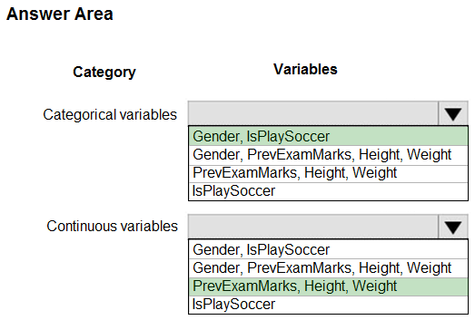

---

## Question 200 | [Link](https://www.examtopics.com/discussions/microsoft/view/23931-exam-dp-100-topic-3-question-20-discussion/){:target="_blank"}

HOTSPOT -

You plan to preprocess text from CSV files. You load the Azure Machine Learning Studio default stop words list.

You need to configure the Preprocess Text module to meet the following requirements:

✑ Ensure that multiple related words from a single canonical form.

✑ Remove pipe characters from text.

Remove words to optimize information retrieval.

Which three options should you select? To answer, select the appropriate options in the answer area.

NOTE: Each correct selection is worth one point.

Hot Area:

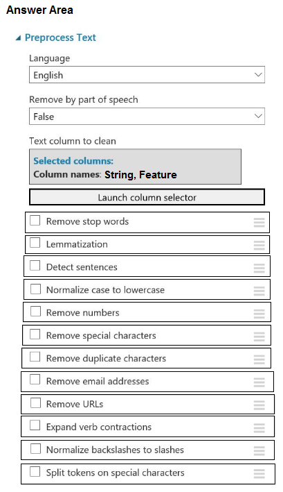

  
Show Suggested Answer

  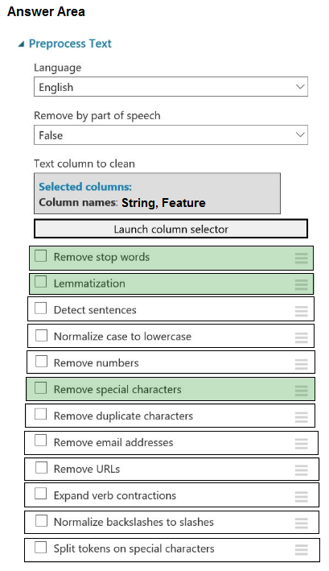

---

## Question 201 | [Link](https://www.examtopics.com/discussions/microsoft/view/47466-exam-dp-100-topic-3-question-21-discussion/){:target="_blank"}

You plan to run a script as an experiment using a Script Run Configuration. The script uses modules from the scipy library as well as several Python packages that are not typically installed in a default conda environment.

You plan to run the experiment on your local workstation for small datasets and scale out the experiment by running it on more powerful remote compute clusters for larger datasets.

You need to ensure that the experiment runs successfully on local and remote compute with the least administrative effort.

What should you do?

* A.Do not specify an environment in the run configuration for the experiment. Run the experiment by using the default environment.
* B.Create a virtual machine (VM) with the required Python configuration and attach the VM as a compute target. Use this compute target for all experiment runs.
* C.Create and register an Environment that includes the required packages. Use this Environment for all experiment runs.
* D.Create a config.yaml file defining the conda packages that are required and save the file in the experiment folder.
* E.Always run the experiment with an Estimator by using the default packages.

  
Show Suggested Answer

  C

---

## Question 202 | [Link](https://www.examtopics.com/discussions/microsoft/view/59105-exam-dp-100-topic-3-question-22-discussion/){:target="_blank"}

You write a Python script that processes data in a comma-separated values (CSV) file.

You plan to run this script as an Azure Machine Learning experiment.

The script loads the data and determines the number of rows it contains using the following code:

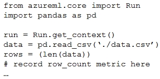

You need to record the row count as a metric named row_count that can be returned using the get_metrics method of the Run object after the experiment run completes.

Which code should you use?

* A.run.upload_file(T3 row_count', './data.csv')
* B.run.log('row_count', rows)
* C.run.tag('row_count', rows)
* D.run.log_table('row_count', rows)
* E.run.log_row('row_count', rows)

  
Show Suggested Answer

  B

---

## Question 203 | [Link](https://www.examtopics.com/discussions/microsoft/view/55875-exam-dp-100-topic-3-question-23-discussion/){:target="_blank"}

Note: This question is part of a series of questions that present the same scenario. Each question in the series contains a unique solution that might meet the stated goals. Some question sets might have more than one correct solution, while others might not have a correct solution.

After you answer a question in this section, you will NOT be able to return to it. As a result, these questions will not appear in the review screen.

You are creating a new experiment in Azure Machine Learning Studio.

One class has a much smaller number of observations than the other classes in the training set.

You need to select an appropriate data sampling strategy to compensate for the class imbalance.

Solution: You use the Synthetic Minority Oversampling Technique (SMOTE) sampling mode.

Does the solution meet the goal?

* A.Yes
* B.No

  
Show Suggested Answer

  A

---

## Question 204 | [Link](https://www.examtopics.com/discussions/microsoft/view/25612-exam-dp-100-topic-3-question-24-discussion/){:target="_blank"}

Note: This question is part of a series of questions that present the same scenario. Each question in the series contains a unique solution that might meet the stated goals. Some question sets might have more than one correct solution, while others might not have a correct solution.

After you answer a question in this section, you will NOT be able to return to it. As a result, these questions will not appear in the review screen.

You are creating a new experiment in Azure Machine Learning Studio.

One class has a much smaller number of observations than the other classes in the training set.

You need to select an appropriate data sampling strategy to compensate for the class imbalance.

Solution: You use the Stratified split for the sampling mode.

Does the solution meet the goal?

* A.Yes
* B.No

  
Show Suggested Answer

  B

---

## Question 205 | [Link](https://www.examtopics.com/discussions/microsoft/view/40809-exam-dp-100-topic-3-question-25-discussion/){:target="_blank"}

You are creating a machine learning model.

You need to identify outliers in the data.

Which two visualizations can you use? Each correct answer presents a complete solution.

NOTE: Each correct selection is worth one point.

* A.Venn diagram
* B.Box plot
* C.ROC curve
* D.Random forest diagram
* E.Scatter plot

  
Show Suggested Answer

  BE

---

## Question 206 | [Link](https://www.examtopics.com/discussions/microsoft/view/40810-exam-dp-100-topic-3-question-26-discussion/){:target="_blank"}

You are evaluating a completed binary classification machine learning model.

You need to use the precision as the evaluation metric.

Which visualization should you use?

* A.Violin plot
* B.Gradient descent
* C.Box plot
* D.Binary classification confusion matrix

  
Show Suggested Answer

  D

---

## Question 207 | [Link](https://www.examtopics.com/discussions/microsoft/view/51900-exam-dp-100-topic-3-question-27-discussion/){:target="_blank"}

You create a multi-class image classification deep learning model that uses the PyTorch deep learning framework.

You must configure Azure Machine Learning Hyperdrive to optimize the hyperparameters for the classification model.

You need to define a primary metric to determine the hyperparameter values that result in the model with the best accuracy score.

Which three actions must you perform? Each correct answer presents part of the solution.

NOTE: Each correct selection is worth one point.

* A.Set the primary_metric_goal of the estimator used to run the bird_classifier_train.py script to maximize.
* B.Add code to the bird_classifier_train.py script to calculate the validation loss of the model and log it as a float value with the key loss.
* C.Set the primary_metric_goal of the estimator used to run the bird_classifier_train.py script to minimize.
* D.Set the primary_metric_name of the estimator used to run the bird_classifier_train.py script to accuracy.
* E.Set the primary_metric_name of the estimator used to run the bird_classifier_train.py script to loss.
* F.Add code to the bird_classifier_train.py script to calculate the validation accuracy of the model and log it as a float value with the key accuracy.

  
Show Suggested Answer

  ADF

---

## Question 208 | [Link](https://www.examtopics.com/discussions/microsoft/view/57618-exam-dp-100-topic-3-question-28-discussion/){:target="_blank"}

DRAG DROP -

You have a dataset that contains over 150 features. You use the dataset to train a Support Vector Machine (SVM) binary classifier.

You need to use the Permutation Feature Importance module in Azure Machine Learning Studio to compute a set of feature importance scores for the dataset.

In which order should you perform the actions? To answer, move all actions from the list of actions to the answer area and arrange them in the correct order.

Select and Place:

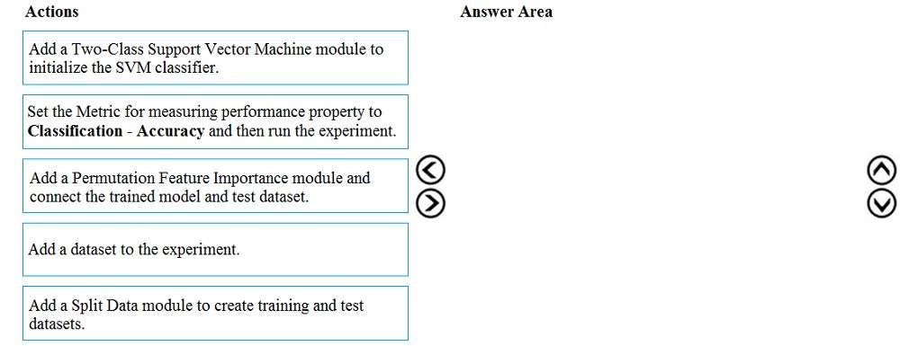

  
Show Suggested Answer

  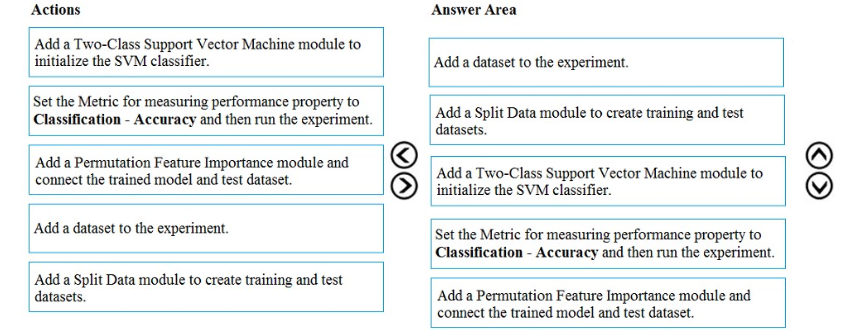

---

## Question 209 | [Link](https://www.examtopics.com/discussions/microsoft/view/46907-exam-dp-100-topic-3-question-29-discussion/){:target="_blank"}

HOTSPOT -

You are using the Hyperdrive feature in Azure Machine Learning to train a model.

You configure the Hyperdrive experiment by running the following code:

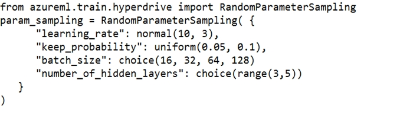

For each of the following statements, select Yes if the statement is true. Otherwise, select No.

NOTE: Each correct selection is worth one point.

Hot Area:

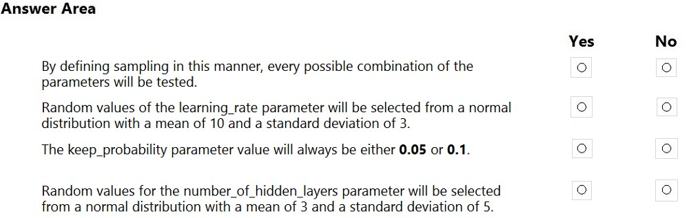

  
Show Suggested Answer

  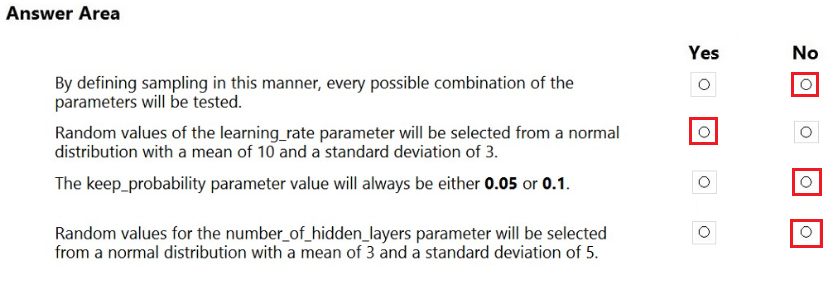

---

## Question 210 | [Link](https://www.examtopics.com/discussions/microsoft/view/20349-exam-dp-100-topic-3-question-30-discussion/){:target="_blank"}

You are performing a filter-based feature selection for a dataset to build a multi-class classifier by using Azure Machine Learning Studio.

The dataset contains categorical features that are highly correlated to the output label column.

You need to select the appropriate feature scoring statistical method to identify the key predictors.

Which method should you use?

* A.Kendall correlation
* B.Spearman correlation
* C.Chi-squared
* D.Pearson correlation

  
Show Suggested Answer

  C

---

## Question 211 | [Link](https://www.examtopics.com/discussions/microsoft/view/28550-exam-dp-100-topic-3-question-31-discussion/){:target="_blank"}

HOTSPOT -

You create a binary classification model to predict whether a person has a disease.

You need to detect possible classification errors.

Which error type should you choose for each description? To answer, select the appropriate options in the answer area.

NOTE: Each correct selection is worth one point.

Hot Area:

  
Show Suggested Answer

  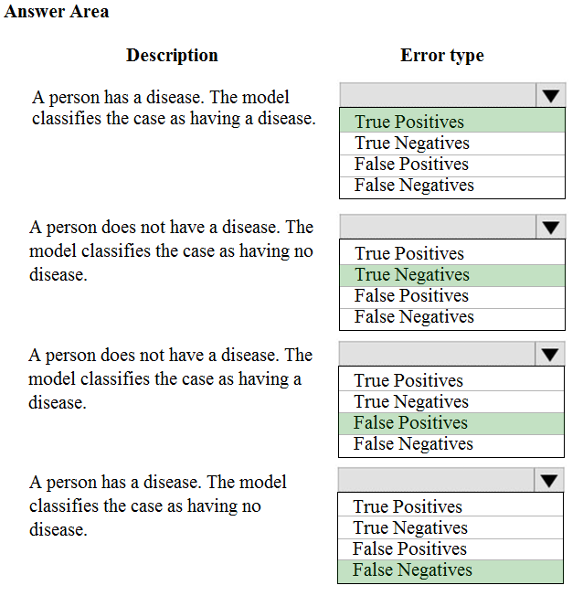

---

## Question 212 | [Link](https://www.examtopics.com/discussions/microsoft/view/33195-exam-dp-100-topic-3-question-32-discussion/){:target="_blank"}

HOTSPOT -

You are using the Azure Machine Learning Service to automate hyperparameter exploration of your neural network classification model.

You must define the hyperparameter space to automatically tune hyperparameters using random sampling according to following requirements:

✑ The learning rate must be selected from a normal distribution with a mean value of 10 and a standard deviation of 3.

✑ Batch size must be 16, 32 and 64.

✑ Keep probability must be a value selected from a uniform distribution between the range of 0.05 and 0.1.

You need to use the param_sampling method of the Python API for the Azure Machine Learning Service.

How should you complete the code segment? To answer, select the appropriate options in the answer area.

NOTE: Each correct selection is worth one point.

Hot Area:

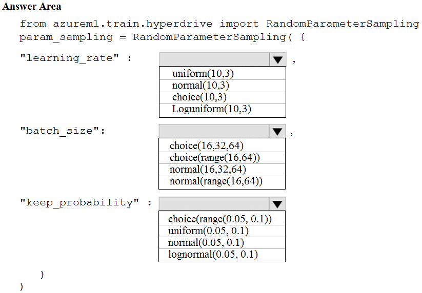

  
Show Suggested Answer

  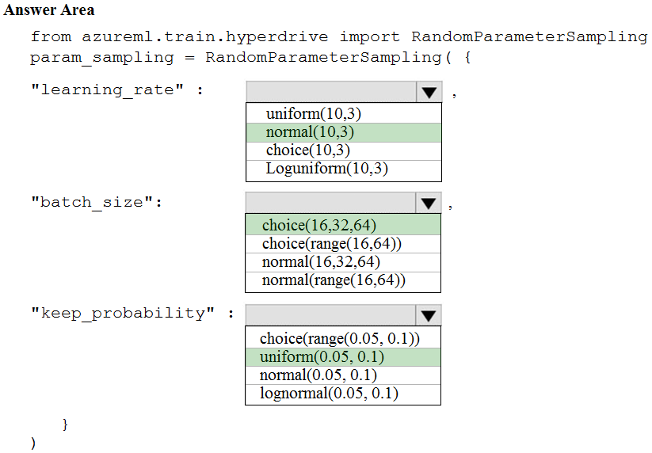

---

## Question 213 | [Link](https://www.examtopics.com/discussions/microsoft/view/57619-exam-dp-100-topic-3-question-33-discussion/){:target="_blank"}

You plan to use automated machine learning to train a regression model. You have data that has features which have missing values, and categorical features with few distinct values.

You need to configure automated machine learning to automatically impute missing values and encode categorical features as part of the training task.

Which parameter and value pair should you use in the AutoMLConfig class?

* A.featurization = 'auto'
* B.enable_voting_ensemble = True
* C.task = 'classification'
* D.exclude_nan_labels = True
* E.enable_tf = True

  
Show Suggested Answer

  A

---

## Question 214 | [Link](https://www.examtopics.com/discussions/microsoft/view/47068-exam-dp-100-topic-3-question-34-discussion/){:target="_blank"}

DRAG DROP -

You create a training pipeline using the Azure Machine Learning designer. You upload a CSV file that contains the data from which you want to train your model.

You need to use the designer to create a pipeline that includes steps to perform the following tasks:

✑ Select the training features using the pandas filter method.

✑ Train a model based on the naive_bayes.GaussianNB algorithm.

✑ Return only the Scored Labels column by using the query

✑ SELECT [Scored Labels] FROM t1;

Which modules should you use? To answer, drag the appropriate modules to the appropriate locations. Each module name may be used once, more than once, or not at all. You may need to drag the split bar between panes or scroll to view content.

NOTE: Each correct selection is worth one point.

Select and Place:

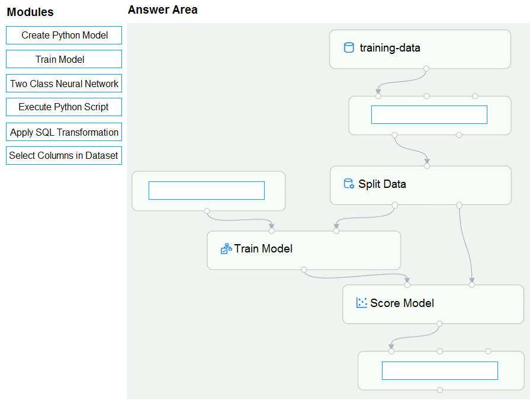

  
Show Suggested Answer

  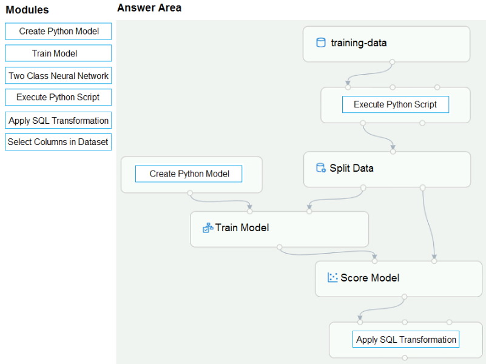

---

## Question 215 | [Link](https://www.examtopics.com/discussions/microsoft/view/19375-exam-dp-100-topic-3-question-35-discussion/){:target="_blank"}

You are building a regression model for estimating the number of calls during an event.

You need to determine whether the feature values achieve the conditions to build a Poisson regression model.

Which two conditions must the feature set contain? Each correct answer presents part of the solution.

NOTE: Each correct selection is worth one point.

* A.The label data must be a negative value.
* B.The label data must be whole numbers.
* C.The label data must be non-discrete.
* D.The label data must be a positive value.
* E.The label data can be positive or negative.

  
Show Suggested Answer

  BD

---

## Question 216 | [Link](https://www.examtopics.com/discussions/microsoft/view/55882-exam-dp-100-topic-3-question-36-discussion/){:target="_blank"}

Note: This question is part of a series of questions that present the same scenario. Each question in the series contains a unique solution that might meet the stated goals. Some question sets might have more than one correct solution, while others might not have a correct solution.

After you answer a question in this section, you will NOT be able to return to it. As a result, these questions will not appear in the review screen.

You are creating a new experiment in Azure Machine Learning Studio.

One class has a much smaller number of observations than the other classes in the training set.

You need to select an appropriate data sampling strategy to compensate for the class imbalance.

Solution: You use the Principal Components Analysis (PCA) sampling mode.

Does the solution meet the goal?

* A.Yes
* B.No

  
Show Suggested Answer

  B

---

## Question 217 | [Link](https://www.examtopics.com/discussions/microsoft/view/11186-exam-dp-100-topic-3-question-37-discussion/){:target="_blank"}

You are performing feature engineering on a dataset.

You must add a feature named CityName and populate the column value with the text London.

You need to add the new feature to the dataset.

Which Azure Machine Learning Studio module should you use?

* A.Edit Metadata
* B.Filter Based Feature Selection
* C.Execute Python Script
* D.Latent Dirichlet Allocation

  
Show Suggested Answer

  C

---

## Question 218 | [Link](https://www.examtopics.com/discussions/microsoft/view/55505-exam-dp-100-topic-3-question-38-discussion/){:target="_blank"}

You are evaluating a completed binary classification machine learning model.

You need to use the precision as the evaluation metric.

Which visualization should you use?

* A.violin plot
* B.Gradient descent
* C.Scatter plot
* D.Receiver Operating Characteristic (ROC) curve

  
Show Suggested Answer

  D

---

## Question 219 | [Link](https://www.examtopics.com/discussions/microsoft/view/31069-exam-dp-100-topic-3-question-39-discussion/){:target="_blank"}

You are solving a classification task.

You must evaluate your model on a limited data sample by using k-fold cross-validation. You start by configuring a k parameter as the number of splits.

You need to configure the k parameter for the cross-validation.

Which value should you use?

* A.k=1
* B.k=10
* C.k=0.5
* D.k=0.9

  
Show Suggested Answer

  B

---

## Question 220 | [Link](https://www.examtopics.com/discussions/microsoft/view/20991-exam-dp-100-topic-3-question-40-discussion/){:target="_blank"}

HOTSPOT -

You have a dataset created for multiclass classification tasks that contains a normalized numerical feature set with 10,000 data points and 150 features.

You use 75 percent of the data points for training and 25 percent for testing. You are using the scikit-learn machine learning library in Python. You use X to denote the feature set and Y to denote class labels.

You create the following Python data frames:

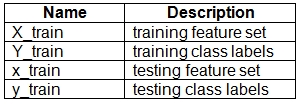

You need to apply the Principal Component Analysis (PCA) method to reduce the dimensionality of the feature set to 10 features in both training and testing sets.

How should you complete the code segment? To answer, select the appropriate options in the answer area.

NOTE: Each correct selection is worth one point.

Hot Area:

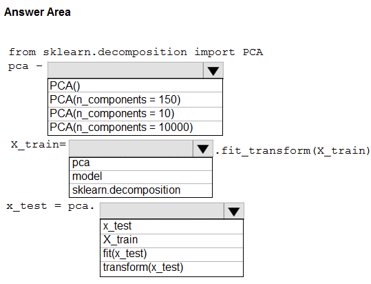

  
Show Suggested Answer

  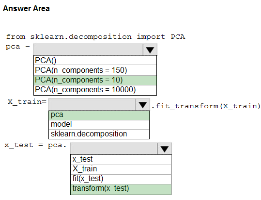

---

## Question 221 | [Link](https://www.examtopics.com/discussions/microsoft/view/25506-exam-dp-100-topic-3-question-41-discussion/){:target="_blank"}

HOTSPOT -

You have a feature set containing the following numerical features: X, Y, and Z.

The Poisson correlation coefficient (r-value) of X, Y, and Z features is shown in the following image:

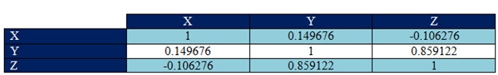

Use the drop-down menus to select the answer choice that answers each question based on the information presented in the graphic.

NOTE: Each correct selection is worth one point.

Hot Area:

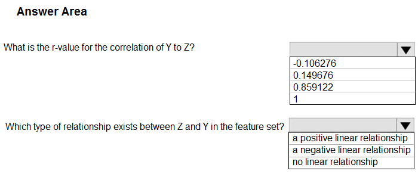

  
Show Suggested Answer

  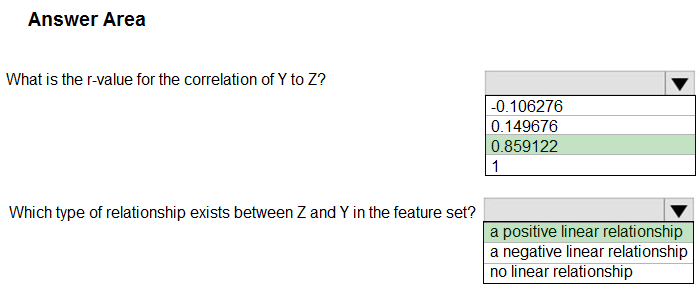

---

## Question 222 | [Link](https://www.examtopics.com/discussions/microsoft/view/53610-exam-dp-100-topic-3-question-42-discussion/){:target="_blank"}

DRAG DROP -

You plan to explore demographic data for home ownership in various cities. The data is in a CSV file with the following format: age,city,income,home_owner

21,Chicago,50000,0

35,Seattle,120000,1

23,Seattle,65000,0

45,Seattle,130000,1

18,Chicago,48000,0

You need to run an experiment in your Azure Machine Learning workspace to explore the data and log the results. The experiment must log the following information:

✑ the number of observations in the dataset

✑ a box plot of income by home_owner

✑ a dictionary containing the city names and the average income for each city

You need to use the appropriate logging methods of the experiment's run object to log the required information.

How should you complete the code? To answer, drag the appropriate code segments to the correct locations. Each code segment may be used once, more than once, or not at all. You may need to drag the split bar between panes or scroll to view content.

NOTE: Each correct selection is worth one point.

Select and Place:

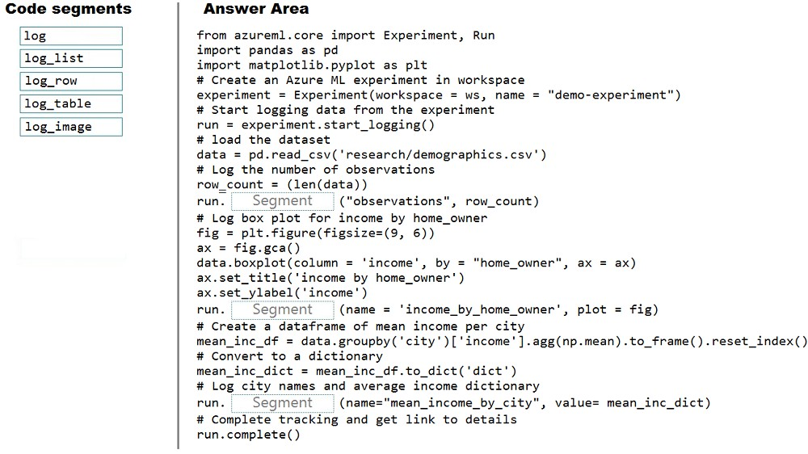

  
Show Suggested Answer

  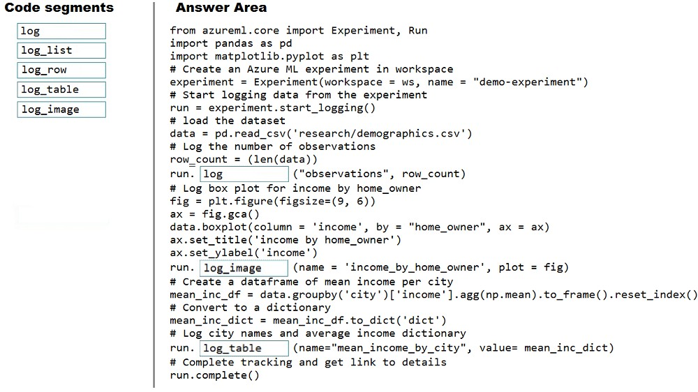

---

## Question 223 | [Link](https://www.examtopics.com/discussions/microsoft/view/24303-exam-dp-100-topic-3-question-43-discussion/){:target="_blank"}

You use the Azure Machine Learning service to create a tabular dataset named training_data. You plan to use this dataset in a training script.

You create a variable that references the dataset using the following code: training_ds = workspace.datasets.get("training_data")

You define an estimator to run the script.

You need to set the correct property of the estimator to ensure that your script can access the training_data dataset.

Which property should you set?

* A.environment_definition = {"training_data":training_ds}
* B.inputs = [training_ds.as_named_input('training_ds')]
* C.script_params = {"--training_ds":training_ds}
* D.source_directory = training_ds

  
Show Suggested Answer

  B

---

## Question 224 | [Link](https://www.examtopics.com/discussions/microsoft/view/50594-exam-dp-100-topic-3-question-44-discussion/){:target="_blank"}

You register a file dataset named csv_folder that references a folder. The folder includes multiple comma-separated values (CSV) files in an Azure storage blob container.

You plan to use the following code to run a script that loads data from the file dataset. You create and instantiate the following variables:

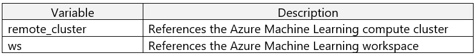

You have the following code:

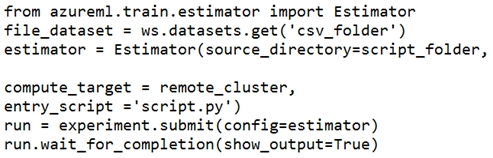

You need to pass the dataset to ensure that the script can read the files it references.

Which code segment should you insert to replace the code comment?

* A.inputs=[file_dataset.as_named_input('training_files')],
* B.inputs=[file_dataset.as_named_input('training_files').as_mount()],
* C.inputs=[file_dataset.as_named_input('training_files').to_pandas_dataframe()],
* D.script_params={'--training_files': file_dataset},

  
Show Suggested Answer

  B

---

## Question 225 | [Link](https://www.examtopics.com/discussions/microsoft/view/24014-exam-dp-100-topic-3-question-45-discussion/){:target="_blank"}

You are creating a new Azure Machine Learning pipeline using the designer.

The pipeline must train a model using data in a comma-separated values (CSV) file that is published on a website. You have not created a dataset for this file.

You need to ingest the data from the CSV file into the designer pipeline using the minimal administrative effort.

Which module should you add to the pipeline in Designer?

* A.Convert to CSV
* B.Enter Data Manually
* C.Import Data
* D.Dataset

  
Show Suggested Answer

  C

---

## Question 226 | [Link](https://www.examtopics.com/discussions/microsoft/view/54036-exam-dp-100-topic-3-question-46-discussion/){:target="_blank"}

You define a datastore named ml-data for an Azure Storage blob container. In the container, you have a folder named train that contains a file named data.csv.

You plan to use the file to train a model by using the Azure Machine Learning SDK.

You plan to train the model by using the Azure Machine Learning SDK to run an experiment on local compute.

You define a DataReference object by running the following code:

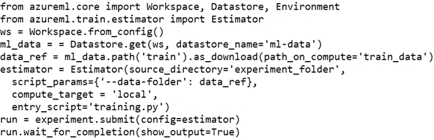

You need to load the training data.

Which code segment should you use?

A.

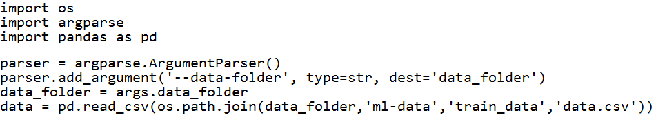

B.

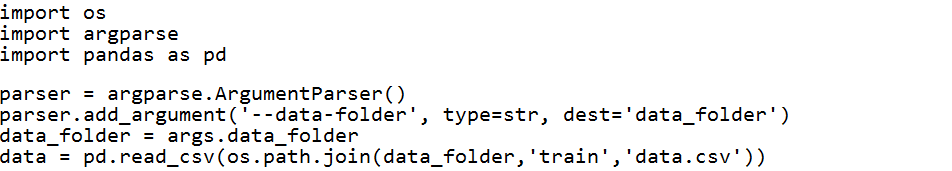

C.

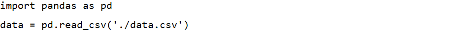

D.

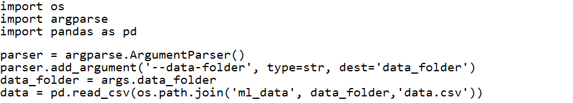

E.

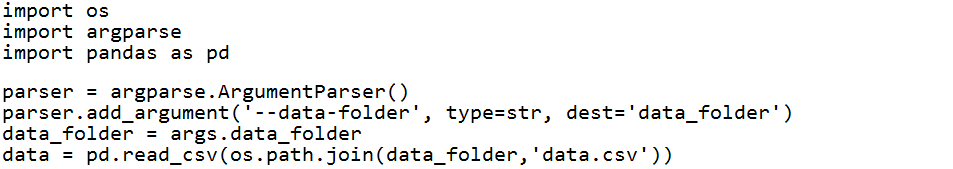

  
Show Suggested Answer

  E

---

## Question 227 | [Link](https://www.examtopics.com/discussions/microsoft/view/47487-exam-dp-100-topic-3-question-47-discussion/){:target="_blank"}

Note: This question is part of a series of questions that present the same scenario. Each question in the series contains a unique solution that might meet the stated goals. Some question sets might have more than one correct solution, while others might not have a correct solution.

After you answer a question in this section, you will NOT be able to return to it. As a result, these questions will not appear in the review screen.

You create an Azure Machine Learning service datastore in a workspace. The datastore contains the following files:

✑ /data/2018/Q1.csv

✑ /data/2018/Q2.csv

✑ /data/2018/Q3.csv

✑ /data/2018/Q4.csv

✑ /data/2019/Q1.csv

All files store data in the following format:

id,f1,f2,I

1,1,2,0

2,1,1,1

3,2,1,0

4,2,2,1

You run the following code:

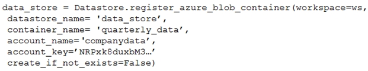

You need to create a dataset named training_data and load the data from all files into a single data frame by using the following code:

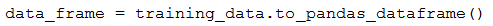

Solution: Run the following code:

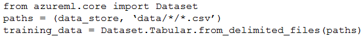

Does the solution meet the goal?

* A.Yes
* B.No

  
Show Suggested Answer

  A

---

## Question 228 | [Link](https://www.examtopics.com/discussions/microsoft/view/57350-exam-dp-100-topic-3-question-48-discussion/){:target="_blank"}

Note: This question is part of a series of questions that present the same scenario. Each question in the series contains a unique solution that might meet the stated goals. Some question sets might have more than one correct solution, while others might not have a correct solution.

After you answer a question in this section, you will NOT be able to return to it. As a result, these questions will not appear in the review screen.

You create an Azure Machine Learning service datastore in a workspace. The datastore contains the following files:

✑ /data/2018/Q1.csv

✑ /data/2018/Q2.csv

✑ /data/2018/Q3.csv

✑ /data/2018/Q4.csv

✑ /data/2019/Q1.csv

All files store data in the following format:

id,f1,f2,I

1,1,2,0

2,1,1,1

3,2,1,0

4,2,2,1

You run the following code:

You need to create a dataset named training_data and load the data from all files into a single data frame by using the following code:

Solution: Run the following code:

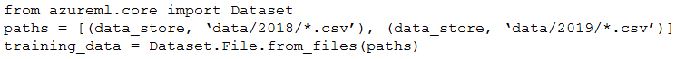

Does the solution meet the goal?

* A.Yes
* B.No

  
Show Suggested Answer

  B

---

## Question 229 | [Link](https://www.examtopics.com/discussions/microsoft/view/48339-exam-dp-100-topic-3-question-49-discussion/){:target="_blank"}

Note: This question is part of a series of questions that present the same scenario. Each question in the series contains a unique solution that might meet the stated goals. Some question sets might have more than one correct solution, while others might not have a correct solution.

After you answer a question in this section, you will NOT be able to return to it. As a result, these questions will not appear in the review screen.

You create an Azure Machine Learning service datastore in a workspace. The datastore contains the following files:

✑ /data/2018/Q1.csv

✑ /data/2018/Q2.csv

✑ /data/2018/Q3.csv

✑ /data/2018/Q4.csv

✑ /data/2019/Q1.csv

All files store data in the following format:

id,f1,f2,I

1,1,2,0

2,1,1,1

3,2,1,0

4,2,2,1

You run the following code:

You need to create a dataset named training_data and load the data from all files into a single data frame by using the following code:

Solution: Run the following code:

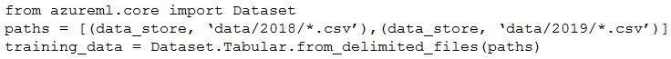

Does the solution meet the goal?

* A.Yes
* B.No

  
Show Suggested Answer

  A

---

## Question 230 | [Link](https://www.examtopics.com/discussions/microsoft/view/58997-exam-dp-100-topic-3-question-50-discussion/){:target="_blank"}

You plan to use the Hyperdrive feature of Azure Machine Learning to determine the optimal hyperparameter values when training a model.

You must use Hyperdrive to try combinations of the following hyperparameter values:

✑ learning_rate: any value between 0.001 and 0.1

✑ batch_size: 16, 32, or 64

You need to configure the search space for the Hyperdrive experiment.

Which two parameter expressions should you use? Each correct answer presents part of the solution.

NOTE: Each correct selection is worth one point.

* A.a choice expression for learning_rate
* B.a uniform expression for learning_rate
* C.a normal expression for batch_size
* D.a choice expression for batch_size
* E.a uniform expression for batch_size

  
Show Suggested Answer

  BD

---

## Question 231 | [Link](https://www.examtopics.com/discussions/microsoft/view/55646-exam-dp-100-topic-3-question-51-discussion/){:target="_blank"}

HOTSPOT -

Your Azure Machine Learning workspace has a dataset named real_estate_data. A sample of the data in the dataset follows.

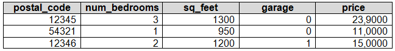

You want to use automated machine learning to find the best regression model for predicting the price column.

You need to configure an automated machine learning experiment using the Azure Machine Learning SDK.

How should you complete the code? To answer, select the appropriate options in the answer area.

NOTE: Each correct selection is worth one point.

Hot Area:

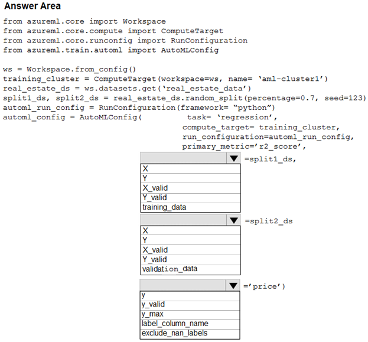

  
Show Suggested Answer

  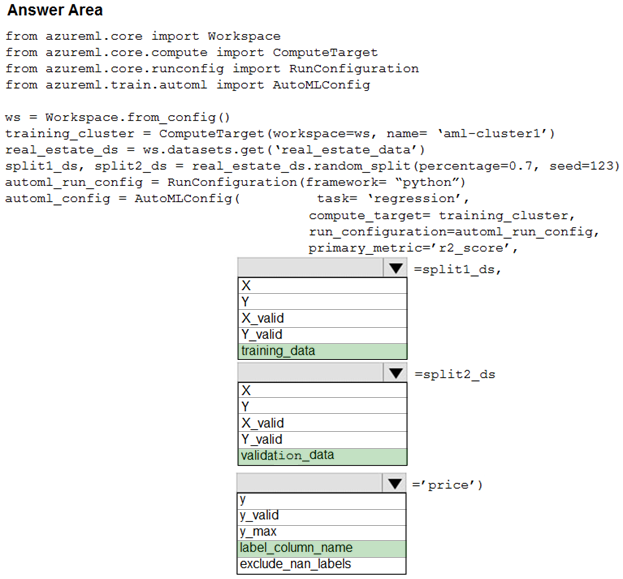

---

## Question 232 | [Link](https://www.examtopics.com/discussions/microsoft/view/47785-exam-dp-100-topic-3-question-52-discussion/){:target="_blank"}

HOTSPOT -

You have a multi-class image classification deep learning model that uses a set of labeled photographs. You create the following code to select hyperparameter values when training the model.

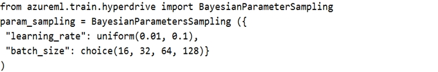

For each of the following statements, select Yes if the statement is true. Otherwise, select No.

NOTE: Each correct selection is worth one point.

Hot Area:

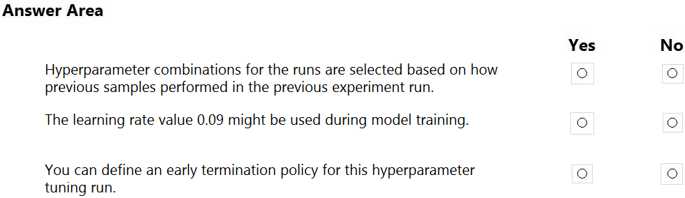

  
Show Suggested Answer

  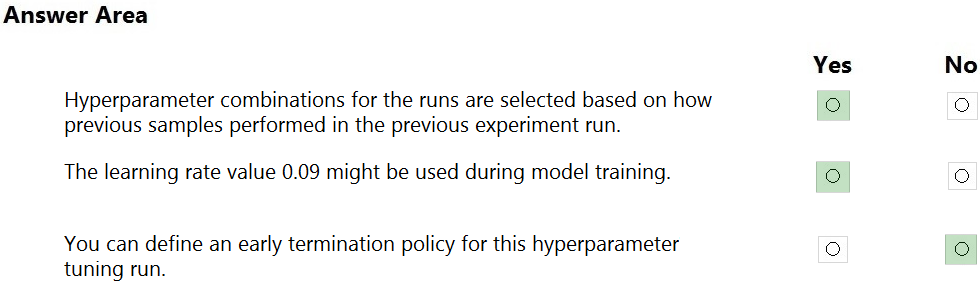

---

## Question 233 | [Link](https://www.examtopics.com/discussions/microsoft/view/47786-exam-dp-100-topic-3-question-53-discussion/){:target="_blank"}

You run an automated machine learning experiment in an Azure Machine Learning workspace. Information about the run is listed in the table below:

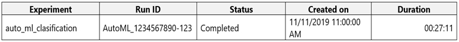

You need to write a script that uses the Azure Machine Learning SDK to retrieve the best iteration of the experiment run.

Which Python code segment should you use?

A.

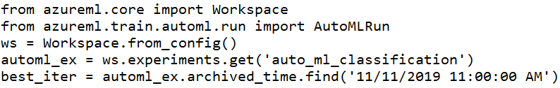

B.

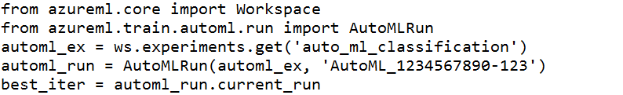

C.

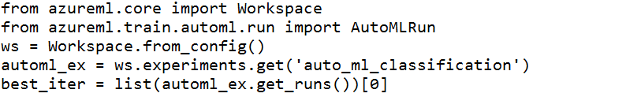

D.

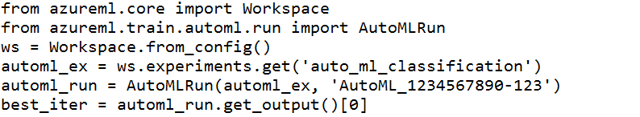

E.

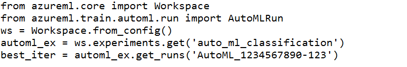

  
Show Suggested Answer

  D

---

## Question 234 | [Link](https://www.examtopics.com/discussions/microsoft/view/24013-exam-dp-100-topic-3-question-54-discussion/){:target="_blank"}

You have a comma-separated values (CSV) file containing data from which you want to train a classification model.

You are using the Automated Machine Learning interface in Azure Machine Learning studio to train the classification model. You set the task type to Classification.

You need to ensure that the Automated Machine Learning process evaluates only linear models.

What should you do?

* A.Add all algorithms other than linear ones to the blocked algorithms list.
* B.Set the Exit criterion option to a metric score threshold.
* C.Clear the option to perform automatic featurization.
* D.Clear the option to enable deep learning.
* E.Set the task type to Regression.

  
Show Suggested Answer

  A

---

## Question 235 | [Link](https://www.examtopics.com/discussions/microsoft/view/70206-exam-dp-100-topic-3-question-55-discussion/){:target="_blank"}

Note: This question is part of a series of questions that present the same scenario. Each question in the series contains a unique solution that might meet the stated goals. Some question sets might have more than one correct solution, while others might not have a correct solution.

After you answer a question in this section, you will NOT be able to return to it. As a result, these questions will not appear in the review screen.

You plan to use a Python script to run an Azure Machine Learning experiment. The script creates a reference to the experiment run context, loads data from a file, identifies the set of unique values for the label column, and completes the experiment run:

The experiment must record the unique labels in the data as metrics for the run that can be reviewed later.

You must add code to the script to record the unique label values as run metrics at the point indicated by the comment.

Solution: Replace the comment with the following code:

run.upload_file('outputs/labels.csv', './data.csv')

Does the solution meet the goal?

* A.Yes
* B.No

  
Show Suggested Answer

  B

---

## Question 236 | [Link](https://www.examtopics.com/discussions/microsoft/view/70208-exam-dp-100-topic-3-question-56-discussion/){:target="_blank"}

Note: This question is part of a series of questions that present the same scenario. Each question in the series contains a unique solution that might meet the stated goals. Some question sets might have more than one correct solution, while others might not have a correct solution.

After you answer a question in this section, you will NOT be able to return to it. As a result, these questions will not appear in the review screen.

You plan to use a Python script to run an Azure Machine Learning experiment. The script creates a reference to the experiment run context, loads data from a file, identifies the set of unique values for the label column, and completes the experiment run:

The experiment must record the unique labels in the data as metrics for the run that can be reviewed later.

You must add code to the script to record the unique label values as run metrics at the point indicated by the comment.

Solution: Replace the comment with the following code:

run.log_table('Label Values', label_vals)

Does the solution meet the goal?

* A.Yes
* B.No

  
Show Suggested Answer

  B

---

## Question 237 | [Link](https://www.examtopics.com/discussions/microsoft/view/70210-exam-dp-100-topic-3-question-57-discussion/){:target="_blank"}

Note: This question is part of a series of questions that present the same scenario. Each question in the series contains a unique solution that might meet the stated goals. Some question sets might have more than one correct solution, while others might not have a correct solution.

After you answer a question in this section, you will NOT be able to return to it. As a result, these questions will not appear in the review screen.

You plan to use a Python script to run an Azure Machine Learning experiment. The script creates a reference to the experiment run context, loads data from a file, identifies the set of unique values for the label column, and completes the experiment run:

The experiment must record the unique labels in the data as metrics for the run that can be reviewed later.

You must add code to the script to record the unique label values as run metrics at the point indicated by the comment.

Solution: Replace the comment with the following code:

for label_val in label_vals:

run.log('Label Values', label_val)

Does the solution meet the goal?

* A.Yes
* B.No

  
Show Suggested Answer

  A

---

## Question 238 | [Link](https://www.examtopics.com/discussions/microsoft/view/57620-exam-dp-100-topic-3-question-58-discussion/){:target="_blank"}

HOTSPOT -

You publish a batch inferencing pipeline that will be used by a business application.

The application developers need to know which information should be submitted to and returned by the REST interface for the published pipeline.

You need to identify the information required in the REST request and returned as a response from the published pipeline.

Which values should you use in the REST request and to expect in the response? To answer, select the appropriate options in the answer area.

NOTE: Each correct selection is worth one point.

Hot Area:

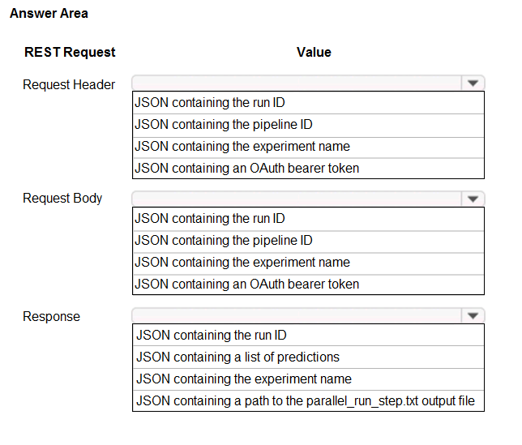

  
Show Suggested Answer

  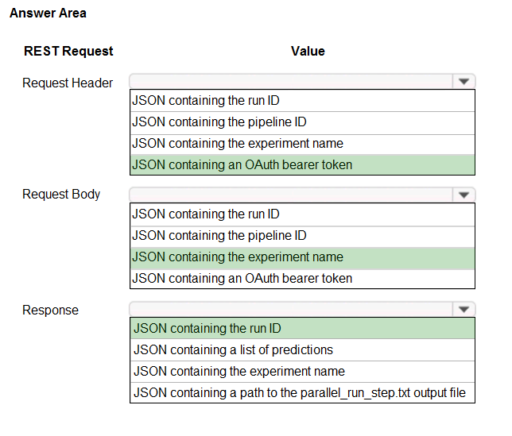

---

## Question 239 | [Link](https://www.examtopics.com/discussions/microsoft/view/56113-exam-dp-100-topic-3-question-59-discussion/){:target="_blank"}

HOTSPOT -

You create an experiment in Azure Machine Learning Studio. You add a training dataset that contains 10,000 rows. The first 9,000 rows represent class 0 (90 percent).

The remaining 1,000 rows represent class 1 (10 percent).

The training set is imbalances between two classes. You must increase the number of training examples for class 1 to 4,000 by using 5 data rows. You add the

Synthetic Minority Oversampling Technique (SMOTE) module to the experiment.

You need to configure the module.

Which values should you use? To answer, select the appropriate options in the dialog box in the answer area.

NOTE: Each correct selection is worth one point.

Hot Area:

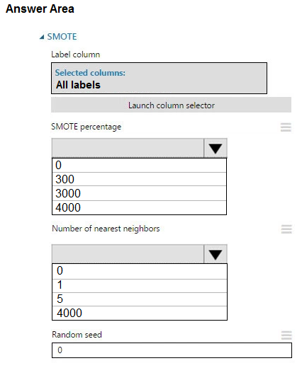

  
Show Suggested Answer

  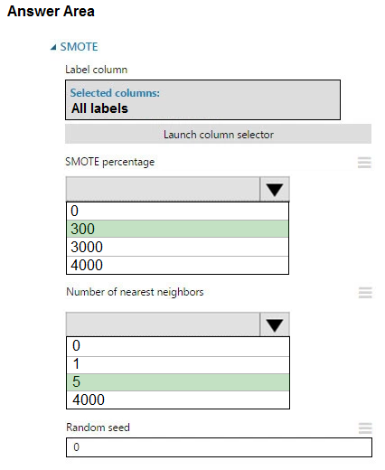

---

## Question 240 | [Link](https://www.examtopics.com/discussions/microsoft/view/11184-exam-dp-100-topic-3-question-60-discussion/){:target="_blank"}

You are solving a classification task.

You must evaluate your model on a limited data sample by using k-fold cross-validation. You start by configuring a k parameter as the number of splits.

You need to configure the k parameter for the cross-validation.

Which value should you use?

* A.k=0.5
* B.k=0.01
* C.k=5
* D.k=1

  
Show Suggested Answer

  C

---

## Question 241 | [Link](https://www.examtopics.com/discussions/microsoft/view/47628-exam-dp-100-topic-3-question-61-discussion/){:target="_blank"}

HOTSPOT -

You are running Python code interactively in a Conda environment. The environment includes all required Azure Machine Learning SDK and MLflow packages.

You must use MLflow to log metrics in an Azure Machine Learning experiment named mlflow-experiment.

How should you complete the code? To answer, select the appropriate options in the answer area.

NOTE: Each correct selection is worth one point.

Hot Area:

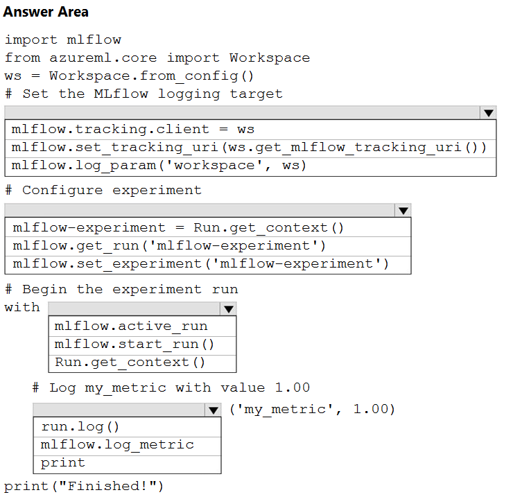

  
Show Suggested Answer

  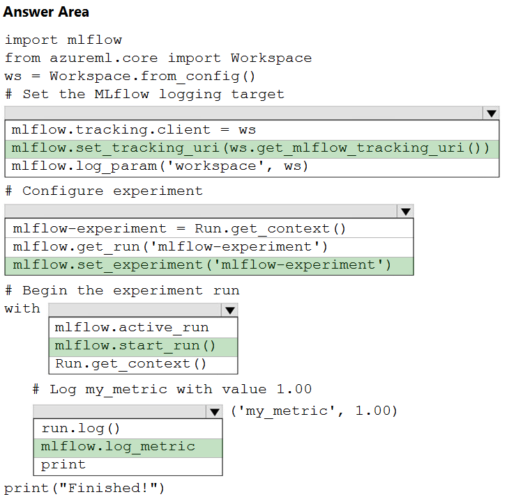

---

## Question 242 | [Link](https://www.examtopics.com/discussions/microsoft/view/46433-exam-dp-100-topic-3-question-62-discussion/){:target="_blank"}

DRAG DROP -

You are creating a machine learning model that can predict the species of a penguin from its measurements. You have a file that contains measurements for three species of penguin in comma-delimited format.

The model must be optimized for area under the received operating characteristic curve performance metric, averaged for each class.

You need to use the Automated Machine Learning user interface in Azure Machine Learning studio to run an experiment and find the best performing model.

Which five actions should you perform in sequence? To answer, move the appropriate actions from the list of actions to the answer area and arrange them in the correct order.

Select and Place:

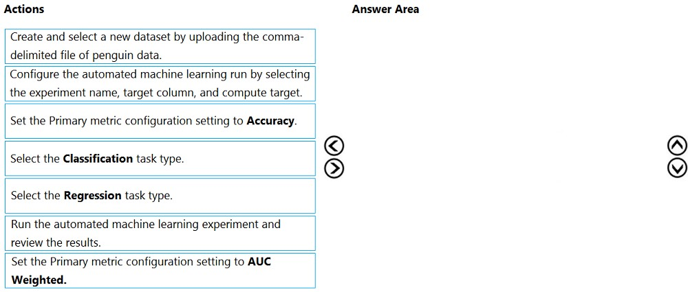

  
Show Suggested Answer

  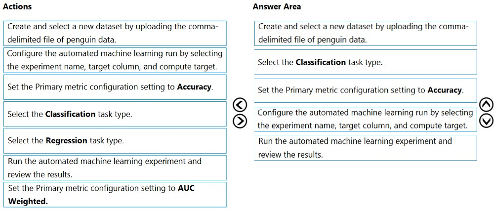

---

## Question 243 | [Link](https://www.examtopics.com/discussions/microsoft/view/20676-exam-dp-100-topic-3-question-63-discussion/){:target="_blank"}

HOTSPOT -

You are tuning a hyperparameter for an algorithm. The following table shows a data set with different hyperparameter, training error, and validation errors.

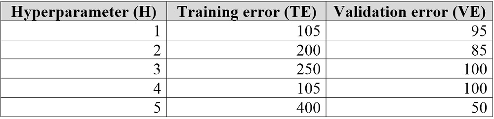

Use the drop-down menus to select the answer choice that answers each question based on the information presented in the graphic.

Hot Area:

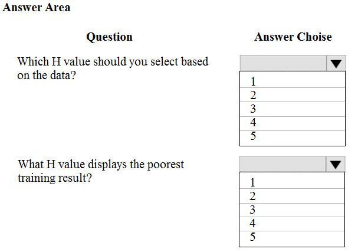

  
Show Suggested Answer

  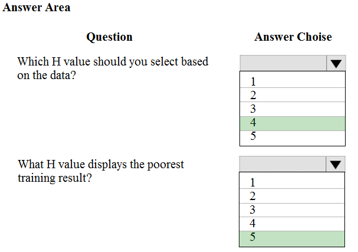

---

## Question 244 | [Link](https://www.examtopics.com/discussions/microsoft/view/47680-exam-dp-100-topic-3-question-64-discussion/){:target="_blank"}

Note: This question is part of a series of questions that present the same scenario. Each question in the series contains a unique solution that might meet the stated goals. Some question sets might have more than one correct solution, while others might not have a correct solution.

After you answer a question in this section, you will NOT be able to return to it. As a result, these questions will not appear in the review screen.

You create a model to forecast weather conditions based on historical data.

You need to create a pipeline that runs a processing script to load data from a datastore and pass the processed data to a machine learning model training script.

Solution: Run the following code:

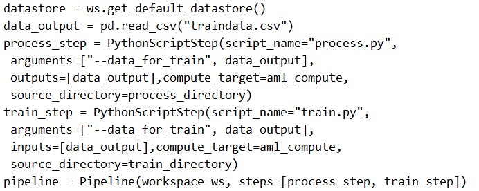

Does the solution meet the goal?

* A.Yes
* B.No

  
Show Suggested Answer

  B

---

## Question 245 | [Link](https://www.examtopics.com/discussions/microsoft/view/71231-exam-dp-100-topic-3-question-65-discussion/){:target="_blank"}

Note: This question is part of a series of questions that present the same scenario. Each question in the series contains a unique solution that might meet the stated goals. Some question sets might have more than one correct solution, while others might not have a correct solution.

After you answer a question in this section, you will NOT be able to return to it. As a result, these questions will not appear in the review screen.

You create a model to forecast weather conditions based on historical data.

You need to create a pipeline that runs a processing script to load data from a datastore and pass the processed data to a machine learning model training script.

Solution: Run the following code:

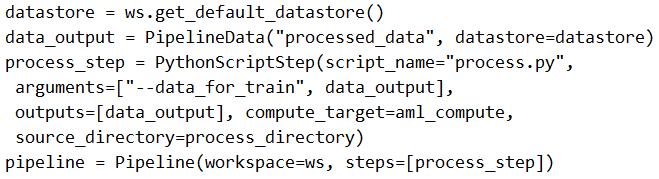

Does the solution meet the goal?

* A.Yes
* B.No

  
Show Suggested Answer

  B

---

## Question 246 | [Link](https://www.examtopics.com/discussions/microsoft/view/54696-exam-dp-100-topic-3-question-66-discussion/){:target="_blank"}

Note: This question is part of a series of questions that present the same scenario. Each question in the series contains a unique solution that might meet the stated goals. Some question sets might have more than one correct solution, while others might not have a correct solution.

After you answer a question in this section, you will NOT be able to return to it. As a result, these questions will not appear in the review screen.

You create a model to forecast weather conditions based on historical data.

You need to create a pipeline that runs a processing script to load data from a datastore and pass the processed data to a machine learning model training script.

Solution: Run the following code:

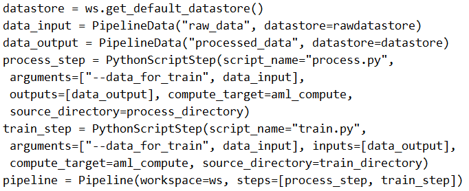

Does the solution meet the goal?

* A.Yes
* B.No

  
Show Suggested Answer

  B

---

## Question 247 | [Link](https://www.examtopics.com/discussions/microsoft/view/48804-exam-dp-100-topic-3-question-67-discussion/){:target="_blank"}

Note: This question is part of a series of questions that present the same scenario. Each question in the series contains a unique solution that might meet the stated goals. Some question sets might have more than one correct solution, while others might not have a correct solution.

After you answer a question in this section, you will NOT be able to return to it. As a result, these questions will not appear in the review screen.

You have a Python script named train.py in a local folder named scripts. The script trains a regression model by using scikit-learn. The script includes code to load a training data file which is also located in the scripts folder.

You must run the script as an Azure ML experiment on a compute cluster named aml-compute.

You need to configure the run to ensure that the environment includes the required packages for model training. You have instantiated a variable named aml- compute that references the target compute cluster.

Solution: Run the following code:

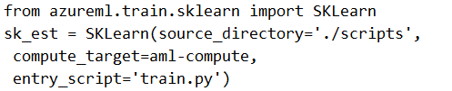

Does the solution meet the goal?

* A.Yes
* B.No

  
Show Suggested Answer

  B

---

## Question 248 | [Link](https://www.examtopics.com/discussions/microsoft/view/47794-exam-dp-100-topic-3-question-68-discussion/){:target="_blank"}

Note: This question is part of a series of questions that present the same scenario. Each question in the series contains a unique solution that might meet the stated goals. Some question sets might have more than one correct solution, while others might not have a correct solution.

After you answer a question in this section, you will NOT be able to return to it. As a result, these questions will not appear in the review screen.

You have a Python script named train.py in a local folder named scripts. The script trains a regression model by using scikit-learn. The script includes code to load a training data file which is also located in the scripts folder.

You must run the script as an Azure ML experiment on a compute cluster named aml-compute.

You need to configure the run to ensure that the environment includes the required packages for model training. You have instantiated a variable named aml- compute that references the target compute cluster.

Solution: Run the following code:

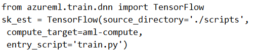

Does the solution meet the goal?

* A.Yes
* B.No

  
Show Suggested Answer

  B

---

## Question 249 | [Link](https://www.examtopics.com/discussions/microsoft/view/47062-exam-dp-100-topic-3-question-69-discussion/){:target="_blank"}

Note: This question is part of a series of questions that present the same scenario. Each question in the series contains a unique solution that might meet the stated goals. Some question sets might have more than one correct solution, while others might not have a correct solution.

After you answer a question in this section, you will NOT be able to return to it. As a result, these questions will not appear in the review screen.

You have a Python script named train.py in a local folder named scripts. The script trains a regression model by using scikit-learn. The script includes code to load a training data file which is also located in the scripts folder.

You must run the script as an Azure ML experiment on a compute cluster named aml-compute.

You need to configure the run to ensure that the environment includes the required packages for model training. You have instantiated a variable named aml- compute that references the target compute cluster.

Solution: Run the following code:

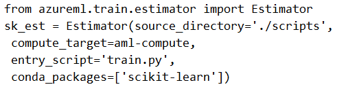

Does the solution meet the goal?

* A.Yes
* B.No

  
Show Suggested Answer

  B

---

## Question 250 | [Link](https://www.examtopics.com/discussions/microsoft/view/49548-exam-dp-100-topic-3-question-70-discussion/){:target="_blank"}

DRAG DROP -

You create machine learning models by using Azure Machine Learning.

You plan to train and score models by using a variety of compute contexts. You also plan to create a new compute resource in Azure Machine Learning studio.

You need to select the appropriate compute types.

Which compute types should you select? To answer, drag the appropriate compute types to the correct requirements. Each compute type may be used once, more than once, or not at all. You may need to drag the split bar between panes or scroll to view content.

NOTE: Each correct selection is worth one point.

Select and Place:

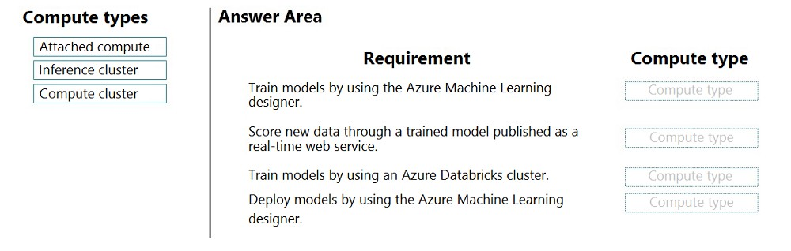

  
Show Suggested Answer

  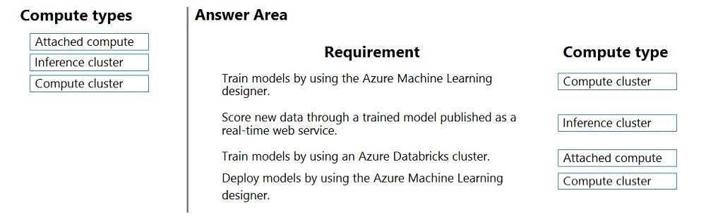

---

## Question 251 | [Link](https://www.examtopics.com/discussions/microsoft/view/49549-exam-dp-100-topic-3-question-71-discussion/){:target="_blank"}

DRAG DROP -

You are building an experiment using the Azure Machine Learning designer.

You split a dataset into training and testing sets. You select the Two-Class Boosted Decision Tree as the algorithm.

You need to determine the Area Under the Curve (AUC) of the model.

Which three modules should you use in sequence? To answer, move the appropriate modules from the list of modules to the answer area and arrange them in the correct order.

Select and Place:

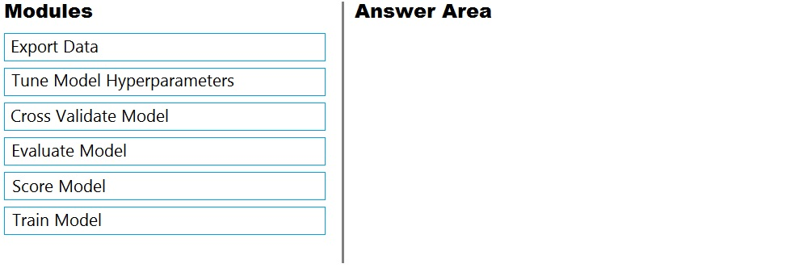

  
Show Suggested Answer

  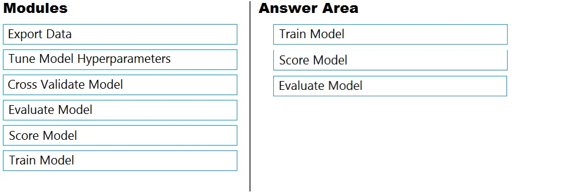

---

## Question 252 | [Link](https://www.examtopics.com/discussions/microsoft/view/48284-exam-dp-100-topic-3-question-72-discussion/){:target="_blank"}

You create a multi-class image classification deep learning model that uses a set of labeled images. You create a script file named train.py that uses the PyTorch

1.3 framework to train the model.

You must run the script by using an estimator. The code must not require any additional Python libraries to be installed in the environment for the estimator. The time required for model training must be minimized.

You need to define the estimator that will be used to run the script.

Which estimator type should you use?

* A.TensorFlow
* B.PyTorch
* C.SKLearn
* D.Estimator

  
Show Suggested Answer

  B

---

## Question 253 | [Link](https://www.examtopics.com/discussions/microsoft/view/47699-exam-dp-100-topic-3-question-73-discussion/){:target="_blank"}

You create a pipeline in designer to train a model that predicts automobile prices.

Because of non-linear relationships in the data, the pipeline calculates the natural log (Ln) of the prices in the training data, trains a model to predict this natural log of price value, and then calculates the exponential of the scored label to get the predicted price.

The training pipeline is shown in the exhibit. (Click the Training pipeline tab.)

Training pipeline -

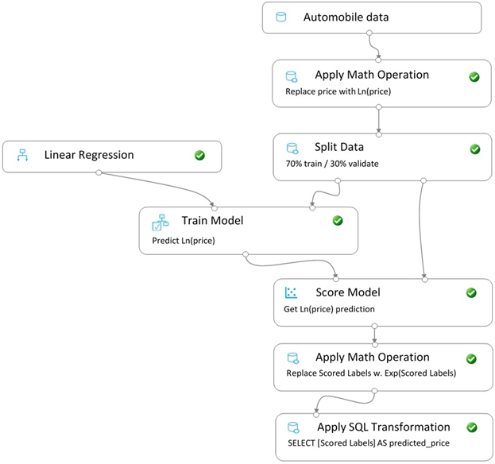

You create a real-time inference pipeline from the training pipeline, as shown in the exhibit. (Click the Real-time pipeline tab.)

Real-time pipeline -

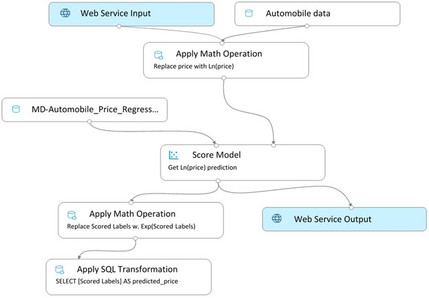

You need to modify the inference pipeline to ensure that the web service returns the exponential of the scored label as the predicted automobile price and that client applications are not required to include a price value in the input values.

Which three modifications must you make to the inference pipeline? Each correct answer presents part of the solution.

NOTE: Each correct selection is worth one point.

* A.Connect the output of the Apply SQL Transformation to the Web Service Output module.
* B.Replace the Web Service Input module with a data input that does not include the price column.
* C.Add a Select Columns module before the Score Model module to select all columns other than price.
* D.Replace the training dataset module with a data input that does not include the price column.
* E.Remove the Apply Math Operation module that replaces price with its natural log from the data flow.
* F.Remove the Apply SQL Transformation module from the data flow.

  
Show Suggested Answer

  ACE

---

## Question 254 | [Link](https://www.examtopics.com/discussions/microsoft/view/49550-exam-dp-100-topic-3-question-74-discussion/){:target="_blank"}

HOTSPOT -

You register the following versions of a model.

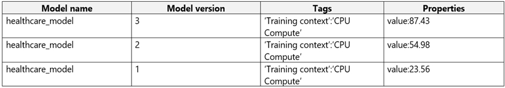

You use the Azure ML Python SDK to run a training experiment. You use a variable named run to reference the experiment run.

After the run has been submitted and completed, you run the following code:

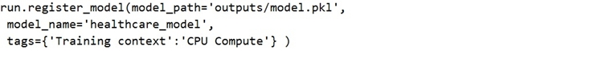

For each of the following statements, select Yes if the statement is true. Otherwise, select No.

NOTE: Each correct selection is worth one point.

Hot Area:

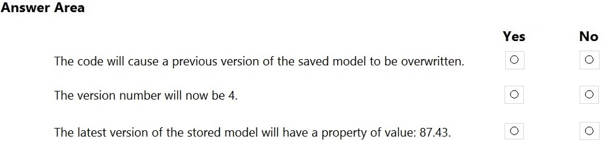

  
Show Suggested Answer

  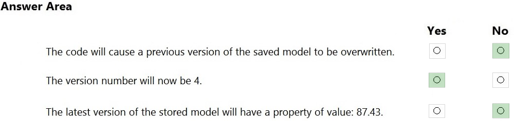

---

## Question 255 | [Link](https://www.examtopics.com/discussions/microsoft/view/49551-exam-dp-100-topic-3-question-75-discussion/){:target="_blank"}

You are creating a classification model for a banking company to identify possible instances of credit card fraud. You plan to create the model in Azure Machine

Learning by using automated machine learning.

The training dataset that you are using is highly unbalanced.

You need to evaluate the classification model.

Which primary metric should you use?

* A.normalized_mean_absolute_error
* B.AUC_weighted
* C.accuracy
* D.normalized_root_mean_squared_error
* E.spearman_correlation

  
Show Suggested Answer

  B

---

## Question 256 | [Link](https://www.examtopics.com/discussions/microsoft/view/49552-exam-dp-100-topic-3-question-76-discussion/){:target="_blank"}

You create a machine learning model by using the Azure Machine Learning designer. You publish the model as a real-time service on an Azure Kubernetes

Service (AKS) inference compute cluster. You make no changes to the deployed endpoint configuration.

You need to provide application developers with the information they need to consume the endpoint.

Which two values should you provide to application developers? Each correct answer presents part of the solution.

NOTE: Each correct selection is worth one point.

* A.The name of the AKS cluster where the endpoint is hosted.
* B.The name of the inference pipeline for the endpoint.
* C.The URL of the endpoint.
* D.The run ID of the inference pipeline experiment for the endpoint.
* E.The key for the endpoint.

  
Show Suggested Answer

  CE

---

## Question 257 | [Link](https://www.examtopics.com/discussions/microsoft/view/47184-exam-dp-100-topic-3-question-77-discussion/){:target="_blank"}

HOTSPOT -

You collect data from a nearby weather station. You have a pandas dataframe named weather_df that includes the following data:

The data is collected every 12 hours: noon and midnight.

You plan to use automated machine learning to create a time-series model that predicts temperature over the next seven days. For the initial round of training, you want to train a maximum of 50 different models.

You must use the Azure Machine Learning SDK to run an automated machine learning experiment to train these models.

You need to configure the automated machine learning run.

How should you complete the AutoMLConfig definition? To answer, select the appropriate options in the answer area.

NOTE: Each correct selection is worth one point.

Hot Area:

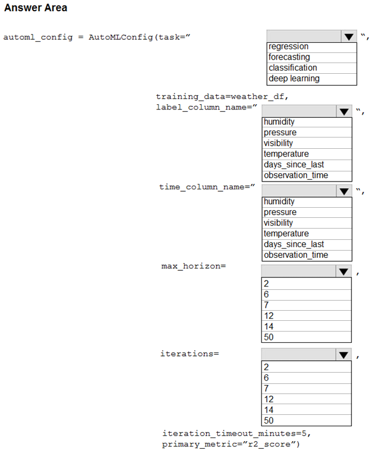

  
Show Suggested Answer

  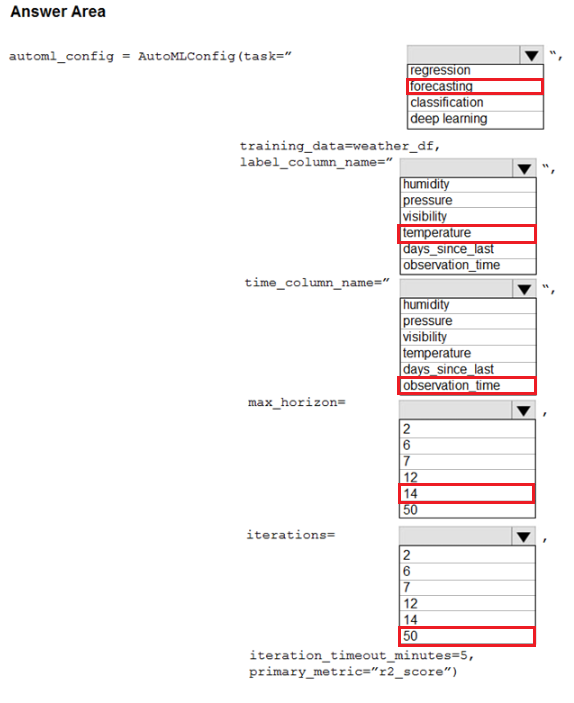

---

## Question 258 | [Link](https://www.examtopics.com/discussions/microsoft/view/47700-exam-dp-100-topic-3-question-78-discussion/){:target="_blank"}

Note: This question is part of a series of questions that present the same scenario. Each question in the series contains a unique solution that might meet the stated goals. Some question sets might have more than one correct solution, while others might not have a correct solution.

After you answer a question in this section, you will NOT be able to return to it. As a result, these questions will not appear in the review screen.

You create a model to forecast weather conditions based on historical data.

You need to create a pipeline that runs a processing script to load data from a datastore and pass the processed data to a machine learning model training script.

Solution: Run the following code:

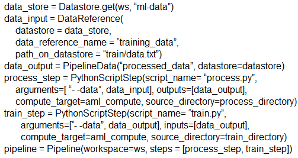

Does the solution meet the goal?

* A.Yes
* B.No

  
Show Suggested Answer

  A

---

## Question 259 | [Link](https://www.examtopics.com/discussions/microsoft/view/46625-exam-dp-100-topic-3-question-79-discussion/){:target="_blank"}

You run an experiment that uses an AutoMLConfig class to define an automated machine learning task with a maximum of ten model training iterations. The task will attempt to find the best performing model based on a metric named accuracy.

You submit the experiment with the following code:

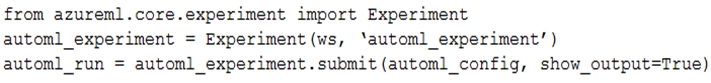

You need to create Python code that returns the best model that is generated by the automated machine learning task.

Which code segment should you use?

* A.best_model = automl_run.get_details()
* B.best_model = automl_run.get_metrics()
* C.best_model = automl_run.get_file_names()[1]
* D.best_model = automl_run.get_output()[1]

  
Show Suggested Answer

  D

---

## Question 260 | [Link](https://www.examtopics.com/discussions/microsoft/view/43145-exam-dp-100-topic-3-question-80-discussion/){:target="_blank"}

You plan to use the Hyperdrive feature of Azure Machine Learning to determine the optimal hyperparameter values when training a model.

You must use Hyperdrive to try combinations of the following hyperparameter values. You must not apply an early termination policy.

✑ learning_rate: any value between 0.001 and 0.1

✑ batch_size: 16, 32, or 64

You need to configure the sampling method for the Hyperdrive experiment.

Which two sampling methods can you use? Each correct answer is a complete solution.

NOTE: Each correct selection is worth one point.

* A.No sampling
* B.Grid sampling
* C.Bayesian sampling
* D.Random sampling

  
Show Suggested Answer

  CD

---

## Question 261 | [Link](https://www.examtopics.com/discussions/microsoft/view/57763-exam-dp-100-topic-3-question-81-discussion/){:target="_blank"}

You are training machine learning models in Azure Machine Learning. You use Hyperdrive to tune the hyperparameters.

In previous model training and tuning runs, many models showed similar performance.

You need to select an early termination policy that meets the following requirements:

✑ accounts for the performance of all previous runs when evaluating the current run avoids comparing the current run with only the best performing run to date

Which two early termination policies should you use? Each correct answer presents part of the solution.

NOTE: Each correct selection is worth one point.

* A.Median stopping
* B.Bandit
* C.Default
* D.Truncation selection

  
Show Suggested Answer

  AD

---

## Question 262 | [Link](https://www.examtopics.com/discussions/microsoft/view/60085-exam-dp-100-topic-3-question-82-discussion/){:target="_blank"}

HOTSPOT -

You are hired as a data scientist at a winery. The previous data scientist used Azure Machine Learning.

You need to review the models and explain how each model makes decisions.

Which explainer modules should you use? To answer, select the appropriate options in the answer area.

NOTE: Each correct selection is worth one point.

Hot Area:

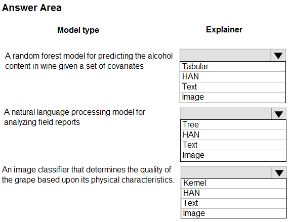

  
Show Suggested Answer

  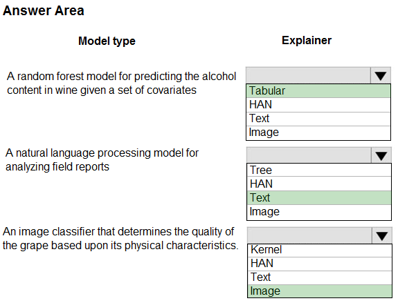

---

## Question 263 | [Link](https://www.examtopics.com/discussions/microsoft/view/57623-exam-dp-100-topic-3-question-83-discussion/){:target="_blank"}

HOTSPOT -

You have a dataset that includes home sales data for a city. The dataset includes the following columns.

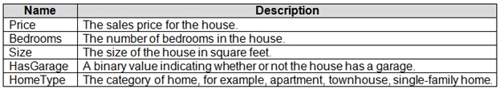

Each row in the dataset corresponds to an individual home sales transaction.

You need to use automated machine learning to generate the best model for predicting the sales price based on the features of the house.

Which values should you use? To answer, select the appropriate options in the answer area.

NOTE: Each correct selection is worth one point.

Hot Area:

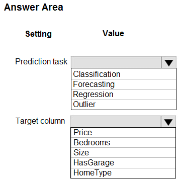

  
Show Suggested Answer

  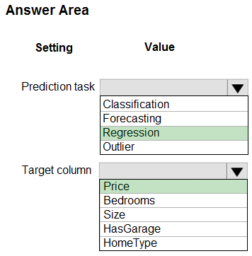

---

## Question 264 | [Link](https://www.examtopics.com/discussions/microsoft/view/43146-exam-dp-100-topic-3-question-84-discussion/){:target="_blank"}

You use the Azure Machine Learning SDK in a notebook to run an experiment using a script file in an experiment folder.

The experiment fails.

You need to troubleshoot the failed experiment.

What are two possible ways to achieve this goal? Each correct answer presents a complete solution.

* A.Use the get_metrics() method of the run object to retrieve the experiment run logs.
* B.Use the get_details_with_logs() method of the run object to display the experiment run logs.
* C.View the log files for the experiment run in the experiment folder.
* D.View the logs for the experiment run in Azure Machine Learning studio.
* E.Use the get_output() method of the run object to retrieve the experiment run logs.

  
Show Suggested Answer

  BD

---

## Question 265 | [Link](https://www.examtopics.com/discussions/microsoft/view/46676-exam-dp-100-topic-3-question-85-discussion/){:target="_blank"}

DRAG DROP -

You have an Azure Machine Learning workspace that contains a CPU-based compute cluster and an Azure Kubernetes Service (AKS) inference cluster. You create a tabular dataset containing data that you plan to use to create a classification model.

You need to use the Azure Machine Learning designer to create a web service through which client applications can consume the classification model by submitting new data and getting an immediate prediction as a response.

Which three actions should you perform in sequence? To answer, move the appropriate actions from the list of actions to the answer area and arrange them in the correct order.

Select and Place:

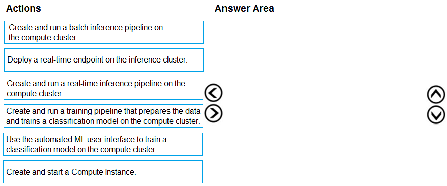

  
Show Suggested Answer

  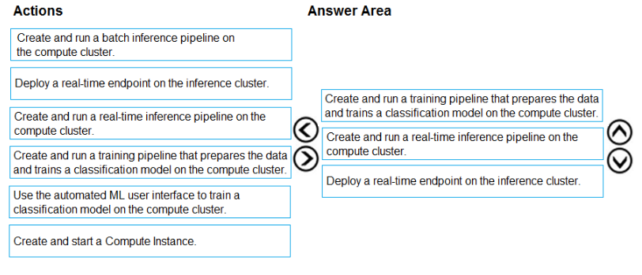

---

## Question 266 | [Link](https://www.examtopics.com/discussions/microsoft/view/20748-exam-dp-100-topic-3-question-86-discussion/){:target="_blank"}

You use the Two-Class Neural Network module in Azure Machine Learning Studio to build a binary classification model. You use the Tune Model

Hyperparameters module to tune accuracy for the model.

You need to configure the Tune Model Hyperparameters module.

Which two values should you use? Each correct answer presents part of the solution.

NOTE: Each correct selection is worth one point.

* A.Number of hidden nodes
* B.Learning Rate
* C.The type of the normalizer
* D.Number of learning iterations
* E.Hidden layer specification

  
Show Suggested Answer

  BD

---

## Question 267 | [Link](https://www.examtopics.com/discussions/microsoft/view/47800-exam-dp-100-topic-3-question-87-discussion/){:target="_blank"}

HOTSPOT -

You are running a training experiment on remote compute in Azure Machine Learning.

The experiment is configured to use a conda environment that includes the mlflow and azureml-contrib-run packages.

You must use MLflow as the logging package for tracking metrics generated in the experiment.

You need to complete the script for the experiment.

How should you complete the code? To answer, select the appropriate options in the answer area.

NOTE: Each correct selection is worth one point.

Hot Area:

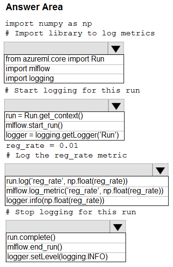

  
Show Suggested Answer

  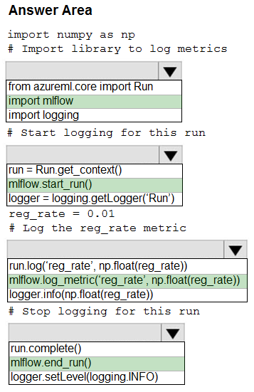

---

## Question 268 | [Link](https://www.examtopics.com/discussions/microsoft/view/21503-exam-dp-100-topic-3-question-88-discussion/){:target="_blank"}

You create a binary classification model by using Azure Machine Learning Studio.

You must tune hyperparameters by performing a parameter sweep of the model. The parameter sweep must meet the following requirements:

✑ iterate all possible combinations of hyperparameters

✑ minimize computing resources required to perform the sweep

You need to perform a parameter sweep of the model.

Which parameter sweep mode should you use?

* A.Random sweep
* B.Sweep clustering
* C.Entire grid
* D.Random grid

  
Show Suggested Answer

  C

---

## Question 269 | [Link](https://www.examtopics.com/discussions/microsoft/view/21181-exam-dp-100-topic-3-question-89-discussion/){:target="_blank"}

You are building a recurrent neural network to perform a binary classification.

You review the training loss, validation loss, training accuracy, and validation accuracy for each training epoch.

You need to analyze model performance.

You need to identify whether the classification model is overfitted.

Which of the following is correct?

* A.The training loss stays constant and the validation loss stays on a constant value and close to the training loss value when training the model.
* B.The training loss decreases while the validation loss increases when training the model.
* C.The training loss stays constant and the validation loss decreases when training the model.
* D.The training loss increases while the validation loss decreases when training the model.

  
Show Suggested Answer

  B

---

## Question 270 | [Link](https://www.examtopics.com/discussions/microsoft/view/53684-exam-dp-100-topic-3-question-90-discussion/){:target="_blank"}

Note: This question is part of a series of questions that present the same scenario. Each question in the series contains a unique solution that might meet the stated goals. Some question sets might have more than one correct solution, while others might not have a correct solution.

After you answer a question in this section, you will NOT be able to return to it. As a result, these questions will not appear in the review screen.

You have a Python script named train.py in a local folder named scripts. The script trains a regression model by using scikit-learn. The script includes code to load a training data file which is also located in the scripts folder.

You must run the script as an Azure ML experiment on a compute cluster named aml-compute.

You need to configure the run to ensure that the environment includes the required packages for model training. You have instantiated a variable named aml- compute that references the target compute cluster.

Solution: Run the following code:

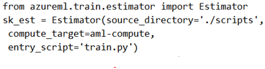

Does the solution meet the goal?

* A.Yes
* B.No

  
Show Suggested Answer

  B

---

## Question 271 | [Link](https://www.examtopics.com/discussions/microsoft/view/44809-exam-dp-100-topic-3-question-91-discussion/){:target="_blank"}

You are performing clustering by using the K-means algorithm.

You need to define the possible termination conditions.

Which three conditions can you use? Each correct answer presents a complete solution.

NOTE: Each correct selection is worth one point.

* A.Centroids do not change between iterations.
* B.The residual sum of squares (RSS) rises above a threshold.
* C.The residual sum of squares (RSS) falls below a threshold.
* D.A fixed number of iterations is executed.
* E.The sum of distances between centroids reaches a maximum.

  
Show Suggested Answer

  ACD

---

## Question 272 | [Link](https://www.examtopics.com/discussions/microsoft/view/64517-exam-dp-100-topic-3-question-92-discussion/){:target="_blank"}

HOTSPOT -

You are using C-Support Vector classification to do a multi-class classification with an unbalanced training dataset. The C-Support Vector classification using

Python code shown below:

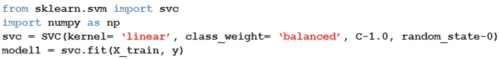

You need to evaluate the C-Support Vector classification code.

Which evaluation statement should you use? To answer, select the appropriate options in the answer area.

NOTE: Each correct selection is worth one point.

Hot Area:

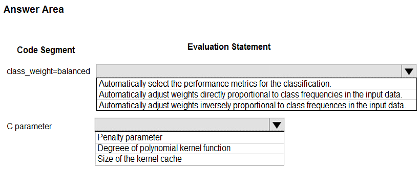

  
Show Suggested Answer

  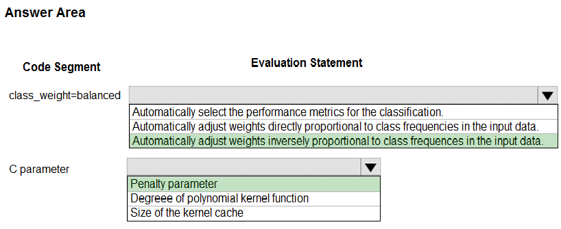

---

## Question 273 | [Link](https://www.examtopics.com/discussions/microsoft/view/11187-exam-dp-100-topic-3-question-93-discussion/){:target="_blank"}

You are building a machine learning model for translating English language textual content into French language textual content.

You need to build and train the machine learning model to learn the sequence of the textual content.

Which type of neural network should you use?

* A.Multilayer Perceptions (MLPs)
* B.Convolutional Neural Networks (CNNs)
* C.Recurrent Neural Networks (RNNs)
* D.Generative Adversarial Networks (GANs)

  
Show Suggested Answer

  C

---

## Question 274 | [Link](https://www.examtopics.com/discussions/microsoft/view/57714-exam-dp-100-topic-3-question-94-discussion/){:target="_blank"}

You create a binary classification model.

You need to evaluate the model performance.

Which two metrics can you use? Each correct answer presents a complete solution.

NOTE: Each correct selection is worth one point.

* A.relative absolute error
* B.precision
* C.accuracy
* D.mean absolute error
* E.coefficient of determination

  
Show Suggested Answer

  BC

---

## Question 275 | [Link](https://www.examtopics.com/discussions/microsoft/view/63884-exam-dp-100-topic-3-question-95-discussion/){:target="_blank"}

You create a script that trains a convolutional neural network model over multiple epochs and logs the validation loss after each epoch. The script includes arguments for batch size and learning rate.

You identify a set of batch size and learning rate values that you want to try.

You need to use Azure Machine Learning to find the combination of batch size and learning rate that results in the model with the lowest validation loss.

What should you do?

* A.Run the script in an experiment based on an AutoMLConfig object
* B.Create a PythonScriptStep object for the script and run it in a pipeline
* C.Use the Automated Machine Learning interface in Azure Machine Learning studio
* D.Run the script in an experiment based on a ScriptRunConfig object
* E.Run the script in an experiment based on a HyperDriveConfig object

  
Show Suggested Answer

  E

---

## Question 276 | [Link](https://www.examtopics.com/discussions/microsoft/view/57569-exam-dp-100-topic-3-question-96-discussion/){:target="_blank"}

You use the Azure Machine Learning Python SDK to define a pipeline to train a model.

The data used to train the model is read from a folder in a datastore.

You need to ensure the pipeline runs automatically whenever the data in the folder changes.

What should you do?

* A.Set the regenerate_outputs property of the pipeline to True
* B.Create a ScheduleRecurrance object with a Frequency of auto. Use the object to create a Schedule for the pipeline
* C.Create a PipelineParameter with a default value that references the location where the training data is stored
* D.Create a Schedule for the pipeline. Specify the datastore in the datastore property, and the folder containing the training data in the path_on_datastore property

  
Show Suggested Answer

  D

---

## Question 277 | [Link](https://www.examtopics.com/discussions/microsoft/view/56897-exam-dp-100-topic-3-question-97-discussion/){:target="_blank"}

You plan to run a Python script as an Azure Machine Learning experiment.

The script must read files from a hierarchy of folders. The files will be passed to the script as a dataset argument.

You must specify an appropriate mode for the dataset argument.

Which two modes can you use? Each correct answer presents a complete solution.

NOTE: Each correct selection is worth one point.

* A.to_pandas_dataframe()
* B.as_download()
* C.as_upload()
* D.as_mount()

  
Show Suggested Answer

  D

---

## Question 278 | [Link](https://www.examtopics.com/discussions/microsoft/view/70305-exam-dp-100-topic-3-question-98-discussion/){:target="_blank"}

You create a Python script that runs a training experiment in Azure Machine Learning. The script uses the Azure Machine Learning SDK for Python.

You must add a statement that retrieves the names of the logs and outputs generated by the script.

You need to reference a Python class object from the SDK for the statement.

Which class object should you use?

* A.Run
* B.ScriptRunConfig
* C.Workspace
* D.Experiment

  
Show Suggested Answer

  A

---

## Question 279 | [Link](https://www.examtopics.com/discussions/microsoft/view/69632-exam-dp-100-topic-3-question-99-discussion/){:target="_blank"}

You run a script as an experiment in Azure Machine Learning.

You have a Run object named run that references the experiment run. You must review the log files that were generated during the experiment run.

You need to download the log files to a local folder for review.

Which two code segments can you run to achieve this goal? Each correct answer presents a complete solution.

NOTE: Each correct selection is worth one point.

* A.run.get_details()
* B.run.get_file_names()
* C.run.get_metrics()
* D.run.download_files(output_directory='./runfiles')
* E.run.get_all_logs(destination='./runlogs')

  
Show Suggested Answer

  DE

---

## Question 280 | [Link](https://www.examtopics.com/discussions/microsoft/view/70306-exam-dp-100-topic-3-question-100-discussion/){:target="_blank"}

You have the following code. The code prepares an experiment to run a script:

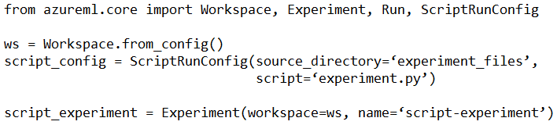

The experiment must be run on local computer using the default environment.

You need to add code to start the experiment and run the script.

Which code segment should you use?

* A.run = script_experiment.start_logging()
* B.run = Run(experiment=script_experiment)
* C.ws.get_run(run_id=experiment.id)
* D.run = script_experiment.submit(config=script_config)

  
Show Suggested Answer

  D

---

## Question 281 | [Link](https://www.examtopics.com/discussions/microsoft/view/70307-exam-dp-100-topic-3-question-101-discussion/){:target="_blank"}

You use the following code to define the steps for a pipeline: from azureml.core import Workspace, Experiment, Run from azureml.pipeline.core import Pipeline from azureml.pipeline.steps import PythonScriptStep ws = Workspace.from_config()

. . .

step1 = PythonScriptStep(name="step1", ...)

step2 = PythonScriptsStep(name="step2", ...)

pipeline_steps = [step1, step2]

You need to add code to run the steps.

Which two code segments can you use to achieve this goal? Each correct answer presents a complete solution.

NOTE: Each correct selection is worth one point.

* A.experiment = Experiment(workspace=ws, name='pipeline-experiment') run = experiment.submit(config=pipeline_steps)
* B.run = Run(pipeline_steps)
* C.pipeline = Pipeline(workspace=ws, steps=pipeline_steps) experiment = Experiment(workspace=ws, name='pipeline-experiment') run = experiment.submit(pipeline)
* D.pipeline = Pipeline(workspace=ws, steps=pipeline_steps) run = pipeline.submit(experiment_name='pipeline-experiment')

  
Show Suggested Answer

  CD

---

## Question 282 | [Link](https://www.examtopics.com/discussions/microsoft/view/68896-exam-dp-100-topic-3-question-102-discussion/){:target="_blank"}

HOTSPOT -

You create an Azure Databricks workspace and a linked Azure Machine Learning workspace.

You have the following Python code segment in the Azure Machine Learning workspace: import mlflow import mlflow.azureml import azureml.mlflow import azureml.core from azureml.core import Workspace subscription_id = 'subscription_id' resourse_group = 'resource_group_name' workspace_name = 'workspace_name' ws = Workspace.get(name=workspace_name, subscription_id=subscription_id, resource_group=resource_group) experimentName = "/Users/{user_name}/{experiment_folder}/{experiment_name}" mlflow.set_experiment(experimentName) uri = ws.get_mlflow_tracking_uri() mlflow.set_tracking_uri(uri)

Instructions: For each of the following statements, select Yes if the statement is true. Otherwise, select No.

NOTE: Each correct selection is worth one point.

Hot Area:

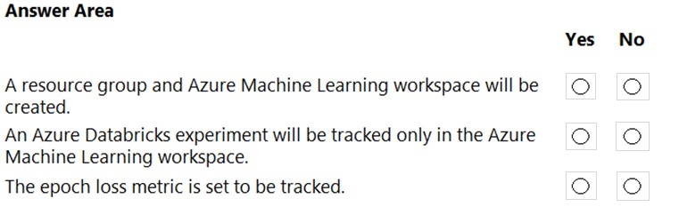

  
Show Suggested Answer

  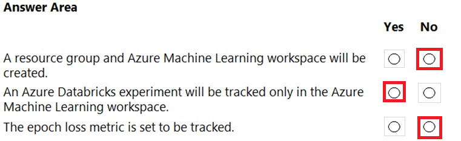

---

## Question 283 | [Link](https://www.examtopics.com/discussions/microsoft/view/69088-exam-dp-100-topic-3-question-103-discussion/){:target="_blank"}

You create and register a model in an Azure Machine Learning workspace.

You must use the Azure Machine Learning SDK to implement a batch inference pipeline that uses a ParallelRunStep to score input data using the model. You must specify a value for the ParallelRunConfig compute_target setting of the pipeline step.

You need to create the compute target.

Which class should you use?

* A.BatchCompute
* B.AdlaCompute
* C.AmlCompute
* D.AksCompute

  
Show Suggested Answer

  C

---

## Question 284 | [Link](https://www.examtopics.com/discussions/microsoft/view/69193-exam-dp-100-topic-3-question-104-discussion/){:target="_blank"}

DRAG DROP -

You previously deployed a model that was trained using a tabular dataset named training-dataset, which is based on a folder of CSV files.

Over time, you have collected the features and predicted labels generated by the model in a folder containing a CSV file for each month. You have created two tabular datasets based on the folder containing the inference data: one named predictions-dataset with a schema that matches the training data exactly, including the predicted label; and another named features-dataset with a schema containing all of the feature columns and a timestamp column based on the filename, which includes the day, month, and year.

You need to create a data drift monitor to identify any changing trends in the feature data since the model was trained. To accomplish this, you must define the required datasets for the data drift monitor.

Which datasets should you use to configure the data drift monitor? To answer, drag the appropriate datasets to the correct data drift monitor options. Each source may be used once, more than once, or not at all. You may need to drag the split bar between panes or scroll to view content.

NOTE: Each correct selection is worth one point.

Select and Place:

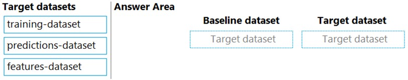

  
Show Suggested Answer

  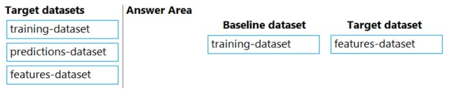

---

## Question 285 | [Link](https://www.examtopics.com/discussions/microsoft/view/69001-exam-dp-100-topic-3-question-105-discussion/){:target="_blank"}

You plan to run a Python script as an Azure Machine Learning experiment.

The script contains the following code:

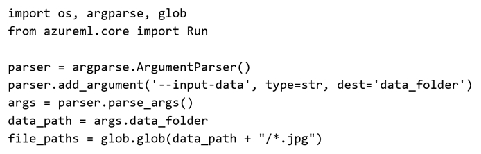

You must specify a file dataset as an input to the script. The dataset consists of multiple large image files and must be streamed directly from its source.

You need to write code to define a ScriptRunConfig object for the experiment and pass the ds dataset as an argument.

Which code segment should you use?

* A.arguments = ['--input-data', ds.to_pandas_dataframe()]
* B.arguments = ['--input-data', ds.as_mount()]
* C.arguments = ['--data-data', ds]
* D.arguments = ['--input-data', ds.as_download()]

  
Show Suggested Answer

  B

---

## Question 286 | [Link](https://www.examtopics.com/discussions/microsoft/view/79221-exam-dp-100-topic-3-question-106-discussion/){:target="_blank"}

You have a Jupyter Notebook that contains Python code that is used to train a model.

You must create a Python script for the production deployment. The solution must minimize code maintenance.

Which two actions should you perform? Each correct answer presents part of the solution.

NOTE: Each correct selection is worth one point.

* A.Refactor the Jupyter Notebook code into functions
* B.Save each function to a separate Python file
* C.Define a main() function in the Python script
* D.Remove all comments and functions from the Python script

  
Show Suggested Answer

  AC

---

## Question 287 | [Link](https://www.examtopics.com/discussions/microsoft/view/80890-exam-dp-100-topic-3-question-107-discussion/){:target="_blank"}

HOTSPOT -

You use an Azure Machine Learning workspace.

You create the following Python code:

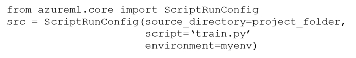

For each of the following statements, select Yes if the statement is true. Otherwise, select No.

NOTE: Each correct selection is worth one point.

Hot Area:

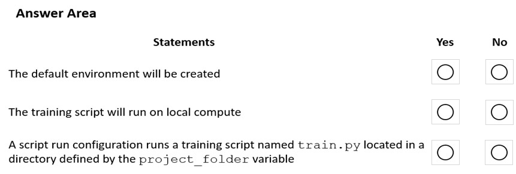

  
Show Suggested Answer

  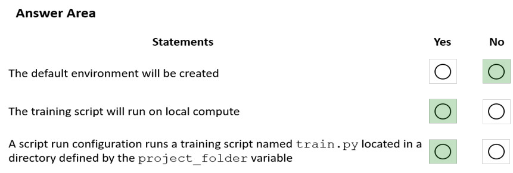

---

## Question 288 | [Link](https://www.examtopics.com/discussions/microsoft/view/86092-exam-dp-100-topic-3-question-108-discussion/){:target="_blank"}

HOTSPOT -

You create a Python script named train.py and save it in a folder named scripts. The script uses the scikit-learn framework to train a machine learning model.

You must run the script as an Azure Machine Learning experiment on your local workstation.

You need to write Python code to initiate an experiment that runs the train.py script.

How should you complete the code segment? To answer, select the appropriate options in the answer area.

NOTE: Each correct selection is worth one point.

Hot Area:

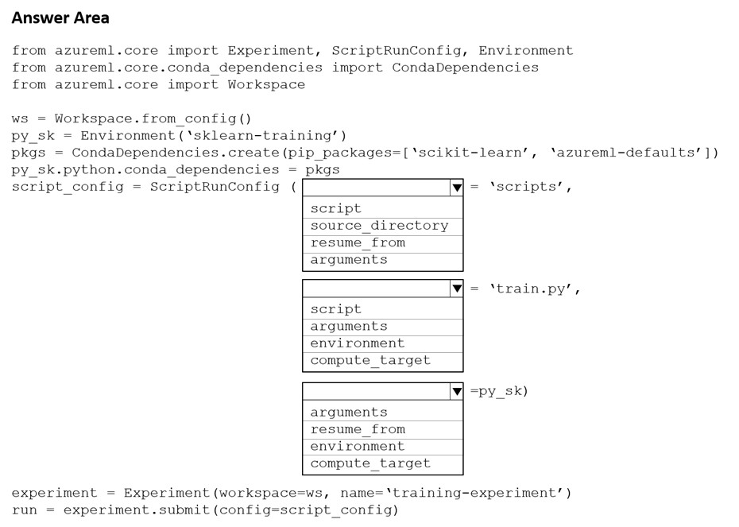

  
Show Suggested Answer

  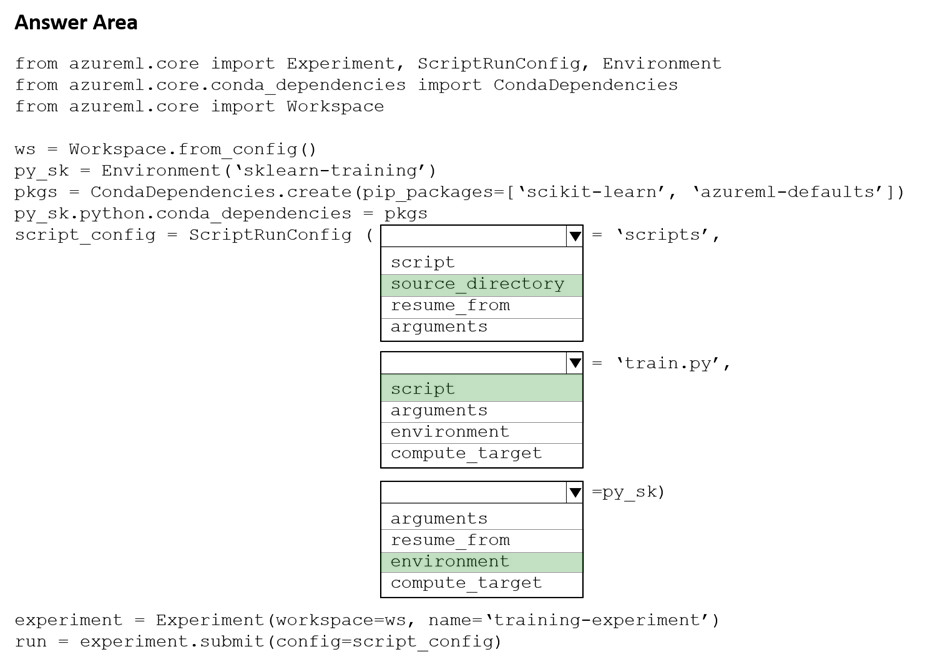

---

## Question 289 | [Link](https://www.examtopics.com/discussions/microsoft/view/81370-exam-dp-100-topic-3-question-109-discussion/){:target="_blank"}

Note: This question is part of a series of questions that present the same scenario. Each question in the series contains a unique solution that might meet the stated goals. Some question sets might have more than one correct solution, while others might not have a correct solution.

After you answer a question in this section, you will NOT be able to return to it. As a result, these questions will not appear in the review screen.

You plan to use a Python script to run an Azure Machine Learning experiment. The script creates a reference to the experiment run context, loads data from a file, identifies the set of unique values for the label column, and completes the experiment run:

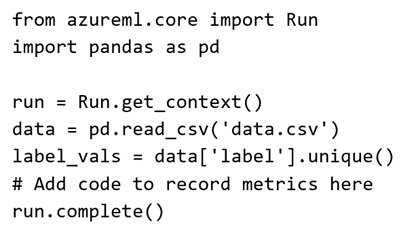

The experiment must record the unique labels in the data as metrics for the run that can be reviewed later.

You must add code to the script to record the unique label values as run metrics at the point indicated by the comment.

Solution: Replace the comment with the following code:

run.log_list('Label Values', label_vals)

Does the solution meet the goal?

* A.Yes
* B.No

  
Show Suggested Answer

  A

---

## Question 290 | [Link](https://www.examtopics.com/discussions/microsoft/view/104677-exam-dp-100-topic-3-question-110-discussion/){:target="_blank"}

You use the Azure Machine Learning SDK for Python to create a pipeline that includes the following step:

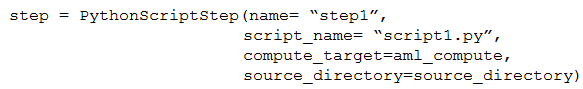

The output of the step run must be cached and reused on subsequent runs when the source_directory value has not changed.

You need to define the step.

What should you include in the step definition?

* A.allow_reuse
* B.version
* C.data.as_input(name=…)
* D.hash_paths

  
Show Suggested Answer

  A

---

## Question 291 | [Link](https://www.examtopics.com/discussions/microsoft/view/103469-exam-dp-100-topic-3-question-111-discussion/){:target="_blank"}

You are developing a two-step Azure Machine Learning pipeline by using the Azure Machine Learning SDK for Python.

You need to register the output of the pipeline as a new version of a named dataset after the run has been completed.

What should you implement?

* A.the as_input method of the OutputDatasetConfig class
* B.the register_on_complete method of the OutputDatasetConfig class
* C.the as_mount method of the DatasetConsumptionConfig class
* D.the as_download method of the DatasetConsumptionConfig class

  
Show Suggested Answer

  B

---

## Question 292 | [Link](https://www.examtopics.com/discussions/microsoft/view/103661-exam-dp-100-topic-3-question-112-discussion/){:target="_blank"}

HOTSPOT

-

You build a data pipeline in an Azure Machine Learning workspace by using the Azure Machine Learning SDK for Python. You create a data preparation step in the data pipeline.

You create the following code fragment in Python:

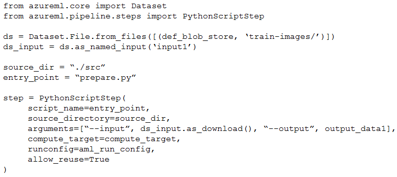

For each of the following statements, select Yes if the statement is true. Otherwise, select No.

NOTE: Each correct selection is worth one point.

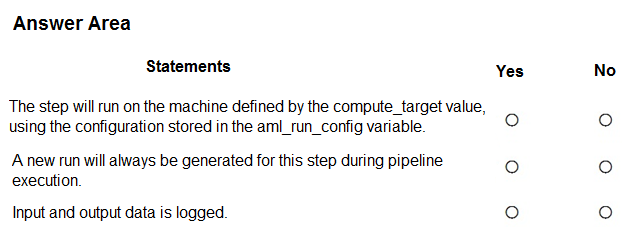

  
Show Suggested Answer

  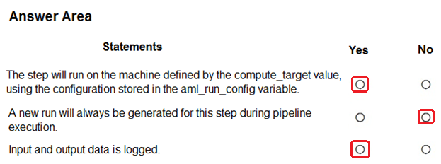

---

## Question 293 | [Link](https://www.examtopics.com/discussions/microsoft/view/103470-exam-dp-100-topic-3-question-113-discussion/){:target="_blank"}

HOTSPOT

-

You use Azure Machine Learning to implement hyperparameter tuning.

Training runs must terminate when the primary metric is lowered by 25 percent or more compared to the best performing run.

You need to configure an early termination policy to terminate training jobs.

Which values should you use? To answer, select the appropriate options in the answer area.

NOTE: Each correct selection is worth one point.

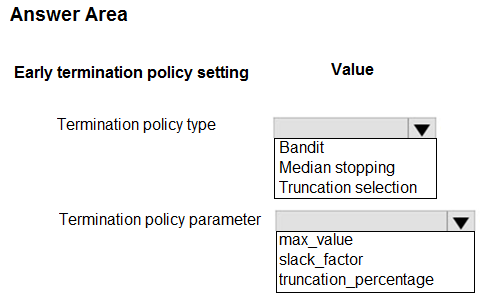

  
Show Suggested Answer

  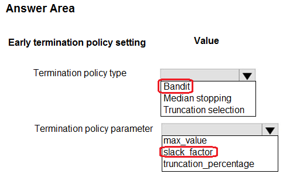

---

## Question 294 | [Link](https://www.examtopics.com/discussions/microsoft/view/103471-exam-dp-100-topic-3-question-114-discussion/){:target="_blank"}

You are implementing hyperparameter tuning by using Bayesian sampling for a model training from a notebook. The notebook is in an Azure Machine Learning workspace that uses a compute cluster with 20 nodes.

The code implements Bandit termination policy with slack factor set to 0.2 and the HyperDriveConfig class instance with max_concurrent_runs set to 10.

You must increase effectiveness of the tuning process by improving sampling convergence.

You need to select which sampling convergence to use.

What should you select?

* A.Set the value of slack factor of early_termination_policy to 09.
* B.Set the value of max_concurrent_runs of HyperDriveConfig to 4.
* C.Set the value of slack factor of early_termination_policy to 0.1.
* D.Set the value of max_concurrent_runs of HyperDriveConfig to 20.

  
Show Suggested Answer

  B

---

## Question 295 | [Link](https://www.examtopics.com/discussions/microsoft/view/104032-exam-dp-100-topic-3-question-115-discussion/){:target="_blank"}

DRAG DROP

-

You create an Azure Machine Learning workspace. You are training a classification model with no-code AutoML in Azure Machine Learning studio.

The model must predict if a client of a financial institution will subscribe to a fixed-term deposit. You must identify the feature that has the most influence on the predictions of the model for the second highest scoring algorithm. You must minimize the effort and time to identify the feature.

You need to complete the identification.

Which three actions should you perform in sequence? To answer, move the appropriate actions from the list of actions to the answer area and arrange them in the correct order.

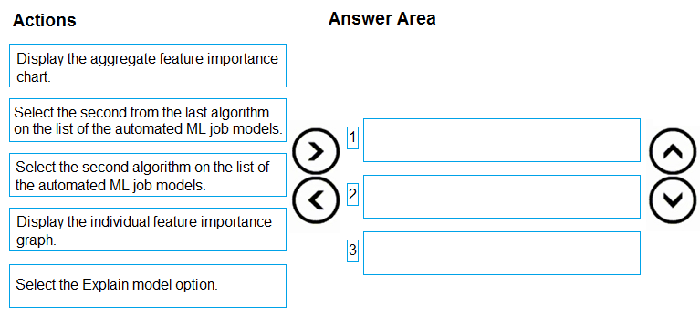

  
Show Suggested Answer

  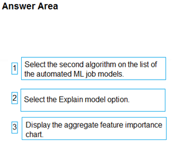

---

## Question 296 | [Link](https://www.examtopics.com/discussions/microsoft/view/103618-exam-dp-100-topic-3-question-116-discussion/){:target="_blank"}

HOTSPOT

-

You load data from a notebook in an Azure Machine Learning workspace into a pandas dataframe named df. The data contains 10,000 patient records. Each record includes the Age property for the corresponding patient.

You must identify the mean age value from the differentially private data generated by SmartNoise SDK.

You need to complete the Python code that will generate the mean age value from the differentially private data.

Which code segments should you use? To answer, select the appropriate options in the answer area.

NOTE: Each correct selection is worth one point.

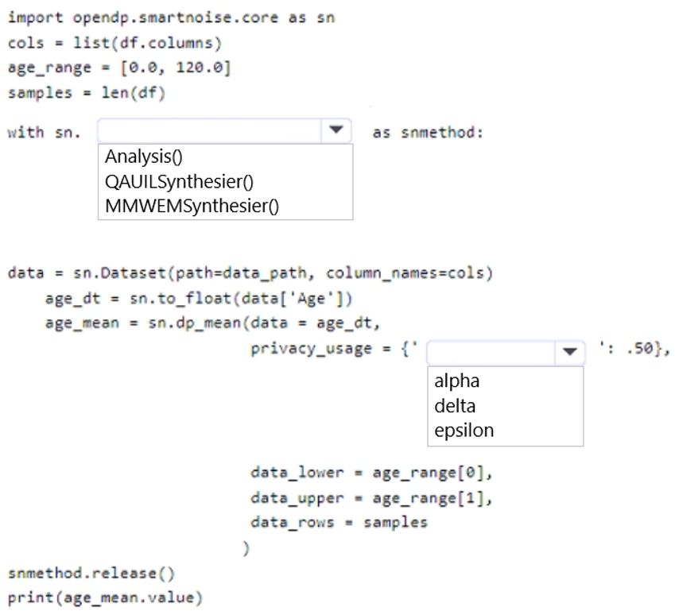

  
Show Suggested Answer

  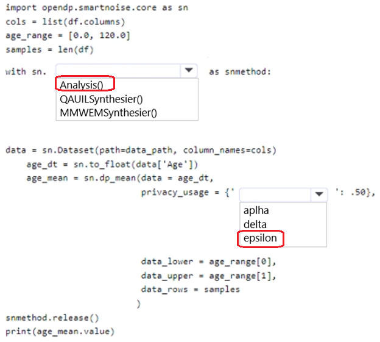

---

## Question 297 | [Link](https://www.examtopics.com/discussions/microsoft/view/117445-exam-dp-100-topic-3-question-117-discussion/){:target="_blank"}

HOTSPOT

-

You are developing code to analyze a dataset that includes age information for a large group of diabetes patients. You create an Azure Machine Learning workspace and install all required libraries. You set the privacy budget to 1.0.

You must analyze the dataset and preserve data privacy. The code must run twice before the privacy budget is depleted.

You need to complete the code.

Which values should you use? To answer, select the appropriate options in the answer area.

NOTE: Each correct selection is worth one point.

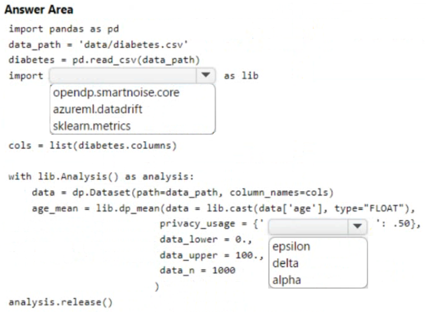

  
Show Suggested Answer

  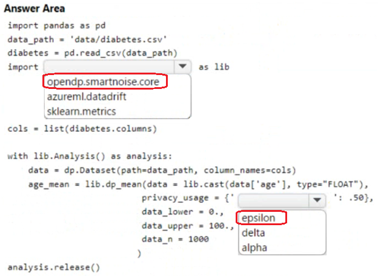

---

## Question 298 | [Link](https://www.examtopics.com/discussions/microsoft/view/109768-exam-dp-100-topic-3-question-118-discussion/){:target="_blank"}

You use Azure Machine Learning studio to analyze a dataset containing a decimal column named column1.

You need to verify that the column1 values are normally distributed.

Which statistic should you use?

* A.Max
* B.Type
* C.Profile
* D.Mean

  
Show Suggested Answer

  C

---

## Question 299 | [Link](https://www.examtopics.com/discussions/microsoft/view/103707-exam-dp-100-topic-3-question-119-discussion/){:target="_blank"}

HOTSPOT

-

You use Azure Machine Learning to implement hyperparameter tuning with a Bandit early termination policy.

The policy uses a slack_factor set to 0.1. an evaluation interval set to 1, and an evaluation delay set to 5.

You need to evaluate the outcome of the early termination policy.

What should you evaluate? To answer, select the appropriate options in the answer area.

NOTE: Each correct selection is worth one point.

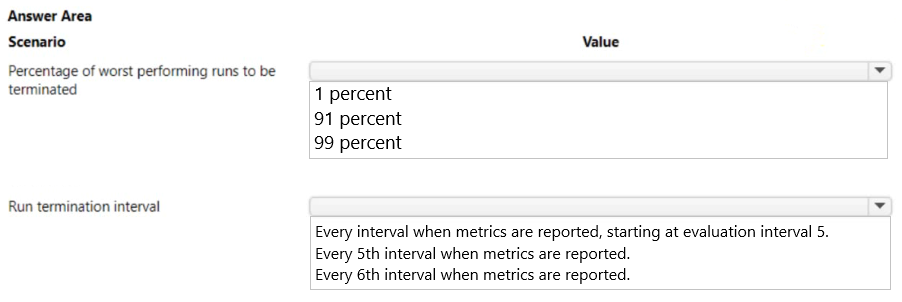

  
Show Suggested Answer

  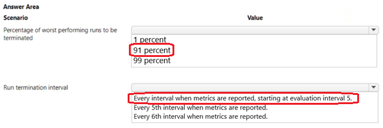

---

## Question 300 | [Link](https://www.examtopics.com/discussions/microsoft/view/109769-exam-dp-100-topic-3-question-120-discussion/){:target="_blank"}

HOTSPOT

-

You train a machine learning model by using Azure Machine Learning.

You use the following training script in Python to log an accuracy value:

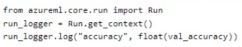

You must use a Python script to define a sweep job.

You need to provide the primary metric and goal you want hyperparameter tuning to optimize.

How should you complete the Python script? To answer, select the appropriate options in the answer area.

NOTE: Each correct selection is worth one point.

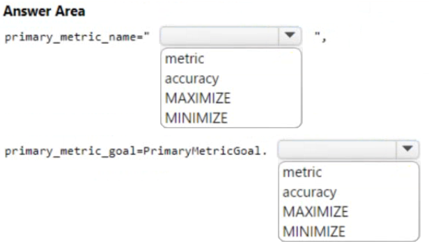

  
Show Suggested Answer

  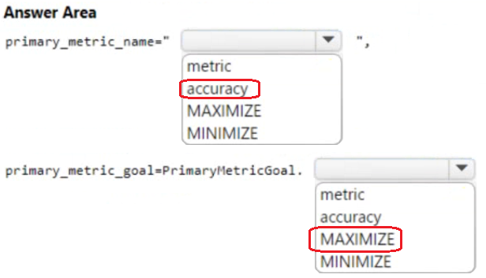

---

## Question 301 | [Link](https://www.examtopics.com/discussions/microsoft/view/117446-exam-dp-100-topic-3-question-121-discussion/){:target="_blank"}

HOTSPOT

-

You have an Azure Machine learning workspace. The workspace contains a dataset with data in a tabular form.

You plan to use the Azure Machine Learning SDK for Python v1 to create a control script that will load the dataset into a pandas dataframe in preparation for model training. The script will accept a parameter designating the dataset.

You need to complete the script.

How should you complete the script? To answer, select the appropriate options in the answer area.

NOTE: Each correct selection is worth one point.

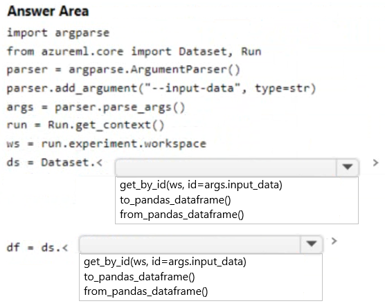

  
Show Suggested Answer

  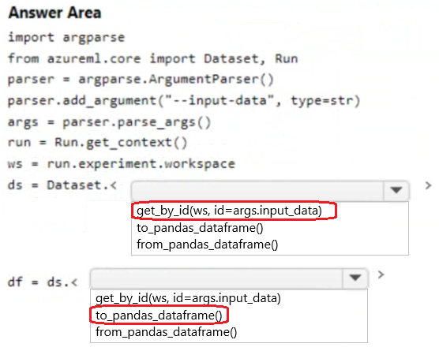

---

## Question 302 | [Link](https://www.examtopics.com/discussions/microsoft/view/103693-exam-dp-100-topic-3-question-122-discussion/){:target="_blank"}

You have a dataset that is stored in an Azure Machine Learning workspace.

You must perform a data analysis for differential privacy by using the SmartNoise SDK.

You need to measure the distribution of reports for repeated queries to ensure that they are balanced.

Which type of test should you perform?

* A.Bias
* B.Privacy
* C.Accuracy
* D.Utility

  
Show Suggested Answer

  A

---

## Question 303 | [Link](https://www.examtopics.com/discussions/microsoft/view/104099-exam-dp-100-topic-3-question-123-discussion/){:target="_blank"}

You use the Azure Machine Learning Python SDK to create a batch inference pipeline.

You must publish the batch inference pipeline so that business groups in your organization can use the pipeline. Each business group must be able to specify a different location for the data that the pipeline submits to the model for scoring.

You need to publish the pipeline.

What should you do?

* A.Create multiple endpoints for the published pipeline service and have each business group submit jobs to its own endpoint.
* B.Define a PipelineParameter object for the pipeline and use it to specify the business group-specific input dataset for each pipeline run.
* C.Define a OutputFileDatasetConfig object for the pipeline and use the object to specify the business group-specific input dataset for each pipeline run.
* D.Have each business group run the pipeline on local compute and use a local file for the input data.

  
Show Suggested Answer

  B

---

## Question 304 | [Link](https://www.examtopics.com/discussions/microsoft/view/109770-exam-dp-100-topic-3-question-124-discussion/){:target="_blank"}

You create an Azure Machine Learning workspace. You train an MLflow-formatted regression model by using tabular structured data.

You must use a Responsible AI dashboard to access the model.

You need to use the Azure Machine Learning studio UI to generate the Responsible AI dashboard.

What should you do first?

* A.Deploy the model to a managed online endpoint.
* B.Register the model with the workspace.
* C.Create the model explanations.
* D.Convert the model from the MLflow format to a custom format.

  
Show Suggested Answer

  B

---

## Question 305 | [Link](https://www.examtopics.com/discussions/microsoft/view/104098-exam-dp-100-topic-3-question-125-discussion/){:target="_blank"}

You are developing a machine learning model by using Azure Machine Learning. You are using multiple text files in tabular format for model data.

You have the following requirements:

•	You must use AutoMLjobs to train the model.

•	You must use data from specified columns.

•	The data concept must support lazy evaluation.

You need to load data into a Pandas dataframe.

Which data concept should you use?

* A.Data asset
* B.URI
* C.Datastore
* D.MLTable

  
Show Suggested Answer

  D

---

## Question 306 | [Link](https://www.examtopics.com/discussions/microsoft/view/103473-exam-dp-100-topic-3-question-126-discussion/){:target="_blank"}

You use differential privacy to ensure your reports are private.

The calculated value of the epsilon for your data is 1.8.

You need to modify your data to ensure your reports are private.

Which epsilon value should you accept for your data?

* A.between 0 and 1
* B.between 2 and 3
* C.between 3 and 10
* D.more than 10

  
Show Suggested Answer

  A

---

## Question 307 | [Link](https://www.examtopics.com/discussions/microsoft/view/103616-exam-dp-100-topic-3-question-127-discussion/){:target="_blank"}

You create a multi-class image classification model with automated machine learning in Azure Machine Learning.

You need to prepare labeled image data as input for model training in the form of an Azure Machine Learning tabular dataset.

Which data format should you use?

* A.COCO
* B.JSONL
* C.JSON
* D.Pascal VOC

  
Show Suggested Answer

  B

---

## Question 308 | [Link](https://www.examtopics.com/discussions/microsoft/view/103617-exam-dp-100-topic-3-question-128-discussion/){:target="_blank"}

You use Azure Machine Learning to train a model.

You must use a sampling method for tuning hyperparameters. The sampling method must pick samples based on how the model performed with previous samples.

You need to select a sampling method.

Which sampling method should you use?

* A.Grid
* B.Bayesian
* C.Random

  
Show Suggested Answer

  B

---

## Question 309 | [Link](https://www.examtopics.com/discussions/microsoft/view/104101-exam-dp-100-topic-3-question-129-discussion/){:target="_blank"}

DRAG DROP

-

You have an Azure Machine Learning workspace. You are running an experiment on your local computer.

You need to use MLflow Tracking to store metrics and artifacts from your local experiment runs in the workspace.

In which order should you perform the actions? To answer, move all actions from the list of actions to the answer area and arrange them in the correct order.

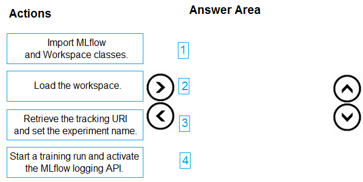

  
Show Suggested Answer

  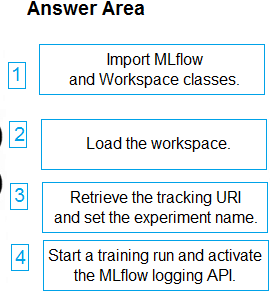

---

## Question 310 | [Link](https://www.examtopics.com/discussions/microsoft/view/111310-exam-dp-100-topic-3-question-130-discussion/){:target="_blank"}

HOTSPOT

-

You are implementing hyperparameter tuning for a model training from a notebook. The notebook is in an Azure Machine Learning workspace. You add code that imports all relevant Python libraries.

You must configure Bayesian sampling over the search space for the num_hidden_layers and batch_size hyperparameters.

You need to complete the following Python code to configure Bayesian sampling.

Which code segments should you use? To answer, select the appropriate options in the answer area.

NOTE: Each correct selection is worth one point.

  
Show Suggested Answer

  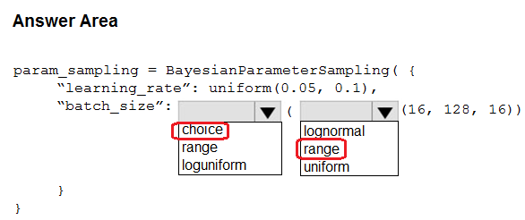

---

## Question 311 | [Link](https://www.examtopics.com/discussions/microsoft/view/103613-exam-dp-100-topic-3-question-131-discussion/){:target="_blank"}

You create a training pipeline by using the Azure Machine Learning designer.

You need to load data into a machine learning pipeline by using the Import Data component.

Which two data sources could you use? Each correct answer presents a complete solution.

NOTE: Each correct selection is worth one point.

* A.Azure SQL Database
* B.Registered dataset
* C.URL via HTTP
* D.Azure Blob storage container through a registered datastore
* E.Azure Data Lake Storage Gen2

  
Show Suggested Answer

  CD

---

## Question 312 | [Link](https://www.examtopics.com/discussions/microsoft/view/103612-exam-dp-100-topic-3-question-132-discussion/){:target="_blank"}

HOTSPOT

-

You create an Azure Machine Learning dataset containing automobile price data. The dataset includes 10,000 rows and 10 columns. You use the Azure Machine Learning designer to transform the dataset by using an Execute Python Script component and custom code.

The code must combine three columns to create a new column.

You need to configure the code function.

Which configurations should you use? To answer, select the appropriate options in the answer area.

NOTE: Each correct selection is worth one point.

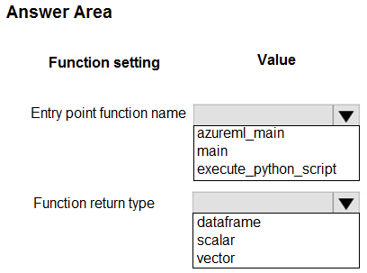

  
Show Suggested Answer

  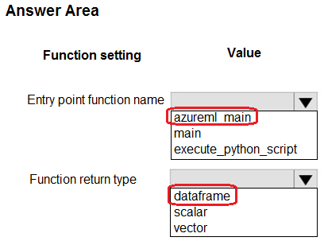

---

## Question 313 | [Link](https://www.examtopics.com/discussions/microsoft/view/109179-exam-dp-100-topic-3-question-133-discussion/){:target="_blank"}

HOTSPOT -

You create an Azure Machine Learning workspace and a dataset. The dataset includes age values for a large group of diabetes patients. You use the dp_mean function from the SmartNoise library to calculate the mean of the age value. You store the value in a variable named age_mean.

You must output the value of the interval rage of released mean values that will be returned 95 percent of the time.

You need to complete the code.

Which code values should you use? To answer, select the appropriate options in the answer area.

NOTE: Each correct selection is worth one point.

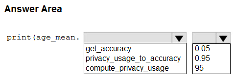

  
Show Suggested Answer

  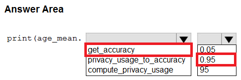

---

## Question 314 | [Link](https://www.examtopics.com/discussions/microsoft/view/103611-exam-dp-100-topic-3-question-134-discussion/){:target="_blank"}

HOTSPOT

-

You have machine learning models that produce unfair predictions across sensitive features.

You must use a post-processing technique to apply a constraint to the models to mitigate their unfairness.

You need to select a post-processing technique and model type.

What should you use? To answer, select the appropriate options in the answer area.

NOTE: Each correct selection is worth one point.

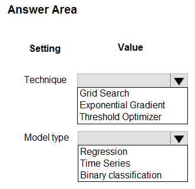

  
Show Suggested Answer

  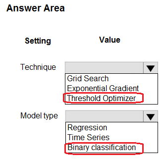

---

## Question 315 | [Link](https://www.examtopics.com/discussions/microsoft/view/111308-exam-dp-100-topic-3-question-135-discussion/){:target="_blank"}

HOTSPOT

-

You have an Azure Machine Learning workspace.

You plan to use the Azure Machine Learning SDK for Python v1 to submit a job to run a training script.

You need to complete the script to ensure that it will execute the training script.

How should you complete the script? To answer, select the appropriate options in the answer area.

NOTE: Each correct selection is worth one point.

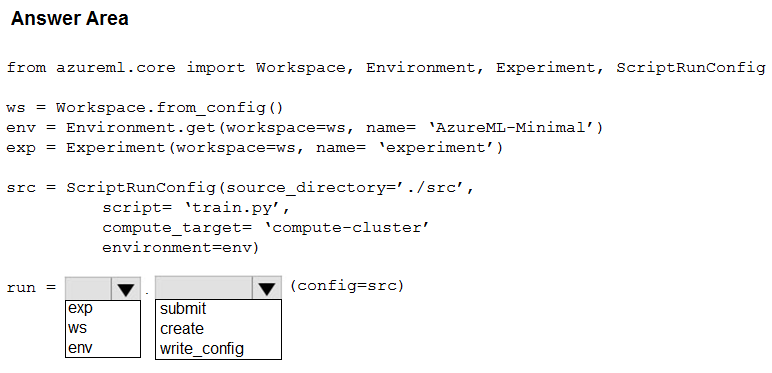

  
Show Suggested Answer

  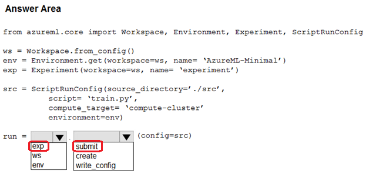

---

## Question 316 | [Link](https://www.examtopics.com/discussions/microsoft/view/106560-exam-dp-100-topic-3-question-136-discussion/){:target="_blank"}

HOTSPOT -

You load data from a notebook in an Azure Machine Learning workspace into a pandas dataframe. The data contains 10,000 records. Each record consists of 10 columns.

You must identify the number of missing values in each of the columns.

You need to complete the Python code that will return the number of missing values in each of the columns.

Which code segments should you use? To answer, select the appropriate options in the answer area.

NOTE: Each correct selection is worth one point.

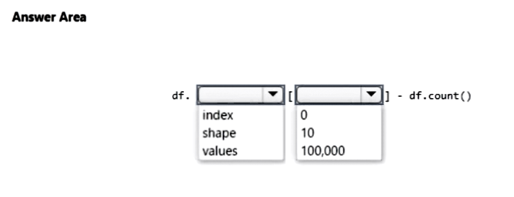

  
Show Suggested Answer

  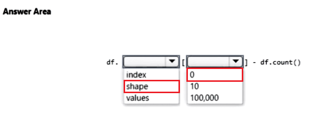

---

## Question 317 | [Link](https://www.examtopics.com/discussions/microsoft/view/111307-exam-dp-100-topic-3-question-137-discussion/){:target="_blank"}

You register a model in an Azure Machine Learning workspace by running the following code:

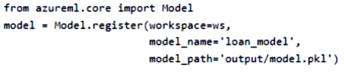

You are creating a scoring script to use in a real-time service for the model.

You need to write code in the scoring script to set the path of the registered model so that it can be loaded by the service. You include the necessary import statements.

Which code segment should you use?

* A.path = Model.get_model_path(‘loan_model’)
* B.path = ‘model.pkl’
* C.path = ws.models(‘loan_model’)
* D.path = ‘outputs/model.pkl’

  
Show Suggested Answer

  A

---

## Question 318 | [Link](https://www.examtopics.com/discussions/microsoft/view/110992-exam-dp-100-topic-3-question-138-discussion/){:target="_blank"}

You are using a ScriptRunConfig object to configure an experiment that uses a script to train a machine learning model.

The script must apply a regularization rate hyperparameter to the algorithm that is used to train the model.

You need to pass the regularization rate in a variable named reg_rate to the script.

Which code segment should you use?

* A.
* B.
* C.
* D.

  
Show Suggested Answer

  B

---

## Question 319 | [Link](https://www.examtopics.com/discussions/microsoft/view/109812-exam-dp-100-topic-3-question-139-discussion/){:target="_blank"}

You are using Azure Machine Learning to monitor a trained and deployed model. You implement Event Grid to respond to Azure Machine Learning events.

Model performance has degraded due to model input data changes.

You need to trigger a remediation ML pipeline based on an Azure Machine Learning event.

Which event should you use?

* A.RunStatusChanged
* B.RunCompleted
* C.DatasetDriftDetected
* D.ModelDeployed

  
Show Suggested Answer

  C

---

## Question 320 | [Link](https://www.examtopics.com/discussions/microsoft/view/110994-exam-dp-100-topic-3-question-140-discussion/){:target="_blank"}

HOTSPOT

-

You create an Azure Machine Learning workspace. You train a classification model by using automated machine learning (automated ML) in Azure Machine Learning studio. The training data contains multiple classes that have significantly different numbers of samples.

You must use a metric type to avoid labeling negative samples as positive and an averaging method that will minimize the class imbalance.

You need to configure the metric type and the averaging method.

Which configurations should you use? To answer, select the appropriate options in the answer area.

NOTE: Each correct selection is worth one point.

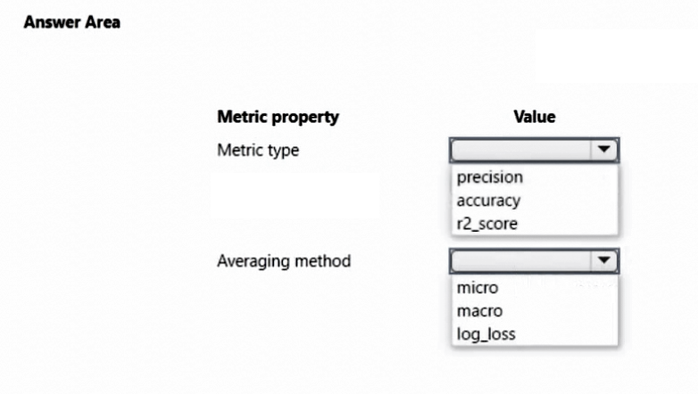

  
Show Suggested Answer

  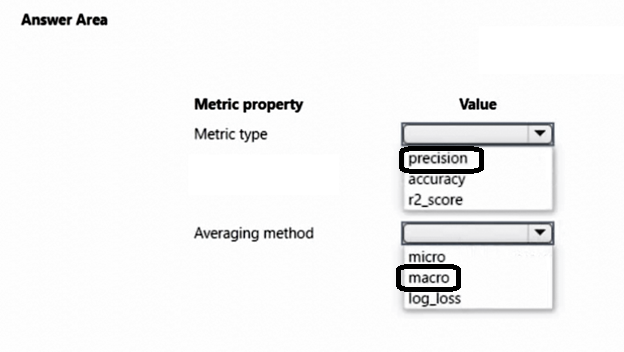

---

## Question 321 | [Link](https://www.examtopics.com/discussions/microsoft/view/113377-exam-dp-100-topic-3-question-141-discussion/){:target="_blank"}

HOTSPOT

-

You use Azure Machine Learning and SmartNoise Python libraries to implement a differential privacy solution to protect a dataset containing citizen demographics for the city of Seattle in the United States.

The solution has the following requirements:

•	Allow for multiple queries targeting the mean and variance of the citizen’s age.

•	Ensure full plausible deniability.

You need to define the query rate limit to minimize the risk of re-identification.

What should you configure? To answer, select the appropriate options in the answer area.

NOTE: Each correct selection is worth one point.

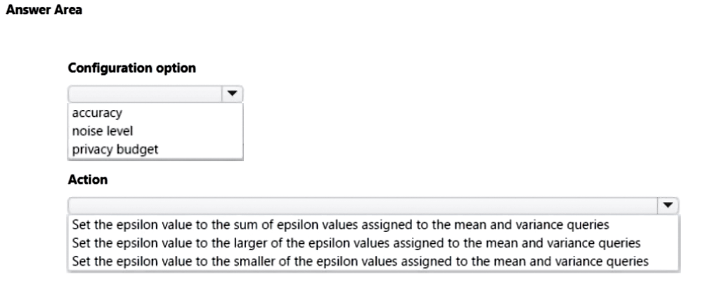

  
Show Suggested Answer

  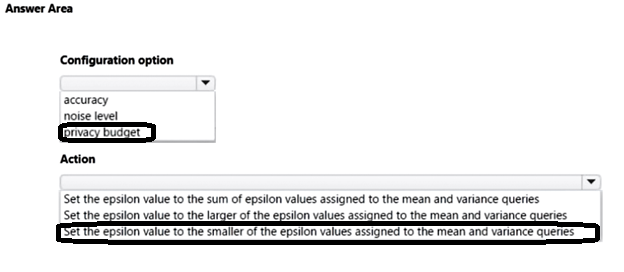

---

## Question 322 | [Link](https://www.examtopics.com/discussions/microsoft/view/106669-exam-dp-100-topic-3-question-142-discussion/){:target="_blank"}

You are implementing hyperparameter tuning for a model training from a notebook. The notebook is in an Azure Machine Learning workspace.

You must configure a grid sampling method over the search space for the num_hidden_layers and batch_size hyperparameters.

You need to identify the hyperparameters for the grid sampling.

Which hyperparameter sampling approach should you use?

* A.uniform
* B.qlognormal
* C.choice
* D.normal

  
Show Suggested Answer

  C

---

## Question 323 | [Link](https://www.examtopics.com/discussions/microsoft/view/107703-exam-dp-100-topic-3-question-143-discussion/){:target="_blank"}

You create an Azure Machine Learning workspace. You are implementing hyperparameter tuning for a model training from a notebook.

You must configure a Bandit termination policy that provides the following outcome:

If the value of the primary metric of AUC is 0.8 at the point of evaluation intervals, any run with the primary metric value below 0.66 will be terminated.

You need to identify which Bandit termination policy configuration to use.

What should you identify?

* A.Set slack_amount to 0.2.
* B.Set slack_factor to 0.1.
* C.Set slack_factor to 0.2.
* D.Set slack_amount to 0.1.

  
Show Suggested Answer

  C

---

## Question 324 | [Link](https://www.examtopics.com/discussions/microsoft/view/117484-exam-dp-100-topic-3-question-144-discussion/){:target="_blank"}

HOTSPOT

-

You are using the Azure Machine Learning designer to transform a dataset by using an Execute Python Script component and custom code.

You need to define the method signature for the Execute Python Script component and return value type.

What should you define? To answer, select the appropriate options in the answer area.

NOTE: Each correct selection is worth one point.

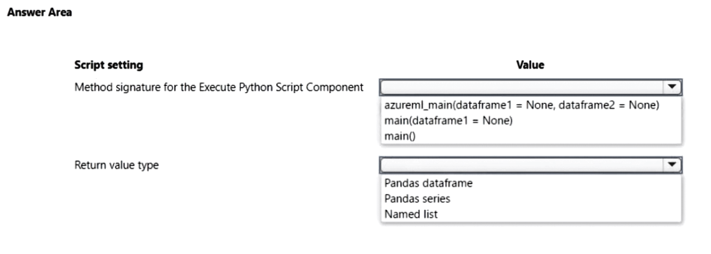

  
Show Suggested Answer

  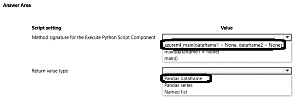

---

## Question 325 | [Link](https://www.examtopics.com/discussions/microsoft/view/109170-exam-dp-100-topic-3-question-145-discussion/){:target="_blank"}

You need to evaluate the potential risk of exposing personal information based on the values of epsilon and delta for differential privacy. You create a privacy report.

What does an epsilon value greater than one represent?

* A.The privacy of data is preserved and there is limited impact on data accuracy.
* B.There is a high risk of exposing the actual data that is uses to generate the report.
* C.The data used in the report is very noisy.

  
Show Suggested Answer

  B

---

## Question 326 | [Link](https://www.examtopics.com/discussions/microsoft/view/115189-exam-dp-100-topic-3-question-146-discussion/){:target="_blank"}

HOTSPOT

-

You manage an Azure Machine Learning workspace named workspace1 by using the Python SDK v2.

The default datastore of workspace1 contains a folder named sample_data. The folder structure contains the following content:

|— sample_data

|— MLTable

|— file1.txt

|— file2.txt

|— file3.txt

You write Python SDK v2 code to materialize the data from the files in the sample_data folder into a Pandas data frame.

You need to complete the Python SDK v2 code to use the MLTable folder as the materialization blueprint.

How should you complete the code? To answer, select the appropriate options in the answer area.

NOTE: Each correct selection is worth one point.

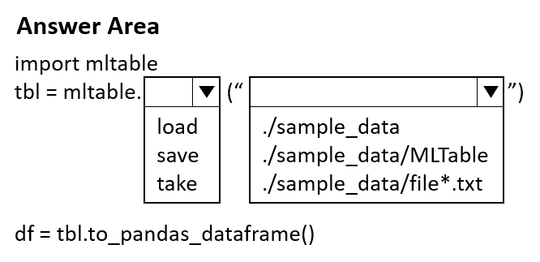

  
Show Suggested Answer

  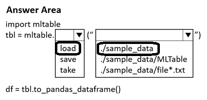

---

## Question 327 | [Link](https://www.examtopics.com/discussions/microsoft/view/116504-exam-dp-100-topic-3-question-147-discussion/){:target="_blank"}

DRAG DROP

-

You have an Azure Machine Learning workspace. You are running an experiment on your local computer.

You need to ensure that you can use MLflow Tracking with Azure Machine Learning Python SDK v2 to store metrics and artifacts from your local experiment runs m the workspace.

In which order should you perform the actions? To answer, move all actions from the list of actions to the answer area and arrange them in the correct order.

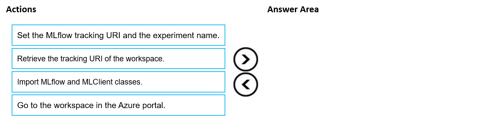

  
Show Suggested Answer

  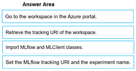

---

## Question 328 | [Link](https://www.examtopics.com/discussions/microsoft/view/116507-exam-dp-100-topic-3-question-148-discussion/){:target="_blank"}

You create a workspace by using Azure Machine Learning Studio.

You must run a Python SDK v2 notebook in the workspace by using Azure Machine Learning Studio. You must preserve the current values of variables set in the notebook for the current instance.

You need to maintain the state of the notebook.

What should you do?

* A.Change the compute.
* B.Change the current kernel.
* C.Stop the compute.
* D.Stop the current kernel.

  
Show Suggested Answer

  D

---

## Question 329 | [Link](https://www.examtopics.com/discussions/microsoft/view/117494-exam-dp-100-topic-3-question-149-discussion/){:target="_blank"}

HOTSPOT

-

You are using the Azure Machine Learning designer to transform a dataset containing the census data of all nations.

You must use the Split Data component to separate the dataset into two datasets. The first dataset must contain the census data of the United States. The second dataset must include the census data of the remaining nations.

You need to configure the component to create the datasets.

Which configuration values should you use? To answer, select the appropriate options in the answer area.

NOTE: Each correct selection is worth one point.

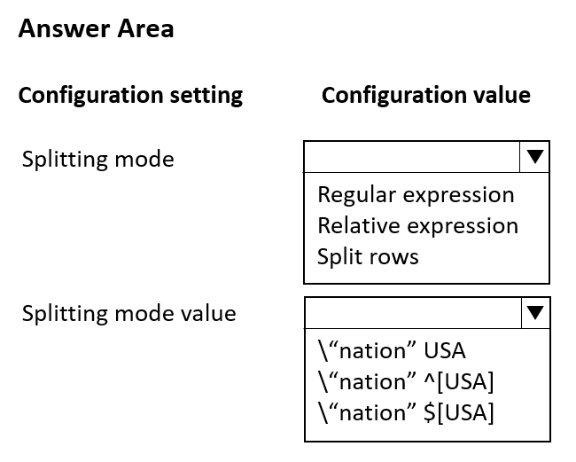

  
Show Suggested Answer

  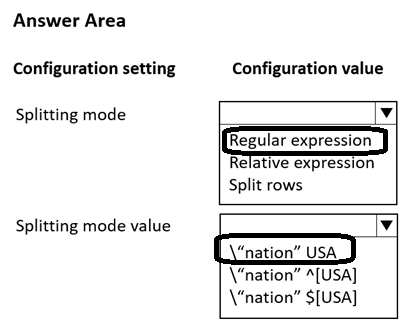

---

## Question 330 | [Link](https://www.examtopics.com/discussions/microsoft/view/117051-exam-dp-100-topic-3-question-150-discussion/){:target="_blank"}

You create an Azure Machine Learning workspace named workspaces. You create a Python SDK v2 notebook to perform custom model training in workspaces.

You need to run the notebook from Azure Machine Learning Studio in workspaces.

What should you provision first?

* A.default storage account
* B.real-time endpoint
* C.Azure Machine Learning compute cluster
* D.Azure Machine Learning compute instance

  
Show Suggested Answer

  D

---

## Question 331 | [Link](https://www.examtopics.com/discussions/microsoft/view/118318-exam-dp-100-topic-3-question-151-discussion/){:target="_blank"}

HOTSPOT

-

You create an Azure Machine Learning workspace.

You must use the Python SDK v2 to implement an experiment from a Jupyter notebook in the workspace. The experiment must log a table in the following format:

table = {

"col1" : [1, 2, 3],

"col2" : [4, 5, 6]

)

You need to complete the Python code to log the table.

How should you complete the code? To answer, select the appropriate options in the answer area.

NOTE: Each correct selection is worth one point.

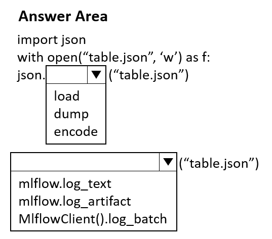

  
Show Suggested Answer

  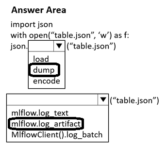

---

## Question 332 | [Link](https://www.examtopics.com/discussions/microsoft/view/117495-exam-dp-100-topic-3-question-152-discussion/){:target="_blank"}

You plan to run a script as an experiment. The script uses modules from the SciPy library and several Python packages that are not typically installed in a default conda environment.

You plan to run the experiment on your local workstation for small datasets and scale out the experiment by running it on more powerful remote compute dusters for larger datasets.

You need to ensure that the experiment runs successfully on local and remote compute with the least administrative effort.

What should you do?

* A.Leave the environment unspecified for the experiment. Run the expenment by using the default environment.
* B.Create a config.yaml file that defines the required conda packages and save the file in the experiment folder.
* C.Create and register an environment that includes the required packages. Use this environment for all experiment jobs.
* D.Create a virtual machine (VM) by using the required Python configuration and attach the VM as a compute target. Use this compute target for all experiment runs.

  
Show Suggested Answer

  C

---

## Question 333 | [Link](https://www.examtopics.com/discussions/microsoft/view/112416-exam-dp-100-topic-3-question-153-discussion/){:target="_blank"}

You have an Azure Machine Learning workspace. You build a deep learning model.

You need to publish a GPU-enabled model as a web service.

Which two compute targets can you use? Each correct answer presents a complete solution.

NOTE: Each correct selection is worth one point.

* A.Azure Kubernetes Service (AKS)
* B.Azure Container Instances (ACI)
* C.Local web service
* D.Azure Machine Learning compute clusters

  
Show Suggested Answer

  AB

---

## Question 334 | [Link](https://www.examtopics.com/discussions/microsoft/view/117496-exam-dp-100-topic-3-question-154-discussion/){:target="_blank"}

You create an Azure Machine Learning workspace named workspace1. The workspace contains a Python SDK v2 notebook that uses MLflow to collect model training metrics and artifacts from your local computer.

You must reuse the notebook to run on Azure Machine Learning compute instance in workspace1.

You need to continue to log metrics and artifacts from your data science code.

What should you do?

* A.Instantiate the job class.
* B.Instantiate the MLCIient class.
* C.Log in to workspace1.
* D.Configure the tracking URL.

  
Show Suggested Answer

  D

---

## Question 335 | [Link](https://www.examtopics.com/discussions/microsoft/view/114204-exam-dp-100-topic-3-question-155-discussion/){:target="_blank"}

You use Azure Machine Learning to train a model.

You must use Bayesian sampling to tune hyperparameters.

You need to select a learning_rate parameter distribution.

Which two distributions can you use? Each correct answer presents a complete solution.

NOTE: Each correct selection is worth one point.

* A.Uniform
* B.Choice
* C.QNormal
* D.Normal
* E.LogUniform

  
Show Suggested Answer

  AB

---

## Question 336 | [Link](https://www.examtopics.com/discussions/microsoft/view/113384-exam-dp-100-topic-3-question-156-discussion/){:target="_blank"}

DRAG DROP

-

You manage an Azure Machine Learning workspace named workspace1 and a Data Science Virtual Machine (DSVM) named DSMV1.

You must run an experiment on DSMV1 by using a Jupyter notebook and Python SDK v2 code. You must store metrics and artifacts in workspace1. You start by creating Python SDK v2 code to import all required packages.

You need to implement the Python SDK v2 code to store metrics and artifacts in workspace1.

Which three actions should you perform in sequence? To answer, move the appropriate actions from the list of actions to the answer area and arrange them in the correct order.

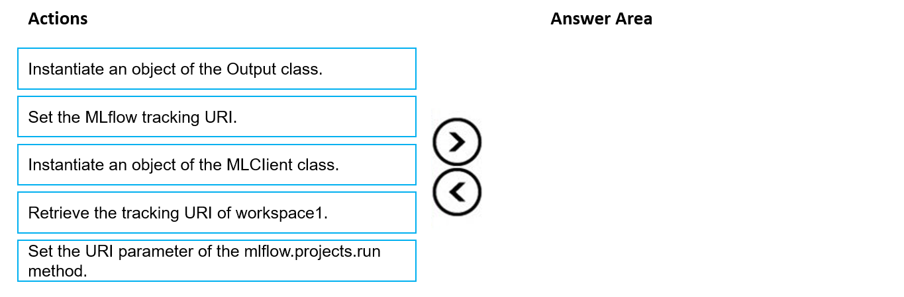

  
Show Suggested Answer

  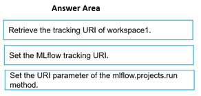

---

## Question 337 | [Link](https://www.examtopics.com/discussions/microsoft/view/114206-exam-dp-100-topic-3-question-157-discussion/){:target="_blank"}

You create an Azure Machine learning workspace.

You must use the Azure Machine Learning Python SDK v2 to define the search space for discrete hyperparameters. The hyperparameters must consist of a list of predetermined, comma-separated integer values.

You need to import the class from the azure.ai.ml.sweep package used to create the list of values.

Which class should you import?

* A.Choice
* B.Randint
* C.Uniform
* D.Normal

  
Show Suggested Answer

  A

---

## Question 338 | [Link](https://www.examtopics.com/discussions/microsoft/view/114210-exam-dp-100-topic-3-question-158-discussion/){:target="_blank"}

HOTSPOT

-

You manage an Azure Machine Learning workspace named workspace1 by using the Python SDK v2. You create a General Purpose v2 Azure storage account named mlstorage1. The storage account includes a publicly accessible container named mlcontainer1.

The container stores 10 blobs with files in the CSV format.

You must develop Python SDK v2 code to create a data asset referencing all blobs in the container named mlcontainer1.

You need to complete the Python SDK v2 code.

How should you complete the code? To answer, select the appropriate options in the answer area.

NOTE: Each correct selection is worth one point.

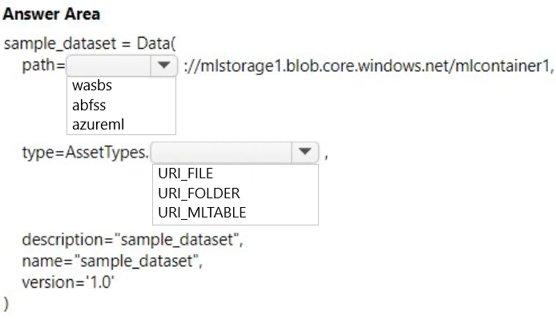

  
Show Suggested Answer

  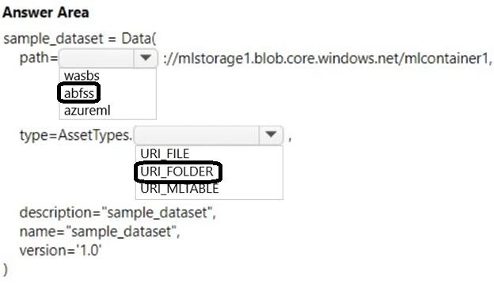

---

## Question 339 | [Link](https://www.examtopics.com/discussions/microsoft/view/114212-exam-dp-100-topic-3-question-159-discussion/){:target="_blank"}

HOTSPOT

-

You monitor an Azure Machine Learning classification training experiment named train.classification on Azure Notebooks.

You must store a table named table as an artifact in Azure Machine Learning Studio during model training.

You need to collect and list the metrics by using MLflow.

How should you complete the code segment? To answer, select the appropriate option in the answer area.

NOTE: Each correct selection is worth one point.

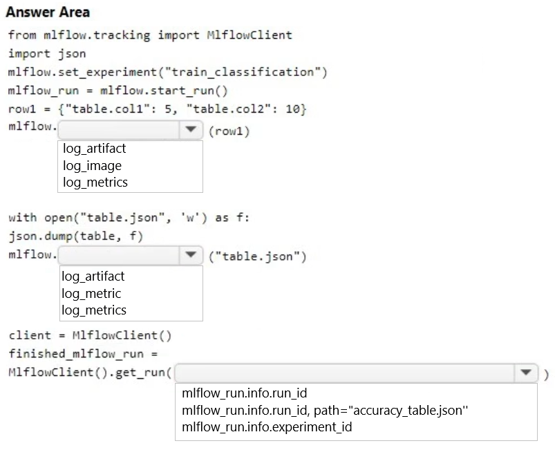

  
Show Suggested Answer

  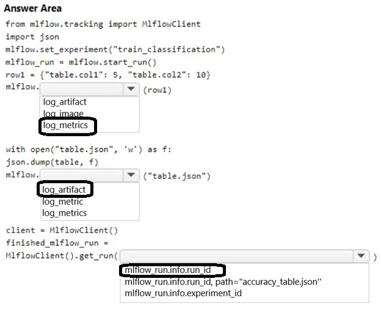

---

## Question 340 | [Link](https://www.examtopics.com/discussions/microsoft/view/114214-exam-dp-100-topic-3-question-160-discussion/){:target="_blank"}

You have a dataset that contains records of patients tested for diabetes. The dataset includes the patient's age.

You plan to create an analysis that will report the mean age value from the differentially private data derived from the dataset.

You need to identify the epsilon value to use in the analysis that minimizes the risk of exposing the actual data.

Which epsilon value should you use?

* A.-1.5
* B.-0.5
* C.0.5
* D.1.5

  
Show Suggested Answer

  C

---

## Question 341 | [Link](https://www.examtopics.com/discussions/microsoft/view/117555-exam-dp-100-topic-3-question-161-discussion/){:target="_blank"}

HOTSPOT -

You manage an Azure Machine Learning workspace. You configure an automated machine learning regression training job by using the Azure Machine Learning Python SDK v2.

You configure the regression job by using the following script:

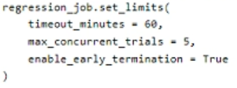

For each of the following statements, select Yes if the statement is true. Otherwise, select No.

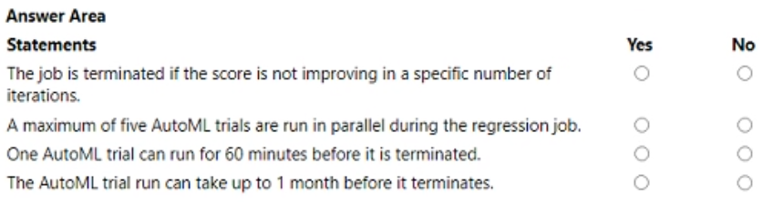

  
Show Suggested Answer

  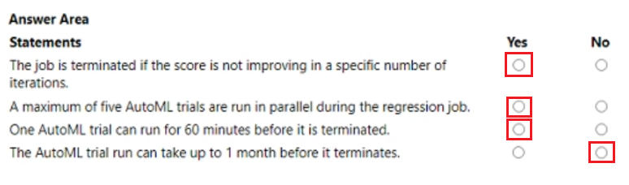

---

## Question 342 | [Link](https://www.examtopics.com/discussions/microsoft/view/114215-exam-dp-100-topic-3-question-162-discussion/){:target="_blank"}

DRAG DROP

-

You manage an Azure Machine Learning workspace. You train a model named model1.

You must identify the features to modify for a differing model prediction result.

You need to configure the Responsible AI (RAI) dashboard for model1.

Which three actions should you perform in sequence? To answer, move the appropriate actions from the list of actions to the answer area and arrange them in the correct order.

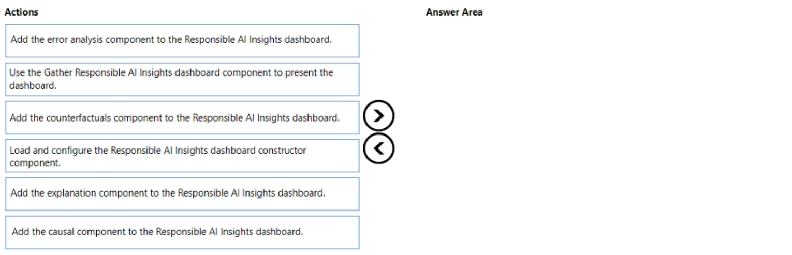

  
Show Suggested Answer

  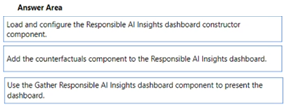

---

## Question 343 | [Link](https://www.examtopics.com/discussions/microsoft/view/113387-exam-dp-100-topic-3-question-163-discussion/){:target="_blank"}

HOTSPOT -

You are using hyperparameter tuning in Azure Machine Learning Python SDK v2 to train a model.

You configure the hyperparameter tuning experiment by running the following code:

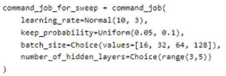

For each of the following statements, select Yes if the statement is true. Otherwise, select No.

NOTE: Each correct selection is worth one point.

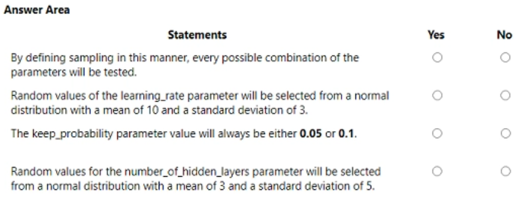

  
Show Suggested Answer

  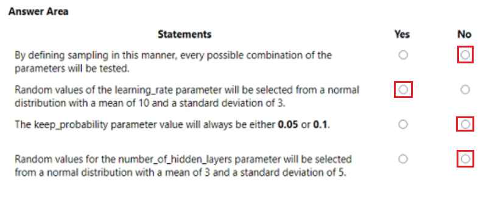

---

## Question 344 | [Link](https://www.examtopics.com/discussions/microsoft/view/114216-exam-dp-100-topic-3-question-164-discussion/){:target="_blank"}

HOTSPOT

-

You use Azure Machine Learning to train a machine learning model.

You use the following training script in Python to perform logging:

import mlflow

mlflow.log_metric(“accuracy", float(vel_accuracy))

You must use a Python script to define a sweep job.

You need to provide the primary metric and goal you want hyperparameter tuning to optimize.

How should you complete the Python script? To answer, select the appropriate options in the answer area.

NOTE: Each correct selection is worth one point.

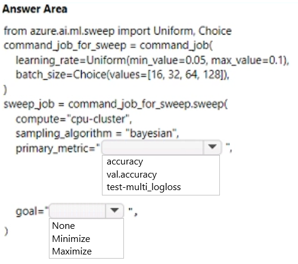

  
Show Suggested Answer

  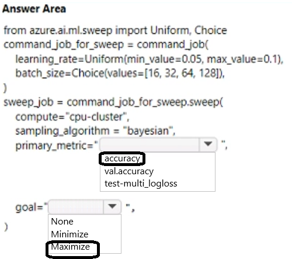

---

## Question 345 | [Link](https://www.examtopics.com/discussions/microsoft/view/114217-exam-dp-100-topic-3-question-165-discussion/){:target="_blank"}

You create a workspace by using Azure Machine Learning Studio.

You must run a Python SDK v2 notebook in the workspace by using Azure Machine Learning Studio.

You need to reset the state of the notebook.

Which three actions should you use? Each correct answer presents a complete solution.

NOTE: Each correct selection is worth one point.

* A.Stop the current kernel.
* B.Change the compute.
* C.Reset the compute.
* D.Navigate to another section of the workspace.
* E.Change the current kernel.

  
Show Suggested Answer

  BCE

---

## Question 346 | [Link](https://www.examtopics.com/discussions/microsoft/view/116530-exam-dp-100-topic-3-question-166-discussion/){:target="_blank"}

You manage an Azure Machine Learning workspace.

You must log multiple metrics by using MLflow.

You need to maximize logging performance.

What are two possible ways to achieve this goal? Each correct answer presents a complete solution.

NOTE: Each correct selection is worth one point.

* A.MLflowClient.log_batch
* B.mlflow.log_metrics
* C.mlflow.log_metric
* D.mlflow.log_param

  
Show Suggested Answer

  AB

---

## Question 347 | [Link](https://www.examtopics.com/discussions/microsoft/view/124121-exam-dp-100-topic-3-question-167-discussion/){:target="_blank"}

HOTSPOT

-

You create multiple machine learning models by using automated machine learning.

You need to configure a primary metric for each use case.

Which metrics should you configure? To answer, select the appropriate options in the answer area.

NOTE: Each correct selection is worth one point.

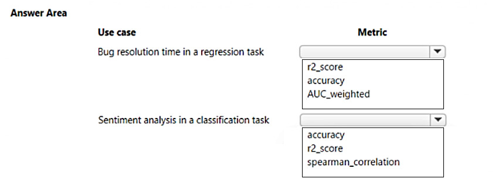

  
Show Suggested Answer

  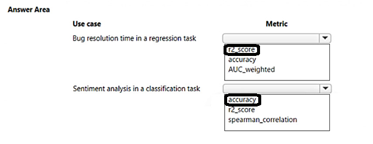

---

## Question 348 | [Link](https://www.examtopics.com/discussions/microsoft/view/117528-exam-dp-100-topic-3-question-168-discussion/){:target="_blank"}

HOTSPOT

-

You are running a training experiment on remote compute in Azure Machine Learning (ML) by using Azure ML SDK v2 for Python.

The experiment is configured to use a conda environment that includes all required packages.

You must track metrics generated in the experiment.

You need to complete the script for the experiment.

How should you complete the code? To answer, select the appropriate options in the answer area.

NOTE: Each correct selection is worth one point.

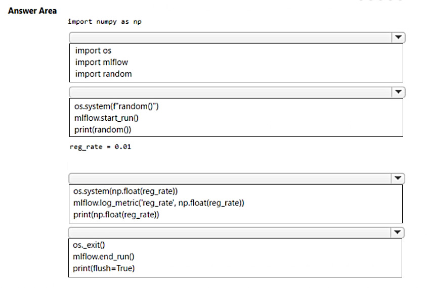

  
Show Suggested Answer

  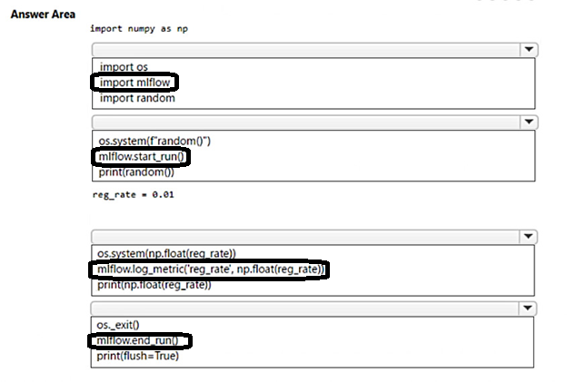

---

## Question 349 | [Link](https://www.examtopics.com/discussions/microsoft/view/116531-exam-dp-100-topic-3-question-169-discussion/){:target="_blank"}

HOTSPOT

-

You perform hyperparameter tuning with Azure Machine Learning.

You create the following Python code:

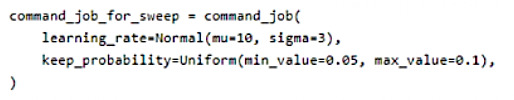

For each of the following statements, select Yes if the statement is true. Otherwise, select No.

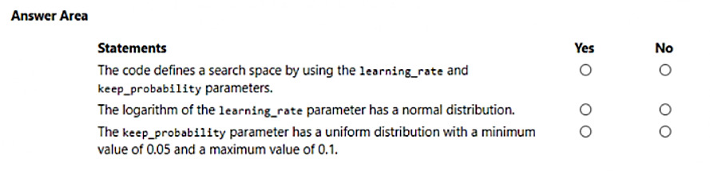

  
Show Suggested Answer

  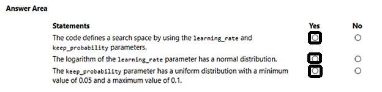

---

## Question 350 | [Link](https://www.examtopics.com/discussions/microsoft/view/117529-exam-dp-100-topic-3-question-170-discussion/){:target="_blank"}

HOTSPOT

-

You download a .csv file from a notebook in an Azure Machine Learning workspace to a data/sample.csv folder on a compute instance. The file contains 10,000 records.

You must generate the summary statistics for the data in the file. The statistics must include the following for each numerical column:

•	number of non-empty values

•	average value

•	standard deviation

•	minimum and maximum values

•	25th, 50th, and 75th percentiles

You need to complete the Python code that will generate the summary statistics.

Which code segments should you use? To answer, select the appropriate options in the answer area.

NOTE: Each correct selection is worth one point.

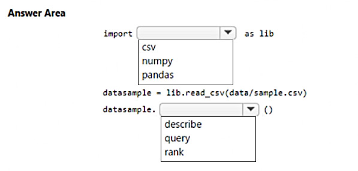

  
Show Suggested Answer

  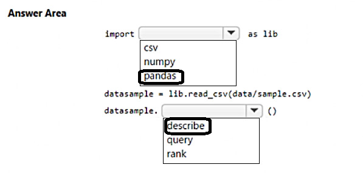

---

## Question 351 | [Link](https://www.examtopics.com/discussions/microsoft/view/305355-exam-dp-100-topic-3-question-171-discussion/){:target="_blank"}

DRAG DROP

-

You are designing an Azure Machine Learning solution by using the Python SDK v2.

You must train and deploy the solution by using a compute target. The compute target must meet the following requirements:

•	Enable the use of on-premises compute resources.

•	Support autoscaling.

You need to configure a compute target for training and inference.

Which compute targets should you configure?

To answer, select the appropriate options in the answer area.

NOTE: Each correct selection is worth one point.

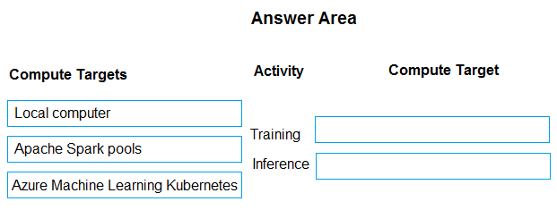

  
Show Suggested Answer

  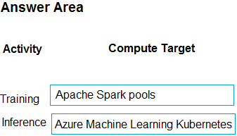

---

## Question 352 | [Link](https://www.examtopics.com/discussions/microsoft/view/134183-exam-dp-100-topic-3-question-172-discussion/){:target="_blank"}

HOTSPOT

-

You create an Azure Machine Learning workspace.

You are developing a Python SDK v2 noteboot to perform custom model training in the workspace. The notebook code imports all required packages.

You need to complete the Python SDK v2 code to include a training script, environment, and compute information.

How should you complete the code? To answer, select the appropriate options in the answer area.

NOTE: Each correct selection is worth one point.

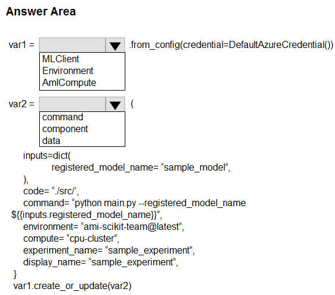

  
Show Suggested Answer

  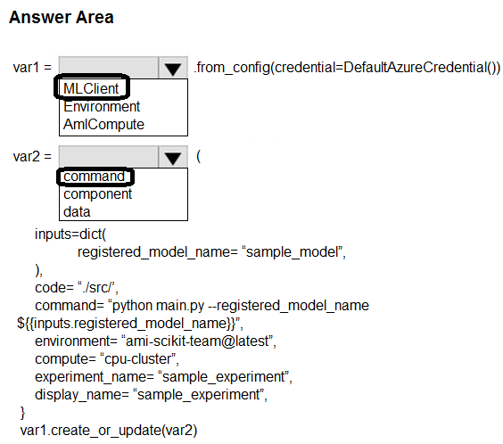

---

## Question 353 | [Link](https://www.examtopics.com/discussions/microsoft/view/135134-exam-dp-100-topic-3-question-173-discussion/){:target="_blank"}

You have an Azure Machine Learning workspace.

You plan to tune a model hyperparameter when you train the model.

You need to define a search space that returns a normally distributed value.

Which parameter should you use?

* A.QUniform
* B.LogUniform
* C.Uniform
* D.LogNormal

  
Show Suggested Answer

  D

---

## Question 354 | [Link](https://www.examtopics.com/discussions/microsoft/view/133561-exam-dp-100-topic-3-question-174-discussion/){:target="_blank"}

You have an Azure Machine Learning workspace named WS1.

You plan to use the Responsible AI dashboard to assess MLflow models that you will register in WS1.

You need to identify the library you should use to register the MLflow models.

Which library should you use?

* A.PyTorch
* B.mlpy
* C.TensorFlow
* D.scikit-learn

  
Show Suggested Answer

  A

---

## Question 355 | [Link](https://www.examtopics.com/discussions/microsoft/view/134854-exam-dp-100-topic-3-question-175-discussion/){:target="_blank"}

You have an Azure Machine Learning workspace.

You plan to use the workspace to set up automated machine learning training for an image classification model.

You need to choose the primary metric to optimize the model training.

Which primary metric should you choose?

* A.r2_score
* B.mean_absolute_error
* C.accuracy
* D.root_mean_squared_log_error

  
Show Suggested Answer

  C

---

## Question 356 | [Link](https://www.examtopics.com/discussions/microsoft/view/150107-exam-dp-100-topic-3-question-177-discussion/){:target="_blank"}

Note: This question is part of a series of questions that present the same scenario. Each question in the series contains a unique solution that might meet the stated goals. Some question sets might have more than one correct solution, while others might not have a correct solution.

After you answer a question in this section, you will NOT be able to return to it. As a result, these questions will not appear in the review screen.

You have an Azure Machine Learning workspace.

You plan to tune model hyperparameters by using a sweep job.

You need to find a sampling method that supports early termination of low-performance jobs and continuous hyperparameters.

Solution: Use the random sampling method over the hyperparameter space.

Does the solution meet the goal?

* A.Yes
* B.No

  
Show Suggested Answer

  A

---

## Question 357 | [Link](https://www.examtopics.com/discussions/microsoft/view/152415-exam-dp-100-topic-3-question-178-discussion/){:target="_blank"}

Note: This question is part of a series of questions that present the same scenario. Each question in the series contains a unique solution that might meet the stated goals. Some question sets might have more than one correct solution, while others might not have a correct solution.

After you answer a question in this section, you will NOT be able to return to it. As a result, these questions will not appear in the review screen.

You have an Azure Machine Learning workspace.

You plan to tune model hyperparameters by using a sweep job.

You need to find a sampling method that supports early termination of low-performance jobs and continuous hyperparameters.

Solution: Use the Bayesian sampling method over the hyperparameter space.

Does the solution meet the goal?

* A.Yes
* B.No

  
Show Suggested Answer

  B

---

## Question 358 | [Link](https://www.examtopics.com/discussions/microsoft/view/142712-exam-dp-100-topic-3-question-179-discussion/){:target="_blank"}

Note: This question is part of a series of questions that present the same scenario. Each question in the series contains a unique solution that might meet the stated goals. Some question sets might have more than one correct solution, while others might not have a correct solution.

After you answer a question in this section, you will NOT be able to return to it. As a result, these questions will not appear in the review screen.

You have an Azure Machine Learning workspace.

You plan to tune model hyperparameters by using a sweep job.

You need to find a sampling method that supports early termination of low-performance jobs and continuous hyperparameters.

Solution: Use the grid sampling method over the hyperparameter space.

Does the solution meet the goal?

* A.Yes
* B.No

  
Show Suggested Answer

  B

---

## Question 359 | [Link](https://www.examtopics.com/discussions/microsoft/view/142976-exam-dp-100-topic-3-question-180-discussion/){:target="_blank"}

You have an Azure Machine Learning workspace.

You plan to use the workspace to set up automated machine learning training for an image classification model.

You need to choose the primary metric to optimize the model training.

Which primary metric should you choose?

* A.r2_score
* B.mean_absolute_error
* C.iou
* D.median_absolute_error

  
Show Suggested Answer

  C

---

## Question 360 | [Link](https://www.examtopics.com/discussions/microsoft/view/142840-exam-dp-100-topic-3-question-181-discussion/){:target="_blank"}

You have an Azure Machine Learning workspace named WS1.

You plan to use Azure Machine Learning SDK v2 to register a model as an asset in WS1 from an artifact generated by an MLflow run. The artifact resides in a named output of a job used for the model training.

You need to identify the syntax of the path to reference the model when you register it.

Which syntax should you use?

* A.t//model/
* B.azureml://registries
* C.mlflow-model/
* D.azureml://jobs/

  
Show Suggested Answer

  D

---

## Question 361 | [Link](https://www.examtopics.com/discussions/microsoft/view/149098-exam-dp-100-topic-3-question-182-discussion/){:target="_blank"}

You manage an Azure Machine Learning workspace.

You experiment with an MLflow model that trains interactively by using a notebook in the workspace.

You need to log dictionary type artifacts of the experiments in Azure Machine Learning by using MLflow.

Which syntax should you use?

* A.mlflow.log_input(my_dict)
* B.mlflow.log_metric("my_metric", my_dict)
* C.mlflow.log_metrics(my_dict)
* D.mlflow.log_text("my_metric", my_dict)

  
Show Suggested Answer

  D

---

## Question 362 | [Link](https://www.examtopics.com/discussions/microsoft/view/150109-exam-dp-100-topic-3-question-183-discussion/){:target="_blank"}

Note: This question is part of a series of questions that present the same scenario. Each question in the series contains a unique solution that might meet the stated goals. Some question sets might have more than one correct solution, while others might not have a correct solution.

After you answer a question in this section, you will NOT be able to return to it. As a result, these questions will not appear in the review screen.

You manage an Azure Machine Learning workspace. The Python script named script.py reads an argument named training_data. The training_data argument specifies the path to the training data in a file named dataset1.csv.

You plan to run the script.py Python script as a command job that trains a machine learning model.

You need to provide the command to pass the path for the dataset as a parameter value when you submit the script as a training job.

Solution: python train.py --training_data training_data

Does the solution meet the goal?

* A.Yes
* B.No

  
Show Suggested Answer

  B

---

## Question 363 | [Link](https://www.examtopics.com/discussions/microsoft/view/150110-exam-dp-100-topic-3-question-184-discussion/){:target="_blank"}

Note: This question is part of a series of questions that present the same scenario. Each question in the series contains a unique solution that might meet the stated goals. Some question sets might have more than one correct solution, while others might not have a correct solution.

After you answer a question in this section, you will NOT be able to return to it. As a result, these questions will not appear in the review screen.

You manage an Azure Machine Learning workspace. The Python script named script.py reads an argument named training_data. The training_data argument specifies the path to the training data in a file named dataset1.csv.

You plan to run the script.py Python script as a command job that trains a machine learning model.

You need to provide the command to pass the path for the dataset as a parameter value when you submit the script as a training job.

Solution: python script.py dataset1.csv

Does the solution meet the goal?

* A.Yes
* B.No

  
Show Suggested Answer

  B

---

## Question 364 | [Link](https://www.examtopics.com/discussions/microsoft/view/152885-exam-dp-100-topic-3-question-185-discussion/){:target="_blank"}

Note: This question is part of a series of questions that present the same scenario. Each question in the series contains a unique solution that might meet the stated goals. Some question sets might have more than one correct solution, while others might not have a correct solution.

After you answer a question in this section, you will NOT be able to return to it. As a result, these questions will not appear in the review screen.

You manage an Azure Machine Learning workspace. The Python script named script.py reads an argument named training_data. The training_data argument specifies the path to the training data in a file named dataset1.csv.

You plan to run the script.py Python script as a command job that trains a machine learning model.

You need to provide the command to pass the path for the dataset as a parameter value when you submit the script as a training job.

Solution: python script.py --training_data ${{inputs.training_data}}

Does the solution meet the goal?

* A.Yes
* B.No

  
Show Suggested Answer

  A

---

## Question 365 | [Link](https://www.examtopics.com/discussions/microsoft/view/150111-exam-dp-100-topic-3-question-186-discussion/){:target="_blank"}

HOTSPOT

-

You manage an Azure Machine Learning workspace.

You plan to train a natural language processing (NLP) model that will assign labels for designated tokens in unstructured text.

You need to configure the NLP task by using automated machine learning.

Which configuration values should you use? To answer, select the appropriate options in the answer area.

NOTE: Each correct selection is worth one point.

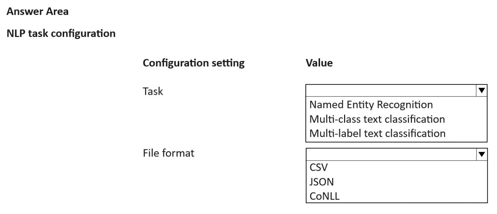

  
Show Suggested Answer

  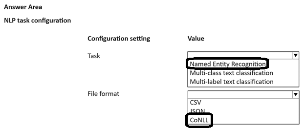

---

## Question 366 | [Link](https://www.examtopics.com/discussions/microsoft/view/150509-exam-dp-100-topic-3-question-187-discussion/){:target="_blank"}

HOTSPOT

-

You manage an Azure Machine Learning workspace. The development environment is configured with a Serverless Spark compute in Azure Machine Learning Notebooks.

You perform interactive data wrangling to clean up the Titanic dataset and store it as a new dataset. (Line numbers are used for reference only.)

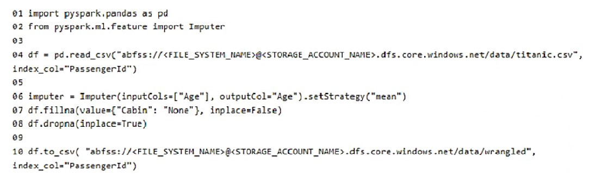

For each of the following statements, select Yes if the statement is true. Otherwise, select No.

NOTE: Each correct selection is worth one point.

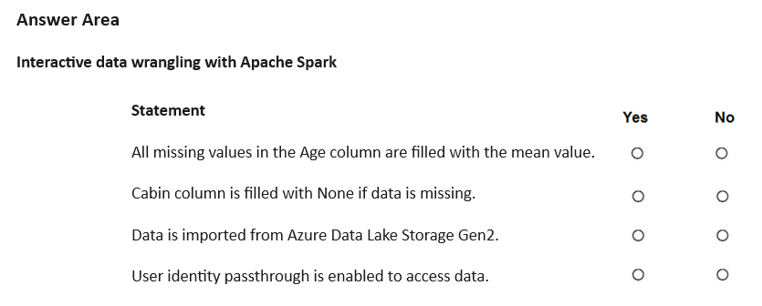

  
Show Suggested Answer

  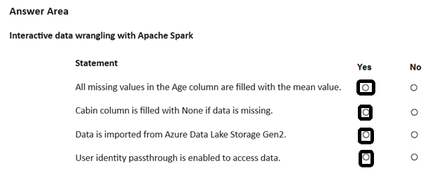

---

## Question 367 | [Link](https://www.examtopics.com/discussions/microsoft/view/149099-exam-dp-100-topic-3-question-190-discussion/){:target="_blank"}

You manage an Azure Machine Learning workspace.

You choose the uri_folder data type as an output of a pipeline component.

You need to define the data access mode that is supported by your configuration.

Which mode should you define?

* A.eval_upload
* B.rw_mount
* C.download
* D.ro_mount

  
Show Suggested Answer

  B

---

## Question 368 | [Link](https://www.examtopics.com/discussions/microsoft/view/150113-exam-dp-100-topic-3-question-191-discussion/){:target="_blank"}

Note: This question is part of a series of questions that present the same scenario. Each question in the series contains a unique solution that might meet the stated goals. Some question sets might have more than one correct solution, while others might not have a correct solution.

After you answer a question in this section, you will NOT be able to return to it. As a result, these questions will not appear in the review screen.

You manage an Azure Machine Learning workspace. The Python script named script.py reads an argument named training_data. The training_data argument specifies the path to the training data in a file named dataset1.csv.

You plan to run the script.py Python script as a command job that trains a machine learning model.

You need to provide the command to pass the path for the dataset as a parameter value when you submit the script as a training job.

Solution: python script.py --training_data dataset1.csv

Does the solution meet the goal?

* A.Yes
* B.No

  
Show Suggested Answer

  A

---

## Question 369 | [Link](https://www.examtopics.com/discussions/microsoft/view/305730-exam-dp-100-topic-3-question-192-discussion/){:target="_blank"}

Note: This question is part of a series of questions that present the same scenario. Each question in the series contains a unique solution that might meet the stated goals. Some question sets might have more than one correct solution, while others might not have a correct solution.

After you answer a question in this section, you will NOT be able to return to it. As a result, these questions will not appear in the review screen.

You have an Azure Machine Learning workspace.

You plan to tune model hyperparameters by using a sweep job.

You need to find a sampling method that supports early termination of low-performance jobs and continuous hyperparameters.

Solution: Use the Sobol sampling method over the hyperparameter space.

Does the solution meet the goal?

* A.Yes
* B.No

  
Show Suggested Answer

  B

---

## Question 370 | [Link](https://www.examtopics.com/discussions/microsoft/view/305370-exam-dp-100-topic-3-question-193-discussion/){:target="_blank"}

You manage an Azure Machine Learning workspace.

You experiment with an MLflow model that trains interactively by using a notebook in the workspace.

You need to log dictionary type artifacts of the experiments in Azure Machine Learning by using MLflow.

Which syntax should you use?

* A.mlflow.log_artifact(my_dict)
* B.mlflow.log_metric("my_metric", my_dict)
* C.mlflow.log_metrics(my_dict)
* D.mlflow.log_artifacts(my_dict)

  
Show Suggested Answer

  A

---

## Question 371 | [Link](https://www.examtopics.com/discussions/microsoft/view/303500-exam-dp-100-topic-3-question-194-discussion/){:target="_blank"}

You manage an Azure Machine Learning Workspace named Workspase1 and an Azure Files share named Share1.

You plan to create an Azure Files datastore in Workspace1 to target Share1.

You need to configure permanent access to Share1 from the Azure Files datastore.

Which authorization method should you use?

* A.Primary access key
* B.Anonymous access
* C.Account SAS key
* D.User delegation SAS key

  
Show Suggested Answer

  C

---

## Question 372 | [Link](https://www.examtopics.com/discussions/microsoft/view/50502-exam-dp-100-topic-4-question-1-discussion/){:target="_blank"}

HOTSPOT -

You are a lead data scientist for a project that tracks the health and migration of birds. You create a multi-image classification deep learning model that uses a set of labeled bird photos collected by experts. You plan to use the model to develop a cross-platform mobile app that predicts the species of bird captured by app users.

You must test and deploy the trained model as a web service. The deployed model must meet the following requirements:

✑ An authenticated connection must not be required for testing.

✑ The deployed model must perform with low latency during inferencing.

✑ The REST endpoints must be scalable and should have a capacity to handle large number of requests when multiple end users are using the mobile application.

You need to verify that the web service returns predictions in the expected JSON format when a valid REST request is submitted.

Which compute resources should you use? To answer, select the appropriate options in the answer area.

NOTE: Each correct selection is worth one point.

Hot Area:

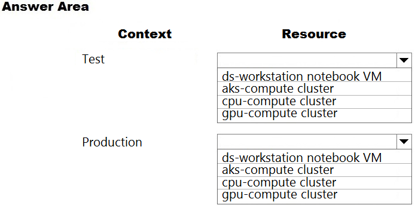

  
Show Suggested Answer

  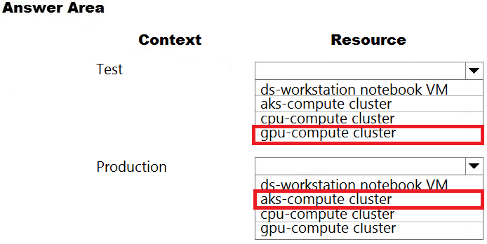

---

## Question 373 | [Link](https://www.examtopics.com/discussions/microsoft/view/48292-exam-dp-100-topic-4-question-2-discussion/){:target="_blank"}

You create a deep learning model for image recognition on Azure Machine Learning service using GPU-based training.

You must deploy the model to a context that allows for real-time GPU-based inferencing.

You need to configure compute resources for model inferencing.

Which compute type should you use?

* A.Azure Container Instance
* B.Azure Kubernetes Service
* C.Field Programmable Gate Array
* D.Machine Learning Compute

  
Show Suggested Answer

  B

---

## Question 374 | [Link](https://www.examtopics.com/discussions/microsoft/view/86095-exam-dp-100-topic-4-question-3-discussion/){:target="_blank"}

You create a batch inference pipeline by using the Azure ML SDK. You run the pipeline by using the following code: from azureml.pipeline.core import Pipeline from azureml.core.experiment import Experiment pipeline = Pipeline(workspace=ws, steps=[parallelrun_step]) pipeline_run = Experiment(ws, 'batch_pipeline').submit(pipeline)

You need to monitor the progress of the pipeline execution.

What are two possible ways to achieve this goal? Each correct answer presents a complete solution.

NOTE: Each correct selection is worth one point.

* A.Run the following code in a notebook:
* B.Use the Inference Clusters tab in Machine Learning Studio.
* C.Use the Activity log in the Azure portal for the Machine Learning workspace.
* D.Run the following code in a notebook:
* E.Run the following code and monitor the console output from the PipelineRun object:

  
Show Suggested Answer

  DE

---

## Question 375 | [Link](https://www.examtopics.com/discussions/microsoft/view/51800-exam-dp-100-topic-4-question-4-discussion/){:target="_blank"}

You train and register a model in your Azure Machine Learning workspace.

You must publish a pipeline that enables client applications to use the model for batch inferencing. You must use a pipeline with a single ParallelRunStep step that runs a Python inferencing script to get predictions from the input data.

You need to create the inferencing script for the ParallelRunStep pipeline step.

Which two functions should you include? Each correct answer presents part of the solution.

NOTE: Each correct selection is worth one point.

* A.run(mini_batch)
* B.main()
* C.batch()
* D.init()
* E.score(mini_batch)

  
Show Suggested Answer

  AD

---

## Question 376 | [Link](https://www.examtopics.com/discussions/microsoft/view/54863-exam-dp-100-topic-4-question-5-discussion/){:target="_blank"}

You deploy a model as an Azure Machine Learning real-time web service using the following code.

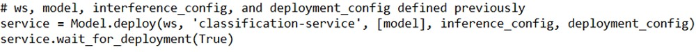

The deployment fails.

You need to troubleshoot the deployment failure by determining the actions that were performed during deployment and identifying the specific action that failed.

Which code segment should you run?

* A.service.get_logs()
* B.service.state
* C.service.serialize()
* D.service.update_deployment_state()

  
Show Suggested Answer

  A

---

## Question 377 | [Link](https://www.examtopics.com/discussions/microsoft/view/54789-exam-dp-100-topic-4-question-6-discussion/){:target="_blank"}

HOTSPOT -

You deploy a model in Azure Container Instance.

You must use the Azure Machine Learning SDK to call the model API.

You need to invoke the deployed model using native SDK classes and methods.

How should you complete the command? To answer, select the appropriate options in the answer areas.

NOTE: Each correct selection is worth one point.

Hot Area:

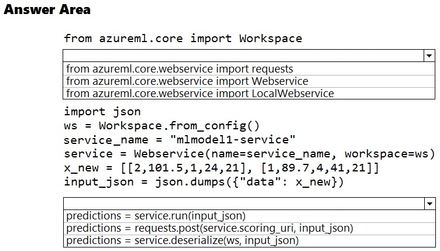

  
Show Suggested Answer

  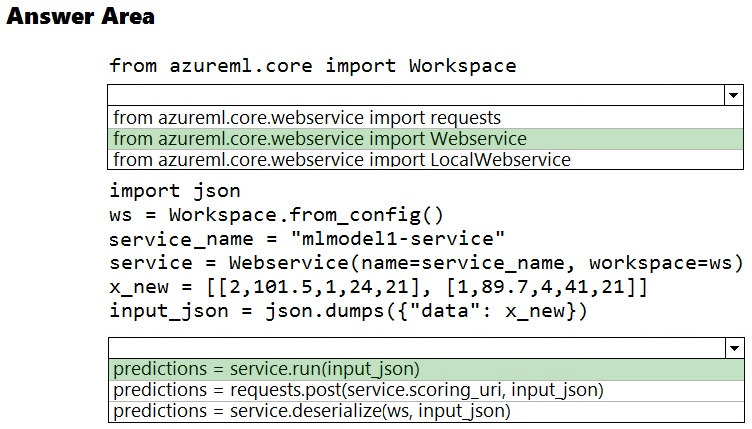

---

## Question 378 | [Link](https://www.examtopics.com/discussions/microsoft/view/47455-exam-dp-100-topic-4-question-7-discussion/){:target="_blank"}

You create a multi-class image classification deep learning model.

You train the model by using PyTorch version 1.2.

You need to ensure that the correct version of PyTorch can be identified for the inferencing environment when the model is deployed.

What should you do?

* A.Save the model locally as a.pt file, and deploy the model as a local web service.
* B.Deploy the model on computer that is configured to use the default Azure Machine Learning conda environment.
* C.Register the model with a .pt file extension and the default version property.
* D.Register the model, specifying the model_framework and model_framework_version properties.

  
Show Suggested Answer

  D

---

## Question 379 | [Link](https://www.examtopics.com/discussions/microsoft/view/50649-exam-dp-100-topic-4-question-8-discussion/){:target="_blank"}

You train a machine learning model.

You must deploy the model as a real-time inference service for testing. The service requires low CPU utilization and less than 48 MB of RAM. The compute target for the deployed service must initialize automatically while minimizing cost and administrative overhead.

Which compute target should you use?

* A.Azure Container Instance (ACI)
* B.attached Azure Databricks cluster
* C.Azure Kubernetes Service (AKS) inference cluster
* D.Azure Machine Learning compute cluster

  
Show Suggested Answer

  A

---

## Question 380 | [Link](https://www.examtopics.com/discussions/microsoft/view/37001-exam-dp-100-topic-4-question-9-discussion/){:target="_blank"}

You register a model that you plan to use in a batch inference pipeline.

The batch inference pipeline must use a ParallelRunStep step to process files in a file dataset. The script has the ParallelRunStep step runs must process six input files each time the inferencing function is called.

You need to configure the pipeline.

Which configuration setting should you specify in the ParallelRunConfig object for the PrallelRunStep step?

* A.process_count_per_node= "6"
* B.node_count= "6"
* C.mini_batch_size= "6"
* D.error_threshold= "6"

  
Show Suggested Answer

  C

---

## Question 381 | [Link](https://www.examtopics.com/discussions/microsoft/view/47169-exam-dp-100-topic-4-question-10-discussion/){:target="_blank"}

You deploy a real-time inference service for a trained model.

The deployed model supports a business-critical application, and it is important to be able to monitor the data submitted to the web service and the predictions the data generates.

You need to implement a monitoring solution for the deployed model using minimal administrative effort.

What should you do?

* A.View the explanations for the registered model in Azure ML studio.
* B.Enable Azure Application Insights for the service endpoint and view logged data in the Azure portal.
* C.View the log files generated by the experiment used to train the model.
* D.Create an ML Flow tracking URI that references the endpoint, and view the data logged by ML Flow.

  
Show Suggested Answer

  B

---

## Question 382 | [Link](https://www.examtopics.com/discussions/microsoft/view/54940-exam-dp-100-topic-4-question-11-discussion/){:target="_blank"}

HOTSPOT -

You use Azure Machine Learning to train and register a model.

You must deploy the model into production as a real-time web service to an inference cluster named service-compute that the IT department has created in the

Azure Machine Learning workspace.

Client applications consuming the deployed web service must be authenticated based on their Azure Active Directory service principal.

You need to write a script that uses the Azure Machine Learning SDK to deploy the model. The necessary modules have been imported.

How should you complete the code? To answer, select the appropriate options in the answer area.

NOTE: Each correct selection is worth one point.

Hot Area:

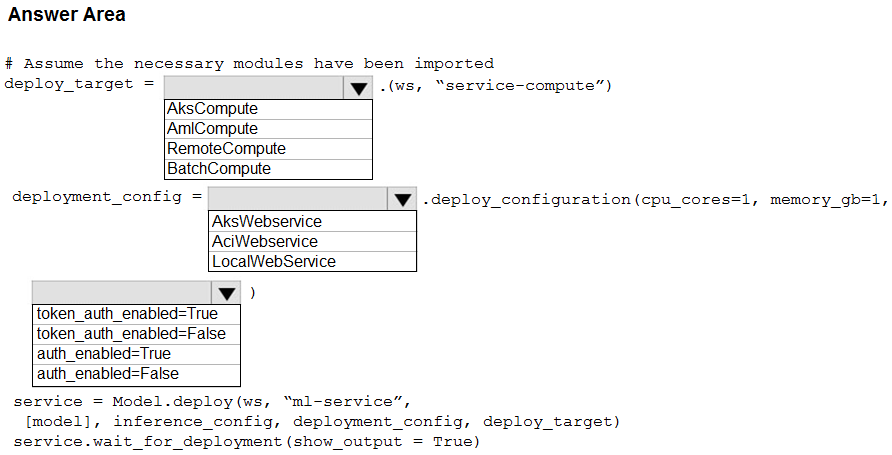

  
Show Suggested Answer

  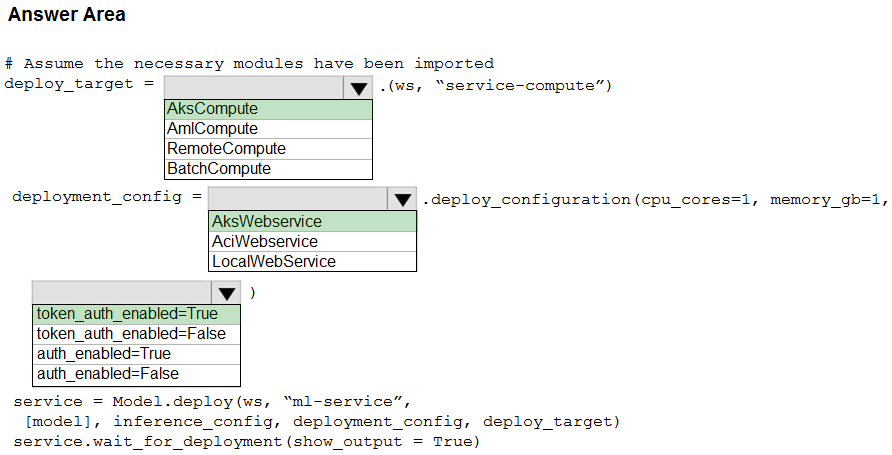

---

## Question 383 | [Link](https://www.examtopics.com/discussions/microsoft/view/55870-exam-dp-100-topic-4-question-12-discussion/){:target="_blank"}

An organization creates and deploys a multi-class image classification deep learning model that uses a set of labeled photographs.

The software engineering team reports there is a heavy inferencing load for the prediction web services during the summer. The production web service for the model fails to meet demand despite having a fully-utilized compute cluster where the web service is deployed.

You need to improve performance of the image classification web service with minimal downtime and minimal administrative effort.

What should you advise the IT Operations team to do?

* A.Create a new compute cluster by using larger VM sizes for the nodes, redeploy the web service to that cluster, and update the DNS registration for the service endpoint to point to the new cluster.
* B.Increase the node count of the compute cluster where the web service is deployed.
* C.Increase the minimum node count of the compute cluster where the web service is deployed.
* D.Increase the VM size of nodes in the compute cluster where the web service is deployed.

  
Show Suggested Answer

  B

---

## Question 384 | [Link](https://www.examtopics.com/discussions/microsoft/view/44452-exam-dp-100-topic-4-question-13-discussion/){:target="_blank"}

You use Azure Machine Learning designer to create a real-time service endpoint. You have a single Azure Machine Learning service compute resource.

You train the model and prepare the real-time pipeline for deployment.

You need to publish the inference pipeline as a web service.

Which compute type should you use?

* A.a new Machine Learning Compute resource
* B.Azure Kubernetes Services
* C.HDInsight
* D.the existing Machine Learning Compute resource
* E.Azure Databricks

  
Show Suggested Answer

  B

---

## Question 385 | [Link](https://www.examtopics.com/discussions/microsoft/view/55874-exam-dp-100-topic-4-question-14-discussion/){:target="_blank"}

Note: This question is part of a series of questions that present the same scenario. Each question in the series contains a unique solution that might meet the stated goals. Some question sets might have more than one correct solution, while others might not have a correct solution.

After you answer a question in this section, you will NOT be able to return to it. As a result, these questions will not appear in the review screen.

You train and register a machine learning model.

You plan to deploy the model as a real-time web service. Applications must use key-based authentication to use the model.

You need to deploy the web service.

Solution:

Create an AciWebservice instance.

Set the value of the ssl_enabled property to True.

Deploy the model to the service.

Does the solution meet the goal?

* A.Yes
* B.No

  
Show Suggested Answer

  B

---

## Question 386 | [Link](https://www.examtopics.com/discussions/microsoft/view/53427-exam-dp-100-topic-4-question-15-discussion/){:target="_blank"}

Note: This question is part of a series of questions that present the same scenario. Each question in the series contains a unique solution that might meet the stated goals. Some question sets might have more than one correct solution, while others might not have a correct solution.

After you answer a question in this section, you will NOT be able to return to it. As a result, these questions will not appear in the review screen.

You train and register a machine learning model.

You plan to deploy the model as a real-time web service. Applications must use key-based authentication to use the model.

You need to deploy the web service.

Solution:

Create an AciWebservice instance.

Set the value of the auth_enabled property to True.

Deploy the model to the service.

Does the solution meet the goal?

* A.Yes
* B.No

  
Show Suggested Answer

  A

---

## Question 387 | [Link](https://www.examtopics.com/discussions/microsoft/view/56150-exam-dp-100-topic-4-question-16-discussion/){:target="_blank"}

Note: This question is part of a series of questions that present the same scenario. Each question in the series contains a unique solution that might meet the stated goals. Some question sets might have more than one correct solution, while others might not have a correct solution.

After you answer a question in this section, you will NOT be able to return to it. As a result, these questions will not appear in the review screen.

You train and register a machine learning model.

You plan to deploy the model as a real-time web service. Applications must use key-based authentication to use the model.

You need to deploy the web service.

Solution:

Create an AciWebservice instance.

Set the value of the auth_enabled property to False.

Set the value of the token_auth_enabled property to True.

Deploy the model to the service.

Does the solution meet the goal?

* A.Yes
* B.No

  
Show Suggested Answer

  B

---

## Question 388 | [Link](https://www.examtopics.com/discussions/microsoft/view/64159-exam-dp-100-topic-4-question-17-discussion/){:target="_blank"}

You use the following Python code in a notebook to deploy a model as a web service: from azureml.core.webservice import AciWebservice from azureml.core.model import InferenceConfig inference_config = InferenceConfig(runtime='python', source_directory='model_files', entry_script='score.py', conda_file='env.yml') deployment_config = AciWebservice.deploy_configuration(cpu_cores=1, memory_gb=1) service = Model.deploy(ws, 'my-service', [model], inference_config, deployment_config) service.wait_for_deployment(True)

The deployment fails.

You need to use the Python SDK in the notebook to determine the events that occurred during service deployment an initialization.

Which code segment should you use?

* A.service.state
* B.service.get_logs()
* C.service.serialize()
* D.service.environment

  
Show Suggested Answer

  B

---

## Question 389 | [Link](https://www.examtopics.com/discussions/microsoft/view/55752-exam-dp-100-topic-4-question-18-discussion/){:target="_blank"}

You use the Azure Machine Learning Python SDK to define a pipeline that consists of multiple steps.

When you run the pipeline, you observe that some steps do not run. The cached output from a previous run is used instead.

You need to ensure that every step in the pipeline is run, even if the parameters and contents of the source directory have not changed since the previous run.

What are two possible ways to achieve this goal? Each correct answer presents a complete solution.

NOTE: Each correct selection is worth one point.

* A.Use a PipelineData object that references a datastore other than the default datastore.
* B.Set the regenerate_outputs property of the pipeline to True.
* C.Set the allow_reuse property of each step in the pipeline to False.
* D.Restart the compute cluster where the pipeline experiment is configured to run.
* E.Set the outputs property of each step in the pipeline to True.

  
Show Suggested Answer

  BC

---

## Question 390 | [Link](https://www.examtopics.com/discussions/microsoft/view/27447-exam-dp-100-topic-4-question-19-discussion/){:target="_blank"}

You train a model and register it in your Azure Machine Learning workspace. You are ready to deploy the model as a real-time web service.

You deploy the model to an Azure Kubernetes Service (AKS) inference cluster, but the deployment fails because an error occurs when the service runs the entry script that is associated with the model deployment.

You need to debug the error by iteratively modifying the code and reloading the service, without requiring a re-deployment of the service for each code update.

What should you do?

* A.Modify the AKS service deployment configuration to enable application insights and re-deploy to AKS.
* B.Create an Azure Container Instances (ACI) web service deployment configuration and deploy the model on ACI.
* C.Add a breakpoint to the first line of the entry script and redeploy the service to AKS.
* D.Create a local web service deployment configuration and deploy the model to a local Docker container.
* E.Register a new version of the model and update the entry script to load the new version of the model from its registered path.

  
Show Suggested Answer

  D

---

## Question 391 | [Link](https://www.examtopics.com/discussions/microsoft/view/35978-exam-dp-100-topic-4-question-20-discussion/){:target="_blank"}

You use Azure Machine Learning designer to create a training pipeline for a regression model.

You need to prepare the pipeline for deployment as an endpoint that generates predictions asynchronously for a dataset of input data values.

What should you do?

* A.Clone the training pipeline.
* B.Create a batch inference pipeline from the training pipeline.
* C.Create a real-time inference pipeline from the training pipeline.
* D.Replace the dataset in the training pipeline with an Enter Data Manually module.

  
Show Suggested Answer

  B

---

## Question 392 | [Link](https://www.examtopics.com/discussions/microsoft/view/43144-exam-dp-100-topic-4-question-21-discussion/){:target="_blank"}

You retrain an existing model.

You need to register the new version of a model while keeping the current version of the model in the registry.

What should you do?

* A.Register a model with a different name from the existing model and a custom property named version with the value 2.
* B.Register the model with the same name as the existing model.
* C.Save the new model in the default datastore with the same name as the existing model. Do not register the new model.
* D.Delete the existing model and register the new one with the same name.

  
Show Suggested Answer

  B

---

## Question 393 | [Link](https://www.examtopics.com/discussions/microsoft/view/36440-exam-dp-100-topic-4-question-22-discussion/){:target="_blank"}

You use the Azure Machine Learning SDK to run a training experiment that trains a classification model and calculates its accuracy metric.

The model will be retrained each month as new data is available.

You must register the model for use in a batch inference pipeline.

You need to register the model and ensure that the models created by subsequent retraining experiments are registered only if their accuracy is higher than the currently registered model.

What are two possible ways to achieve this goal? Each correct answer presents a complete solution.

NOTE: Each correct selection is worth one point.

* A.Specify a different name for the model each time you register it.
* B.Register the model with the same name each time regardless of accuracy, and always use the latest version of the model in the batch inferencing pipeline.
* C.Specify the model framework version when registering the model, and only register subsequent models if this value is higher.
* D.Specify a property named accuracy with the accuracy metric as a value when registering the model, and only register subsequent models if their accuracy is  higher than the accuracy property value of the currently registered model.
* E.Specify a tag named accuracy with the accuracy metric as a value when registering the model, and only register subsequent models if their accuracy is higher than the accuracy tag value of the currently registered model.

  
Show Suggested Answer

  DE

---

## Question 394 | [Link](https://www.examtopics.com/discussions/microsoft/view/57625-exam-dp-100-topic-4-question-23-discussion/){:target="_blank"}

You are a data scientist working for a hotel booking website company. You use the Azure Machine Learning service to train a model that identifies fraudulent transactions.

You must deploy the model as an Azure Machine Learning real-time web service using the Model.deploy method in the Azure Machine Learning SDK. The deployed web service must return real-time predictions of fraud based on transaction data input.

You need to create the script that is specified as the entry_script parameter for the InferenceConfig class used to deploy the model.

What should the entry script do?

* A.Register the model with appropriate tags and properties.
* B.Create a Conda environment for the web service compute and install the necessary Python packages.
* C.Load the model and use it to predict labels from input data.
* D.Start a node on the inference cluster where the web service is deployed.
* E.Specify the number of cores and the amount of memory required for the inference compute.

  
Show Suggested Answer

  C

---

## Question 395 | [Link](https://www.examtopics.com/discussions/microsoft/view/49618-exam-dp-100-topic-4-question-24-discussion/){:target="_blank"}

DRAG DROP -

You use Azure Machine Learning to deploy a model as a real-time web service.

You need to create an entry script for the service that ensures that the model is loaded when the service starts and is used to score new data as it is received.

Which functions should you include in the script? To answer, drag the appropriate functions to the correct actions. Each function may be used once, more than once, or not at all. You may need to drag the split bar between panes or scroll to view content.

NOTE: Each correct selection is worth one point.

Select and Place:

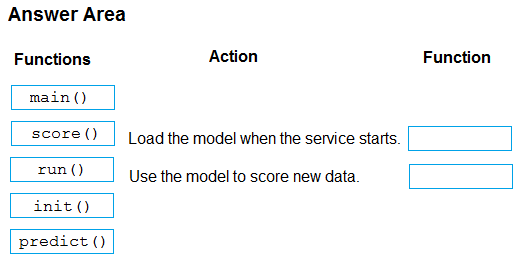

  
Show Suggested Answer

  

---

## Question 396 | [Link](https://www.examtopics.com/discussions/microsoft/view/36439-exam-dp-100-topic-4-question-25-discussion/){:target="_blank"}

You develop and train a machine learning model to predict fraudulent transactions for a hotel booking website.

Traffic to the site varies considerably. The site experiences heavy traffic on Monday and Friday and much lower traffic on other days. Holidays are also high web traffic days.

You need to deploy the model as an Azure Machine Learning real-time web service endpoint on compute that can dynamically scale up and down to support demand.

Which deployment compute option should you use?

* A.attached Azure Databricks cluster
* B.Azure Container Instance (ACI)
* C.Azure Kubernetes Service (AKS) inference cluster
* D.Azure Machine Learning Compute Instance
* E.attached virtual machine in a different region

  
Show Suggested Answer

  C

---

## Question 397 | [Link](https://www.examtopics.com/discussions/microsoft/view/70548-exam-dp-100-topic-4-question-26-discussion/){:target="_blank"}

You use the designer to create a training pipeline for a classification model. The pipeline uses a dataset that includes the features and labels required for model training.

You create a real-time inference pipeline from the training pipeline. You observe that the schema for the generated web service input is based on the dataset and includes the label column that the model predicts. Client applications that use the service must not be required to submit this value.

You need to modify the inference pipeline to meet the requirement.

What should you do?

* A.Add a Select Columns in Dataset module to the inference pipeline after the dataset and use it to select all columns other than the label.
* B.Delete the dataset from the training pipeline and recreate the real-time inference pipeline.
* C.Delete the Web Service Input module from the inference pipeline.
* D.Replace the dataset in the inference pipeline with an Enter Data Manually module that includes data for the feature columns but not the label column.

  
Show Suggested Answer

  A

---

## Question 398 | [Link](https://www.examtopics.com/discussions/microsoft/view/70550-exam-dp-100-topic-4-question-27-discussion/){:target="_blank"}

You use the Azure Machine Learning designer to create and run a training pipeline. You then create a real-time inference pipeline.

You must deploy the real-time inference pipeline as a web service.

What must you do before you deploy the real-time inference pipeline?

* A.Run the real-time inference pipeline.
* B.Create a batch inference pipeline.
* C.Clone the training pipeline.
* D.Create an Azure Machine Learning compute cluster.

  
Show Suggested Answer

  A

---

## Question 399 | [Link](https://www.examtopics.com/discussions/microsoft/view/72267-exam-dp-100-topic-4-question-28-discussion/){:target="_blank"}

You create an Azure Machine Learning workspace named ML-workspace. You also create an Azure Databricks workspace named DB-workspace. DB-workspace contains a cluster named DB-cluster.

You must use DB-cluster to run experiments from notebooks that you import into DB-workspace.

You need to use ML-workspace to track MLflow metrics and artifacts generated by experiments running on DB-cluster. The solution must minimize the need for custom code.

What should you do?

* A.From DB-cluster, configure the Advanced Logging option.
* B.From DB-workspace, configure the Link Azure ML workspace option.
* C.From ML-workspace, create an attached compute.
* D.From ML-workspace, create a compute cluster.

  
Show Suggested Answer

  B

---

## Question 400 | [Link](https://www.examtopics.com/discussions/microsoft/view/70054-exam-dp-100-topic-4-question-29-discussion/){:target="_blank"}

HOTSPOT -

You create an Azure Machine Learning workspace.

You need to detect data drift between a baseline dataset and a subsequent target dataset by using the DataDriftDetector class.

How should you complete the code segment? To answer, select the appropriate options in the answer area.

NOTE: Each correct selection is worth one point.

Hot Area:

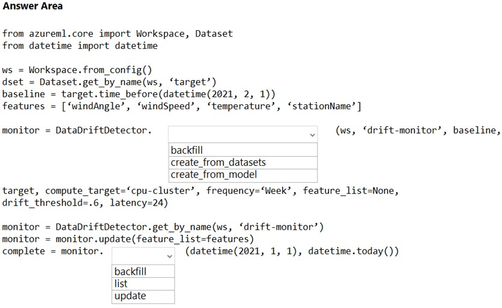

  
Show Suggested Answer

  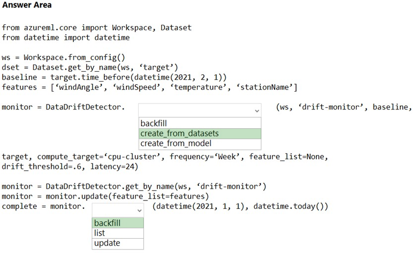

---

## Question 401 | [Link](https://www.examtopics.com/discussions/microsoft/view/69010-exam-dp-100-topic-4-question-30-discussion/){:target="_blank"}

You are planning to register a trained model in an Azure Machine Learning workspace.

You must store additional metadata about the model in a key-value format. You must be able to add new metadata and modify or delete metadata after creation.

You need to register the model.

Which parameter should you use?

* A.description
* B.model_framework
* C.tags
* D.properties

  
Show Suggested Answer

  C

---

## Question 402 | [Link](https://www.examtopics.com/discussions/microsoft/view/70056-exam-dp-100-topic-4-question-31-discussion/){:target="_blank"}

You have a Python script that executes a pipeline. The script includes the following code: from azureml.core import Experiment pipeline_run = Experiment(ws, 'pipeline_test').submit(pipeline)

You want to test the pipeline before deploying the script.

You need to display the pipeline run details written to the STDOUT output when the pipeline completes.

Which code segment should you add to the test script?

* A.pipeline_run.get.metrics()
* B.pipeline_run.wait_for_completion(show_output=True)
* C.pipeline_param = PipelineParameter(name="stdout", default_value="console")
* D.pipeline_run.get_status()

  
Show Suggested Answer

  B

---

## Question 403 | [Link](https://www.examtopics.com/discussions/microsoft/view/81322-exam-dp-100-topic-4-question-32-discussion/){:target="_blank"}

You train and register a machine learning model. You create a batch inference pipeline that uses the model to generate predictions from multiple data files.

You must publish the batch inference pipeline as a service that can be scheduled to run every night.

You need to select an appropriate compute target for the inference service.

Which compute target should you use?

* A.Azure Machine Learning compute instance
* B.Azure Machine Learning compute cluster
* C.Azure Kubernetes Service (AKS)-based inference cluster
* D.Azure Container Instance (ACI) compute target

  
Show Suggested Answer

  B

---

## Question 404 | [Link](https://www.examtopics.com/discussions/microsoft/view/81061-exam-dp-100-topic-4-question-33-discussion/){:target="_blank"}

DRAG DROP -

You train and register a model by using the Azure Machine Learning SDK on a local workstation. Python 3.6 and Visual Studio Code are installed on the workstation.

When you try to deploy the model into production as an Azure Kubernetes Service (AKS)-based web service, you experience an error in the scoring script that causes deployment to fail.

You need to debug the service on the local workstation before deploying the service to production.

Which four actions should you perform in sequence? To answer, move the appropriate actions from the list of actions to the answer area and arrange them in the correct order.

Select and Place:

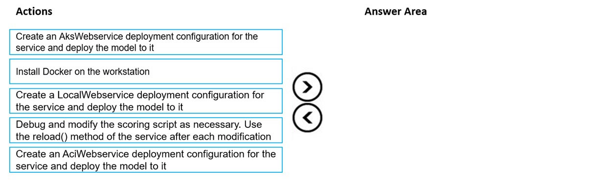

  
Show Suggested Answer

  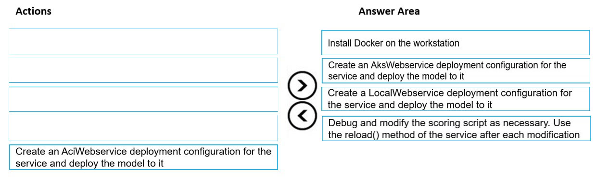

---

## Question 405 | [Link](https://www.examtopics.com/discussions/microsoft/view/80913-exam-dp-100-topic-4-question-34-discussion/){:target="_blank"}

DRAG DROP -

You create an Azure Machine Learning workspace and a new Azure DevOps organization. You register a model in the workspace and deploy the model to the target environment.

All new versions of the model registered in the workspace must automatically be deployed to the target environment.

You need to configure Azure Pipelines to deploy the model.

Which four actions should you perform in sequence? To answer, move the appropriate actions from the list of actions to the answer area and arrange them in the correct order.

Select and Place:

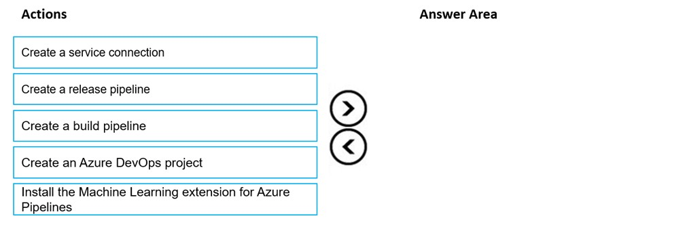

  
Show Suggested Answer

  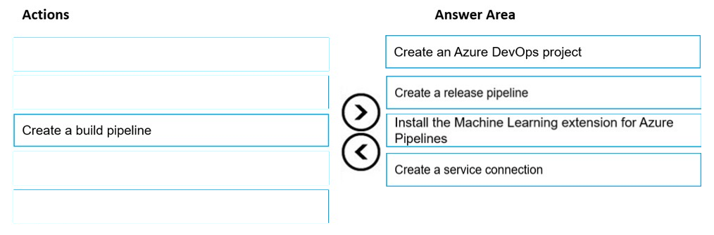

---

## Question 406 | [Link](https://www.examtopics.com/discussions/microsoft/view/86307-exam-dp-100-topic-4-question-35-discussion/){:target="_blank"}

You use the Azure Machine Learning designer to create and run a training pipeline.

The pipeline must be run every night to inference predictions from a large volume of files. The folder where the files will be stored is defined as a dataset.

You need to publish the pipeline as a REST service that can be used for the nightly inferencing run.

What should you do?

* A.Create a batch inference pipeline
* B.Set the compute target for the pipeline to an inference cluster
* C.Create a real-time inference pipeline
* D.Clone the pipeline

  
Show Suggested Answer

  A

---

## Question 407 | [Link](https://www.examtopics.com/discussions/microsoft/view/104052-exam-dp-100-topic-4-question-36-discussion/){:target="_blank"}

HOTSPOT

-

You create an Azure Machine Learning model to include model files and a scoring script.

You must deploy the model. The deployment solution must meet the following requirements:

•	Provide near real-time inferencing.

•	Enable endpoint and deployment level cost estimates.

•	Support logging to Azure Log Analytics.

You need to configure the deployment solution.

What should you configure? To answer, select the appropriate options in the answer area.

NOTE: Each correct selection is worth one point.

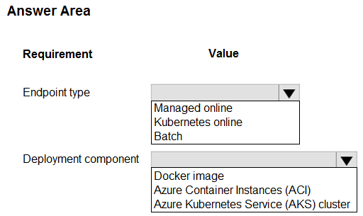

  
Show Suggested Answer

  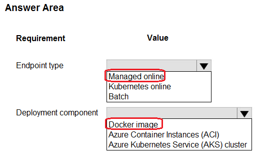

---

## Question 408 | [Link](https://www.examtopics.com/discussions/microsoft/view/104684-exam-dp-100-topic-4-question-37-discussion/){:target="_blank"}

You are developing a machine learning model.

You must inference the machine learning model for testing.

You need to use a minimal cost compute target.

Which two compute targets should you use? Each correct answer presents a complete solution.

NOTE: Each correct selection is worth one point.

* A.Azure Machine Learning Kubernetes
* B.Azure Databricks
* C.Remote VM
* D.Local web service
* E.Azure Container Instances

  
Show Suggested Answer

  DE

---

## Question 409 | [Link](https://www.examtopics.com/discussions/microsoft/view/104114-exam-dp-100-topic-4-question-38-discussion/){:target="_blank"}

You train and publish a machine learning model.

You need to run a pipeline that retrains the model based on a trigger from an external system.

What should you configure?

* A.Azure Data Catalog
* B.Azure Batch
* C.Azure Logic App

  
Show Suggested Answer

  C

---

## Question 410 | [Link](https://www.examtopics.com/discussions/microsoft/view/106001-exam-dp-100-topic-4-question-39-discussion/){:target="_blank"}

You create an Azure Machine Learning workspace.

You must configure an event handler to send an email notification when data drift is detected in the workspace datasets. You must minimize development efforts.

You need to configure an Azure service to send the notification.

Which Azure service should you use?

* A.Azure Logic Apps
* B.Azure Automation runbook
* C.Azure Function apps
* D.Azure DevOps pipeline

  
Show Suggested Answer

  A

---

## Question 411 | [Link](https://www.examtopics.com/discussions/microsoft/view/109154-exam-dp-100-topic-4-question-40-discussion/){:target="_blank"}

HOTSPOT

-

You create an Azure Machine Learning dataset. You use the Azure Machine Learning designer to transform the dataset by using an Execute Python Script component and custom code.

You must upload the script and associated libraries as a script bundle.

You need to configure the Execute Python Script component.

Which configurations should you use? To answer, select the appropriate options in the answer area.

NOTE: Each correct selection is worth one point.

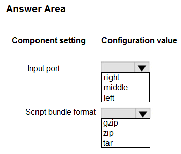

  
Show Suggested Answer

  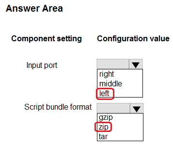

---

## Question 412 | [Link](https://www.examtopics.com/discussions/microsoft/view/103425-exam-dp-100-topic-4-question-41-discussion/){:target="_blank"}

HOTSPOT

-

You create a list of movie descriptions in text data format.

You must analyze the movie descriptions with automated machine learning.

You need to use the Azure Machine Learning for Python SDK v1 to configure a job with the specific natural language processing (NLP) task function for AutoML jobs.

Which functions should you use? To answer, select the appropriate options in the answer area.

NOTE: Each correct selection is worth one point.

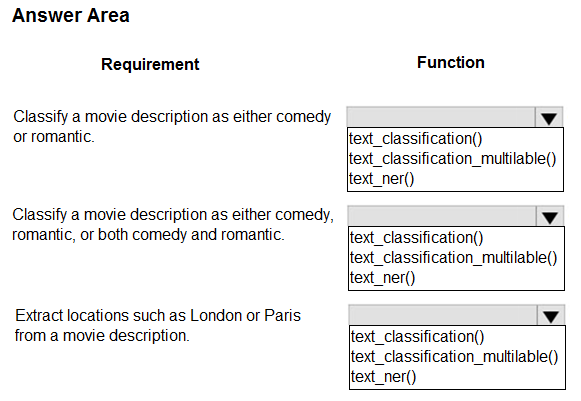

  
Show Suggested Answer

  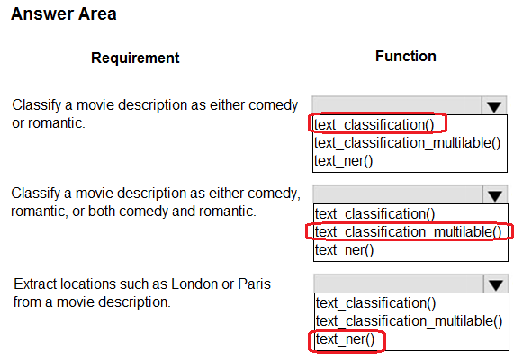

---

## Question 413 | [Link](https://www.examtopics.com/discussions/microsoft/view/104054-exam-dp-100-topic-4-question-42-discussion/){:target="_blank"}

Note: This question is part of a series of questions that present the same scenario. Each question in the series contains a unique solution that might meet the stated goals. Some question sets might have more than one correct solution, while others might not have a correct solution.

After you answer a question in this section, you will NOT be able to return to it. As a result, these questions will not appear in the review screen.

You create an Azure Machine Learning pipeline named pipeline1 with two steps that contain Python scripts. Data processed by the first step is passed to the second step.

You must update the content of the downstream data source of pipeline1 and run the pipeline again.

You need to ensure the new run of pipeline1 fully processes the updated content.

Solution: Set the allow_reuse parameter of the PythonScriptStep object of both steps to False.

Does the solution meet the goal?

* A.Yes
* B.No

  
Show Suggested Answer

  A

---

## Question 414 | [Link](https://www.examtopics.com/discussions/microsoft/view/104300-exam-dp-100-topic-4-question-43-discussion/){:target="_blank"}

Note: This question is part of a series of questions that present the same scenario. Each question in the series contains a unique solution that might meet the stated goals. Some question sets might have more than one correct solution, while others might not have a correct solution.

After you answer a question in this section, you will NOT be able to return to it. As a result, these questions will not appear in the review screen.

You create an Azure Machine Learning pipeline named pipeline1 with two steps that contain Python scripts. Data processed by the first step is passed to the second step.

You must update the content of the downstream data source of pipeline1 and run the pipeline again.

You need to ensure the new run of pipeline1 fully processes the updated content.

Solution: Set the regenerate_outputs parameter of the pipeline1 experiment’s run submit method to True.

Does the solution meet the goal?

* A.Yes
* B.No

  
Show Suggested Answer

  A

---

## Question 415 | [Link](https://www.examtopics.com/discussions/microsoft/view/104301-exam-dp-100-topic-4-question-44-discussion/){:target="_blank"}

Note: This question is part of a series of questions that present the same scenario. Each question in the series contains a unique solution that might meet the stated goals. Some question sets might have more than one correct solution, while others might not have a correct solution.

After you answer a question in this section, you will NOT be able to return to it. As a result, these questions will not appear in the review screen.

You create an Azure Machine Learning pipeline named pipeline1 with two steps that contain Python scripts. Data processed by the first step is passed to the second step.

You must update the content of the downstream data source of pipeline1 and run the pipeline again.

You need to ensure the new run of pipeline1 fully processes the updated content.

Solution: Change the value of the compute_target parameter of the PythonScriptStep object in the two steps.

Does the solution meet the goal?

* A.Yes
* B.No

  
Show Suggested Answer

  B

---

## Question 416 | [Link](https://www.examtopics.com/discussions/microsoft/view/103680-exam-dp-100-topic-4-question-45-discussion/){:target="_blank"}

HOTSPOT

-

You are authoring a pipeline by using the Azure Machine Learning SDK for Python. You implement code to import all relevant classes, configure the workspace, and define all pipeline steps.

You need to initiate pipeline execution.

How should you complete the code? To answer, select the appropriate options in the answer area.

NOTE: Each correct selection is worth one point.

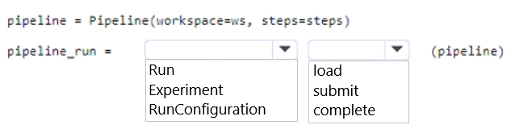

  
Show Suggested Answer

  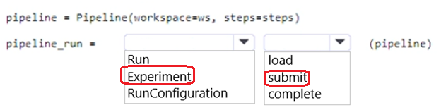

---

## Question 417 | [Link](https://www.examtopics.com/discussions/microsoft/view/104302-exam-dp-100-topic-4-question-46-discussion/){:target="_blank"}

DRAG DROP

-

You have an Azure Machine Learning workspace that contains a training cluster and an inference cluster.

You plan to create a classification model by using the Azure Machine Learning designer.

You need to ensure that client applications can submit data as HTTP requests and receive predictions as responses.

Which three actions should you perform in sequence? To answer, move the appropriate actions from the list of actions to the answer area and arrange them in the correct order.

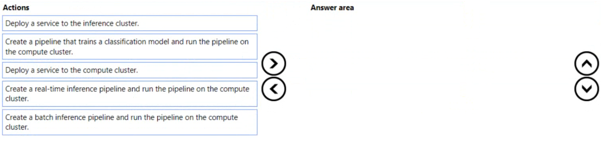

  
Show Suggested Answer

  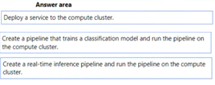

---

## Question 418 | [Link](https://www.examtopics.com/discussions/microsoft/view/104161-exam-dp-100-topic-4-question-47-discussion/){:target="_blank"}

You create an MLflow model.

You must deploy the model to Azure Machine Learning for batch inference.

You need to create the batch deployment.

Which two components should you use? Each correct answer presents a complete solution.

NOTE: Each correct selection is worth one point.

* A.Environment
* B.Model files
* C.Online endpoint
* D.Kubernetes online endpoint
* E.Compute target

  
Show Suggested Answer

  BE

---

## Question 419 | [Link](https://www.examtopics.com/discussions/microsoft/view/103319-exam-dp-100-topic-4-question-48-discussion/){:target="_blank"}

You create an Azure Machine Learning workspace. The workspace contains a dataset named sample_dataset, a compute instance, and a compute cluster.

You must create a two-stage pipeline that will prepare data in the dataset and then train and register a model based on the prepared data.

The first stage of the pipeline contains the following code:

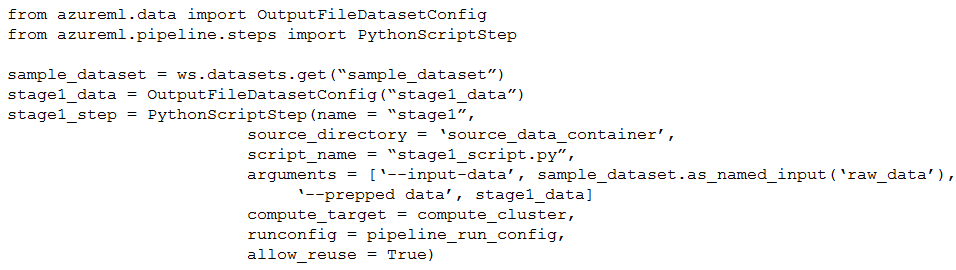

You need to identify the location containing the output of the first stage of the script that you can use as input for the second stage.

Which storage location should you use?

* A.workspaceblobstore datastore
* B.workspacefilestore datastore
* C.compute instance
* D.compute_cluster

  
Show Suggested Answer

  A

---

## Question 420 | [Link](https://www.examtopics.com/discussions/microsoft/view/106795-exam-dp-100-topic-4-question-49-discussion/){:target="_blank"}

DRAG DROP

-

You are developing a machine learning solution by using the Azure Machine Learning designer.

You need to create a web service that applications can use to submit data feature values and retrieve a predicted label.

Which three actions should you perform in sequence? To answer, move the appropriate actions from the list of actions to the answer area and arrange them in the correct order.

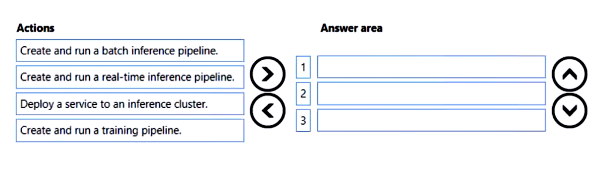

  
Show Suggested Answer

  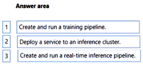

---

## Question 421 | [Link](https://www.examtopics.com/discussions/microsoft/view/107558-exam-dp-100-topic-4-question-50-discussion/){:target="_blank"}

HOTSPOT

-

You create an Azure Machine Learning workspace and install the MLflow library.

You need to log different types of data by using the MLflow library.

Which method should you use? To answer, select the appropriate options in the answer area.

NOTE: Each correct selection is worth one point.

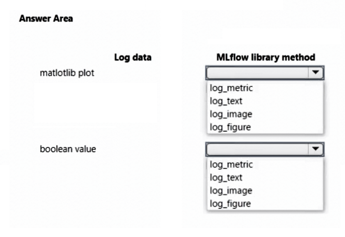

  
Show Suggested Answer

  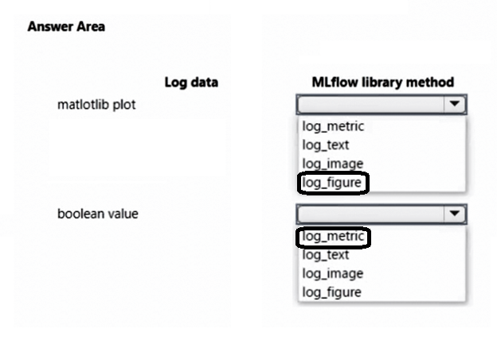

---

## Question 422 | [Link](https://www.examtopics.com/discussions/microsoft/view/107559-exam-dp-100-topic-4-question-51-discussion/){:target="_blank"}

DRAG DROP

-

You create an Azure Machine Learning workspace. You are training a classification model with no-code AutoML in Azure Machine Learning studio.

The model must predict if a client of a financial institution will subscribe to a fixed-term deposit. You must preview the data profile in Azure Machine Learning studio once the dataset is created.

You need to train the model.

Which four actions should you perform in sequence? To answer, move the appropriate actions from the list of actions to the answer area and arrange them in the correct order.

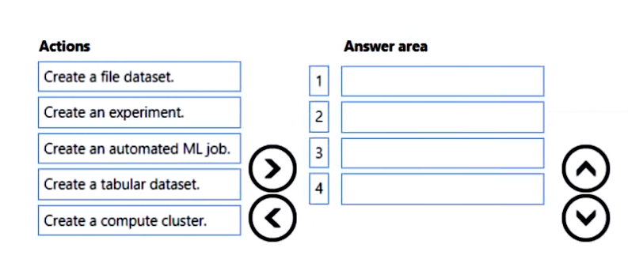

  
Show Suggested Answer

  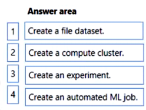

---

## Question 423 | [Link](https://www.examtopics.com/discussions/microsoft/view/106796-exam-dp-100-topic-4-question-52-discussion/){:target="_blank"}

You create an Azure Machine Learning workspace. You use Azure Machine Learning designer to create a pipeline within the workspace.

You need to submit a pipeline run from the designer.

What should you do first?

* A.Create an experiment.
* B.Create an attached compute resource.
* C.Create a compute cluster.
* D.Select a model.

  
Show Suggested Answer

  A

---

## Question 424 | [Link](https://www.examtopics.com/discussions/microsoft/view/114441-exam-dp-100-topic-4-question-53-discussion/){:target="_blank"}

HOTSPOT

-

You create an Azure Machine learning workspace. The workspace contains a folder named src. The folder contains a Python script named script1.py.

You use the Azure Machine Learning Python SDK v2 to create a control script. You must use the control script to run script1.py as part of a training job.

You need to complete the section of script that defines the job parameters.

How should you complete the script? To answer, select the appropriate options in the answer area.

NOTE: Each correct selection is worth one point.

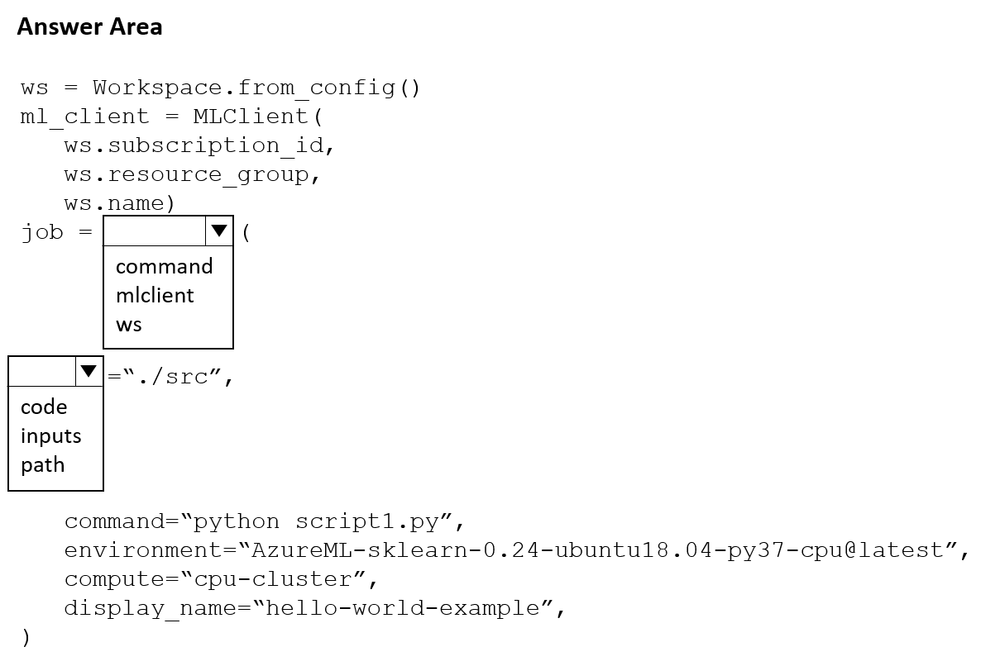

  
Show Suggested Answer

  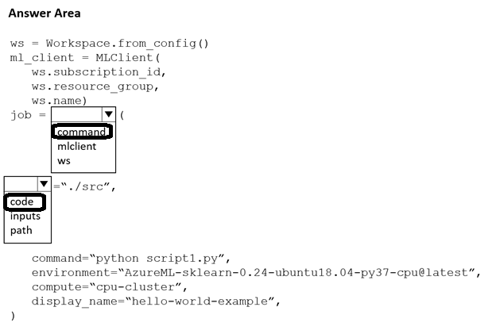

---

## Question 425 | [Link](https://www.examtopics.com/discussions/microsoft/view/116613-exam-dp-100-topic-4-question-54-discussion/){:target="_blank"}

HOTSPOT -

You manage an Azure Machine Learning workspace. You submit a training job with the Azure Machine Learning Python SDK v2. You must use MLflow to log metrics, model parameters, and model artifacts automatically when training a model.

You start by writing the following code segment:

import mlflow

mlflow.autolog(log_models=False, exclusive=True)

For each of the following statements, select Yes if the statement is true. Otherwise, select No.

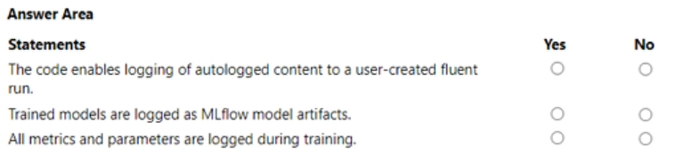

  
Show Suggested Answer

  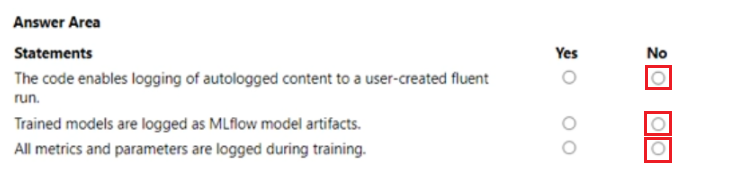

---

## Question 426 | [Link](https://www.examtopics.com/discussions/microsoft/view/114444-exam-dp-100-topic-4-question-55-discussion/){:target="_blank"}

Note: This question is part of a series of questions that present the same scenario. Each question in the series contains a unique solution that might meet the stated goals. Some question sets might have more than one correct solution, while others might not have a correct solution.

After you answer a question in this section, you will NOT be able to return to it. As a result, these questions will not appear in the review screen.

You train and register an Azure Machine Learning model.

You plan to deploy the model to an online endpoint.

You need to ensure that applications will be able to use the authentication method with a non-expiring artifact to access the model.

Solution: Create a managed online endpoint and set the value of its auth_mode parameter to aml_token. Deploy the model to the online endpoint.

Does the solution meet the goal?

* A.Yes
* B.No

  
Show Suggested Answer

  B

---

## Question 427 | [Link](https://www.examtopics.com/discussions/microsoft/view/114445-exam-dp-100-topic-4-question-56-discussion/){:target="_blank"}

Note: This question is part of a series of questions that present the same scenario. Each question in the series contains a unique solution that might meet the stated goals. Some question sets might have more than one correct solution, while others might not have a correct solution.

After you answer a question in this section, you will NOT be able to return to it. As a result, these questions will not appear in the review screen.

You train and register an Azure Machine Learning model.

You plan to deploy the model to an online endpoint.

You need to ensure that applications will be able to use the authentication method with a non-expiring artifact to access the model.

Solution: Create a managed online endpoint and set the value of its auth_mode parameter to key. Deploy the model to the online endpoint.

Does the solution meet the goal?

* A.Yes
* B.No

  
Show Suggested Answer

  A

---

## Question 428 | [Link](https://www.examtopics.com/discussions/microsoft/view/114194-exam-dp-100-topic-4-question-57-discussion/){:target="_blank"}

Note: This question is part of a series of questions that present the same scenario. Each question in the series contains a unique solution that might meet the stated goals. Some question sets might have more than one correct solution, while others might not have a correct solution.

After you answer a question in this section, you will NOT be able to return to it. As a result, these questions will not appear in the review screen.

You train and register an Azure Machine Learning model.

You plan to deploy the model to an online endpoint.

You need to ensure that applications will be able to use the authentication method with a non-expiring artifact to access the model.

Solution: Create a managed online endpoint with the default authentication settings. Deploy the model to the online endpoint.

Does the solution meet the goal?

* A.Yes
* B.No

  
Show Suggested Answer

  A

---

## Question 429 | [Link](https://www.examtopics.com/discussions/microsoft/view/114446-exam-dp-100-topic-4-question-58-discussion/){:target="_blank"}

You use the Azure Machine Learning SDK v2 for Python and notebooks to train a model. You use Python code to create a compute target, an environment, and a training script.

You need to prepare information to submit a training job.

Which class should you use?

* A.MLClient
* B.BuildContext
* C.EndpointConnection
* D.command

  
Show Suggested Answer

  D

---

## Question 430 | [Link](https://www.examtopics.com/discussions/microsoft/view/114447-exam-dp-100-topic-4-question-59-discussion/){:target="_blank"}

You manage an Azure Machine Learning workspace.

You build a custom model you must log with MLflow. The custom model includes the following:

•	The model is not natively supported by MLflow.

•	The model cannot be serialized in Pickle format.

•	The model source code is complex.

•	The Python library for the model must be packaged with the model.

You need to create a custom model flavor to enable logging with MLflow.

What should you use?

* A.model loader
* B.artifacts
* C.model wrapper
* D.custom signatures

  
Show Suggested Answer

  A

---

## Question 431 | [Link](https://www.examtopics.com/discussions/microsoft/view/114448-exam-dp-100-topic-4-question-60-discussion/){:target="_blank"}

You create an Azure Machine Learning workspace.

You must use the Python SDK v2 to implement an experiment from a Jupyter notebook in the workspace. The experiment must log string metrics.

You need to implement the method to log the string metrics.

Which method should you use?

* A.mlflow.log_artifact()
* B.mlflow.log.dict()
* C.mlflow.log_metric()
* D.mlflow.log_text()

  
Show Suggested Answer

  D

---

## Question 432 | [Link](https://www.examtopics.com/discussions/microsoft/view/114449-exam-dp-100-topic-4-question-61-discussion/){:target="_blank"}

You manage an Azure Machine Learning workspace. You develop a machine learning model.

You must deploy the model to use a low-priority VM with a pricing discount.

You need to deploy the model.

Which compute target should you use?

* A.Azure Kubernetes Service (AKS)
* B.Azure Machine Learning compute clusters
* C.Azure Container Instances (ACI)
* D.Local deployment

  
Show Suggested Answer

  B

---

## Question 433 | [Link](https://www.examtopics.com/discussions/microsoft/view/114450-exam-dp-100-topic-4-question-62-discussion/){:target="_blank"}

HOTSPOT

-

You use an Azure Machine Learning workspace, Azure Data Factory pipeline, and a dataset monitor that runs on a schedule to detect data drift.

You need to implement an automated workflow to trigger when the dataset monitor detects data drift and launch the Azure Data Factory pipeline to update the dataset. The solution must minimize the effort to configure the workflow.

How should you configure the workflow? To answer, select the appropriate options in the answer area.

NOTE: Each correct selection is worth one point.

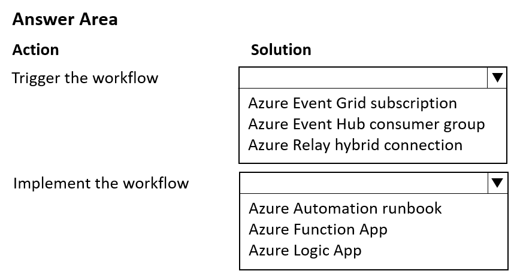

  
Show Suggested Answer

  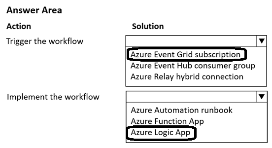

---

## Question 434 | [Link](https://www.examtopics.com/discussions/microsoft/view/114451-exam-dp-100-topic-4-question-63-discussion/){:target="_blank"}

DRAG DROP

-

You train and register a model by using the Azure Machine Learning Python SDK v2 on a local workstation. Python 3.7 and Visual Studio Code are installed on the workstation.

When you try to deploy the model into production to a Kubernetes online endpoint, you experience an error in the scoring script that causes deployment to fail.

You need to debug the service on the local workstation before deploying the service to production.

Which three actions should you perform in sequence? To answer, move the appropriate actions from the list of actions to the answer area and arrange them in the correct order.

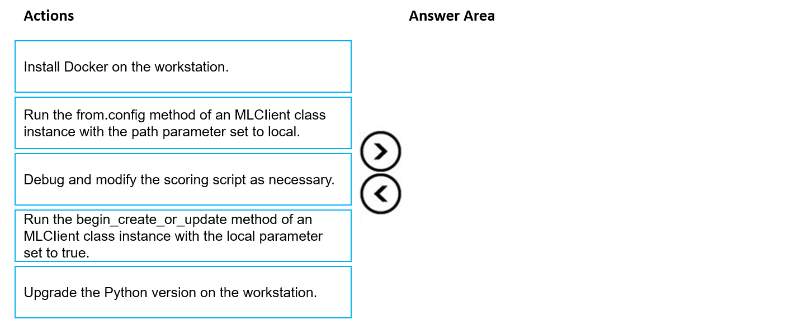

  
Show Suggested Answer

  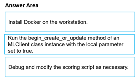

---

## Question 435 | [Link](https://www.examtopics.com/discussions/microsoft/view/114454-exam-dp-100-topic-4-question-64-discussion/){:target="_blank"}

DRAG DROP

-

You create a multi-class image classification deep learning model.

The model must be retrained monthly with the new image data fetched from a public web portal. You create an Azure Machine Learning pipeline to fetch new data, standardize the size of images, and retrain the model.

You need to use the Azure Machine Learning Python SDK v2 to configure the schedule for the pipeline. The schedule should be defined by using the frequency and interval properties, with frequency set to “month" and interval set to "1".

Which three classes should you instantiate in sequence? To answer, move the appropriate actions from the list of actions to the answer area and arrange them in the correct order.

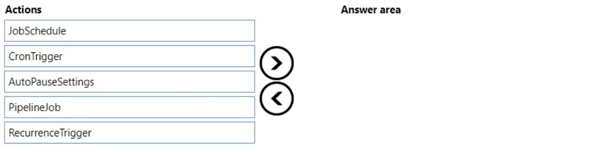

  
Show Suggested Answer

  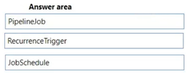

---

## Question 436 | [Link](https://www.examtopics.com/discussions/microsoft/view/114455-exam-dp-100-topic-4-question-65-discussion/){:target="_blank"}

Note: This question is part of a series of questions that present the same scenario. Each question in the series contains a unique solution that might meet the stated goals. Some question sets might have more than one correct solution, while others might not have a correct solution.

After you answer a question in this section, you will NOT be able to return to it. As a result, these questions will not appear in the review screen.

You train and register an Azure Machine Learning model.

You plan to deploy the model to an online endpoint.

You need to ensure that applications will be able to use the authentication method with a non-expiring artifact to access the model.

Solution: Create a Kubernetes online endpoint and set the value of its auth_mode parameter to aml_token. Deploy the model to the online endpoint.

Does the solution meet the goal?

* A.Yes
* B.No

  
Show Suggested Answer

  B

---

## Question 437 | [Link](https://www.examtopics.com/discussions/microsoft/view/118485-exam-dp-100-topic-4-question-66-discussion/){:target="_blank"}

You manage an Azure Machine Learning workspace.

You must provide explanations for the behavior of the models with feature importance measures.

You need to configure a Responsible AI dashboard in Azure Machine Learning.

Which dashboard component should you configure?

* A.Counterfactual what-if
* B.Casual inference
* C.Fairness assessment
* D.Interpretability

  
Show Suggested Answer

  D

---

## Question 438 | [Link](https://www.examtopics.com/discussions/microsoft/view/114456-exam-dp-100-topic-4-question-67-discussion/){:target="_blank"}

You create an Azure Machine Learning workspace.

You must use the Python SDK v2 to implement an experiment from a Jupyter notebook in the workspace. The experiment must log a list of numeral metrics.

You need to implement a method to log a list of numeral metrics.

Which method should you use?

* A.mlflow.log_metric()
* B.mlflow.log.batch()
* C.mlflow.log_image()
* D.mlflow.log_artifact()

  
Show Suggested Answer

  B

---

## Question 439 | [Link](https://www.examtopics.com/discussions/microsoft/view/114458-exam-dp-100-topic-4-question-68-discussion/){:target="_blank"}

HOTSPOT

-

You create an Azure Machine Learning workspace.

You plan to write an Azure Machine Learning SDK for Python v2 script that logs an image for an experiment. The logged image must be available from the images tab in Azure Machine Learning Studio.

You need to complete the script.

Which code segments should you use? To answer, select the appropriate options in the answer area.

NOTE: Each correct selection is worth one point.

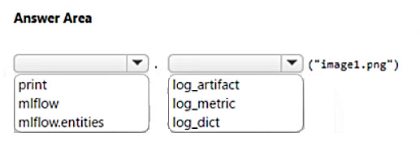

  
Show Suggested Answer

  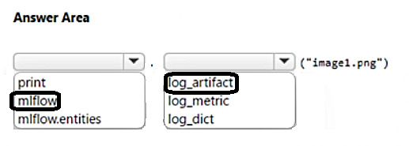

---

## Question 440 | [Link](https://www.examtopics.com/discussions/microsoft/view/123918-exam-dp-100-topic-4-question-69-discussion/){:target="_blank"}

You run Azure Machine Learning training experiments. The training scripts directory contains 100 files that includes a file named .amlignore. The directory also contains subdirectories named ./outputs and ./logs.

There are 20 files in the training scripts directory that must be excluded from the snapshot to the compute targets. You create a file named .gitignore in the root of the directory. You add the names of the 20 files to the .gitignore file. These 20 files continue to be copied to the compute targets.

You need to exclude the 20 files.

What should you do?

* A.Copy the contents of the file named .gitignore to the file named .amlignore.
* B.Move the file named .gitignore to the ./outputs directory.
* C.Move the file named .gitignore to the ./logs directory.
* D.Add the contents of the file named .amlignore to the file named .gitignore.

  
Show Suggested Answer

  A

---

## Question 441 | [Link](https://www.examtopics.com/discussions/microsoft/view/114459-exam-dp-100-topic-4-question-70-discussion/){:target="_blank"}

You build a data pipeline in an Azure Machine Learning workspace by using the Azure Machine Learning SDK for Python.

You need to run a Python script as a pipeline step.

Which two classes could you use? Each correct answer presents a complete solution.

NOTE: Each correct selection is worth one point.

* A.PythonScriptStep
* B.AutoMLStep
* C.CommandStep
* D.StepRun

  
Show Suggested Answer

  AC

---

## Question 442 | [Link](https://www.examtopics.com/discussions/microsoft/view/134694-exam-dp-100-topic-4-question-71-discussion/){:target="_blank"}

You have an Azure Machine Learning workspace.

You plan to run a job to train a model as an MLflow model output.

You need to specify the output mode of the MLflow model.

Which three modes can you specify? Each correct answer presents a complete solution.

NOTE: Each correct selection is worth one point.

* A.rw_mount
* B.ro_mount
* C.upload
* D.download
* E.direct

  
Show Suggested Answer

  ACE

---

## Question 443 | [Link](https://www.examtopics.com/discussions/microsoft/view/136605-exam-dp-100-topic-4-question-72-discussion/){:target="_blank"}

Note: This question is part of a series of questions that present the same scenario. Each question in the series contains a unique solution that might meet the stated goals. Some question sets might have more than one correct solution, while others might not have a correct solution.

After you answer a question in this section, you will NOT be able to return to it. As a result, these questions will not appear in the review screen.

You have an Azure Machine Learning workspace. You connect to a terminal session from the Notebooks page in Azure Machine Learning studio.

You plan to add a new Jupyter kernel that will be accessible from the same terminal session.

You need to perform the task that must be completed before you can add the new kernel.

Solution: Create an environment.

Does the solution meet the goal?

* A.Yes
* B.No

  
Show Suggested Answer

  A

---

## Question 444 | [Link](https://www.examtopics.com/discussions/microsoft/view/136606-exam-dp-100-topic-4-question-73-discussion/){:target="_blank"}

Note: This question is part of a series of questions that present the same scenario. Each question in the series contains a unique solution that might meet the stated goals. Some question sets might have more than one correct solution, while others might not have a correct solution.

After you answer a question in this section, you will NOT be able to return to it. As a result, these questions will not appear in the review screen.

You have an Azure Machine Learning workspace. You connect to a terminal session from the Notebooks page in Azure Machine Learning studio.

You plan to add a new Jupyter kernel that will be accessible from the same terminal session.

You need to perform the task that must be completed before you can add the new kernel.

Solution: Delete the Python 3.6 – AzureML kernel.

Does the solution meet the goal?

* A.Yes
* B.No

  
Show Suggested Answer

  B

---

## Question 445 | [Link](https://www.examtopics.com/discussions/microsoft/view/136607-exam-dp-100-topic-4-question-74-discussion/){:target="_blank"}

Note: This question is part of a series of questions that present the same scenario. Each question in the series contains a unique solution that might meet the stated goals. Some question sets might have more than one correct solution, while others might not have a correct solution.

After you answer a question in this section, you will NOT be able to return to it. As a result, these questions will not appear in the review screen.

You have an Azure Machine Learning workspace. You connect to a terminal session from the Notebooks page in Azure Machine Learning studio.

You plan to add a new Jupyter kernel that will be accessible from the same terminal session.

You need to perform the task that must be completed before you can add the new kernel.

Solution: Delete the Python 3.8 – AzureML kernel.

Does the solution meet the goal?

* A.Yes
* B.No

  
Show Suggested Answer

  B

---

## Question 446 | [Link](https://www.examtopics.com/discussions/microsoft/view/140810-exam-dp-100-topic-4-question-75-discussion/){:target="_blank"}

You are a data scientist working for a hotel booking website company. You use the Azure Machine Learning service to train a model that identifies fraudulent transactions.

You must deploy the model as an Azure Machine Learning online endpoint by using the Azure Machine Learning Python SDK v2. The deployed model must return real-time predictions of fraud based on transaction data input.

You need to create the script that is specified as the scoring_script parameter for the CodeConfiguration class used to deploy the model.

What should the entry script do?

* A.Register the model with appropriate tags and properties.
* B.Create a Conda environment for the online endpoint compute and install the necessary Python packages.
* C.Load the model and use it to predict labels from input data.
* D.Start a node on the inference cluster where the model is deployed.
* E.Specify the number of cores and the amount of memory required for the online endpoint compute.

  
Show Suggested Answer

  C

---

## Question 447 | [Link](https://www.examtopics.com/discussions/microsoft/view/140809-exam-dp-100-topic-4-question-76-discussion/){:target="_blank"}

Note: This question is part of a series of questions that present the same scenario. Each question in the series contains a unique solution that might meet the stated goals. Some question sets might have more than one correct solution, while others might not have a correct solution.

After you answer a question in this section, you will NOT be able to return to it. As a result, these questions will not appear in the review screen.

You have an Azure Machine Learning workspace. You connect to a terminal session from the Notebooks page in Azure Machine Learning studio.

You plan to add a new Jupyter kernel that will be accessible from the same terminal session.

You need to perform the task that must be completed before you can add the new kernel.

Solution: Create a compute instance.

Does the solution meet the goal?

* A.Yes
* B.No

  
Show Suggested Answer

  B

---

## Question 448 | [Link](https://www.examtopics.com/discussions/microsoft/view/143014-exam-dp-100-topic-4-question-77-discussion/){:target="_blank"}

DRAG DROP

-

You manage an Azure Machine Learning workspace.

You plan to import and wrangle data stored in Azure Data Lake Storage Gen2 with Apache Spark.

You need to start interactive data wrangling with the user identity passthrough.

Which three actions should you perform in sequence? To answer, move the appropriate actions from the list of actions to the answer area and arrange them in the correct order.

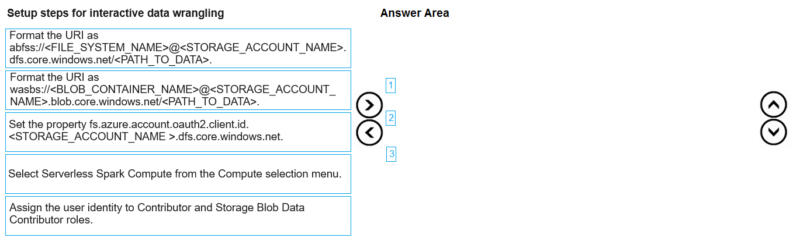

  
Show Suggested Answer

  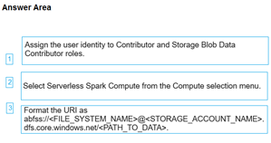

---

## Question 449 | [Link](https://www.examtopics.com/discussions/microsoft/view/142588-exam-dp-100-topic-4-question-78-discussion/){:target="_blank"}

Note: This question is part of a series of questions that present the same scenario. Each question in the series contains a unique solution that might meet the stated goals. Some question sets might have more than one correct solution, while others might not have a correct solution.

After you answer a question in this section, you will NOT be able to return to it. As a result, these questions will not appear in the review screen.

You have an Azure Machine Learning workspace named Workspace1. Workspace1 has a registered MLflow model named model1 with PyFunc flavor.

You plan to deploy model1 to an online endpoint named endpoint1 without egress connectivity by using Azure Machine Learning Python SDK v2.

You have the following code:

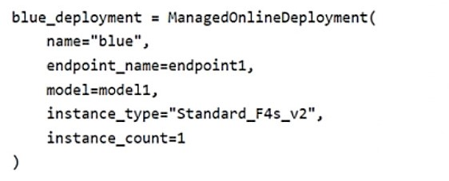

You need to add a parameter to the ManagedOnlineDeployment object to ensure the model deploys successfully.

Solution: Add the scoring_script parameter.

Does the solution meet the goal?

* A.Yes
* B.No

  
Show Suggested Answer

  A

---

## Question 450 | [Link](https://www.examtopics.com/discussions/microsoft/view/142587-exam-dp-100-topic-4-question-79-discussion/){:target="_blank"}

Note: This question is part of a series of questions that present the same scenario. Each question in the series contains a unique solution that might meet the stated goals. Some question sets might have more than one correct solution, while others might not have a correct solution.

After you answer a question in this section, you will NOT be able to return to it. As a result, these questions will not appear in the review screen.

You have an Azure Machine Learning workspace named Workspace1. Workspace1 has a registered MLflow model named model1 with PyFunc flavor.

You plan to deploy model1 to an online endpoint named endpoint1 without egress connectivity by using Azure Machine Learning Python SDK v2.

You have the following code:

You need to add a parameter to the ManagedOnlineDeployment object to ensure the model deploys successfully.

Solution: Add the environment parameter.

Does the solution meet the goal?

* A.Yes
* B.No

  
Show Suggested Answer

  B

---

## Question 451 | [Link](https://www.examtopics.com/discussions/microsoft/view/142586-exam-dp-100-topic-4-question-80-discussion/){:target="_blank"}

Note: This question is part of a series of questions that present the same scenario. Each question in the series contains a unique solution that might meet the stated goals. Some question sets might have more than one correct solution, while others might not have a correct solution.

After you answer a question in this section, you will NOT be able to return to it. As a result, these questions will not appear in the review screen.

You have an Azure Machine Learning workspace named Workspace1. Workspace1 has a registered MLflow model named model1 with PyFunc flavor.

You plan to deploy model1 to an online endpoint named endpoint1 without egress connectivity by using Azure Machine Learning Python SDK v2.

You have the following code:

You need to add a parameter to the ManagedOnlineDeployment object to ensure the model deploys successfully.

Solution: Add the with_package parameter.

Does the solution meet the goal?

* A.Yes
* B.No

  
Show Suggested Answer

  A

---

## Question 452 | [Link](https://www.examtopics.com/discussions/microsoft/view/150488-exam-dp-100-topic-4-question-81-discussion/){:target="_blank"}

You manage an Azure Machine Learning workspace.

An MLflow model is already registered. You plan to customize how the deployment does inference.

You need to deploy the MLflow model to a batch endpoint for batch inferencing.

What should you create first?

* A.scoring script
* B.deployment
* C.environment
* D.deployment definition

  
Show Suggested Answer

  D

---

## Question 453 | [Link](https://www.examtopics.com/discussions/microsoft/view/151240-exam-dp-100-topic-4-question-82-discussion/){:target="_blank"}

You manage an Azure Machine Learning workspace that includes a batch endpoint.

You plan to deploy a model to the batch endpoint.

You need to configure compute for the deployment.

Which compute should you use?

* A.Remote VM
* B.AmlCompute instance
* C.Azure Batch
* D.Kubernetes cluster

  
Show Suggested Answer

  B

---

## Question 454 | [Link](https://www.examtopics.com/discussions/microsoft/view/149191-exam-dp-100-topic-4-question-83-discussion/){:target="_blank"}

You manage an Azure Machine Learning workspace.

You plan to train a natural language processing (NLP) text classification model in multiple languages by using Azure Machine Learning Python SDK v2.

You need to configure the language of the text classification job by using automated machine learning.

Which method of the TextClassificationJob class should you use?

* A.set_data
* B.set_featurization
* C.set_sweep
* D.set_training_parameters

  
Show Suggested Answer

  B

---

## Question 455 | [Link](https://www.examtopics.com/discussions/microsoft/view/151107-exam-dp-100-topic-4-question-84-discussion/){:target="_blank"}

DRAG DROP

-

You set up a machine learning workflow as an automated process. You have an Owner role in an Azure subscription that contains the Azure Machine Learning workspace.

You must set up an authentication method that allows an automated process to authenticate to the workspace without requiring user interaction.

You need to set up the authentication for the Azure Machine Learning workspace.

Which three actions should you perform in sequence? To answer, move the appropriate actions from the list of actions to the answer area and arrange them in the correct order.

NOTE: More than one order of answer choices is correct. You will receive credit for any of the correct orders you select.

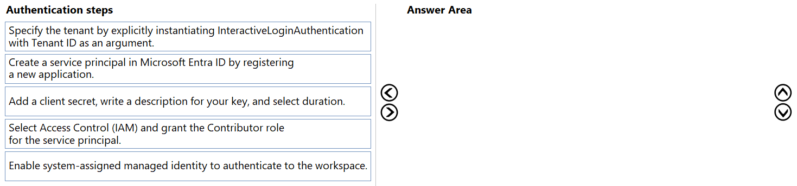

  
Show Suggested Answer

  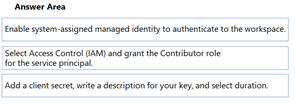

---

## Question 456 | [Link](https://www.examtopics.com/discussions/microsoft/view/305406-exam-dp-100-topic-4-question-86-discussion/){:target="_blank"}

DRAG DROP

-

You are designing an Azure Machine Learning solution.

The model must be trained by using automated machine learning. The compute must be a shared resource with users in the Azure Machine Learning workspace. After you train the model, it must be deployed for batch scoring on a serverless compute.

You need to select the appropriate computation options for the solution.

Which compute options should you select for training and deployment? To answer, move the appropriate compute options to the correct project activities. You may use each compute option once, more than once, or not at all. You may need to move the split bar between panes or scroll to view content.

NOTE: Each correct selection is worth one point.

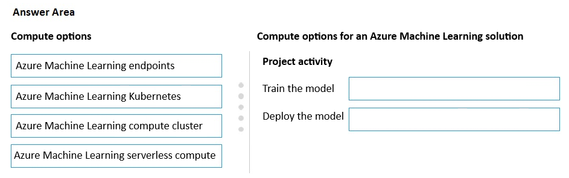

  
Show Suggested Answer

  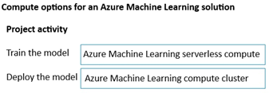

---

## Question 457 | [Link](https://www.examtopics.com/discussions/microsoft/view/305407-exam-dp-100-topic-4-question-87-discussion/){:target="_blank"}

You manage an Azure Machine Learning workspace. You use Azure Machine Learning Python SDK v2 to configure a trigger to schedule a pipeline job.

You need to create a time-based schedule with recurrence pattern.

Which two properties must you use to successfully configure the trigger? Each correct answer presents part of the solution.

NOTE: Each correct selection is worth one point.

* A.interval
* B.start_time
* C.schedule
* D.time_zone
* E.frequency

  
Show Suggested Answer

  AE

---

## Question 458 | [Link](https://www.examtopics.com/discussions/microsoft/view/51975-exam-dp-100-topic-5-question-1-discussion/){:target="_blank"}

You are a data scientist working for a bank and have used Azure ML to train and register a machine learning model that predicts whether a customer is likely to repay a loan.

You want to understand how your model is making selections and must be sure that the model does not violate government regulations such as denying loans based on where an applicant lives.

You need to determine the extent to which each feature in the customer data is influencing predictions.

What should you do?

* A.Enable data drift monitoring for the model and its training dataset.
* B.Score the model against some test data with known label values and use the results to calculate a confusion matrix.
* C.Use the Hyperdrive library to test the model with multiple hyperparameter values.
* D.Use the interpretability package to generate an explainer for the model.
* E.Add tags to the model registration indicating the names of the features in the training dataset.

  
Show Suggested Answer

  D

---

## Question 459 | [Link](https://www.examtopics.com/discussions/microsoft/view/46440-exam-dp-100-topic-5-question-2-discussion/){:target="_blank"}

HOTSPOT -

You write code to retrieve an experiment that is run from your Azure Machine Learning workspace.

The run used the model interpretation support in Azure Machine Learning to generate and upload a model explanation.

Business managers in your organization want to see the importance of the features in the model.

You need to print out the model features and their relative importance in an output that looks similar to the following.

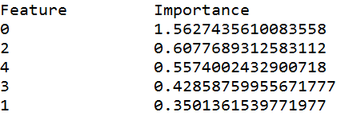

How should you complete the code? To answer, select the appropriate options in the answer area.

NOTE: Each correct selection is worth one point.

Hot Area:

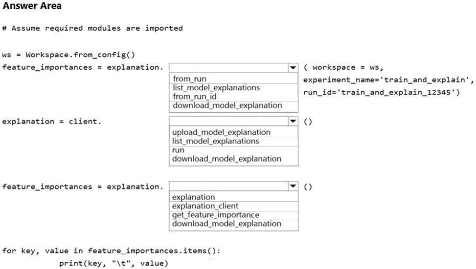

  
Show Suggested Answer

  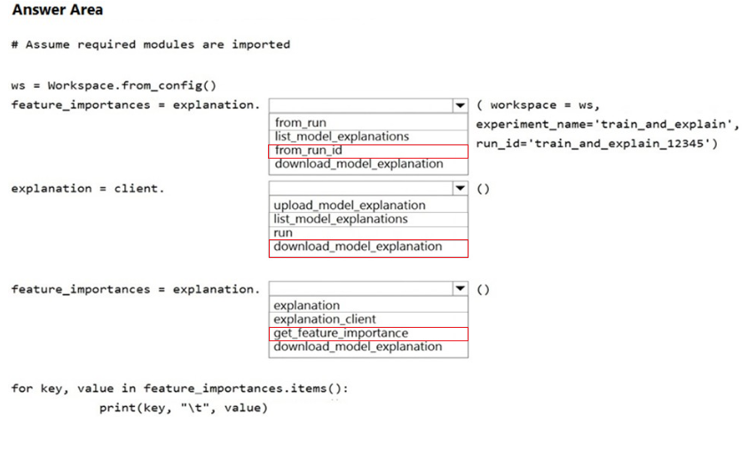

---

## Question 460 | [Link](https://www.examtopics.com/discussions/microsoft/view/36685-exam-dp-100-topic-5-question-3-discussion/){:target="_blank"}

Note: This question is part of a series of questions that present the same scenario. Each question in the series contains a unique solution that might meet the stated goals. Some question sets might have more than one correct solution, while others might not have a correct solution.

After you answer a question in this section, you will NOT be able to return to it. As a result, these questions will not appear in the review screen.

You train a classification model by using a logistic regression algorithm.

You must be able to explain the model's predictions by calculating the importance of each feature, both as an overall global relative importance value and as a measure of local importance for a specific set of predictions.

You need to create an explainer that you can use to retrieve the required global and local feature importance values.

Solution: Create a MimicExplainer.

Does the solution meet the goal?

* A.Yes
* B.No

  
Show Suggested Answer

  A

---

## Question 461 | [Link](https://www.examtopics.com/discussions/microsoft/view/47071-exam-dp-100-topic-5-question-4-discussion/){:target="_blank"}

Note: This question is part of a series of questions that present the same scenario. Each question in the series contains a unique solution that might meet the stated goals. Some question sets might have more than one correct solution, while others might not have a correct solution.

After you answer a question in this section, you will NOT be able to return to it. As a result, these questions will not appear in the review screen.

You train a classification model by using a logistic regression algorithm.

You must be able to explain the model's predictions by calculating the importance of each feature, both as an overall global relative importance value and as a measure of local importance for a specific set of predictions.

You need to create an explainer that you can use to retrieve the required global and local feature importance values.

Solution: Create a TabularExplainer.

Does the solution meet the goal?

* A.Yes
* B.No

  
Show Suggested Answer

  A

---

## Question 462 | [Link](https://www.examtopics.com/discussions/microsoft/view/37044-exam-dp-100-topic-5-question-5-discussion/){:target="_blank"}

Note: This question is part of a series of questions that present the same scenario. Each question in the series contains a unique solution that might meet the stated goals. Some question sets might have more than one correct solution, while others might not have a correct solution.

After you answer a question in this section, you will NOT be able to return to it. As a result, these questions will not appear in the review screen.

You train a classification model by using a logistic regression algorithm.

You must be able to explain the model's predictions by calculating the importance of each feature, both as an overall global relative importance value and as a measure of local importance for a specific set of predictions.

You need to create an explainer that you can use to retrieve the required global and local feature importance values.

Solution: Create a PFIExplainer.

Does the solution meet the goal?

* A.Yes
* B.No

  
Show Suggested Answer

  B

---

## Question 463 | [Link](https://www.examtopics.com/discussions/microsoft/view/20989-exam-dp-100-topic-5-question-6-discussion/){:target="_blank"}

HOTSPOT -

You are performing feature scaling by using the scikit-learn Python library for x.1 x2, and x3 features.

Original and scaled data is shown in the following image.

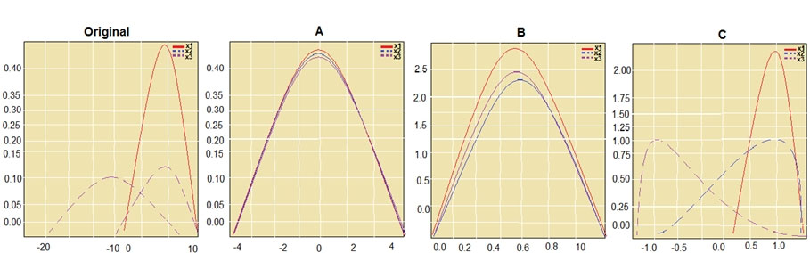

Use the drop-down menus to select the answer choice that answers each question based on the information presented in the graphic.

NOTE: Each correct selection is worth one point.

Hot Area:

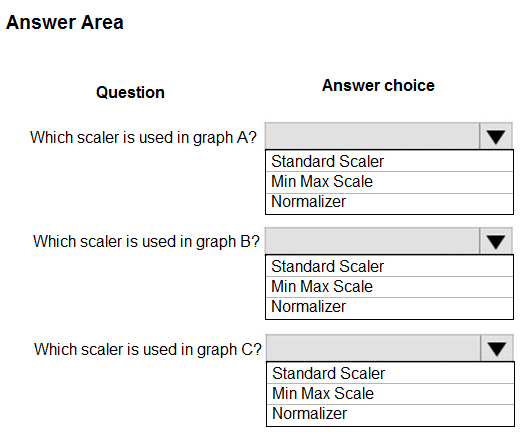

  
Show Suggested Answer

  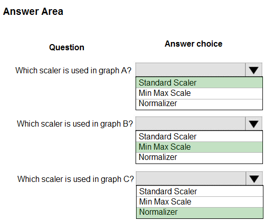

---

## Question 464 | [Link](https://www.examtopics.com/discussions/microsoft/view/21282-exam-dp-100-topic-5-question-7-discussion/){:target="_blank"}

You are determining if two sets of data are significantly different from one another by using Azure Machine Learning Studio.

Estimated values in one set of data may be more than or less than reference values in the other set of data. You must produce a distribution that has a constant

Type I error as a function of the correlation.

You need to produce the distribution.

Which type of distribution should you produce?

* A.Unpaired t-test with a two-tail option
* B.Unpaired t-test with a one-tail option
* C.Paired t-test with a one-tail option
* D.Paired t-test with a two-tail option

  
Show Suggested Answer

  D

---

## Question 465 | [Link](https://www.examtopics.com/discussions/microsoft/view/20990-exam-dp-100-topic-5-question-8-discussion/){:target="_blank"}

DRAG DROP -

You are producing a multiple linear regression model in Azure Machine Learning Studio.

Several independent variables are highly correlated.

You need to select appropriate methods for conducting effective feature engineering on all the data.

Which three actions should you perform in sequence? To answer, move the appropriate actions from the list of actions to the answer area and arrange them in the correct order.

Select and Place:

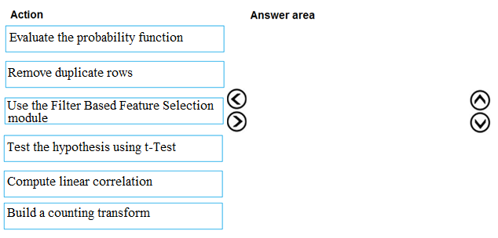

  
Show Suggested Answer

  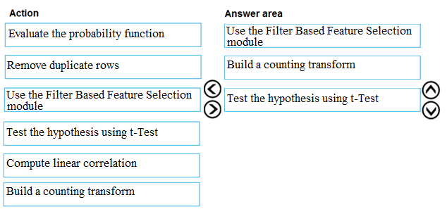

---

## Question 466 | [Link](https://www.examtopics.com/discussions/microsoft/view/20314-exam-dp-100-topic-5-question-9-discussion/){:target="_blank"}

You are performing feature engineering on a dataset.

You must add a feature named CityName and populate the column value with the text London.

You need to add the new feature to the dataset.

Which Azure Machine Learning Studio module should you use?

* A.Extract N-Gram Features from Text
* B.Edit Metadata
* C.Preprocess Text
* D.Apply SQL Transformation

  
Show Suggested Answer

  D

---

## Question 467 | [Link](https://www.examtopics.com/discussions/microsoft/view/60523-exam-dp-100-topic-5-question-10-discussion/){:target="_blank"}

Note: This question is part of a series of questions that present the same scenario. Each question in the series contains a unique solution that might meet the stated goals. Some question sets might have more than one correct solution, while others might not have a correct solution.

After you answer a question in this section, you will NOT be able to return to it. As a result, these questions will not appear in the review screen.

You are creating a model to predict the price of a student's artwork depending on the following variables: the student's length of education, degree type, and art form.

You start by creating a linear regression model.

You need to evaluate the linear regression model.

Solution: Use the following metrics: Mean Absolute Error, Root Mean Absolute Error, Relative Absolute Error, Relative Squared Error, and the Coefficient of

Determination.

Does the solution meet the goal?

* A.Yes
* B.No

  
Show Suggested Answer

  A

---

## Question 468 | [Link](https://www.examtopics.com/discussions/microsoft/view/73429-exam-dp-100-topic-5-question-11-discussion/){:target="_blank"}

Note: This question is part of a series of questions that present the same scenario. Each question in the series contains a unique solution that might meet the stated goals. Some question sets might have more than one correct solution, while others might not have a correct solution.

After you answer a question in this section, you will NOT be able to return to it. As a result, these questions will not appear in the review screen.

You are creating a model to predict the price of a student's artwork depending on the following variables: the student's length of education, degree type, and art form.

You start by creating a linear regression model.

You need to evaluate the linear regression model.

Solution: Use the following metrics: Accuracy, Precision, Recall, F1 score, and AUC.

Does the solution meet the goal?

* A.Yes
* B.No

  
Show Suggested Answer

  B

---

## Question 469 | [Link](https://www.examtopics.com/discussions/microsoft/view/133329-exam-dp-100-topic-5-question-12-discussion/){:target="_blank"}

Note: This question is part of a series of questions that present the same scenario. Each question in the series contains a unique solution that might meet the stated goals. Some question sets might have more than one correct solution, while others might not have a correct solution.

After you answer a question in this section, you will NOT be able to return to it. As a result, these questions will not appear in the review screen.

You are creating a model to predict the price of a student's artwork depending on the following variables: the student's length of education, degree type, and art form.

You start by creating a linear regression model.

You need to evaluate the linear regression model.

Solution: Use the following metrics: Relative Squared Error, Coefficient of Determination, Accuracy, Precision, Recall, F1 score, and AUC.

Does the solution meet the goal?

* A.Yes
* B.No

  
Show Suggested Answer

  B

---

## Question 470 | [Link](https://www.examtopics.com/discussions/microsoft/view/48290-exam-dp-100-topic-5-question-13-discussion/){:target="_blank"}

You are a data scientist creating a linear regression model.

You need to determine how closely the data fits the regression line.

Which metric should you review?

* A.Root Mean Square Error
* B.Coefficient of determination
* C.Recall
* D.Precision
* E.Mean absolute error

  
Show Suggested Answer

  B

---

## Question 471 | [Link](https://www.examtopics.com/discussions/microsoft/view/40844-exam-dp-100-topic-5-question-14-discussion/){:target="_blank"}

You are creating a binary classification by using a two-class logistic regression model.

You need to evaluate the model results for imbalance.

Which evaluation metric should you use?

* A.Relative Absolute Error
* B.AUC Curve
* C.Mean Absolute Error
* D.Relative Squared Error
* E.Accuracy
* F.Root Mean Square Error

  
Show Suggested Answer

  B

---

## Question 472 | [Link](https://www.examtopics.com/discussions/microsoft/view/57626-exam-dp-100-topic-5-question-15-discussion/){:target="_blank"}

HOTSPOT -

You are developing a linear regression model in Azure Machine Learning Studio. You run an experiment to compare different algorithms.

The following image displays the results dataset output:

Use the drop-down menus to select the answer choice that answers each question based on the information presented in the image.

NOTE: Each correct selection is worth one point.

Hot Area:

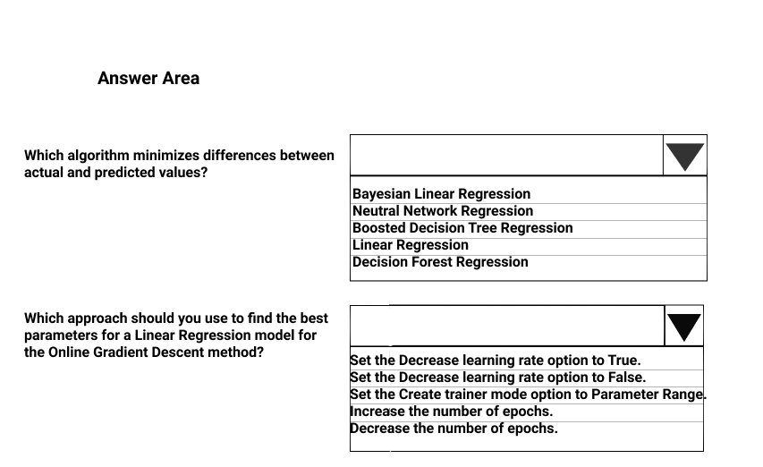

  
Show Suggested Answer

  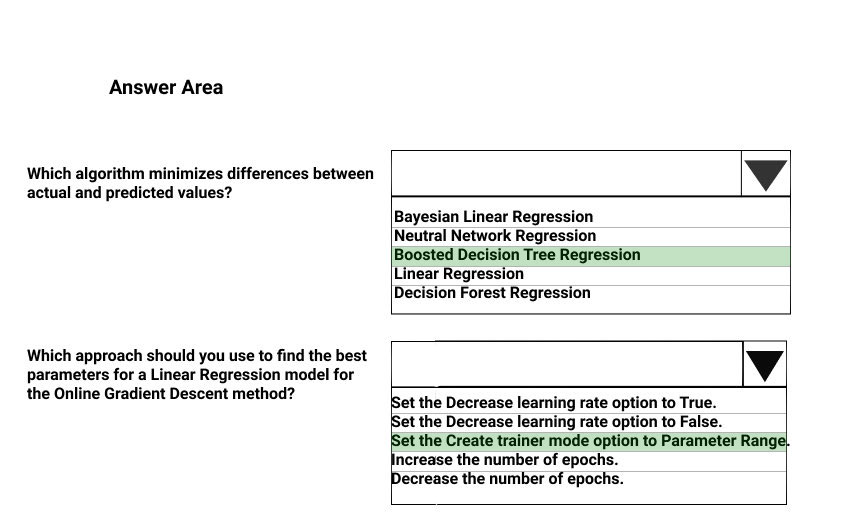

---

## Question 473 | [Link](https://www.examtopics.com/discussions/microsoft/view/30979-exam-dp-100-topic-5-question-16-discussion/){:target="_blank"}

HOTSPOT -

You are using a decision tree algorithm. You have trained a model that generalizes well at a tree depth equal to 10.

You need to select the bias and variance properties of the model with varying tree depth values.

Which properties should you select for each tree depth? To answer, select the appropriate options in the answer area.

Hot Area:

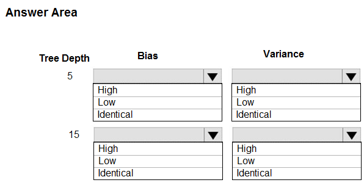

  
Show Suggested Answer

  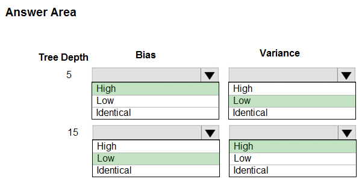

---

## Question 474 | [Link](https://www.examtopics.com/discussions/microsoft/view/20351-exam-dp-100-topic-5-question-17-discussion/){:target="_blank"}

DRAG DROP -

You have a model with a large difference between the training and validation error values.

You must create a new model and perform cross-validation.

You need to identify a parameter set for the new model using Azure Machine Learning Studio.

Which module you should use for each step? To answer, drag the appropriate modules to the correct steps. Each module may be used once or more than once, or not at all. You may need to drag the split bar between panes or scroll to view content.

NOTE: Each correct selection is worth one point.

Select and Place:

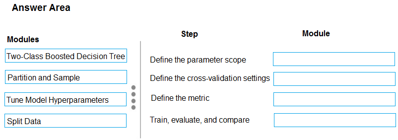

  
Show Suggested Answer

  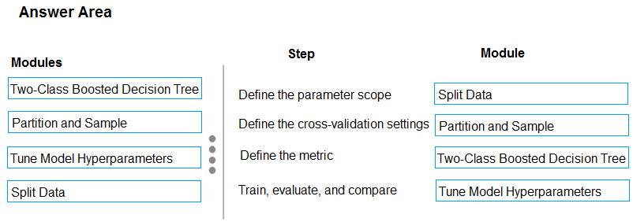

---

## Question 475 | [Link](https://www.examtopics.com/discussions/microsoft/view/20376-exam-dp-100-topic-5-question-18-discussion/){:target="_blank"}

HOTSPOT -

You are analyzing the asymmetry in a statistical distribution.

The following image contains two density curves that show the probability distribution of two datasets.

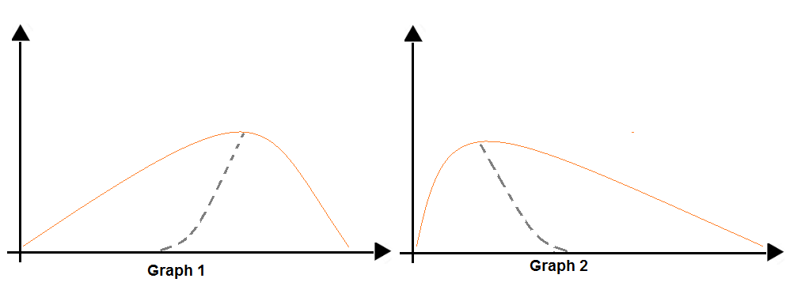

Use the drop-down menus to select the answer choice that answers each question based on the information presented in the graphic.

NOTE: Each correct selection is worth one point.

Hot Area:

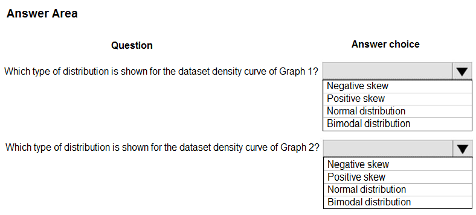

  
Show Suggested Answer

  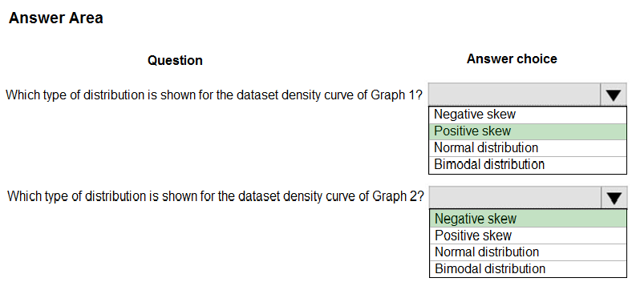

---

## Question 476 | [Link](https://www.examtopics.com/discussions/microsoft/view/20352-exam-dp-100-topic-5-question-19-discussion/){:target="_blank"}

You are a data scientist building a deep convolutional neural network (CNN) for image classification.

The CNN model you build shows signs of overfitting.

You need to reduce overfitting and converge the model to an optimal fit.

Which two actions should you perform? Each correct answer presents a complete solution.

NOTE: Each correct selection is worth one point.

* A.Add an additional dense layer with 512 input units.
* B.Add L1/L2 regularization.
* C.Use training data augmentation.
* D.Reduce the amount of training data.
* E.Add an additional dense layer with 64 input units.

  
Show Suggested Answer

  BC

---

## Question 477 | [Link](https://www.examtopics.com/discussions/microsoft/view/33239-exam-dp-100-topic-5-question-20-discussion/){:target="_blank"}

Note: This question is part of a series of questions that present the same scenario. Each question in the series contains a unique solution that might meet the stated goals. Some question sets might have more than one correct solution, while others might not have a correct solution.

After you answer a question in this section, you will NOT be able to return to it. As a result, these questions will not appear in the review screen.

You are creating a model to predict the price of a student's artwork depending on the following variables: the student's length of education, degree type, and art form.

You start by creating a linear regression model.

You need to evaluate the linear regression model.

Solution: Use the following metrics: Mean Absolute Error, Root Mean Absolute Error, Relative Absolute Error, Accuracy, Precision, Recall, F1 score, and AUC.

Does the solution meet the goal?

* A.Yes
* B.No

  
Show Suggested Answer

  B

---

## Question 478 | [Link](https://www.examtopics.com/discussions/microsoft/view/57627-exam-dp-100-topic-5-question-21-discussion/){:target="_blank"}

You are building a binary classification model by using a supplied training set.

The training set is imbalanced between two classes.

You need to resolve the data imbalance.

What are three possible ways to achieve this goal? Each correct answer presents a complete solution.

NOTE: Each correct selection is worth one point.

* A.Penalize the classification
* B.Resample the dataset using undersampling or oversampling
* C.Normalize the training feature set
* D.Generate synthetic samples in the minority class
* E.Use accuracy as the evaluation metric of the model

  
Show Suggested Answer

  ABD

---

## Question 479 | [Link](https://www.examtopics.com/discussions/microsoft/view/57101-exam-dp-100-topic-5-question-22-discussion/){:target="_blank"}

HOTSPOT -

You train a classification model by using a decision tree algorithm.

You create an estimator by running the following Python code. The variable feature_names is a list of all feature names, and class_names is a list of all class names. from interpret.ext.blackbox import TabularExplainer explainer = TabularExplainer(model, x_train, features=feature_names, classes=class_names)

You need to explain the predictions made by the model for all classes by determining the importance of all features.

For each of the following statements, select Yes if the statement is true. Otherwise, select No.

NOTE: Each correct selection is worth one point.

Hot Area:

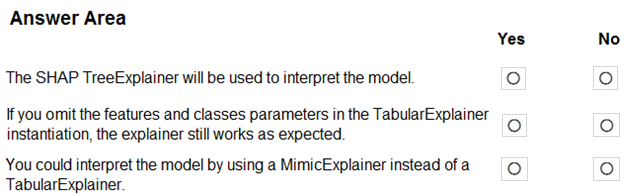

  
Show Suggested Answer

  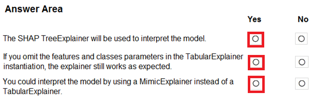

---

## Question 480 | [Link](https://www.examtopics.com/discussions/microsoft/view/70563-exam-dp-100-topic-5-question-23-discussion/){:target="_blank"}

DRAG DROP -

You have several machine learning models registered in an Azure Machine Learning workspace.

You must use the Fairlearn dashboard to assess fairness in a selected model.

Which three actions should you perform in sequence? To answer, move the appropriate actions from the list of actions to the answer area and arrange them in the correct order.

Select and Place:

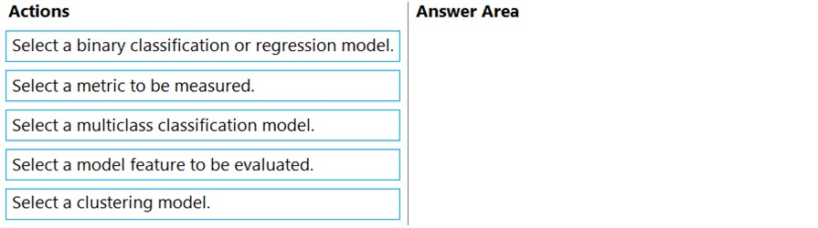

  
Show Suggested Answer

  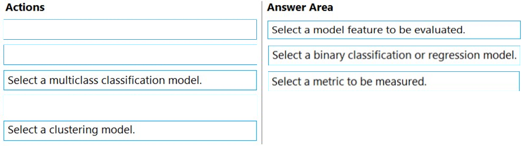

---

## Question 481 | [Link](https://www.examtopics.com/discussions/microsoft/view/70564-exam-dp-100-topic-5-question-24-discussion/){:target="_blank"}

HOTSPOT -

A biomedical research company plans to enroll people in an experimental medical treatment trial.

You create and train a binary classification model to support selection and admission of patients to the trial. The model includes the following features: Age,

Gender, and Ethnicity.

The model returns different performance metrics for people from different ethnic groups.

You need to use Fairlearn to mitigate and minimize disparities for each category in the Ethnicity feature.

Which technique and constraint should you use? To answer, select the appropriate options in the answer area.

NOTE: Each correct selection is worth one point.

Hot Area:

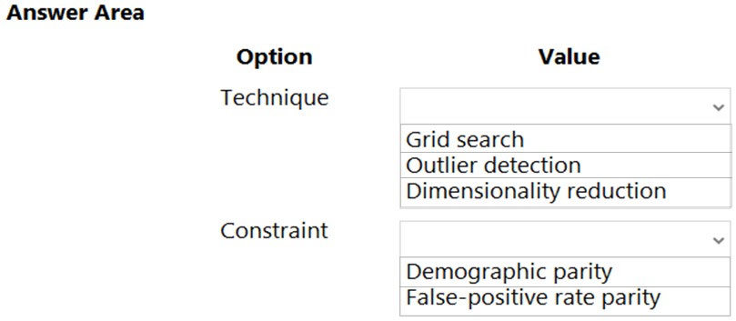

  
Show Suggested Answer

  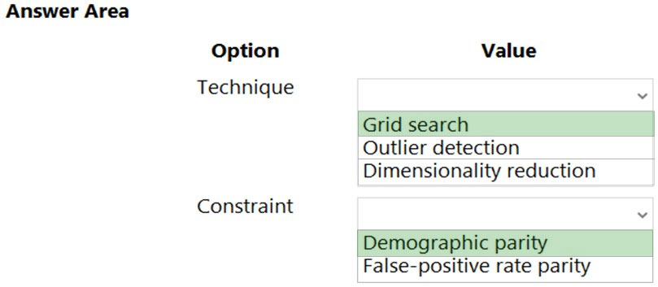

---

## Question 482 | [Link](https://www.examtopics.com/discussions/microsoft/view/85978-exam-dp-100-topic-5-question-25-discussion/){:target="_blank"}

You create a binary classification model. The model is registered in an Azure Machine Learning workspace. You use the Azure Machine Learning Fairness SDK to assess the model fairness.

You develop a training script for the model on a local machine.

You need to load the model fairness metrics into Azure Machine Learning studio.

What should you do?

* A.Implement the download_dashboard_by_upload_id function
* B.Implement the create_group_metric_set function
* C.Implement the upload_dashboard_dictionary function
* D.Upload the training script

  
Show Suggested Answer

  C

---

## Question 483 | [Link](https://www.examtopics.com/discussions/microsoft/view/78863-exam-dp-100-topic-5-question-26-discussion/){:target="_blank"}

You have a dataset that includes confidential data. You use the dataset to train a model.

You must use a differential privacy parameter to keep the data of individuals safe and private.

You need to reduce the effect of user data on aggregated results.

What should you do?

* A.Decrease the value of the epsilon parameter to reduce the amount of noise added to the data
* B.Increase the value of the epsilon parameter to decrease privacy and increase accuracy
* C.Decrease the value of the epsilon parameter to increase privacy and reduce accuracy
* D.Set the value of the epsilon parameter to 1 to ensure maximum privacy

  
Show Suggested Answer

  C

---

## Question 484 | [Link](https://www.examtopics.com/discussions/microsoft/view/81374-exam-dp-100-topic-5-question-27-discussion/){:target="_blank"}

HOTSPOT -

You create an Azure Machine Learning workspace and load a Python training script named train.py in the src subfolder. The dataset used to train your model is available locally.

You run the following script to train the model:

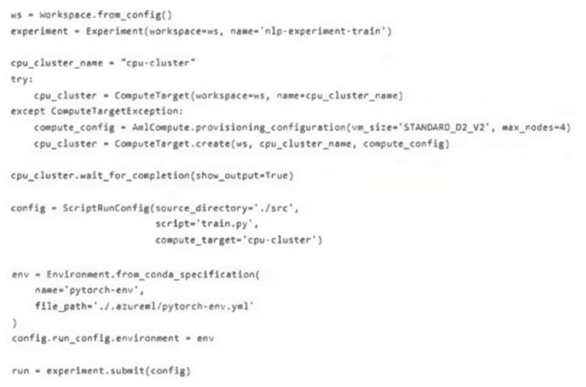

Instructions: For each of the following statements, select Yes if the statement is true. Otherwise, select No.

NOTE: Each correct selection is worth one point.

Hot Area:

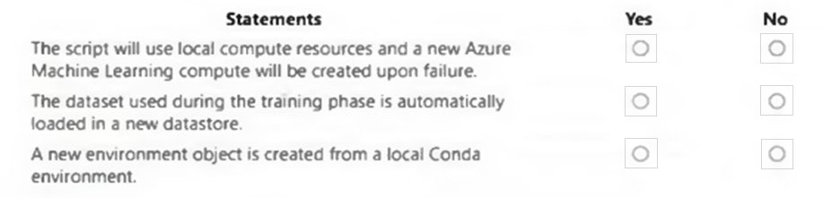

  
Show Suggested Answer

  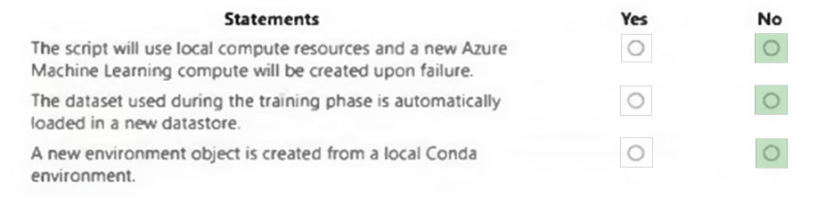

---

## Question 485 | [Link](https://www.examtopics.com/discussions/microsoft/view/79813-exam-dp-100-topic-5-question-28-discussion/){:target="_blank"}

You develop a machine learning project on a local machine. The project uses the Azure Machine Learning SDK for Python. You use Git as version control for scripts.

You submit a training run that returns a Run object.

You need to retrieve the active Git branch for the training run.

Which two code segments should you use? Each correct answer presents part of the solution.

NOTE: Each correct selection is worth one point.

* A.details = run.get_environment()
* B.details.properties['azureml.git.branch']
* C.details.properties['azureml.git.commit']
* D.details = run.get_details()

  
Show Suggested Answer

  BD

---

## Question 486 | [Link](https://www.examtopics.com/discussions/microsoft/view/78891-exam-dp-100-topic-5-question-29-discussion/){:target="_blank"}

You are attaching an Azure Databricks-based compute resource to an Azure Machine Learning development workspace.

You need to configure parameters to attach the resource.

Which three parameters should you use? Each correct answer presents part of the solution.

NOTE: Each correct selection is worth one point.

* A.Workspace name
* B.Compute name
* C.Workspace user credentials
* D.Workspace resource ID
* E.Access token

  
Show Suggested Answer

  ABE

---

## Question 487 | [Link](https://www.examtopics.com/discussions/microsoft/view/80936-exam-dp-100-topic-5-question-30-discussion/){:target="_blank"}

HOTSPOT -

You are developing a two-step Azure Machine Learning pipeline by using the Azure Machine Learning SDK for Python.

The pipeline must pass temporary data from the first step to the second step.

You need to configure the second step to ensure that it can use the temporary data from the first step.

Which class and method should you use? To answer, select the appropriate options in the answer area.

NOTE: Each correct selection is worth one point.

Hot Area:

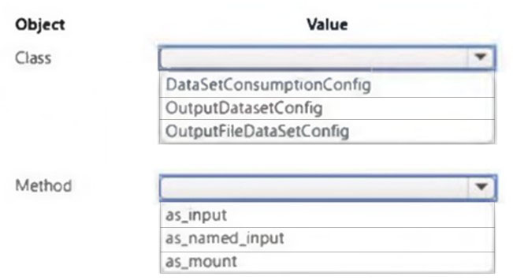

  
Show Suggested Answer

  

---

## Question 488 | [Link](https://www.examtopics.com/discussions/microsoft/view/78885-exam-dp-100-topic-5-question-31-discussion/){:target="_blank"}

DRAG DROP -

You use a training pipeline in the Azure Machine Learning designer. You register a datastore named ds1. The datastore contains multiple training data files. You use the Import Data module with the configured datastore.

You need to retrain a model on a different set of data files.

Which four actions should you perform in sequence? To answer, move the appropriate actions from the list of actions to the answer area and arrange them in the correct order.

Select and Place:

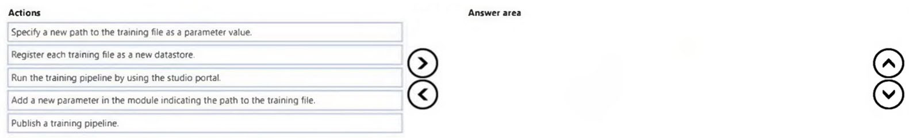

  
Show Suggested Answer

  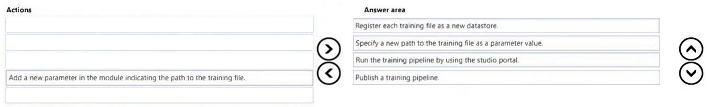

---

## Question 489 | [Link](https://www.examtopics.com/discussions/microsoft/view/78890-exam-dp-100-topic-5-question-32-discussion/){:target="_blank"}

You create a binary classification model. You use the Fairlearn package to assess model fairness.

You must eliminate the need to retrain the model.

You need to implement the Fairlearn package.

Which algorithm should you use?

* A.fairlearn.reductions.ExponentiatedGradient
* B.fairlearn.postprocessing.ThresholdOptimizer
* C.fairlearnpreprocessing.CorrelationRemover
* D.fairlearn.reductions.GridSearch

  
Show Suggested Answer

  B

---

## Question 490 | [Link](https://www.examtopics.com/discussions/microsoft/view/81149-exam-dp-100-topic-5-question-33-discussion/){:target="_blank"}

You have an Azure Machine Learning workspace named workspace1.

You must add a datastore that connects an Azure Blob storage container to workspace1. You must be able to configure a privilege level.

You need to configure authentication.

Which authentication method should you use?

* A.Service principal
* B.Account key
* C.SAS token
* D.Managed identity

  
Show Suggested Answer

  C

---

## Question 491 | [Link](https://www.examtopics.com/discussions/microsoft/view/81124-exam-dp-100-topic-5-question-34-discussion/){:target="_blank"}

You plan to create a compute instance as part of an Azure Machine Learning development workspace.

You must interactively debug code running on the compute instance by using Visual Studio Code Remote.

You need to provision the compute instance.

What should you do?

* A.Enable Remote Desktop Protocol (RDP) access.
* B.Modify role-based access control (RBAC) settings at the workspace level.
* C.Enable Secure Shell Protocol (SSH) access.
* D.Modify role-based access control (RBAC) settings at the compute instance level.

  
Show Suggested Answer

  C

---

## Question 492 | [Link](https://www.examtopics.com/discussions/microsoft/view/78898-exam-dp-100-topic-5-question-35-discussion/){:target="_blank"}

You have a dataset that contains salary information for users. You plan to generate an aggregate salary report that shows average salaries by city.

Privacy of individuals must be preserved without impacting accuracy, completeness, or reliability of the data. The aggregation must be statistically consistent with the distribution of the original data. You must return an approximation of the data instead of the raw data.

You need to apply a differential privacy approach.

What should you do?

* A.Add noise to the salary data during the analysis
* B.Encrypt the salary data before analysis
* C.Remove the salary data
* D.Convert the salary data to the average column value

  
Show Suggested Answer

  A

---

## Question 493 | [Link](https://www.examtopics.com/discussions/microsoft/view/104304-exam-dp-100-topic-5-question-36-discussion/){:target="_blank"}

HOTSPOT

-

You have a binary classifier that predicts positive cases of diabetes within two separate age groups.

The classifier exhibits a high degree of disparity between the age groups.

You need to modify the output of the classifier to maximize its degree of fairness across the age groups and meet the following requirements:

•	Eliminate the need to retrain the model on which the classifier is based.

•	Minimize the disparity between true positive rates and false positive rates across age groups.

Which algorithm and parity constraint should you use? To answer, select the appropriate options in the answer area.

NOTE: Each correct selection is worth one point.

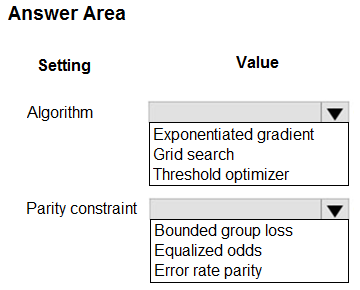

  
Show Suggested Answer

  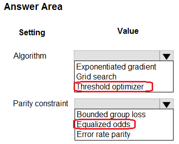

---

## Question 494 | [Link](https://www.examtopics.com/discussions/microsoft/view/150036-exam-dp-100-topic-5-question-37-discussion/){:target="_blank"}

You manage an Azure Machine Learning workspace. You build a model for which you must configure a Responsible AI dashboard.

Based on what you learn from the dashboard, you must perform the following activities:

•	Determine what must be done to get a desirable outcome from the model.

•	Identify the features that have the most direct effect on your outcome of interest.

You need to select the components to use for the Responsible AI dashboard configuration.

Which two components should you add? Each correct answer presents part of the solution.

NOTE: Each correct selection is worth one point.

* A.error analysis
* B.counterfactuals
* C.explanation
* D.causal

  
Show Suggested Answer

  BD

---

## Question 495 | [Link](https://www.examtopics.com/discussions/microsoft/view/12106-exam-dp-100-topic-6-question-1-discussion/){:target="_blank"}

You need to implement a scaling strategy for the local penalty detection data.

Which normalization type should you use?

* A.Streaming
* B.Weight
* C.Batch
* D.Cosine

  
Show Suggested Answer

  C

---

## Question 496 | [Link](https://www.examtopics.com/discussions/microsoft/view/103348-exam-dp-100-topic-6-question-1-discussion/){:target="_blank"}

You create an Azure Machine Learning workspace.

You must configure an event-driven workflow to automatically trigger upon completion of training runs in the workspace. The solution must minimize the administrative effort to configure the trigger.

You need to configure an Azure service to automatically trigger the workflow.

Which Azure service should you use?

* A.Event Grid subscription
* B.Azure Automation runbook
* C.Event Hubs Capture
* D.Event Hubs consumer

  
Show Suggested Answer

  A

---

## Question 497 | [Link](https://www.examtopics.com/discussions/microsoft/view/120693-exam-dp-100-topic-6-question-2-discussion/){:target="_blank"}

HOTSPOT

-

You plan to implement an Azure Machine Learning solution.

You have the following requirements:

•	Run a Jupyter notebook to interactively train a machine learning model.

•	Deploy assets and workflows for machine learning proof of concept by using scripting rather than custom programming.

You need to select a development technique for each requirement.

Which development technique should you use? To answer, select the appropriate options in the answer area.

NOTE: Each correct selection is worth one point.

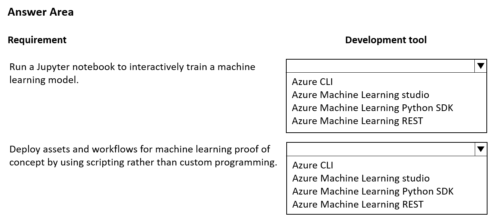

  
Show Suggested Answer

  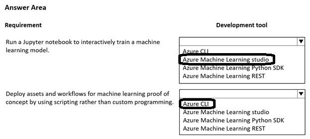

---

## Question 498 | [Link](https://www.examtopics.com/discussions/microsoft/view/36794-exam-dp-100-topic-6-question-2-discussion/){:target="_blank"}

HOTSPOT -

You need to use the Python language to build a sampling strategy for the global penalty detection models.

How should you complete the code segment? To answer, select the appropriate options in the answer area.

NOTE: Each correct selection is worth one point.

Hot Area:

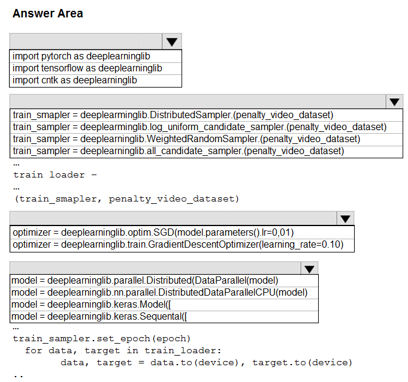

  
Show Suggested Answer

  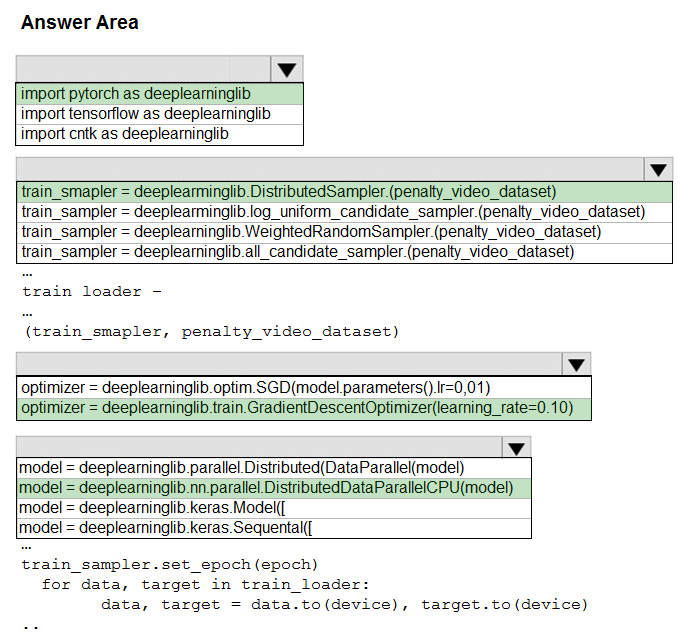

---

## Question 499 | [Link](https://www.examtopics.com/discussions/microsoft/view/114741-exam-dp-100-topic-6-question-3-discussion/){:target="_blank"}

You have an Azure Machine Learning (ML) model deployed to an online endpoint.

You need to review container logs from the endpoint by using Azure ML Python SDK v2. The logs must include the console log from the inference server, with print/log statements from the model’s scoring script.

What should you do first?

* A.Connect by using SSH to the inference server.
* B.Create an instance of the MLCIient class.
* C.Connect by using Docker tools to the inference server.
* D.Create an instance of the OnlineDeploymentOperations class.

  
Show Suggested Answer

  B

---

## Question 500 | [Link](https://www.examtopics.com/discussions/microsoft/view/30866-exam-dp-100-topic-6-question-3-discussion/){:target="_blank"}

DRAG DROP -

You need to define an evaluation strategy for the crowd sentiment models.

Which three actions should you perform in sequence? To answer, move the appropriate actions from the list of actions to the answer area and arrange them in the correct order.

Select and Place:

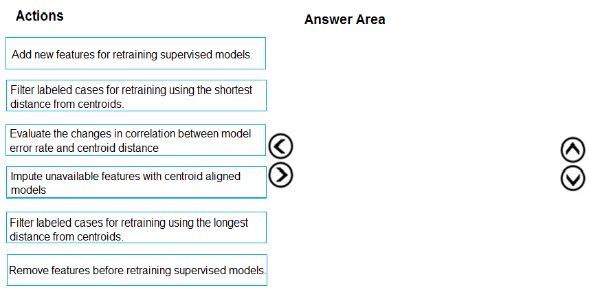

  
Show Suggested Answer

  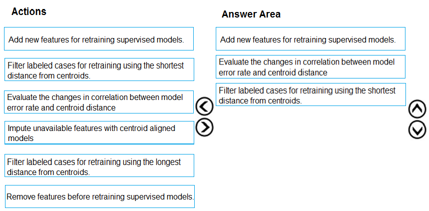

---

## Question 501 | [Link](https://www.examtopics.com/discussions/microsoft/view/53725-exam-dp-100-topic-6-question-4-discussion/){:target="_blank"}

You need to implement a feature engineering strategy for the crowd sentiment local models.

What should you do?

* A.Apply an analysis of variance (ANOVA).
* B.Apply a Pearson correlation coefficient.
* C.Apply a Spearman correlation coefficient.
* D.Apply a linear discriminant analysis.

  
Show Suggested Answer

  D

---

## Question 502 | [Link](https://www.examtopics.com/discussions/microsoft/view/143021-exam-dp-100-topic-6-question-4-discussion/){:target="_blank"}

You use an Azure Machine Learning workspace.

You must monitor cost at the endpoint and deployment level.

You have a trained model that must be deployed as an online endpoint. Users must authenticate by using Microsoft Entra ID.

What should you do?

* A.Deploy the model to Azure Kubernetes Service (AKS). During deployment, set the token_auth_mode parameter of the target configuration object to true.
* B.Deploy the model to Azure Kubernetes Service (AKS). During deployment, set the auth_mode parameter to configure the authentication type.
* C.Deploy the model to a managed online endpoint. During deployment, set the auth_mode parameter to configure the authentication type.
* D.Deploy the model to a managed online endpoint. During deployment, set the token_auth_mode parameter of the target configuration object to true.

  
Show Suggested Answer

  C

---

## Question 503 | [Link](https://www.examtopics.com/discussions/microsoft/view/157744-exam-dp-100-topic-6-question-5-discussion/){:target="_blank"}

You manage an Azure Machine Learning workspace.

You must set up an event-driven process to trigger a retraining pipeline.

You need to configure an Azure service that will trigger a retraining pipeline in response to data drift in Azure Machine Learning datasets.

Which Azure service should you use?

* A.Event Grid
* B.Azure Functions
* C.Event Hubs
* D.Logic Apps

  
Show Suggested Answer

  A

---

## Question 504 | [Link](https://www.examtopics.com/discussions/microsoft/view/37583-exam-dp-100-topic-6-question-5-discussion/){:target="_blank"}

DRAG DROP -

You need to define a modeling strategy for ad response.

Which three actions should you perform in sequence? To answer, move the appropriate actions from the list of actions to the answer area and arrange them in the correct order.

Select and Place:

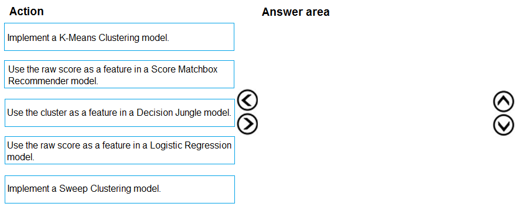

  
Show Suggested Answer

  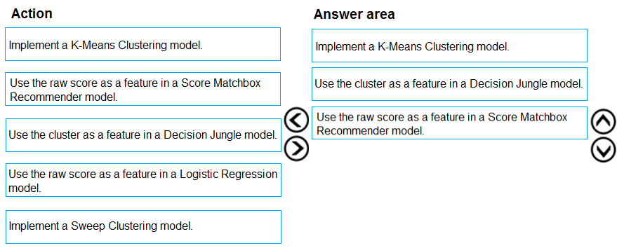

---

## Question 505 | [Link](https://www.examtopics.com/discussions/microsoft/view/40935-exam-dp-100-topic-6-question-6-discussion/){:target="_blank"}

DRAG DROP -

You need to define an evaluation strategy for the crowd sentiment models.

Which three actions should you perform in sequence? To answer, move the appropriate actions from the list of actions to the answer area and arrange them in the correct order.

Select and Place:

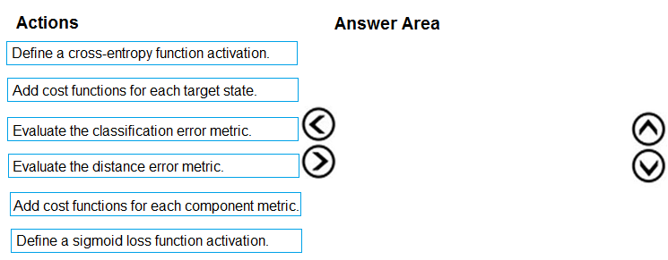

  
Show Suggested Answer

  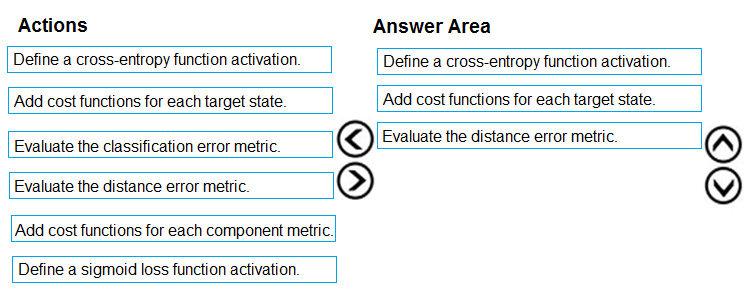

---

## Question 506 | [Link](https://www.examtopics.com/discussions/microsoft/view/306397-exam-dp-100-topic-6-question-6-discussion/){:target="_blank"}

You are designing a training job in an Azure Machine Learning workspace by using Automated ML.

During training, the compute resource must scale up to handle larger datasets.

You need to select the compute resource that has a multi-node cluster that automatically scales.

Which Azure Machine Learning compute target should you use?

* A.Compute instance
* B.Endpoints
* C.Kubernetes cluster
* D.Serverless compute

  
Show Suggested Answer

  D

---

## Question 507 | [Link](https://www.examtopics.com/discussions/microsoft/view/18924-exam-dp-100-topic-6-question-7-discussion/){:target="_blank"}

You need to implement a model development strategy to determine a user's tendency to respond to an ad.

Which technique should you use?

* A.Use a Relative Expression Split module to partition the data based on centroid distance.
* B.Use a Relative Expression Split module to partition the data based on distance travelled to the event.
* C.Use a Split Rows module to partition the data based on distance travelled to the event.
* D.Use a Split Rows module to partition the data based on centroid distance.

  
Show Suggested Answer

  A

---

## Question 508 | [Link](https://www.examtopics.com/discussions/microsoft/view/76903-exam-dp-100-topic-6-question-8-discussion/){:target="_blank"}

You need to implement a new cost factor scenario for the ad response models as illustrated in the performance curve exhibit.

Which technique should you use?

* A.Set the threshold to 0.5 and retrain if weighted Kappa deviates +/- 5% from 0.45.
* B.Set the threshold to 0.05 and retrain if weighted Kappa deviates +/- 5% from 0.5.
* C.Set the threshold to 0.2 and retrain if weighted Kappa deviates +/- 5% from 0.6.
* D.Set the threshold to 0.75 and retrain if weighted Kappa deviates +/- 5% from 0.15.

  
Show Suggested Answer

  A

---

## Question 509 | [Link](https://www.examtopics.com/discussions/microsoft/view/29410-exam-dp-100-topic-7-question-1-discussion/){:target="_blank"}

HOTSPOT -

You need to replace the missing data in the AccessibilityToHighway columns.

How should you configure the Clean Missing Data module? To answer, select the appropriate options in the answer area.

NOTE: Each correct selection is worth one point.

Hot Area:

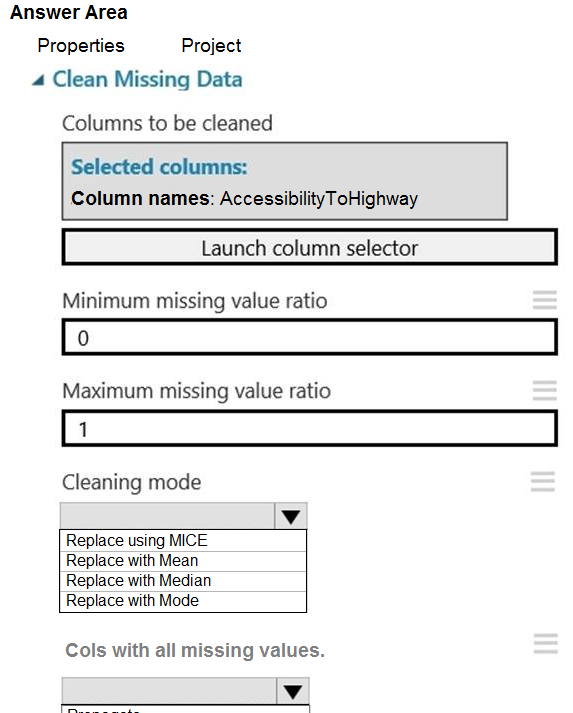

  
Show Suggested Answer

  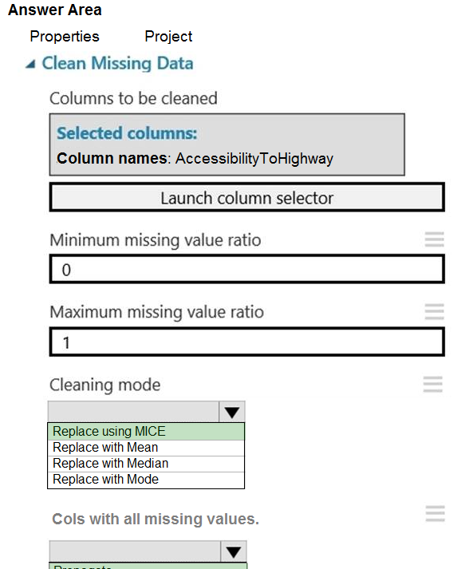

---

## Question 510 | [Link](https://www.examtopics.com/discussions/microsoft/view/20907-exam-dp-100-topic-7-question-2-discussion/){:target="_blank"}

DRAG DROP -

You need to produce a visualization for the diagnostic test evaluation according to the data visualization requirements.

Which three modules should you recommend be used in sequence? To answer, move the appropriate modules from the list of modules to the answer area and arrange them in the correct order.

Select and Place:

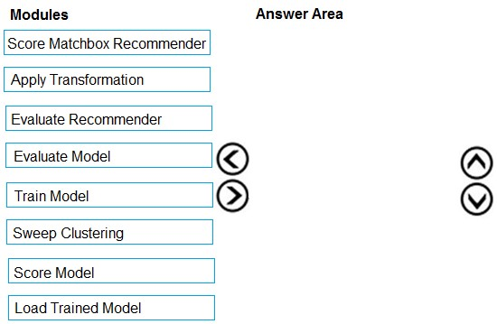

  
Show Suggested Answer

  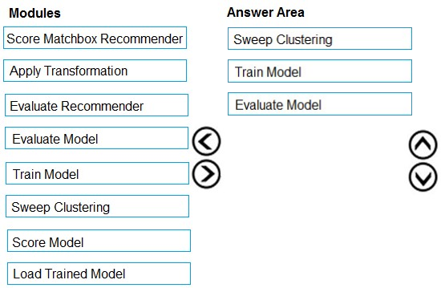

---

## Question 511 | [Link](https://www.examtopics.com/discussions/microsoft/view/25731-exam-dp-100-topic-7-question-3-discussion/){:target="_blank"}

You need to visually identify whether outliers exist in the Age column and quantify the outliers before the outliers are removed.

Which three Azure Machine Learning Studio modules should you use? Each correct answer presents part of the solution.

NOTE: Each correct selection is worth one point.

* A.Create Scatterplot
* B.Summarize Data
* C.Clip Values
* D.Replace Discrete Values
* E.Build Counting Transform

  
Show Suggested Answer

  ABC

---

## Question 512 | [Link](https://www.examtopics.com/discussions/microsoft/view/73872-exam-dp-100-topic-7-question-4-discussion/){:target="_blank"}

HOTSPOT -

You need to identify the methods for dividing the data according to the testing requirements.

Which properties should you select? To answer, select the appropriate options in the answer area.

NOTE: Each correct selection is worth one point.

Hot Area:

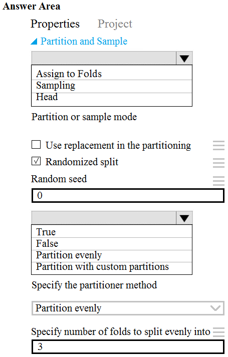

  
Show Suggested Answer

  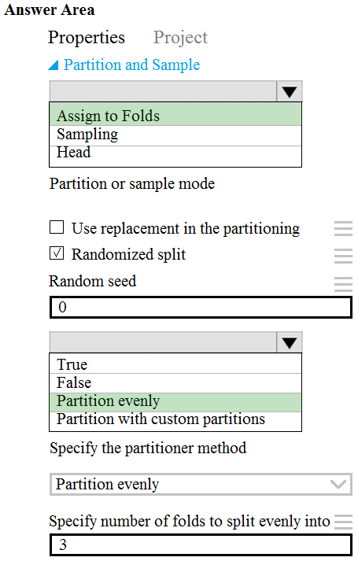

---

## Question 513 | [Link](https://www.examtopics.com/discussions/microsoft/view/20896-exam-dp-100-topic-7-question-5-discussion/){:target="_blank"}

HOTSPOT -

You need to configure the Edit Metadata module so that the structure of the datasets match.

Which configuration options should you select? To answer, select the appropriate options in the answer area.

NOTE: Each correct selection is worth one point.

Hot Area:

  
Show Suggested Answer

  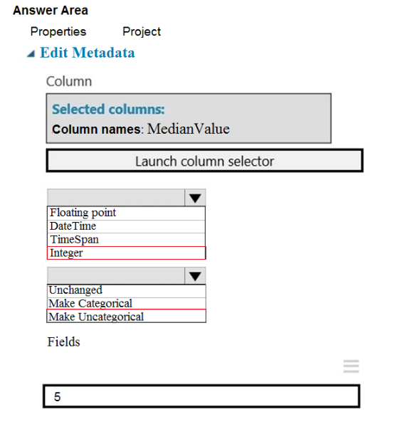

---

## Question 514 | [Link](https://www.examtopics.com/discussions/microsoft/view/20778-exam-dp-100-topic-7-question-6-discussion/){:target="_blank"}

HOTSPOT -

You need to configure the Permutation Feature Importance module for the model training requirements.

What should you do? To answer, select the appropriate options in the dialog box in the answer area.

NOTE: Each correct selection is worth one point.

Hot Area:

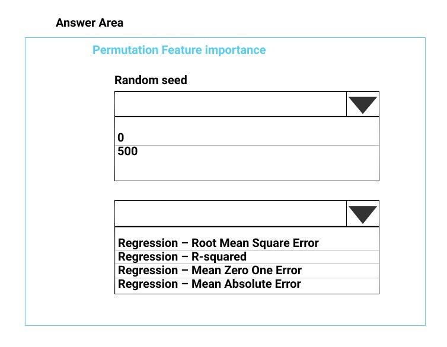

  
Show Suggested Answer

  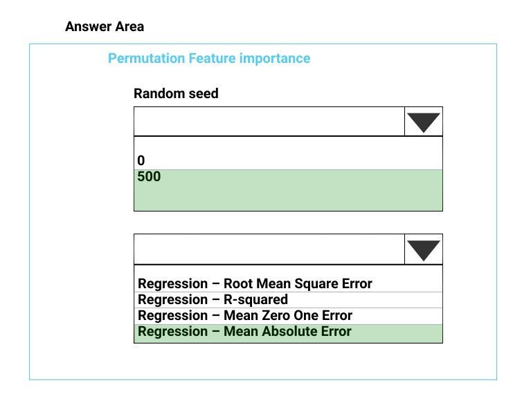

---

## Question 515 | [Link](https://www.examtopics.com/discussions/microsoft/view/41151-exam-dp-100-topic-7-question-7-discussion/){:target="_blank"}

You need to select a feature extraction method.

Which method should you use?

* A.Mutual information
* B.Pearson's correlation
* C.Spearman correlation
* D.Fisher Linear Discriminant Analysis

  
Show Suggested Answer

  C

---

## Question 516 | [Link](https://www.examtopics.com/discussions/microsoft/view/22676-exam-dp-100-topic-7-question-8-discussion/){:target="_blank"}

HOTSPOT -

You need to set up the Permutation Feature Importance module according to the model training requirements.

Which properties should you select? To answer, select the appropriate options in the answer area.

NOTE: Each correct selection is worth one point.

Hot Area:

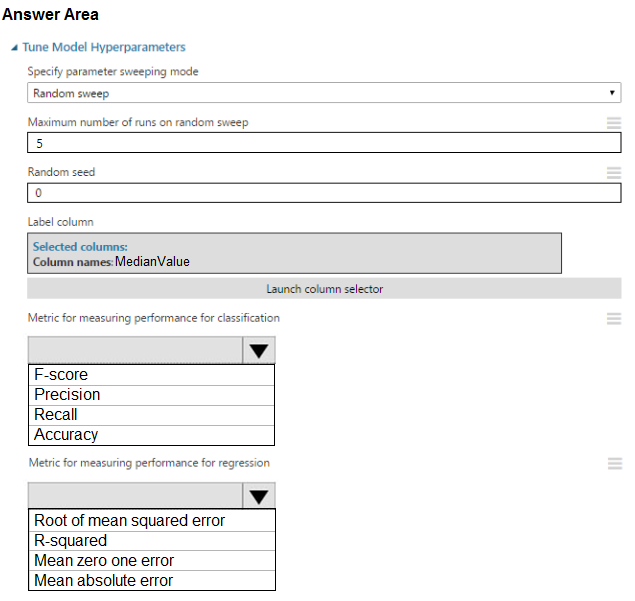

  
Show Suggested Answer

  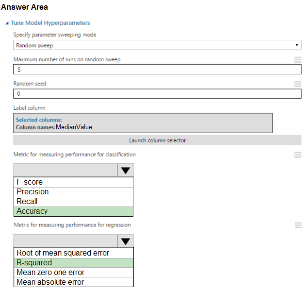

---

## Question 517 | [Link](https://www.examtopics.com/discussions/microsoft/view/30225-exam-dp-100-topic-7-question-9-discussion/){:target="_blank"}

HOTSPOT -

You need to configure the Feature Based Feature Selection module based on the experiment requirements and datasets.

How should you configure the module properties? To answer, select the appropriate options in the dialog box in the answer area.

NOTE: Each correct selection is worth one point.

Hot Area:

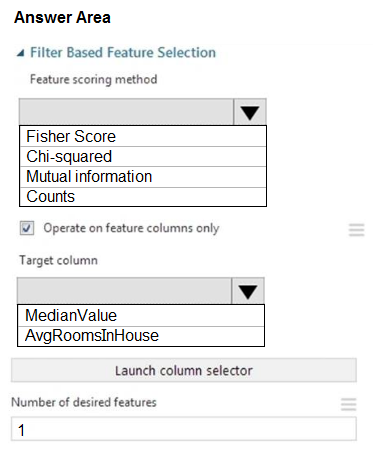

  
Show Suggested Answer

  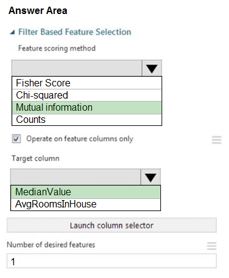

---

## Question 518 | [Link](https://www.examtopics.com/discussions/microsoft/view/37579-exam-dp-100-topic-7-question-10-discussion/){:target="_blank"}

You need to select a feature extraction method.

Which method should you use?

* A.Mutual information
* B.Mood's median test
* C.Kendall correlation
* D.Permutation Feature Importance

  
Show Suggested Answer

  C

---

## Question 519 | [Link](https://www.examtopics.com/discussions/microsoft/view/53079-exam-dp-100-topic-7-question-11-discussion/){:target="_blank"}

DRAG DROP -

You need to implement an early stopping criteria policy for model training.

Which three code segments should you use to develop the solution? To answer, move the appropriate code segments from the list of code segments to the answer area and arrange them in the correct order.

NOTE: More than one order of answer choices is correct. You will receive credit for any of the correct orders you select.

Select and Place:

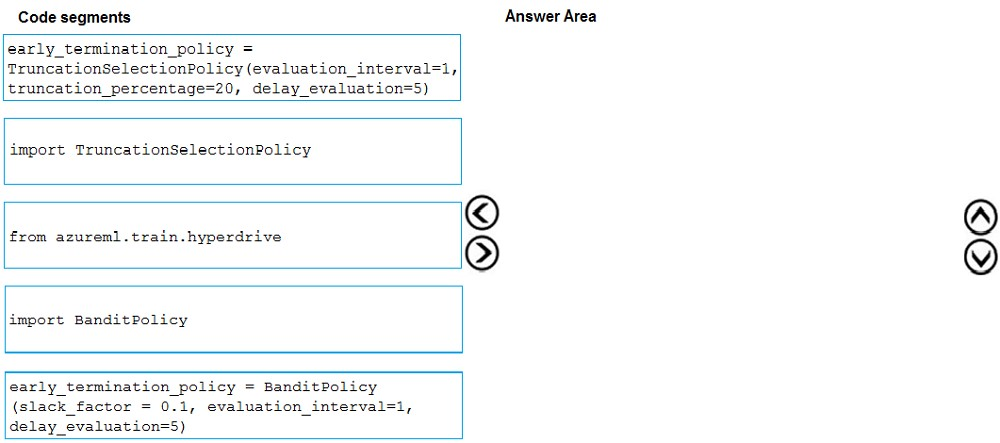

  
Show Suggested Answer

  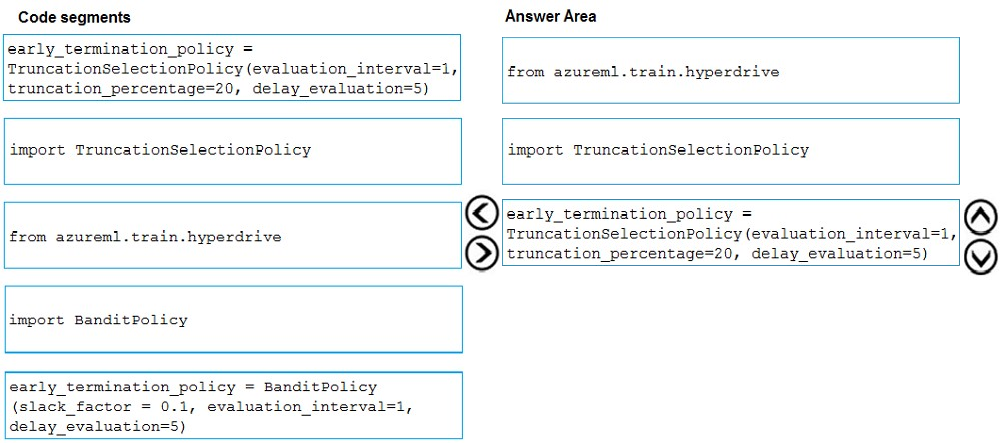

---

## Question 520 | [Link](https://www.examtopics.com/discussions/microsoft/view/46080-exam-dp-100-topic-7-question-12-discussion/){:target="_blank"}

DRAG DROP -

You need to implement early stopping criteria as stated in the model training requirements.

Which three code segments should you use to develop the solution? To answer, move the appropriate code segments from the list of code segments to the answer area and arrange them in the correct order.

NOTE: More than one order of answer choices is correct. You will receive the credit for any of the correct orders you select.

Select and Place:

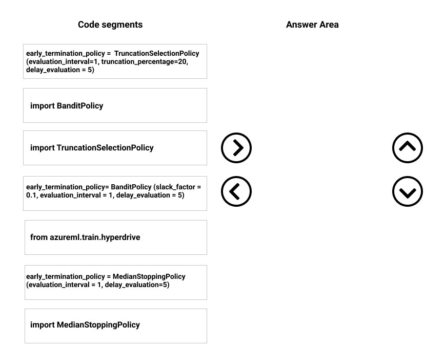

  
Show Suggested Answer

  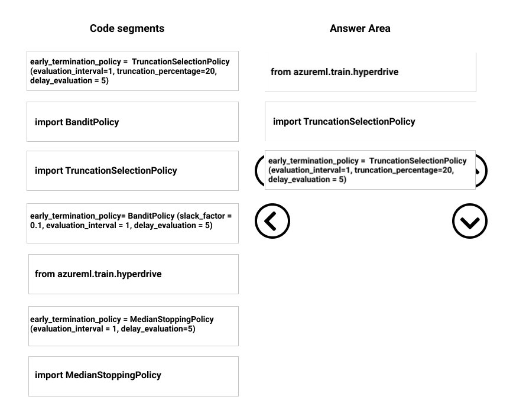

---

## Question 521 | [Link](https://www.examtopics.com/discussions/microsoft/view/59352-exam-dp-100-topic-8-question-1-discussion/){:target="_blank"}

DRAG DROP -

You need to correct the model fit issue.

Which three actions should you perform in sequence? To answer, move the appropriate actions from the list of actions to the answer area and arrange them in the correct order.

Select and Place:

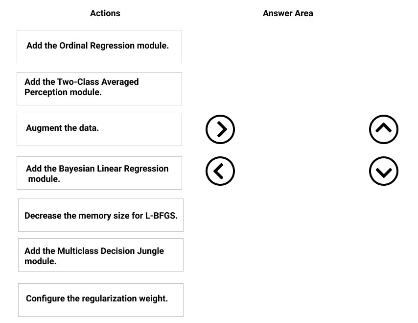

  
Show Suggested Answer

  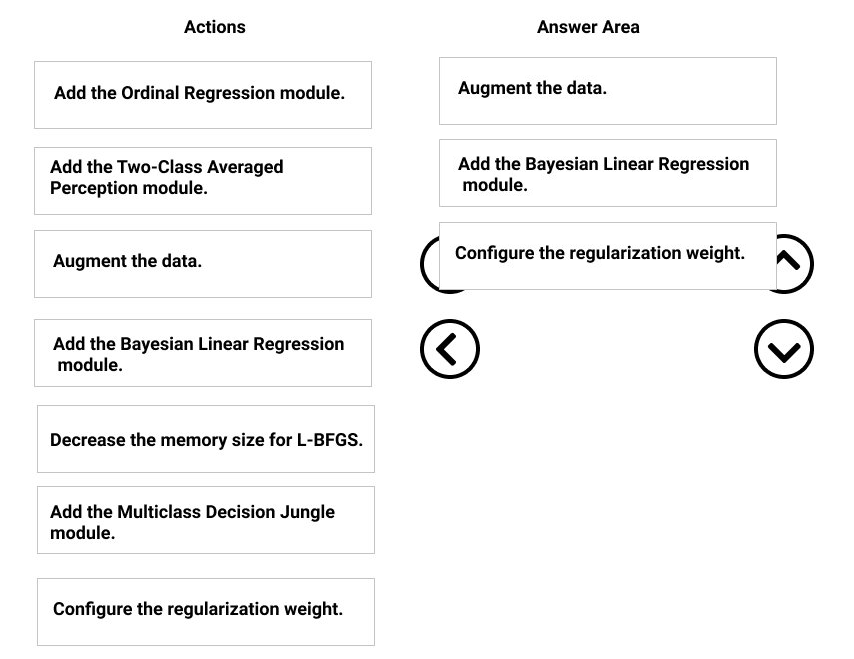

---

