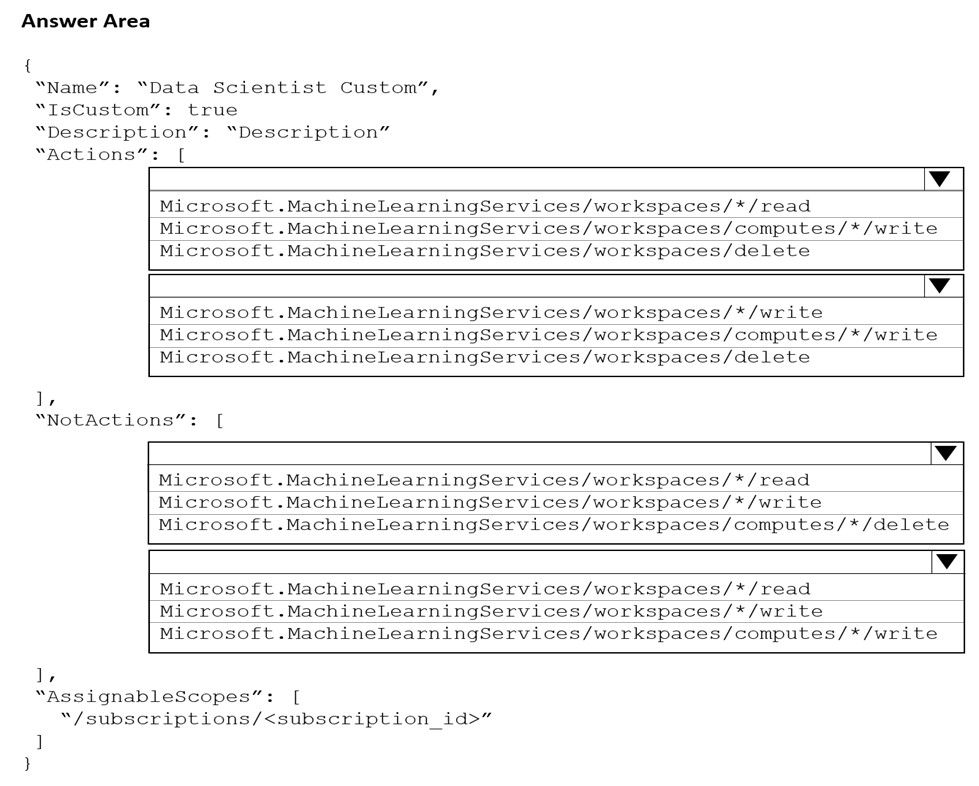
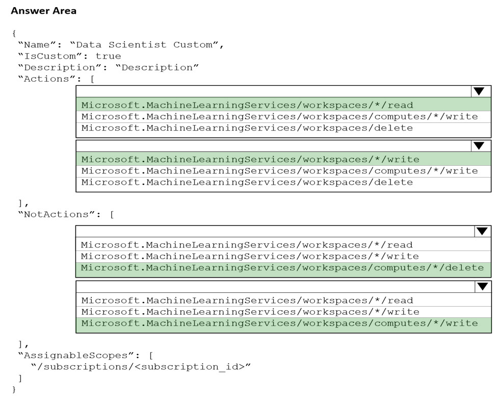

# Question 101

HOTSPOT -

You are the owner of an Azure Machine Learning workspace.

You must prevent the creation or deletion of compute resources by using a custom role. You must allow all other operations inside the workspace.

You need to configure the custom role.

How should you complete the configuration? To answer, select the appropriate options in the answer area.

NOTE: Each correct selection is worth one point.

Hot Area:

  
Show Suggested Answer

 

Box 1: Microsoft.MachineLearningServices/workspaces/*/read

Reader    role: Read-only actions in the workspace. Readers can list and view assets, including datastore credentials, in a workspace. Readers can&#x27;t create or update these assets.

Box 2: Microsoft.MachineLearningServices/workspaces/*/write

If the roles include Actions that have a wildcard (*), the effective permissions are computed by subtracting the NotActions from the allowed Actions.

Box 3: Box 2: Microsoft.MachineLearningServices/workspaces/computes/*/delete

Box 4: Microsoft.MachineLearningServices/workspaces/computes/*/write

Reference:

https://docs.microsoft.com/en-us/azure/role-based-access-control/overview#how-azure-rbac-determines-if-a-user-has-access-to-a-resource

  
Show Discussions

<blockquote>
<strong>danishanis</strong> <code>(Sat 24 Aug 2024 03:20)</code> - <em>Upvotes: 6</em>

correct af
</blockquote>
<blockquote>
<strong>klowqw</strong> <code>(Sat 02 Mar 2024 20:41)</code> - <em>Upvotes: 4</em>

correct
</blockquote>

---

[<< Previous Question](question_100.md) | [Home](../index.md) | [Next Question >>](question_102.md)
