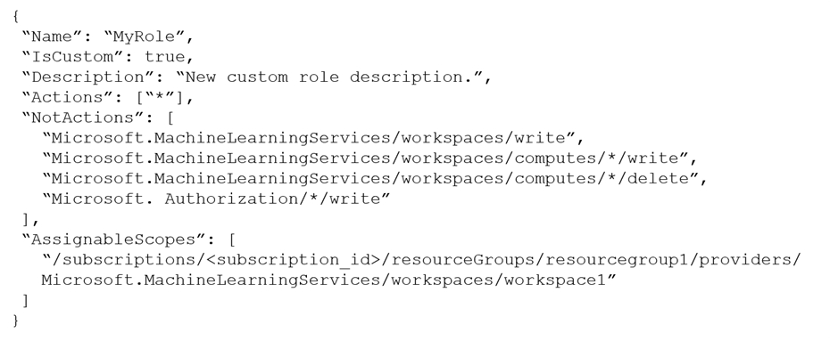
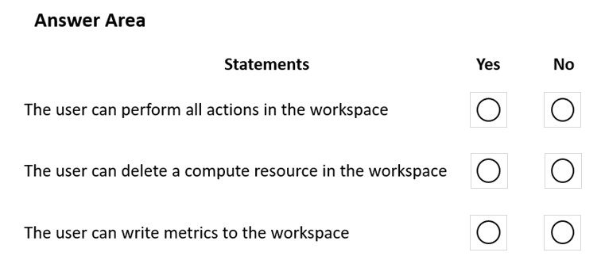
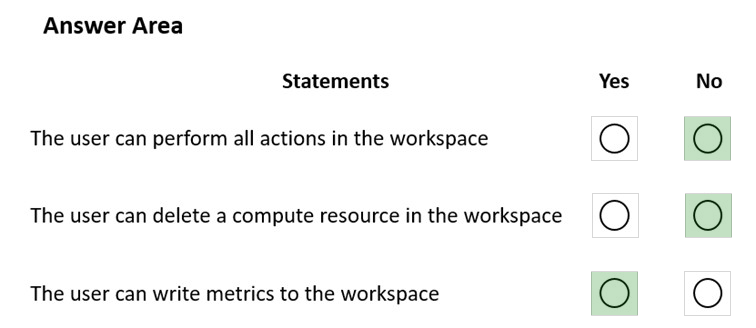

# Question 104

HOTSPOT -

You create an Azure Machine Learning workspace named workspace1. You assign a custom role to a user of workspace1.

The custom role has the following JSON definition:

Instructions: For each of the following statements, select Yes if the statement is true. Otherwise, select No.

NOTE: Each correct selection is worth one point.

Hot Area:

  
Show Suggested Answer

 

Box 1: No -

The actions listed in NotActions are prohibited.

If the roles include Actions that have a wildcard (*), the effective permissions are computed by subtracting the NotActions from the allowed Actions.

Box 2: No -

Deleting compute resources in the workspace is in the NotActions list.

Box 3: Yes -

Writing metrics is not listed in NotActions.

Reference:

https://docs.microsoft.com/en-us/azure/role-based-access-control/overview#how-azure-rbac-determines-if-a-user-has-access-to-a-resource

  
Show Discussions

<blockquote>
<strong>ABosco</strong> <code>(Sun 18 Feb 2024 06:17)</code> - <em>Upvotes: 5</em>

No, No, Yes is correct. The last one is concerning the Roles not related to WS.
</blockquote>
<blockquote>
<strong>PremPatrick</strong> <code>(Thu 18 May 2023 07:52)</code> - <em>Upvotes: 5</em>

Correct. No, No, Yes
</blockquote>
<blockquote>
<strong>PI_Team</strong> <code>(Sat 13 Jan 2024 10:51)</code> - <em>Upvotes: 3</em>

No,No,NO

Writing metrics specifically is not listed in the NotActions property of the provided role definition. However, the NotActions property does include &quot;Microsoft.MachineLearningServices/workspaces/write&quot;, which would likely prevent the user from writing metrics to the workspace, as writing metrics would likely require write permissions on the workspace

SaM
</blockquote>

<blockquote>
<strong>Nadine_nm</strong> <code>(Sun 25 Feb 2024 14:47)</code> - <em>Upvotes: 2</em>

&quot;Microsoft.MachineLearningServices/workspaces/write&quot;, this line only means that It can&#x27;t create or update the workspace
i don&#x27;t think that writing metrics is part of the &quot;updating workspace&quot;
</blockquote>
<blockquote>
<strong>PI_Team</strong> <code>(Wed 03 Jul 2024 17:36)</code> - <em>Upvotes: 4</em>

Yes, you are correct! My bad!
</blockquote>
<blockquote>
<strong>phydev</strong> <code>(Thu 18 Jan 2024 22:01)</code> - <em>Upvotes: 1</em>

You used &quot;likely&quot; twice. So does it or does it not?
</blockquote>

---

[<< Previous Question](question_103.md) | [Home](../index.md) | [Next Question >>](question_105.md)
