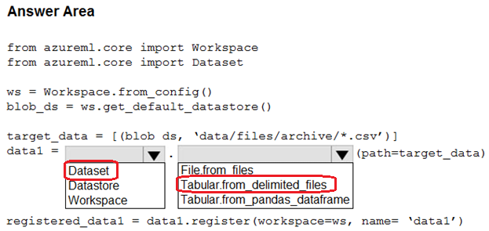

# Question 106

HOTSPOT

-

You use an Azure Machine Learning workspace. The default datastore contains comma-separated values (CSV) files.

The CSV files must be made available for use in experiments and data processing pipelines. The files must be loaded directly into pandas dataframes.

How should you complete the code? To answer, select the appropriate options in the answer area.

NOTE: Each correct selection is worth one point.

  
Show Suggested Answer

 

  
Show Discussions

<blockquote>
<strong>evangelist</strong> <code>(Sun 01 Dec 2024 03:16)</code> - <em>Upvotes: 2</em>

given answer is correct
</blockquote>
<blockquote>
<strong>Lion007</strong> <code>(Fri 28 Jun 2024 20:41)</code> - <em>Upvotes: 4</em>

Correct, the answer is: Dataset and Tabular.from_delimited_files
To make CSV files available for use in Azure ML experiments and data processing pipelines, and specifically for them to be loaded directly into pandas dataframes, the appropriate method from the Dataset class is Tabular.from_delimited_files.
- Tabular.from_delimited_files is designed for structured files like CSVs and will load the data into a format that can be easily converted to pandas dataframes, which is exactly the requirement.

Wrong answers:

- File.from_files is used when you are working with file datasets that are which a collection of references to the files directly without loading their contents into a structured format, rather than providing a dataset that represents the data in a tabular format like CSV.
- Tabular.from_pandas_dataframe is used to create a tabular dataset from an existing pandas dataframe in memory, not from files in a datastore.
</blockquote>
<blockquote>
<strong>NullVoider_0</strong> <code>(Thu 13 Jun 2024 10:36)</code> - <em>Upvotes: 4</em>

Sorry for the previous response. I&#x27;ve double-checked and updated the code. The answer is correct.

from azureml.core import Workspace, Dataset

ws = Workspace.from_config()
blob_ds = ws.get_default_datastore ()
target_data = [(blob ds, &#x27;data/files/archive/*.csv&#x27;)]
data1 = Dataset.Tabular.from_delimited_files(path=target_data)
registered_datal datal.register(workspaws, name data1&#x27;)
</blockquote>

<blockquote>
<strong>NullVoider_0</strong> <code>(Thu 13 Jun 2024 10:30)</code> - <em>Upvotes: 4</em>

The mentioned answer is partially correct. The actual code is given below.

from azureml.core import Workspace, Dataset

ws = Workspace.from_config()
blob_ds = ws.get_default_datastore ()
target_data = [(blob ds, &#x27;data/files/archive/*.csv&#x27;)]
data1 = Dataset.Files.from_files(path=target_data)
registered_datal datal.register(workspaws, name datal&#x27;)
</blockquote>

<blockquote>
<strong>orionduo</strong> <code>(Thu 29 Feb 2024 03:21)</code> - <em>Upvotes: 2</em>

It seems correct
https://github.com/MicrosoftDocs/azure-docs/blob/main/articles/machine-learning/v1/how-to-create-register-datasets.md#create-a-tabulardataset
</blockquote>
<blockquote>
<strong>ajay0011</strong> <code>(Wed 04 Oct 2023 00:50)</code> - <em>Upvotes: 2</em>

correct
</blockquote>

---

[<< Previous Question](question_105.md) | [Home](/index.md) | [Next Question >>](question_107.md)
