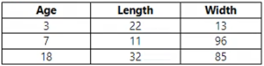
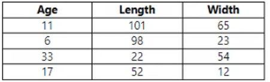

# Question 111

Note: This question is part of a series of questions that present the same scenario. Each question in the series contains a unique solution that might meet the stated goals. Some question sets might have more than one correct solution, while others might not have a correct solution.

After you answer a question in this section, you will NOT be able to return to it. As a result, these questions will not appear in the review screen.

You use Azure Machine Learning designer to load the following datasets into an experiment:

Dataset1 -

Dataset2 -

You need to create a dataset that has the same columns and header row as the input datasets and contains all rows from both input datasets.

Solution: Use the Apply Transformation module.

Does the solution meet the goal?

- A.Yes
- B.No

  
Show Suggested Answer

<strong>B</strong> 

  
Show Discussions

<blockquote>
<strong>MiteshKachhatiya</strong> <code>(Thu 20 Jun 2024 06:54)</code> - <em>Upvotes: 2</em>

Answer is B
</blockquote>
<blockquote>
<strong>Karthikat</strong> <code>(Mon 25 Mar 2024 17:42)</code> - <em>Upvotes: 2</em>

on exam 3/25/2024
</blockquote>
<blockquote>
<strong>TA_</strong> <code>(Mon 25 Mar 2024 11:24)</code> - <em>Upvotes: 1</em>

This set-up of questions on exam 15-03-2024
</blockquote>
<blockquote>
<strong>Plb2</strong> <code>(Fri 23 Feb 2024 22:09)</code> - <em>Upvotes: 1</em>

Assuming we&#x27;re speaking of the &#x27;Apply SQL Transformation&#x27; component here and reading the documentation I was thinking this could work:
&quot;Using the Apply SQL Transformation component, you can:
- Create tables for results and save the datasets in a portable database&quot; and &quot;The component can take up to three datasets as inputs&quot;.

However further down it&#x27;s stated that with SQLLite &quot;LEFT OUTER JOIN is implemented, but not RIGHT OUTER JOIN or FULL OUTER JOIN&quot;.

https://learn.microsoft.com/en-us/azure/machine-learning/component-reference/apply-sql-transformation?view=azureml-api-2
</blockquote>

<blockquote>
<strong>DaniloMagone</strong> <code>(Fri 03 May 2024 13:17)</code> - <em>Upvotes: 1</em>

Why would you assume that if there is a component named Apply Transformation exactly? And this component does not fit the problem. The answer should be B.
</blockquote>
<blockquote>
<strong>Plb2</strong> <code>(Fri 23 Feb 2024 22:11)</code> - <em>Upvotes: 1</em>

Correcting the selected anwer; should be B (no)
</blockquote>
<blockquote>
<strong>phydev</strong> <code>(Thu 20 Jul 2023 13:24)</code> - <em>Upvotes: 4</em>

On exam 20 July 2023.
</blockquote>
<blockquote>
<strong>Dp_100_11</strong> <code>(Wed 24 May 2023 12:02)</code> - <em>Upvotes: 4</em>

No, the solution provided using the Apply Transformation module does not meet the goal of creating a dataset that contains all rows from both input datasets with the same columns and header row.

The Apply Transformation module is used to apply custom transformations or operations on the dataset, but it does not perform the task of merging or combining two datasets into a single dataset with all rows and columns.
</blockquote>

---

[<< Previous Question](question_110.md) | [Home](../index.md) | [Next Question >>](question_112.md)
