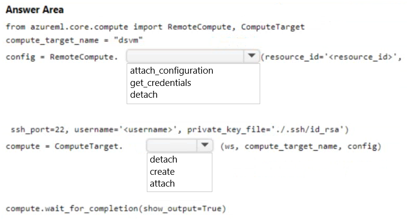
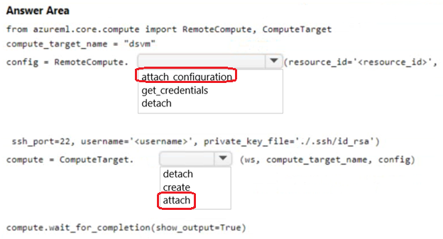

# Question 112

HOTSPOT

-

You must use an Azure Data Science Virtual Machine (DSVM) as a compute target.

You need to attach an existing DSVM to the workspace by using the Azure Machine Learning SDK for Python.

How should you complete the following code segment? To answer, select the appropriate options in the answer area.

NOTE: Each correct selection is worth one point.

  
Show Suggested Answer

 

  
Show Discussions

<blockquote>
<strong>Tommo565</strong> <code>(Fri 22 Mar 2024 09:28)</code> - <em>Upvotes: 9</em>

Correct (I think) https://learn.microsoft.com/en-us/python/api/azureml-core/azureml.core.compute.remote.remotecompute?view=azure-ml-py
</blockquote>
<blockquote>
<strong>ajay0011</strong> <code>(Thu 04 Apr 2024 02:00)</code> - <em>Upvotes: 2</em>

correct
</blockquote>
<blockquote>
<strong>SovanMistry</strong> <code>(Mon 01 Jul 2024 13:02)</code> - <em>Upvotes: 2</em>

correct

You can also use subscription_id, resource_group and vm_name without constructing resourceId. with Attach Configuaration and attach functions
</blockquote>

---

[<< Previous Question](question_111.md) | [Home](/index.md) | [Next Question >>](question_113.md)
