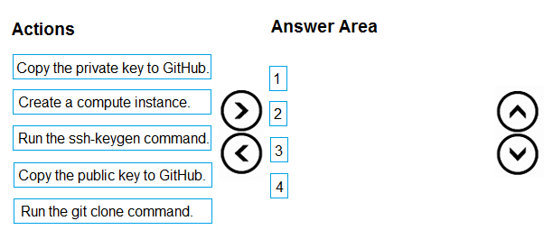
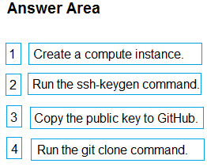

# Question 114

DRAG DROP

-

You create an Azure Machine Learning workspace.

You need to use the shared file system of the workspace to store a clone of a private Git repository.

Which four actions should you perform in sequence? To answer, move the appropriate actions from the list of actions to the answer area and arrange them in the correct order.

  
Show Suggested Answer

 

  
Show Discussions

<blockquote>
<strong>PI_Team</strong> <code>(Sun 21 Jan 2024 12:25)</code> - <em>Upvotes: 6</em>

correct:

1. You need to create a compute instance to access the shared file system of the workspace.
2. You need to run the ssh-keygen command to generate a new SSH key pair. The public key will be used to authenticate your Git account with SSH, and the private key will be used to access your Git repositories.
3. You need to copy the public key to GitHub. The public key will be used by GitHub to authenticate your SSH connection.
4. You can then run the git clone command to clone the private Git repository to the shared file system of the workspace
</blockquote>
<blockquote>
<strong>NullVoider_0</strong> <code>(Mon 12 Aug 2024 13:38)</code> - <em>Upvotes: 2</em>

On exam 12-02-2024.
</blockquote>
<blockquote>
<strong>Kanwal001</strong> <code>(Wed 28 Feb 2024 20:35)</code> - <em>Upvotes: 4</em>

On exam 28 Aug 2023
</blockquote>
<blockquote>
<strong>labriji</strong> <code>(Mon 23 Oct 2023 17:29)</code> - <em>Upvotes: 2</em>

Given answer is correct 😄

here is the order :

- Create a compute instance.
- Run the ssh-keygen command.
- Copy the public key to GitHub.
- Run the git clone command.
</blockquote>

---

[<< Previous Question](question_113.md) | [Home](../index.md) | [Next Question >>](question_115.md)
