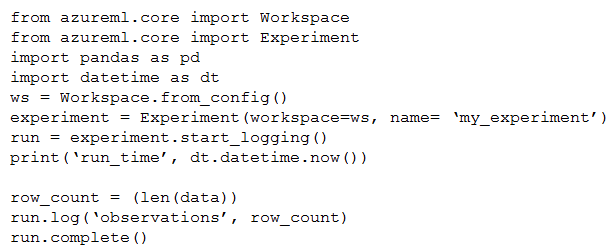
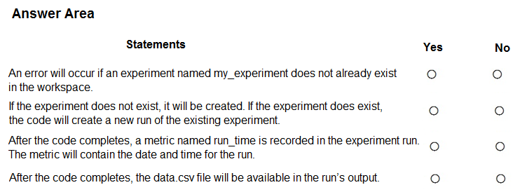
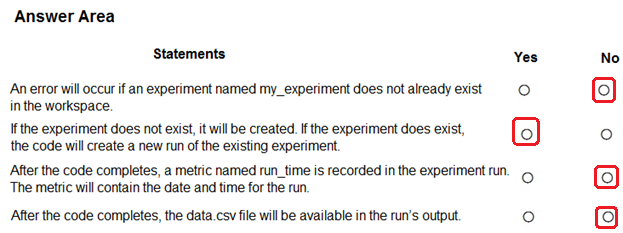

# Question 115

HOTSPOT

-

You have an Azure Machine Learning workspace.

You run the following code in a Python environment in which the configuration file for your workspace has been downloaded.

Instructions: For each of the following statements, select Yes if the statement is true. Otherwise, select No.

NOTE: Each correct selection is worth one point.

  
Show Suggested Answer

 

  
Show Discussions

<blockquote>
<strong>vmcompra</strong> <code>(Tue 26 Dec 2023 15:18)</code> - <em>Upvotes: 5</em>

NO
YES
NO (Nothing is recorded, but printed/showed)
NO
</blockquote>
<blockquote>
<strong>Plb2</strong> <code>(Fri 23 Aug 2024 21:33)</code> - <em>Upvotes: 4</em>

run-time will be in the output_logs std_log.txt, but not in the metrics
</blockquote>
<blockquote>
<strong>valgz</strong> <code>(Wed 20 Mar 2024 08:40)</code> - <em>Upvotes: 3</em>

No, Yes, No, No. I hink the metric that is log is named &quot;observations&quot; and contains the number of rows, not the run_time.
</blockquote>
<blockquote>
<strong>rishi_ram</strong> <code>(Tue 28 Nov 2023 09:54)</code> - <em>Upvotes: 2</em>

No yes yes no 
With this code, the current date and time will be printed during the execution of the script, and it will also be captured in the experiment run as part of the output logs.
</blockquote>
<blockquote>
<strong>vish9</strong> <code>(Mon 20 Nov 2023 13:56)</code> - <em>Upvotes: 1</em>

Given Answer is correct. The code only prints run_time, it does not log it.
</blockquote>
<blockquote>
<strong>labriji</strong> <code>(Mon 23 Oct 2023 16:56)</code> - <em>Upvotes: 2</em>

Q1 - No
Q2 - Yes
Q3 - Yes
Q4 - No
</blockquote>
<blockquote>
<strong>ajay0011</strong> <code>(Wed 04 Oct 2023 02:14)</code> - <em>Upvotes: 3</em>

No, Yes, Yes, No
C)Yes. The code logs a metric named &quot;run_time&quot; with the current date and time using the dt.datetime.now() function. The metric will contain the timestamp of the run.
</blockquote>
<blockquote>
<strong>sap_dg</strong> <code>(Tue 26 Sep 2023 19:12)</code> - <em>Upvotes: 2</em>

I will go for No, Yes, Yes, No
</blockquote>
<blockquote>
<strong>sap_dg</strong> <code>(Tue 26 Sep 2023 19:12)</code> - <em>Upvotes: 5</em>

*No, Yes, No, No
</blockquote>

---

[<< Previous Question](question_114.md) | [Home](../index.md) | [Next Question >>](question_116.md)
