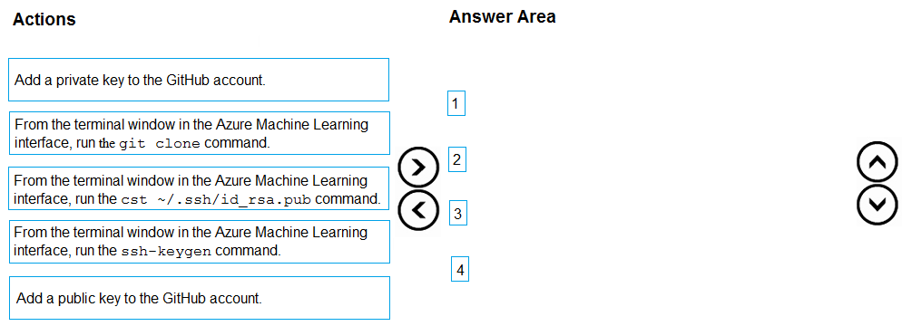
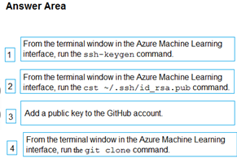

# Question 116

DRAG DROP

-

You have an existing GitHub repository containing Azure Machine Learning project files.

You need to clone the repository to your Azure Machine Learning shared workspace file system.

Which four actions should you perform in sequence? To answer, move the appropriate actions from the list of actions to the answer area and arrange them in the correct order.

NOTE: More than one order of answer choices is correct. You will receive credit for any of the correct orders you select.

  
Show Suggested Answer

 

  
Show Discussions

<blockquote>
<strong>Aryabhatta</strong> <code>(Sun 08 Sep 2024 16:35)</code> - <em>Upvotes: 3</em>

The command cat ~/.ssh/id_rsa.pub displays your SSH public key on Linux.
</blockquote>
<blockquote>
<strong>evangelist</strong> <code>(Sat 01 Jun 2024 08:55)</code> - <em>Upvotes: 2</em>

given answer is correct
</blockquote>
<blockquote>
<strong>og44</strong> <code>(Fri 01 Mar 2024 09:20)</code> - <em>Upvotes: 1</em>

the second  one has a type, need to be cat ~./...
</blockquote>
<blockquote>
<strong>NullVoider_0</strong> <code>(Mon 12 Feb 2024 14:38)</code> - <em>Upvotes: 1</em>

On exam 12-02-2024.
</blockquote>
<blockquote>
<strong>Awooga</strong> <code>(Tue 06 Feb 2024 15:17)</code> - <em>Upvotes: 1</em>

On exam 2024-02-06
</blockquote>
<blockquote>
<strong>Kanwal001</strong> <code>(Mon 28 Aug 2023 19:35)</code> - <em>Upvotes: 4</em>

On exam 28 Aug 2023
</blockquote>
<blockquote>
<strong>labriji</strong> <code>(Sun 23 Apr 2023 17:30)</code> - <em>Upvotes: 2</em>

Given answer is correct 😄
</blockquote>

---

[<< Previous Question](question_115.md) | [Home](/index.md) | [Next Question >>](question_117.md)
