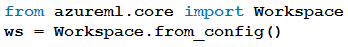

# Question 119

Note: This question is part of a series of questions that present the same scenario. Each question in the series contains a unique solution that might meet the stated goals. Some question sets might have more than one correct solution, while others might not have a correct solution.

After you answer a question in this section, you will NOT be able to return to it. As a result, these questions will not appear in the review screen.

You have the following Azure subscriptions and Azure Machine Learning service workspaces:

You need to obtain a reference to the ml-project workspace.

Solution: Run the following Python code:

Does the solution meet the goal?

- A.Yes
- B.No

  
Show Suggested Answer

<strong>A</strong> 

  
Show Discussions

<blockquote>
<strong>PI_Team</strong> <code>(Tue 25 Jul 2023 10:29)</code> - <em>Upvotes: 10</em>

The code snippet will only work if the config.json file is present in the current working directory. If the file is not present, the code will throw an exception.

To obtain a reference to the ml-project workspace, we can use the following code:

from azureml.core import Workspace

subscription_id = &quot;5a5891d1-557a-4234-9b83-2e90412b1068&quot;
resource_group = &quot;my-resource-group&quot;
workspace_name = &quot;ml-project&quot;

ws = Workspace(subscription_id, resource_group, workspace_name)

SaM
</blockquote>

<blockquote>
<strong>deyoz</strong> <code>(Wed 28 Feb 2024 05:55)</code> - <em>Upvotes: 1</em>

it should be Workspace.get()
</blockquote>
<blockquote>
<strong>LadyCasilda</strong> <code>(Fri 18 Aug 2023 18:50)</code> - <em>Upvotes: 6</em>

On exam 18 August 2023
</blockquote>
<blockquote>
<strong>ManuelHenriques</strong> <code>(Mon 16 Dec 2024 15:36)</code> - <em>Upvotes: 1</em>

A as the file is in the root folder
</blockquote>
<blockquote>
<strong>jl420</strong> <code>(Wed 06 Nov 2024 18:17)</code> - <em>Upvotes: 2</em>

yes. this is the purpose of from_config()
</blockquote>
<blockquote>
<strong>FactCheckr4</strong> <code>(Thu 15 Aug 2024 13:34)</code> - <em>Upvotes: 2</em>

The Workspace.from_config() method is used to load the workspace configuration from the config.json file, which contains all necessary information to connect to the Azure Machine Learning workspace. This file is typically located in the same directory as your Python script.

According to the details in the table, the ml-project workspace information is stored in the config.json file. Using Workspace.from_config() will correctly load the ml-project workspace based on this configuration file.

Therefore, the correct answer is:
A. Yes
</blockquote>

<blockquote>
<strong>welcomeYM</strong> <code>(Tue 07 May 2024 10:12)</code> - <em>Upvotes: 2</em>

A is the answer.
</blockquote>
<blockquote>
<strong>kzmain</strong> <code>(Mon 29 Apr 2024 15:37)</code> - <em>Upvotes: 2</em>

A
To load the workspace from the configuration file, use the from_config method.
https://learn.microsoft.com/en-us/python/api/azureml-core/azureml.core.workspace.workspace?view=azure-ml-py#:~:text=ws%20%3D%20Workspace.from_config()%0A%20%20%20ws.get_details()
</blockquote>
<blockquote>
<strong>Matt2000</strong> <code>(Fri 09 Feb 2024 14:47)</code> - <em>Upvotes: 1</em>

Yes. Reference: https://learn.microsoft.com/en-us/python/api/azureml-core/azureml.core.workspace.workspace?view=azure-ml-py#azureml-core-workspace-workspace-from-config
</blockquote>
<blockquote>
<strong>dporwal</strong> <code>(Tue 19 Dec 2023 19:29)</code> - <em>Upvotes: 1</em>

correct answer is b
</blockquote>
<blockquote>
<strong>NullVoider_0</strong> <code>(Wed 13 Dec 2023 12:58)</code> - <em>Upvotes: 1</em>

With the given code you can only get the workspace configuration to get the reference to the workspace a lot more context is required so the actual given answer is correct not the most voted one.
</blockquote>
<blockquote>
<strong>InversaRadice</strong> <code>(Sat 02 Dec 2023 14:08)</code> - <em>Upvotes: 2</em>

As ml-project is stored in config.json the script will succeed, so the answer is YES
</blockquote>
<blockquote>
<strong>phydev</strong> <code>(Thu 20 Jul 2023 13:26)</code> - <em>Upvotes: 4</em>

On exam 20 July 2023.
</blockquote>
<blockquote>
<strong>Ahmed_Gehad</strong> <code>(Sun 23 Jul 2023 17:02)</code> - <em>Upvotes: 2</em>

How? This is V1 or the previous version., not the latest one
</blockquote>
<blockquote>
<strong>Norasit</strong> <code>(Sat 24 Jun 2023 16:00)</code> - <em>Upvotes: 3</em>

If the &#x27;config.json&#x27; file is in the same directory as your python script, and you don&#x27;t pass any input parameters to the &#x27;from_config()&#x27; method, it will automatically pick up the configuration from the &#x27;config.json&#x27; file in the current directory.
</blockquote>
<blockquote>
<strong>BrahderLau</strong> <code>(Fri 02 Jun 2023 02:52)</code> - <em>Upvotes: 4</em>

To load the workspace from the configuration file, use the from_config method.

ws = Workspace.from_config()
ws.get_details()

The method provides a simple way to reuse the same workspace across multiple Python notebooks or projects. Users can save the workspace Azure Resource Manager (ARM) properties using the write_config method, and use this method to load the same workspace in different Python notebooks or projects without retyping the workspace ARM properties.

Reference: https://learn.microsoft.com/en-us/python/api/azureml-core/azureml.core.workspace.workspace?view=azure-ml-py#remarks
</blockquote>

<blockquote>
<strong>rishi_ram</strong> <code>(Sun 28 May 2023 09:04)</code> - <em>Upvotes: 2</em>

The code ws = Workspace.from_config() will attempt to load the workspace configuration from the config.json file in the current directory. However, it does not specify the specific workspace name &quot;ml-project&quot; mentioned in the question.
from azureml.core import Workspace
ws = Workspace.from_config(path=&#x27;./config.json&#x27;, name=&#x27;ml-project&#x27;)
</blockquote>
<blockquote>
<strong>chaymat</strong> <code>(Sun 16 Apr 2023 00:07)</code> - <em>Upvotes: 2</em>

I think the answer is A
</blockquote>
<blockquote>
<strong>bibinmj</strong> <code>(Sat 15 Apr 2023 23:15)</code> - <em>Upvotes: 1</em>

Ans: B
The config file should be inside `.azureml` folder, not the root of python script. https://azure.github.io/azureml-cheatsheets/docs/cheatsheets/python/v1/workspace/#helpful-methods
</blockquote>

---

[<< Previous Question](question_118.md) | [Home](../index.md) | [Next Question >>](question_120.md)
