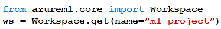

# Question 120

Note: This question is part of a series of questions that present the same scenario. Each question in the series contains a unique solution that might meet the stated goals. Some question sets might have more than one correct solution, while others might not have a correct solution.

After you answer a question in this section, you will NOT be able to return to it. As a result, these questions will not appear in the review screen.

You have the following Azure subscriptions and Azure Machine Learning service workspaces:

You need to obtain a reference to the ml-project workspace.

Solution: Run the following Python code:

Does the solution meet the goal?

- A.Yes
- B.No

  
Show Suggested Answer

<strong>B</strong> 

  
Show Discussions

<blockquote>
<strong>Skip73</strong> <code>(Mon 30 Oct 2023 01:38)</code> - <em>Upvotes: 6</em>

Correct Answer is B. You need to reference to the workspace using ws = Workspace.from_config()
The config.json contains the subscription_id, resource-id and the workspace name which are required to get the reference to the workspace.
</blockquote>
<blockquote>
<strong>evangelist</strong> <code>(Sun 01 Dec 2024 10:15)</code> - <em>Upvotes: 4</em>

The answer is NO,
This code attempts to obtain a reference to the Azure Machine Learning workspace named &quot;ml-project&quot; using the Workspace.get method with only the name parameter. However, the Workspace.get method requires additional parameters to uniquely identify the workspace, such as subscription_id and resource_group. Without these parameters, the method will not be able to locate and reference the workspace correctly.
</blockquote>
<blockquote>
<strong>Plb2</strong> <code>(Fri 23 Aug 2024 21:51)</code> - <em>Upvotes: 3</em>

besides the wsname, subid and rgname should be provided

ws = Workspace.get(name=&quot;myworkspace&quot;,
subscription_id=&#x27;&lt;azure-subscription-id&gt;&#x27;,
resource_group=&#x27;myresourcegroup&#x27;)
</blockquote>

<blockquote>
<strong>Plb2</strong> <code>(Sat 24 Aug 2024 08:44)</code> - <em>Upvotes: 1</em>

adding to this; subid is required if user has access to multiple subscriptions, so in this case it is.
</blockquote>
<blockquote>
<strong>zishankamal</strong> <code>(Wed 14 Aug 2024 11:03)</code> - <em>Upvotes: 1</em>

ws = Workspace.get(name=&quot;myworkspace&quot;,
               subscription_id=&#x27;&lt;azure-subscription-id&gt;&#x27;,
               resource_group=&#x27;myresourcegroup&#x27;)

subscription_id and resource_group are option parameters.
</blockquote>

<blockquote>
<strong>Matt2000</strong> <code>(Fri 09 Aug 2024 13:51)</code> - <em>Upvotes: 1</em>

Yes. Reference: https://learn.microsoft.com/en-us/python/api/azureml-core/azureml.core.workspace.workspace?view=azure-ml-py#azureml-core-workspace-workspace-get
</blockquote>
<blockquote>
<strong>LadyCasilda</strong> <code>(Sun 18 Feb 2024 19:50)</code> - <em>Upvotes: 3</em>

On exam 18 August 2023
</blockquote>
<blockquote>
<strong>skumarliaison</strong> <code>(Tue 13 Feb 2024 18:05)</code> - <em>Upvotes: 2</em>

get
Return a workspace object for an existing Azure Machine Learning Workspace.

Parameters name - str - Required
https://learn.microsoft.com/en-us/python/api/azureml-core/azureml.core.workspace.workspace?view=azure-ml-py#azureml-core-workspace-workspace-get
</blockquote>

<blockquote>
<strong>PI_Team</strong> <code>(Thu 25 Jan 2024 11:28)</code> - <em>Upvotes: 3</em>

The code snippet will not work because the Workspace.get() method requires the subscription ID and resource group of the workspace as well as the workspace name. The config.json file only contains the workspace name, so the code will not be able to find the workspace.

from azureml.core import Workspace

subscription_id = &quot;5a5891d1-557a-4234-9b83-2e90412b1068&quot;
resource_group = &quot;my-resource-group&quot;
workspace_name = &quot;ml-project&quot;

ws = Workspace(subscription_id, resource_group, workspace_name)

SaM
</blockquote>

<blockquote>
<strong>phydev</strong> <code>(Sat 20 Jan 2024 14:26)</code> - <em>Upvotes: 4</em>

On exam 20 July 2023.
</blockquote>
<blockquote>
<strong>BrahderLau</strong> <code>(Sat 02 Dec 2023 03:55)</code> - <em>Upvotes: 2</em>

Answer: Yes

ws = Workspace.get(name=&quot;myworkspace&quot;,
subscription_id=&#x27;&lt;azure-subscription-id&gt;&#x27;,
resource_group=&#x27;myresourcegroup&#x27;)

Reference: https://learn.microsoft.com/en-us/python/api/azureml-core/azureml.core.workspace.workspace?view=azure-ml-py#remarks
</blockquote>

<blockquote>
<strong>BrahderLau</strong> <code>(Sat 02 Dec 2023 03:57)</code> - <em>Upvotes: 4</em>

* Answer: No. Because subscription_id and resoruce group is not provided
</blockquote>
<blockquote>
<strong>rishi_ram</strong> <code>(Tue 28 Nov 2023 10:23)</code> - <em>Upvotes: 4</em>

workspace_name is correct parameter not &#x27;name&#x27; 
https://learn.microsoft.com/en-us/python/api/azureml-core/azureml.core.workspace.workspace?view=azure-ml-py
Answer is B for sure
</blockquote>

---

[<< Previous Question](question_119.md) | [Home](../index.md) | [Next Question >>](question_121.md)
