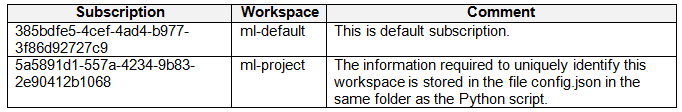

# Question 121

Note: This question is part of a series of questions that present the same scenario. Each question in the series contains a unique solution that might meet the stated goals. Some question sets might have more than one correct solution, while others might not have a correct solution.

After you answer a question in this section, you will NOT be able to return to it. As a result, these questions will not appear in the review screen.

You have the following Azure subscriptions and Azure Machine Learning service workspaces:

You need to obtain a reference to the ml-project workspace.

Solution: Run the following Python code:

Does the solution meet the goal?

- A.Yes
- B.No

  
Show Suggested Answer

<strong>B</strong> 

  
Show Discussions

<blockquote>
<strong>LadyCasilda</strong> <code>(Sun 18 Aug 2024 18:51)</code> - <em>Upvotes: 2</em>

On exam 18 August 2023
</blockquote>
<blockquote>
<strong>phydev</strong> <code>(Sat 20 Jul 2024 13:27)</code> - <em>Upvotes: 2</em>

On exam 20 July 2023.
</blockquote>
<blockquote>
<strong>vmcompra</strong> <code>(Wed 26 Jun 2024 13:55)</code> - <em>Upvotes: 4</em>

Answer is B. NO
Using the constructor, you need to include at least the &quot;subscription_id&quot;, &quot;resource_group&quot; and &quot;workspace_name&quot; as they are REQUIRED.

https://learn.microsoft.com/en-us/python/api/azureml-core/azureml.core.workspace.workspace?view=azure-ml-py
</blockquote>

<blockquote>
<strong>Norasit</strong> <code>(Tue 25 Jun 2024 00:00)</code> - <em>Upvotes: 1</em>

There is no method in the &#x27;Workspace&#x27; class that accepts the &#x27;workspace_name&#x27; parameter.
</blockquote>
<blockquote>
<strong>BrahderLau</strong> <code>(Sun 02 Jun 2024 03:01)</code> - <em>Upvotes: 3</em>

Since, subscription_id and resource_group are required, hence the answer is No

Workspace(subscription_id, resource_group, workspace_name, auth=None, \_location=None, \_disable_service_check=False, \_workspace_id=None, sku=&#x27;basic&#x27;, tags=None, \_cloud=&#x27;AzureCloud&#x27;)

https://learn.microsoft.com/en-us/python/api/azureml-core/azureml.core.workspace.workspace?view=azure-ml-py#constructor
</blockquote>

<blockquote>
<strong>krishna1818</strong> <code>(Wed 29 May 2024 09:52)</code> - <em>Upvotes: 1</em>

ws = workspace.get(name=&#x27;...&#x27;)
</blockquote>
<blockquote>
<strong>rishi_ram</strong> <code>(Tue 28 May 2024 09:21)</code> - <em>Upvotes: 1</em>

Workspace(subscription_id, resource_group, workspace_name, auth=None, _location=None, _disable_service_check=False, _workspace_id=None, sku=&#x27;basic&#x27;, tags=None, _cloud=&#x27;AzureCloud&#x27;)
parameter name is workspace_name not name hence all other options are wrong
This is correct ans
</blockquote>
<blockquote>
<strong>Alex310andra</strong> <code>(Fri 22 Mar 2024 12:57)</code> - <em>Upvotes: 1</em>

What is the difference between this question and the one before?
</blockquote>
<blockquote>
<strong>Alex310andra</strong> <code>(Fri 22 Mar 2024 13:01)</code> - <em>Upvotes: 5</em>

Ah sorry &quot;get&quot; is missing
</blockquote>

---

[<< Previous Question](question_120.md) | [Home](/index.md) | [Next Question >>](question_122.md)
