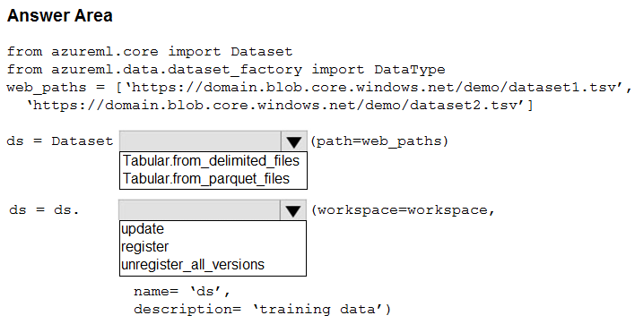
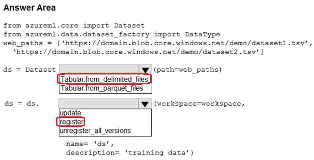

# Question 122

HOTSPOT

-

You create an Azure Machine Learning workspace. You use the Azure Machine Learning SDK for Python.

You must create a dataset from remote paths. The dataset must be reusable within the workspace.

You need to create the dataset.

How should you complete the following code segment? To answer, select the appropriate options in the answer area.

NOTE: Each correct selection is worth one point.

  
Show Suggested Answer

 

  
Show Discussions

<blockquote>
<strong>labriji</strong> <code>(Wed 23 Oct 2024 17:54)</code> - <em>Upvotes: 6</em>

given answer is correct 😄
</blockquote>
<blockquote>
<strong>hammamse</strong> <code>(Thu 03 Oct 2024 10:46)</code> - <em>Upvotes: 2</em>

given answer is true
</blockquote>

---

[<< Previous Question](question_121.md) | [Home](../index.md) | [Next Question >>](question_123.md)
