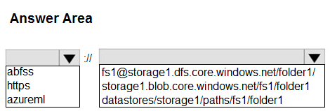
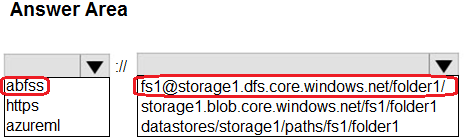

# Question 123

HOTSPOT

-

You create an Azure Data Lake Storage Gen2 storage account named storage1containing a file system named fs1 and a folder named folder1.

The contents of folder1 must be accessible from jobs on compute targets in the Azure Machine Learning workspace.

You need to construct a URI to reference folder1.

How should you construct the URI? To answer, select the appropriate options in the answer area.

NOTE: Each correct selection is worth one point.



<details>
  <summary>Show Suggested Answer</summary>

<br>

</details>

<details>
  <summary>Show Discussions</summary>

<blockquote><p><strong>ajay0011</strong> <code>(Wed 04 Oct 2023 04:37)</code> - <em>Upvotes: 9</em></p><p>This is a URI (Uniform Resource Identifier) that points to a folder named &quot;folder1&quot; in a file system named &quot;fs1&quot; inside an Azure Data Lake Storage Gen2 storage account named &quot;storage1&quot;.

The URI is using the ABFSS (Azure Blob File System Service) protocol to access the storage account.
abfss://&lt;filesystem&gt;@&lt;storageaccount&gt;.dfs.core.windows.net/&lt;directory&gt;</p></blockquote>

<blockquote><p><strong>PI_Team</strong> <code>(Thu 25 Jan 2024 11:38)</code> - <em>Upvotes: 2</em></p><p>Correct.

The URI abfss://&lt;filesystem&gt;@&lt;storageaccount&gt;.dfs.core.windows.net/&lt;directory&gt; points to a folder named folder1 in a file system named fs1 inside an Azure Data Lake Storage Gen2 storage account named storage1. The URI is using the ABFSS (Azure Blob File System Service) protocol to access the storage account.

Here is a breakdown of the URI:

abfss: The scheme identifier for the ABFSS protocol.
&lt;filesystem&gt;: The name of the file system.
@: The delimiter between the file system name and the storage account name.
&lt;storageaccount&gt;: The name of the storage account.
.dfs.core.windows.net: The domain name for the Azure Data Lake Storage Gen2 service.
&lt;directory&gt;: The path to the folder.</p></blockquote>

<blockquote><p><strong>Kanwal001</strong> <code>(Wed 28 Feb 2024 20:36)</code> - <em>Upvotes: 5</em></p><p>On exam 28 Aug 2023</p></blockquote>
<blockquote><p><strong>evangelist</strong> <code>(Sun 01 Dec 2024 10:21)</code> - <em>Upvotes: 1</em></p><p>Correct Selections:
abfss
storage1.dfs.core.windows.net/fs1/folder1
Explanation:
abfss: This is the Azure Blob File System Secure (ABFSS) protocol, used for accessing data in Azure Data Lake Storage Gen2.
storage1.dfs.core.windows.net: This is the domain for accessing the Data Lake Storage Gen2 account named storage1.
fs1/folder1: This is the path within the file system fs1 to the folder folder1.</p></blockquote>
<blockquote><p><strong>sai384957324</strong> <code>(Thu 10 Oct 2024 19:23)</code> - <em>Upvotes: 1</em></p><p>abfss is correct</p></blockquote>
<blockquote><p><strong>damaldon</strong> <code>(Fri 12 Jan 2024 16:36)</code> - <em>Upvotes: 1</em></p><p>correct, for ADLS Gen2:
abfss://&lt;file_system&gt;@&lt;account_name&gt;.dfs.core.windows.net/&lt;path&gt;</p></blockquote>
<blockquote><p><strong>pranav33</strong> <code>(Sun 24 Dec 2023 05:08)</code> - <em>Upvotes: 1</em></p><p>Correct. 
To construct the URI for referencing the contents of `folder1` in the Azure Data Lake Storage Gen2 storage account, you would need to combine the storage account name, file system name, and folder name in a specific format. Here&#x27;s how you should construct the URI:

```
abfss://&lt;storage-account-name&gt;.dfs.core.windows.net/&lt;file-system-name&gt;/&lt;folder-name&gt;
```

In this case, the correct options for constructing the URI would be:

- `storage-account-name`: storage1
- `file-system-name`: fs1
- `folder-name`: folder1

So the correct URI would be:

```
abfss://storage1.dfs.core.windows.net/fs1/folder1
```

Make sure to replace `&lt;storage-account-name&gt;`, `&lt;file-system-name&gt;`, and `&lt;folder-name&gt;` with the actual names of your storage account, file system, and folder respectively.</p></blockquote>

</details>

---

[<< Previous Question](question_122.md) | [Home](/index.md) | [Next Question >>](question_124.md)
