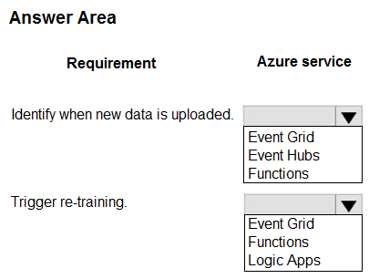
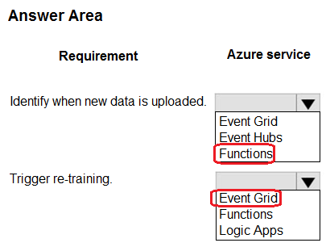

# Question 125

HOTSPOT

-

You train a model by using Azure Machine Learning. You use Azure Blob Storage to store production data.

The model must be re-trained when new data is uploaded to Azure Blob Storage. You need to minimize development and coding.

You need to configure Azure services to develop a re-training solution.

Which Azure services should you use? To answer, select the appropriate options in the answer area.

NOTE: Each correct selection is worth one point.

  
Show Suggested Answer

 

  
Show Discussions

<blockquote>
<strong>SoftAI</strong> <code>(Sat 14 Oct 2023 12:18)</code> - <em>Upvotes: 10</em>

First one is event grid
https://learn.microsoft.com/en-us/azure/data-explorer/create-event-grid-connection?tabs=portal-adx%2Cportal-2
the last one is logic apps:
https://learn.microsoft.com/en-us/azure/machine-learning/v1/how-to-trigger-published-pipeline?view=azureml-api-1
</blockquote>
<blockquote>
<strong>chaymat</strong> <code>(Mon 16 Oct 2023 12:37)</code> - <em>Upvotes: 7</em>

Event Grid, Logic Apps
</blockquote>
<blockquote>
<strong>sanctafrax</strong> <code>(Fri 31 Jan 2025 14:44)</code> - <em>Upvotes: 1</em>

Given answer seems correct. Event grid needs to be filled explicitly (by someone), it does not happen by itself. you need some kind of function. Therefore detecting whether or not there is new data can be done by a timed based triggered function which pushes an event to an event grid. Then trigger the retraining based on the event grid entry.
</blockquote>
<blockquote>
<strong>evangelist</strong> <code>(Sun 01 Dec 2024 10:30)</code> - <em>Upvotes: 1</em>

The other way around, 1: event grid to monitor event of new data 2: triggering functions to re-train the model
</blockquote>
<blockquote>
<strong>Kanwal001</strong> <code>(Wed 28 Feb 2024 20:37)</code> - <em>Upvotes: 6</em>

On exam 28 Aug 2023
</blockquote>
<blockquote>
<strong>MarinaMijailovic</strong> <code>(Thu 08 Feb 2024 16:33)</code> - <em>Upvotes: 1</em>

Event Hubs: Used for high-volume, streaming data ingestion.

Event Grid: Used for reactive programming based on event-driven architectures, distributing event notifications.
</blockquote>

<blockquote>
<strong>PI_Team</strong> <code>(Thu 25 Jan 2024 12:15)</code> - <em>Upvotes: 5</em>

Identify when new data is uploaded: You can use Event Grid to subscribe to events that are emitted when new data is uploaded to Azure Blob Storage. Event Grid will send an event to your subscription whenever a new blob is created or modified.

Trigger re-training: Logic Apps can be a good choice for linking data to blob storage and then to ML Studio. Logic Apps are a more complex solution than Functions, but they offer more flexibility and integration capabilities.

I think Logic Apps would be a better choice over Functions for triggering as the question asks for linking different services together. As far as I know, Logic Apps can be used to integrate with other Azure services, such as Azure Notification Hubs and Azure Service Bus and if we need to integrate with other Azure services, then Logic Apps may be a better choice.

SaM
</blockquote>

<blockquote>
<strong>Norasit</strong> <code>(Mon 25 Dec 2023 02:26)</code> - <em>Upvotes: 1</em>

Trigger re-training can be use Functions and Logic Apps.
In this problem it sound like simple process so I think Functions is better than Logic Apps.
</blockquote>
<blockquote>
<strong>DaniloMagone</strong> <code>(Sun 03 Nov 2024 16:09)</code> - <em>Upvotes: 1</em>

&quot;You need to minimize development and coding.&quot; So it has to be Logic Apps over Functions
</blockquote>
<blockquote>
<strong>rishi_ram</strong> <code>(Tue 28 Nov 2023 10:47)</code> - <em>Upvotes: 2</em>

Azure Event Grid: Azure Event Grid can be used to monitor events in Azure Blob Storage. You can configure Event Grid to trigger an event when new data is uploaded to Azure Blob Storage.

    Azure Functions: Azure Functions is a serverless compute service that can be used to run your re-training code in response to the event triggered by Azure Event Grid. You can write your re-training logic as a function and configure it to be executed when the event is received.

By combining Azure Event Grid and Azure Functions, you can create an automated re-training pipeline that triggers the re-training process whenever new data is uploaded to Azure Blob Storage, without the need for extensive coding or manual intervention.
</blockquote>

<blockquote>
<strong>snegnik</strong> <code>(Sun 10 Dec 2023 14:00)</code> - <em>Upvotes: 4</em>

it is better to mention that you use ChatGPT
</blockquote>
<blockquote>
<strong>labriji</strong> <code>(Mon 23 Oct 2023 18:12)</code> - <em>Upvotes: 4</em>

Identify when new data is uploaded &gt;&gt;  Event Grid
Trigger re-training &gt;&gt; Azure Logic Apps

basta 😅
</blockquote>

<blockquote>
<strong>ajay0011</strong> <code>(Wed 04 Oct 2023 04:47)</code> - <em>Upvotes: 2</em>

Answer is reverse.
you can configure Azure Blob Storage to trigger an event in Azure Event Grid when new data is uploaded. Then, you can create an Azure Function that listens for the event and initiates the re-training process
</blockquote>
<blockquote>
<strong>hammamse</strong> <code>(Mon 02 Oct 2023 21:54)</code> - <em>Upvotes: 2</em>

I  think this is Event Grid + Event Grid?
</blockquote>
<blockquote>
<strong>Tommo565</strong> <code>(Thu 28 Sep 2023 09:27)</code> - <em>Upvotes: 3</em>

Could also be Event Grid + Event Grid
</blockquote>
<blockquote>
<strong>Tommo565</strong> <code>(Sat 23 Sep 2023 08:53)</code> - <em>Upvotes: 5</em>

I think this is Event Grid + Logic Apps?
</blockquote>

---

[<< Previous Question](question_124.md) | [Home](../index.md) | [Next Question >>](question_126.md)
