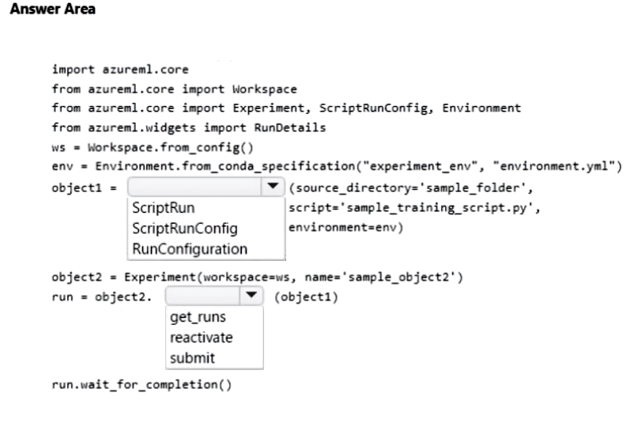
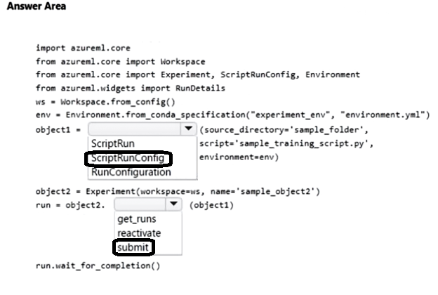

# Question 127

HOTSPOT

-

You manage an Azure Machine Learning workspace. You create a training script named sample_training_script.py. The script is used to train a predictive model in the conda environment defined by a file named environment.yml.

You need to run the script as an experiment.

How should you complete the following code segment? To answer, select the appropriate options in the answer area.

NOTE: Each correct selection is worth one point.

  
Show Suggested Answer

 

  
Show Discussions

<blockquote>
<strong>orionduo</strong> <code>(Thu 29 Aug 2024 06:11)</code> - <em>Upvotes: 2</em>

from azureml.core import ScriptRunConfig, Experiment

# create or load an experiment

experiment = Experiment(workspace, &#x27;MyExperiment&#x27;)

# create or retrieve a compute target

cluster = workspace.compute_targets[&#x27;MyCluster&#x27;]

# create or retrieve an environment

env = Environment.get(ws, name=&#x27;MyEnvironment&#x27;)

# configure and submit your training run

config = ScriptRunConfig(source_directory=&#x27;.&#x27;,
script=&#x27;train.py&#x27;,
arguments=[&#x27;--arg1&#x27;, arg1_val, &#x27;--arg2&#x27;, arg2_val],
compute_target=cluster,
environment=env)
script_run = experiment.submit(config)
</blockquote>

<blockquote>
<strong>Ahmed_Gehad</strong> <code>(Tue 23 Jul 2024 18:16)</code> - <em>Upvotes: 2</em>

I think we shall use mlflow now for experiments.
</blockquote>
<blockquote>
<strong>chaymat</strong> <code>(Tue 16 Apr 2024 12:52)</code> - <em>Upvotes: 3</em>

correct
</blockquote>

---

[<< Previous Question](question_126.md) | [Home](../index.md) | [Next Question >>](question_128.md)
