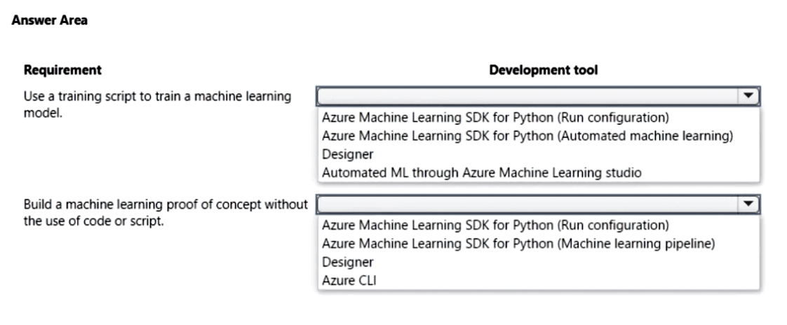
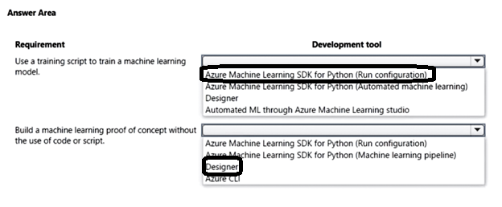

# Question 129

HOTSPOT

-

You are designing a machine learning solution.

You have the following requirements:

• Use a training script to train a machine learning model.

• Build a machine learning proof of concept without the use of code or script.

You need to select a development tool for each requirement.

Which development tool should you use? To answer, select the appropriate options in the answer area.

NOTE: Each correct selection is worth one point.

  
Show Suggested Answer

 

  
Show Discussions

<blockquote>
<strong>Karthikat</strong> <code>(Wed 25 Sep 2024 16:43)</code> - <em>Upvotes: 1</em>

on exam 3/25/2024
</blockquote>
<blockquote>
<strong>james2033</strong> <code>(Fri 19 Apr 2024 08:28)</code> - <em>Upvotes: 2</em>

Use a training script to train a machine learning model --&gt; Azure Machine Learning SDK for Python (Run configuration).

Build a machine learning proof of concept without the use of code or script. --&gt; Designer.
</blockquote>

<blockquote>
<strong>abuluxury</strong> <code>(Sat 20 Jan 2024 16:18)</code> - <em>Upvotes: 1</em>

Don&#x27;t see how the top answer is correct if the say &#x27;without the use of code&#x27; SDK uses code right?
</blockquote>
<blockquote>
<strong>oso0348</strong> <code>(Sat 17 Feb 2024 00:40)</code> - <em>Upvotes: 2</em>

Only bottom answer says ‘without use of code’
</blockquote>
<blockquote>
<strong>labriji</strong> <code>(Mon 23 Oct 2023 18:55)</code> - <em>Upvotes: 2</em>

Given answer looks correct 😄
</blockquote>

---

[<< Previous Question](question_128.md) | [Home](/index.md) | [Next Question >>](question_130.md)
