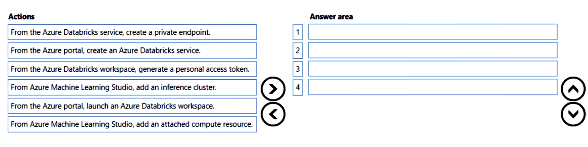
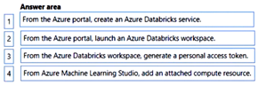

# Question 130

DRAG DROP

-

You provision an Azure Machine Learning workspace in a new Azure subscription.

You need to attach Azure Databricks as a compute resource from the Azure Machine Learning workspace.

Which four actions should you perform in sequence? To answer, move the appropriate actions from the list of actions to the answer area and arrange them in the correct order.

  
Show Suggested Answer

 

  
Show Discussions

<blockquote>
<strong>evangelist</strong> <code>(Sun 01 Dec 2024 11:09)</code> - <em>Upvotes: 2</em>

given answer is correct
</blockquote>
<blockquote>
<strong>james2033</strong> <code>(Fri 19 Apr 2024 08:26)</code> - <em>Upvotes: 3</em>

1. From the Azure portal, create an Azure Databricks service.
2. From the Azure portal, launch an Azure Databricks workspace.
3. From the Azure Databricks workspace, generate a personal access token.
4. From Azure Machine Learning Studio, add an attached compute resource.
</blockquote>
<blockquote>
<strong>SoftAI</strong> <code>(Sat 14 Oct 2023 12:27)</code> - <em>Upvotes: 1</em>

Seems correct, according to https://www.element61.be/en/resource/how-integrate-azure-databricks-azure-machine-learning-running-big-data-machine-learning
</blockquote>

---

[<< Previous Question](question_129.md) | [Home](../index.md) | [Next Question >>](question_131.md)
