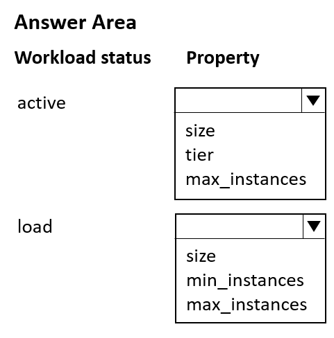
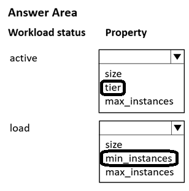

# Question 133

HOTSPOT

-

You manage an Azure Machine Learning workspace by using the Python SDK v2.

You must create a compute cluster in the workspace. The compute cluster must run workloads and property handle interruptions. You start by calculating the maximum amount of compute resources required by the workloads and size the cluster to match the calculations.

The cluster definition includes the following properties and values:

• names=“mlcluster”

• size=“STANDARD_DS3_v2”

• min_instances=1

• max_instances=4

• tier=“dedicated“

The cost of the compute resources must be minimized when a workload is active or idle. Cluster property changes must not affect the maximum amount of compute resources available to the workloads run on the cluster.

You need to modify the cluster properties to minimize the cost of compute resources.

Which properties should you modify? To answer, select the appropriate options in the answer area.

NOTE: Each correct selection is worth one point.

  
Show Suggested Answer

 

  
Show Discussions

<blockquote>
<strong>damaldon</strong> <code>(Fri 12 Jul 2024 16:20)</code> - <em>Upvotes: 6</em>

Correct.
Lower your compute cluster cost with low priority VMs.
from azure.ai.ml.entities import AmlCompute

cluster_low_pri = AmlCompute(
name=&quot;low-pri-example&quot;,
size=&quot;STANDARD_DS3_v2&quot;,
min_instances=0,
max_instances=2,
idle_time_before_scale_down=120,
tier=&quot;low_priority&quot;,
)
ml_client.begin_create_or_update(cluster_low_pri).result()
</blockquote>

<blockquote>
<strong>Mal42</strong> <code>(Wed 21 Aug 2024 07:28)</code> - <em>Upvotes: 6</em>

On exam 18 Aug 2023
</blockquote>
<blockquote>
<strong>MiteshKachhatiya</strong> <code>(Wed 11 Jun 2025 04:48)</code> - <em>Upvotes: 1</em>

On Exam 8th June 2025
</blockquote>

---

[<< Previous Question](question_132.md) | [Home](../index.md) | [Next Question >>](question_134.md)
