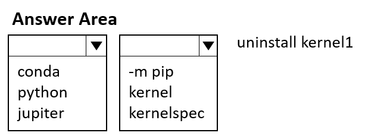
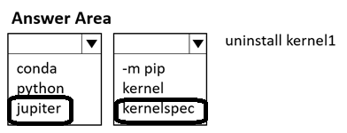

# Question 134

HOTSPOT

-

You manage an Azure Machine Learning workspace named workspace1 with a compute instance named compute1.

You must remove a kernel named kernel1 from compute1. You connect to compute1 by using a terminal window from workspace1.

You need to enter a command in the terminal window to remove kernel.

Which command should you use? To answer, select the appropriate options in the answer area.

NOTE: Each correct selection is worth one point.

  
Show Suggested Answer

 

  
Show Discussions

<blockquote>
<strong>Batman160591</strong> <code>(Thu 20 Jun 2024 21:24)</code> - <em>Upvotes: 6</em>

Answer: jupyter kernelspec uninstall kernel1
This command uninstalls the specified kernel from Jupyter, which is the underlying technology used for compute instances in Azure Machine Learning. By running this command, you will remove the &quot;kernel1&quot; from the list of available kernels on the compute instance.

Please make sure you have the necessary permissions to execute the command on the compute instance.
</blockquote>

<blockquote>
<strong>MiteshKachhatiya</strong> <code>(Wed 11 Jun 2025 06:11)</code> - <em>Upvotes: 1</em>

On exam 8th June 2025
</blockquote>
<blockquote>
<strong>ymj_000</strong> <code>(Thu 07 Nov 2024 03:24)</code> - <em>Upvotes: 2</em>

For reference: https://learn.microsoft.com/en-us/azure/machine-learning/how-to-access-terminal?view=azureml-api-2
</blockquote>
<blockquote>
<strong>A_PL300</strong> <code>(Mon 09 Sep 2024 20:33)</code> - <em>Upvotes: 4</em>

on exam 4 September 2023
</blockquote>
<blockquote>
<strong>LadyCasilda</strong> <code>(Sun 18 Aug 2024 18:52)</code> - <em>Upvotes: 4</em>

On exam 18 August 2023
</blockquote>

---

[<< Previous Question](question_133.md) | [Home](../index.md) | [Next Question >>](question_135.md)
