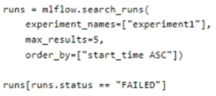
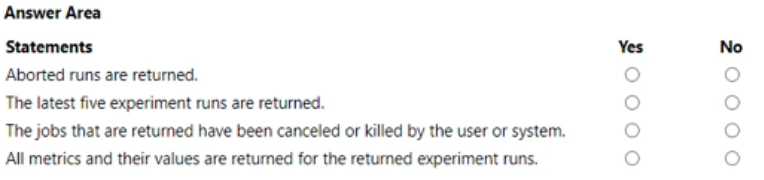
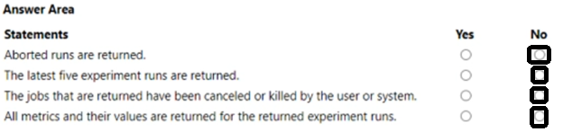

# Question 135

HOTSPOT

-

You manage an Azure Machine Learning workspace. You create an experiment named experiment by using the Azure Machine Learning Python SDK v2 and MLflow.

You are reviewing the results of experiment by using the following code segment:

For each of the following statements, select Yes if the statement is true. Otherwise, select No.

  
Show Suggested Answer

 

  
Show Discussions

<blockquote>
<strong>gunn_m</strong> <code>(Sat 23 Nov 2024 17:03)</code> - <em>Upvotes: 1</em>

Is Killed by system&#x27;different from &#x27;Failed&#x27;?
</blockquote>
<blockquote>
<strong>og44</strong> <code>(Sat 02 Mar 2024 02:10)</code> - <em>Upvotes: 1</em>

Shouldn&#x27;t be the first one YES. As runs[runs.status==&quot;Failed&quot;] will return aborted runs.
is it about the atributes.status?

https://learn.microsoft.com/en-us/azure/machine-learning/how-to-track-experiments-mlflow?view=azureml-api-2#getting-params-and-metrics-from-a-run
</blockquote>

<blockquote>
<strong>zainkhazi</strong> <code>(Fri 08 Mar 2024 15:06)</code> - <em>Upvotes: 1</em>

Aborted means cancelled by the user explicitly, not to be confused with &quot;failed&quot; jobs.
</blockquote>
<blockquote>
<strong>Mal42</strong> <code>(Mon 21 Aug 2023 07:30)</code> - <em>Upvotes: 3</em>

On exam 18 Aug 2023
</blockquote>
<blockquote>
<strong>ABosco</strong> <code>(Fri 18 Aug 2023 08:04)</code> - <em>Upvotes: 4</em>

All NOs is correct.
</blockquote>
<blockquote>
<strong>Batman160591</strong> <code>(Tue 20 Jun 2023 21:13)</code> - <em>Upvotes: 1</em>

NO,YES,NO,NO
</blockquote>
<blockquote>
<strong>mkk888</strong> <code>(Sun 25 Jun 2023 06:08)</code> - <em>Upvotes: 9</em>

order by is ASC based on time so the 5 returned will be oldest not latest. So all will be NO
</blockquote>

---

[<< Previous Question](question_134.md) | [Home](/index.md) | [Next Question >>](question_136.md)
