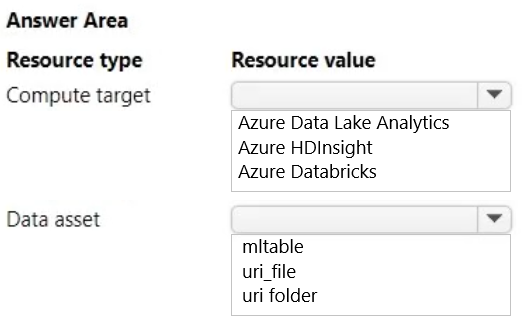
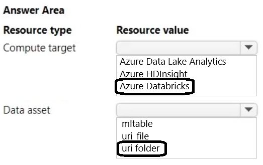

# Question 136

HOTSPOT

-

You manage an Azure Machine Learning workspace by using the Python SDK v2.

You must create an automated machine learning job to generate a classification model by using data files stored in Parquet format.

You must configure an autoscaling compute target and a data asset for the job.

You need to configure the resources for the job.

Which resource configuration should you use? To answer, select the appropriate options in the answer area.

NOTE: Each correct selection is worth one point.

  
Show Suggested Answer

 

  
Show Discussions

<blockquote>
<strong>f11c733</strong> <code>(Mon 17 Jun 2024 09:21)</code> - <em>Upvotes: 6</em>

The correct answers are Azure Databricks and mltable.
</blockquote>
<blockquote>
<strong>LadyCasilda</strong> <code>(Fri 18 Aug 2023 18:51)</code> - <em>Upvotes: 5</em>

On exam 18 August 2023
</blockquote>
<blockquote>
<strong>Plb2</strong> <code>(Sat 24 Feb 2024 15:20)</code> - <em>Upvotes: 2</em>

https://learn.microsoft.com/en-us/azure/machine-learning/how-to-mltable?view=azureml-api-2&amp;tabs=cli

Azure Machine Learning doesn&#x27;t require use of Azure Machine Learning Tables (mltable) for tabular data. You can use Azure Machine Learning File (uri_file) and Folder (uri_folder) types, and your own parsing logic loads the data into a Pandas or Spark data frame.

If you have a simple CSV file or Parquet folder, it&#x27;s easier to use Azure Machine Learning Files/Folders instead of Tables.
</blockquote>

<blockquote>
<strong>Lion007</strong> <code>(Thu 28 Dec 2023 20:14)</code> - <em>Upvotes: 4</em>

Correct: Azure Databricks and uri_folder

Compute target: Azure Databricks
This is because Azure Databricks supports autoscaling of workers required to run your job, which dynamically reallocates workers to match the computational demands of your job, thereby achieving high cluster utilization without the need for provisioning the cluster to match a specific workload​​.

Data asset: uri_folder
This option allows the machine learning job to access all the Parquet files stored in the specified directory. If you have multiple Parquet data files, you would use a URI that points to a folder containing all these files.
</blockquote>

<blockquote>
<strong>damaldon</strong> <code>(Wed 12 Jul 2023 16:32)</code> - <em>Upvotes: 3</em>

Correct.
uri_folder 	Read a folder of parquet/CSV files into Pandas/Spark.
</blockquote>
<blockquote>
<strong>Batman160591</strong> <code>(Tue 20 Jun 2023 21:22)</code> - <em>Upvotes: 1</em>

Seems correct:)
</blockquote>

---

[<< Previous Question](question_135.md) | [Home](../index.md) | [Next Question >>](question_137.md)
