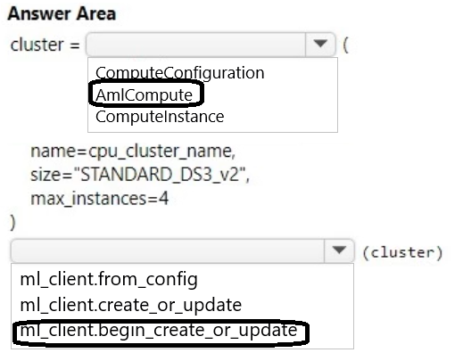

# Question 139

HOTSPOT

-

You create a new Azure Machine Learning workspace with a compute cluster.

You need to create the compute cluster asynchronously by using the Azure Machine Learning Python SDK v2.

How should you complete the code segment? To answer, select the appropriate options in the answer area.

NOTE: Each correct selection is worth one point.

  
Show Suggested Answer

 

  
Show Discussions

<blockquote>
<strong>damaldon</strong> <code>(Fri 12 Jul 2024 17:58)</code> - <em>Upvotes: 3</em>

Correct.
 begin_create_or_update(resource_group_name: str, domain_name: str, domain_info: ‘_models.Domain’, **kwargs: Any) → LROPoller[‘_models.Domain’][source]

    Create or update a domain.

    Asynchronously creates or updates a new domain with the specified parameters.
</blockquote>

---

[<< Previous Question](question_138.md) | [Home](../index.md) | [Next Question >>](question_140.md)
