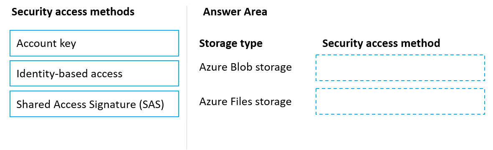
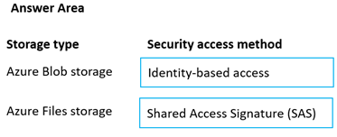

# Question 141

DRAG DROP

-

You manage an Azure Machine Learning workspace named workspace1 by using the Python SDK v2.

You must register datastores in workspace1 for Azure Blob storage and Azure Files storage to meet the following requirements:

• Azure Active Directory (Azure AD) authentication must be used for access to storage when possible.

• Credentials and secrets stored in workspace1 must be valid for a specified time period when accessing Azure Files storage.

You need to configure a security access method used to register the Azure Blob and Azure Files storage in workspace1.

Which security access method should you configure? To answer, select the appropriate options in the answer area.

NOTE: Each correct selection is worth one point.

  
Show Suggested Answer

 

  
Show Discussions

<blockquote>
<strong>LadyCasilda</strong> <code>(Fri 18 Aug 2023 18:52)</code> - <em>Upvotes: 7</em>

On exam 18 August 2023
</blockquote>
<blockquote>
<strong>A_PL300</strong> <code>(Sat 09 Sep 2023 22:01)</code> - <em>Upvotes: 5</em>

on exam 4 September 2023
</blockquote>
<blockquote>
<strong>jl420</strong> <code>(Wed 13 Nov 2024 00:41)</code> - <em>Upvotes: 1</em>

Identity / SAS
</blockquote>
<blockquote>
<strong>phdykd</strong> <code>(Fri 04 Aug 2023 19:35)</code> - <em>Upvotes: 1</em>

Account key and SAS token is correct for both. agreed with  abuluxury
</blockquote>
<blockquote>
<strong>PI_Team</strong> <code>(Wed 26 Jul 2023 09:23)</code> - <em>Upvotes: 1</em>

correct
</blockquote>
<blockquote>
<strong>PI_Team</strong> <code>(Wed 26 Jul 2023 09:24)</code> - <em>Upvotes: 8</em>

1. Azure Blob storage: Identity-based access (Azure AD authentication) allows you to use Azure AD credentials to authenticate and access Azure Blob storage. This is the recommended and more secure method for accessing Blob storage, as it avoids exposing account keys directly.

2. Azure File Storage: Shared access signature (SAS) is used to provide temporary access to resources in Azure File Storage. When using SAS, you can generate a token with specific permissions and expiration time, which can be used to access the Azure File share. This approach allows you to control the access to the file share for a specified time period without exposing the storage account key.

SaM
</blockquote>

<blockquote>
<strong>sl_mslconsulting</strong> <code>(Wed 15 May 2024 19:12)</code> - <em>Upvotes: 1</em>

agreed with explanation. Link: https://learn.microsoft.com/en-us/azure/machine-learning/how-to-administrate-data-authentication?view=azureml-api-2#identity-based-data-authentication
</blockquote>
<blockquote>
<strong>abuluxury</strong> <code>(Thu 20 Jul 2023 15:51)</code> - <em>Upvotes: 2</em>

Don&#x27;t see why you can&#x27;t use sas for both or account key
</blockquote>
<blockquote>
<strong>jl420</strong> <code>(Wed 13 Nov 2024 00:40)</code> - <em>Upvotes: 1</em>

because it said &quot;Azure Active Directory (Azure AD) authentication must be used for access to storage when possible&quot;
</blockquote>
<blockquote>
<strong>Batman160591</strong> <code>(Tue 20 Jun 2023 22:09)</code> - <em>Upvotes: 2</em>

seems correct
</blockquote>

---

[<< Previous Question](question_140.md) | [Home](/index.md) | [Next Question >>](question_142.md)
