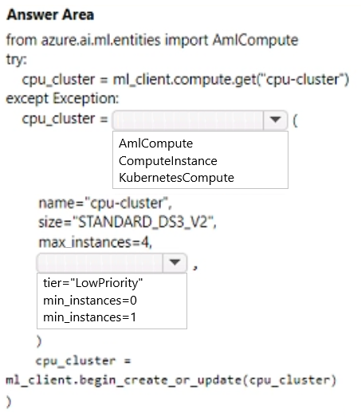
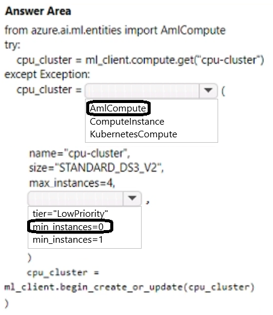

# Question 143

HOTSPOT

-

You create an Azure Machine Learning workspace. You use the Azure Machine Learning Python SDK v2 to create a compute cluster.

The compute cluster must run a training script. Costs associated with running the training script must be minimized.

You need to complete the Python script to create the compute cluster.

How should you complete the script? To answer, select the appropriate options in the answer area.

NOTE: Each correct selection is worth one point.

  
Show Suggested Answer

 

  
Show Discussions

<blockquote>
<strong>haby</strong> <code>(Mon 17 Jun 2024 00:44)</code> - <em>Upvotes: 8</em>

I think should be tier=&quot;LowPriority&quot; since min_instances has default value 0. If dont set min_instances value, it will be 0 by default.
</blockquote>
<blockquote>
<strong>sl_mslconsulting</strong> <code>(Fri 15 Nov 2024 22:49)</code> - <em>Upvotes: 1</em>

should be tier=&quot;LowPriority&quot;. Setting min_instances to 0 won&#x27;t help you cut down the cost if you are actively training a model.
</blockquote>
<blockquote>
<strong>sl_mslconsulting</strong> <code>(Fri 15 Nov 2024 22:50)</code> - <em>Upvotes: 1</em>

Besides it&#x27;s asking &quot;Costs associated with running the training script must be minimized.&quot; so the nodes won&#x27;t be idle.
</blockquote>
<blockquote>
<strong>vv_bb</strong> <code>(Sun 12 May 2024 13:20)</code> - <em>Upvotes: 4</em>

The correct answer is: 
  - AmlCompute
  - tier=&quot;LowPriority&quot;
</blockquote>
<blockquote>
<strong>vv_bb</strong> <code>(Sun 12 May 2024 13:21)</code> - <em>Upvotes: 1</em>

While there is no doubts what the answer should be for the first part, let me explain the answer for the second.

1. According to the question, we should minimize the cost &quot;...associated with running the training script...&quot;.
   It means the goal is to minimize the costs exactly for training, not for the rest of the time.
   Why? Well, because for example the cluster may even be deleted immediately after the training completed, etc. We can&#x27;t be sure why we&#x27;ve being asked not to consider еру сщыеы other than necessary for training, but that&#x27;s what we&#x27;ve being asked for.

And during the training, cluster eventually use all the possible nodes, so defining the [min_instances = 0] will not affect the costs for training at all.
</blockquote>

<blockquote>
<strong>vv_bb</strong> <code>(Sun 12 May 2024 13:22)</code> - <em>Upvotes: 3</em>

2) According to the page below, if you&#x27;ll not define the min_instances, then the default value = 0 will be used. 
So actually there is even no need to explicitly define [min_instances = 0]

While, if you&#x27;re not defining tier, then the default value = &#x27;dedicated&#x27; will be used.

https://learn.microsoft.com/en-us/azure/machine-learning/reference-yaml-compute-aml?view=azureml-api-2
</blockquote>

<blockquote>
<strong>damaldon</strong> <code>(Fri 12 Jan 2024 19:31)</code> - <em>Upvotes: 2</em>

Correct.
</blockquote>
<blockquote>
<strong>Batman160591</strong> <code>(Wed 20 Dec 2023 23:35)</code> - <em>Upvotes: 1</em>

seems correct
</blockquote>

---

[<< Previous Question](question_142.md) | [Home](../index.md) | [Next Question >>](question_144.md)
