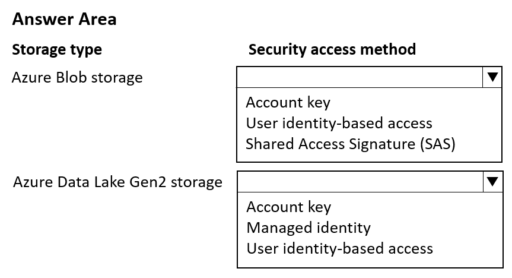
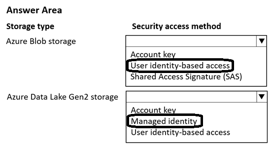

# Question 145

HOTSPOT

-

You manage an Azure Machine Learning workspace named workspace1 by using the Python SDK v2.

You must register datastores in workspace1 for Azure Blob and Azure Data Lake Gen2 storage to meet the following requirements:

• Data scientists accessing the datastore must have the same level of access.

• Access must be restricted to specified containers or folders.

You need to configure a security access method used to register the Azure Blob and Azure Data Lake Gen2 storage in workspace1.

Which security access method should you configure? To answer, select the appropriate options in the answer area.

NOTE: Each correct selection is worth one point.

  
Show Suggested Answer

 

  
Show Discussions

<blockquote>
<strong>PI_Team</strong> <code>(Wed 26 Jul 2023 16:07)</code> - <em>Upvotes: 7</em>

Both should be User identity-based access

User identity-based access allows you to restrict access to the datastore to specific users or groups. This is the best option for your scenario because it ensures that all data scientists accessing the datastore have the same level of access, and it allows you to restrict access to specified containers or folders.

Account key and SAS tokens are both credential-based access methods. This means that the credentials for accessing the datastore are stored in the Azure Machine Learning workspace. This is not ideal for your scenario because it would allow any user with Reader workspace access to access the datastore.

SaM
</blockquote>

<blockquote>
<strong>Batman160591</strong> <code>(Tue 20 Jun 2023 23:01)</code> - <em>Upvotes: 5</em>

To meet the requirements of providing the same level of access to data scientists and restricting access to specified containers or folders when registering Azure Data Lake Gen2 storage in an Azure Machine Learning workspace using the Python SDK v2, you should configure the security access method as:

C. User identity-based access

By using user identity-based access, you can leverage Azure Active Directory (Azure AD) to control access to the Azure Data Lake Gen2 storage. This approach allows you to assign appropriate roles and permissions to individual users or groups in Azure AD, providing granular access control at the user level.

With user identity-based access, you can ensure that only authorized users have access to the specified containers or folders within the Azure Data Lake Gen2 storage. This level of security is essential when you want to restrict access to sensitive data or ensure compliance with data governance policies.

On the other hand, the options &quot;Account key&quot; (A) and &quot;Managed identity&quot; (B) do not meet the requirement of providing the same level of access to data scientists or restricting access to specified containers or folders.
</blockquote>

<blockquote>
<strong>Fefnut</strong> <code>(Wed 20 Nov 2024 11:17)</code> - <em>Upvotes: 1</em>

- Azure Blob storage: SAS since User identity-based access does not give access to the actual data  https://learn.microsoft.com/en-us/azure/storage/blobs/sas-service-create-python?tabs=container. SAS keys can be shared
- Azure Data Lake Gen2: Managed identity since you can create groups to access specific data https://learn.microsoft.com/en-us/azure/storage/blobs/data-lake-storage-access-control#access-control-lists-on-files-and-directories
</blockquote>
<blockquote>
<strong>deyoz</strong> <code>(Fri 01 Mar 2024 03:25)</code> - <em>Upvotes: 1</em>

I do agree with below answers in discussions
</blockquote>

---

[<< Previous Question](question_144.md) | [Home](../index.md) | [Next Question >>](question_146.md)
