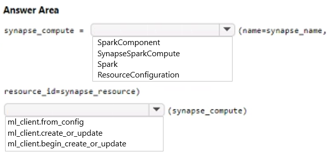
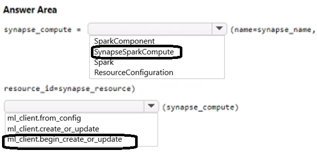

# Question 146

HOTSPOT

-

You are creating data wrangling and model training solutions in an Azure Machine Learning workspace.

You must use the same Python notebook to perform both data wrangling and model training.

You need to use the Azure Machine Learning Python SDK v2 to define and configure the Synapse Spark pool asynchronously in the workspace as dedicated compute.

How should you complete the code segment? To answer, select the appropriate options in the answer area.

NOTE: Each correct selection is worth one point.

  
Show Suggested Answer

 

  
Show Discussions

<blockquote>
<strong>sai384957324</strong> <code>(Thu 10 Oct 2024 21:29)</code> - <em>Upvotes: 1</em>

correct
</blockquote>
<blockquote>
<strong>TA_</strong> <code>(Wed 25 Sep 2024 10:40)</code> - <em>Upvotes: 1</em>

This or very similar on exam 15-03-2024. Several questions related to Synapse Spark
</blockquote>
<blockquote>
<strong>damaldon</strong> <code>(Fri 12 Jan 2024 20:07)</code> - <em>Upvotes: 2</em>

Correct.
</blockquote>
<blockquote>
<strong>Batman160591</strong> <code>(Wed 20 Dec 2023 23:55)</code> - <em>Upvotes: 1</em>

Seems correct
</blockquote>

---

[<< Previous Question](question_145.md) | [Home](/index.md) | [Next Question >>](question_147.md)
