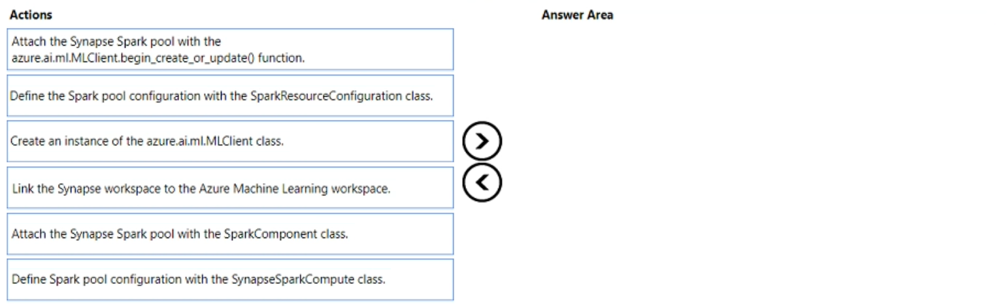
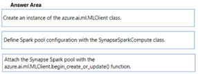

# Question 147

DRAG DROP

-

You create an Azure Machine Learning workspace and an Azure Synapse Analytics workspace with a Spark pool. The workspaces are contained within the same Azure subscription.

You must manage the Synapse Spark pool from the Azure Machine Learning workspace.

You need to attach the Synapse Spark pool in Azure Machine Learning by using the Python SDK v2.

Which three actions should you perform in sequence? To answer, move the appropriate actions from the list of actions to the answer area and arrange them in the correct order.

  
Show Suggested Answer

 

  
Show Discussions

<blockquote>
<strong>TA_</strong> <code>(Mon 25 Mar 2024 11:41)</code> - <em>Upvotes: 1</em>

On exam 15-03-2024
</blockquote>
<blockquote>
<strong>Borjavvvvv</strong> <code>(Mon 18 Dec 2023 20:11)</code> - <em>Upvotes: 3</em>

To attach a Synapse Compute using Python SDK, first create an instance of azure.ai.ml.MLClient class. This provides convenient functions for interaction with Azure Machine Learning services. The following code sample uses azure.identity.DefaultAzureCredential for connecting to a workspace in resource group of a specified Azure subscription. In the following code sample, define the SynapseSparkCompute with the parameters:

name - user-defined name of the new attached Synapse Spark pool.
resource_id - resource ID of the Synapse Spark pool created earlier in the Azure Synapse Analytics workspace.
An azure.ai.ml.MLClient.begin_create_or_update() function call attaches the defined Synapse Spark pool to the Azure Machine Learning workspace.
</blockquote>

<blockquote>
<strong>Mikku123</strong> <code>(Wed 02 Aug 2023 23:12)</code> - <em>Upvotes: 3</em>

My Bad -  The correct sequence is:

Create an instance of the azure.ai.MLClient class
Define the spark pool configuration with the SparkResourceConfiguration class
Attach the Synapse Spark pool with the azure.ai.ml.MLClient.begin_create_or_update() function
</blockquote>

<blockquote>
<strong>Sadhak</strong> <code>(Mon 04 Nov 2024 21:13)</code> - <em>Upvotes: 1</em>

Not SparkResourceConfiguration calss but SynapseSparkCompute class.
</blockquote>
<blockquote>
<strong>Mikku123</strong> <code>(Wed 02 Aug 2023 23:10)</code> - <em>Upvotes: 3</em>

correct answer!
</blockquote>

---

[<< Previous Question](question_146.md) | [Home](/index.md) | [Next Question >>](question_148.md)
