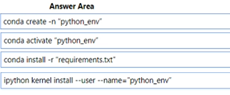

# Question 148

DRAG DROP

-

You manage an Azure Machine Learning workspace named workspace1 with a compute instance named compute1. You connect to compute1 by using a terminal window from workspace1. You create a file named "requirements.txt” containing Python dependencies to include Jupyter.

You need to add a new Jupyter kernel to compute1.

Which four commands should you use? To answer, move the appropriate actions from the list of actions to the answer area and arrange them in the correct order.

  
Show Suggested Answer

 

  
Show Discussions

<blockquote>
<strong>evangelist</strong> <code>(Sun 01 Dec 2024 14:55)</code> - <em>Upvotes: 1</em>

given answer is correct
</blockquote>
<blockquote>
<strong>jojashi</strong> <code>(Fri 29 Nov 2024 11:33)</code> - <em>Upvotes: 1</em>

Correct.
create new environment --&gt; activate new environment --&gt; install packages to the new environment --&gt; create a kernel for that environment

https://learn.microsoft.com/en-us/azure/machine-learning/how-to-access-terminal?view=azureml-api-2
</blockquote>

<blockquote>
<strong>damaldon</strong> <code>(Fri 12 Jan 2024 20:03)</code> - <em>Upvotes: 3</em>

Correct
</blockquote>
<blockquote>
<strong>phdykd</strong> <code>(Wed 27 Dec 2023 18:46)</code> - <em>Upvotes: 4</em>

no, given answer is correct!
</blockquote>
<blockquote>
<strong>Batman160591</strong> <code>(Wed 20 Dec 2023 23:48)</code> - <em>Upvotes: 1</em>

1. ipykernel install --user --name myenv --display-name &quot;Python (myenv)&quot;
2. conda activate myenv
3. pip install -r requirements.txt
4. python -m ipykernel install --user --name myenv --display-name &quot;Python (myenv)&quot;
</blockquote>
<blockquote>
<strong>Plb2</strong> <code>(Sat 07 Sep 2024 19:53)</code> - <em>Upvotes: 1</em>

yes

https://learn.microsoft.com/en-us/azure/machine-learning/how-to-access-terminal?view=azureml-api-2#add-new-kernels
</blockquote>

---

[<< Previous Question](question_147.md) | [Home](/index.md) | [Next Question >>](question_149.md)
