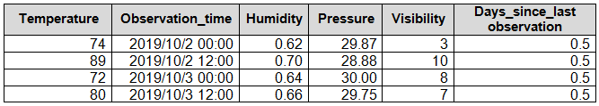
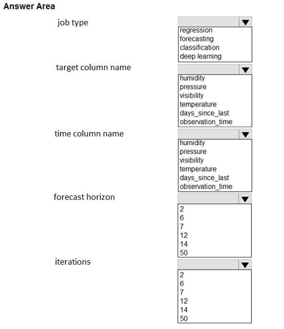
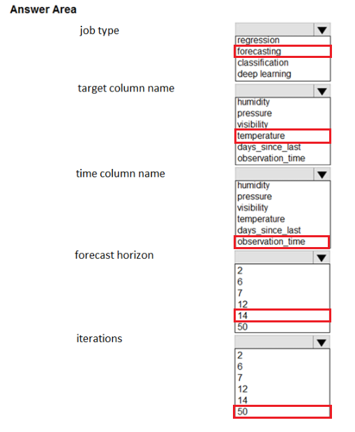

# Question 153

HOTSPOT -

You collect data from a nearby weather station. You have a pandas dataframe named weather_df that includes the following data:

The data is collected every 12 hours: noon and midnight.

You plan to use automated machine learning to create a time-series model that predicts temperature over the next seven days. For the initial round of training, you want to train a maximum of 50 different models.

You must use the Azure Machine Learning SDK v2 to run an automated machine learning experiment to train these models.

You need to configure the automated machine learning job and its settings.

How should you configure parameters of the classes that implement the job? To answer, select the appropriate options in the answer area.

NOTE: Each correct selection is worth one point.

  
Show Suggested Answer

 

  
Show Discussions

<blockquote>
<strong>miumau</strong> <code>(Tue 13 Feb 2024 08:24)</code> - <em>Upvotes: 15</em>

Shouldn&#x27;t the forecast horizon be 14, since the data is in 12 hour intervals &amp; we are asked to get data for the next 7 days?

https://learn.microsoft.com/en-us/azure/machine-learning/reference-automated-ml-forecasting?view=azureml-api-2#forecasting

&quot;The maximum forecast horizon in units of time-series frequency. These units are based on the inferred time interval of your training data, (Ex: monthly, weekly) that the forecaster uses to predict.&quot;
</blockquote>

<blockquote>
<strong>umair_hanu</strong> <code>(Wed 10 Jan 2024 09:29)</code> - <em>Upvotes: 9</em>

IT SHOULD BE FORECASTING
</blockquote>
<blockquote>
<strong>damaldon</strong> <code>(Fri 12 Jan 2024 20:34)</code> - <em>Upvotes: 1</em>

Agree, forecasting
</blockquote>
<blockquote>
<strong>a2c6d4a</strong> <code>(Sat 07 Dec 2024 16:10)</code> - <em>Upvotes: 1</em>

the correct configuration for the parameters of the classes that implement the job is as follows:

Job type: Forecasting
target column name: Temperature
time column name: Observation time
forecast horizon: 7 days
iterations: 50
</blockquote>

<blockquote>
<strong>TA_</strong> <code>(Wed 25 Sep 2024 10:42)</code> - <em>Upvotes: 2</em>

On exam 15-03-2024
</blockquote>
<blockquote>
<strong>NullVoider_0</strong> <code>(Wed 07 Aug 2024 09:20)</code> - <em>Upvotes: 1</em>

Forcast Horizon is 14 since the data collected is every 12 hours which is twice a day for 7 days.
</blockquote>
<blockquote>
<strong>NullVoider_0</strong> <code>(Wed 07 Aug 2024 09:19)</code> - <em>Upvotes: 1</em>

Format Horizon is 14 since the data collected is every 12 hours which is twice a day for 7 days.
</blockquote>
<blockquote>
<strong>PradhanManva</strong> <code>(Mon 25 Mar 2024 07:18)</code> - <em>Upvotes: 1</em>

CHATGPT -
# Define your time-series forecasting task type (e.g., forecasting_future, forecasting_horizon).
# Specify the column you want to predict (e.g., &#x27;temperature&#x27;) and the target lags (e.g., [1, 2, 3]).
# This is important for time-series forecasting.
task = &#x27;forecasting_future&#x27;
target_column_name = &#x27;temperature&#x27;

///****\*\*****

# Configure AutoML settings

automl_config = AutoMLConfig(
task=task,
primary_metric=&#x27;normalized_root_mean_squared_error&#x27;,
training_data=weather_df,
label_column_name=target_column_name,
max_models=50, # Maximum number of models to train
time_column_name=&#x27;timestamp&#x27;, # Name of the time column in your DataFrame
forecast_horizon=7
) **\*\*\*\***/
</blockquote>

<blockquote>
<strong>orionduo</strong> <code>(Thu 29 Feb 2024 01:47)</code> - <em>Upvotes: 3</em>

A regression model provides a function that describes the relationship between one or more independent variables and a response, dependent, or target variable. For example, the relationship between height and weight may be described by a linear regression model.
The first anwser should be forecasting
</blockquote>
<blockquote>
<strong>orionduo</strong> <code>(Thu 29 Feb 2024 02:01)</code> - <em>Upvotes: 1</em>

my mistake
regression model can be used as prediction as well
</blockquote>
<blockquote>
<strong>PI_Team</strong> <code>(Fri 26 Jan 2024 18:11)</code> - <em>Upvotes: 1</em>

Task is forecasting
</blockquote>

---

[<< Previous Question](question_152.md) | [Home](/index.md) | [Next Question >>](question_154.md)
