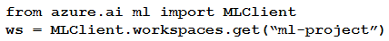

# Question 154

Note: This question is part of a series of questions that present the same scenario. Each question in the series contains a unique solution that might meet the stated goals. Some question sets might have more than one correct solution, while others might not have a correct solution.

After you answer a question in this section, you will NOT be able to return to it. As a result, these questions will not appear in the review screen.

You have the following Azure subscriptions and Azure Machine Learning service workspaces:

You need to obtain a reference to the ml-project workspace.

Solution: Run the following Python code:

Does the solution meet the goal?

- A.Yes
- B.No

  
Show Suggested Answer

<strong>B</strong> 

  
Show Discussions

<blockquote>
<strong>AzureGeek79</strong> <code>(Sun 29 Sep 2024 02:12)</code> - <em>Upvotes: 2</em>

Correct answer is A, see reference below: 
https://learn.microsoft.com/en-us/python/api/azure-ai-ml/azure.ai.ml.operations.workspaceoperations?view=azure-python#azure-ai-ml-operations-workspaceoperations-get
</blockquote>
<blockquote>
<strong>sl_mslconsulting</strong> <code>(Thu 16 May 2024 16:04)</code> - <em>Upvotes: 1</em>

you need to specify subscription id when instantiating the MLClient.
</blockquote>
<blockquote>
<strong>Techlover74</strong> <code>(Sun 18 Feb 2024 05:09)</code> - <em>Upvotes: 1</em>

B is the correct answer because the argument is not passed with the key in get method.
</blockquote>

---

[<< Previous Question](question_153.md) | [Home](/index.md) | [Next Question >>](question_155.md)
