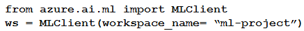

# Question 155

Note: This question is part of a series of questions that present the same scenario. Each question in the series contains a unique solution that might meet the stated goals. Some question sets might have more than one correct solution, while others might not have a correct solution.

After you answer a question in this section, you will NOT be able to return to it. As a result, these questions will not appear in the review screen.

You have the following Azure subscriptions and Azure Machine Learning service workspaces:

You need to obtain a reference to the ml-project workspace.

Solution: Run the following Python code:

Does the solution meet the goal?

- A.Yes
- B.No

  
Show Suggested Answer

<strong>B</strong> 

  
Show Discussions

<blockquote>
<strong>sl_mslconsulting</strong> <code>(Sat 16 Nov 2024 17:12)</code> - <em>Upvotes: 1</em>

Need to specify the subscription id when instantiating the MLClient
</blockquote>
<blockquote>
<strong>Techlover74</strong> <code>(Sun 18 Aug 2024 04:10)</code> - <em>Upvotes: 1</em>

B is correct.
</blockquote>
<blockquote>
<strong>Matt2000</strong> <code>(Mon 12 Aug 2024 10:58)</code> - <em>Upvotes: 1</em>

Same question as the one before (topic 2, 111).
</blockquote>
<blockquote>
<strong>Matt2000</strong> <code>(Mon 12 Aug 2024 10:59)</code> - <em>Upvotes: 1</em>

My mistake. The questions are different.
</blockquote>

---

[<< Previous Question](question_154.md) | [Home](/index.md) | [Next Question >>](question_156.md)
