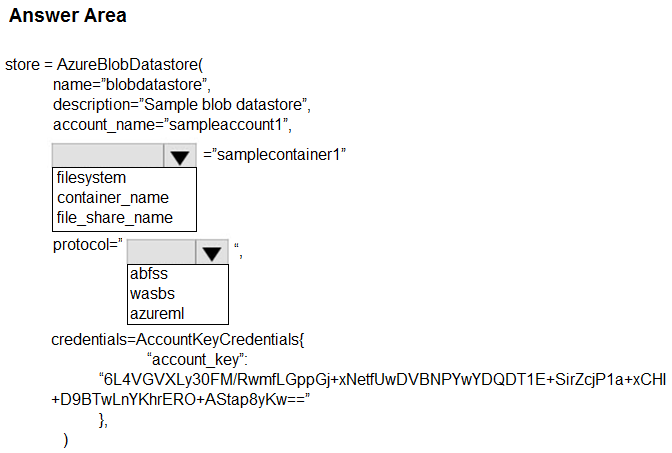
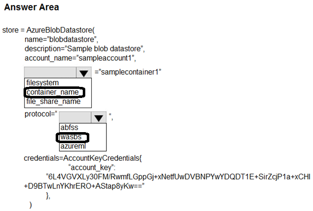

# Question 157

HOTSPOT

-

You manage an Azure Machine Learning workspace named workspace1.

You must register an Azure Blob storage datastore in workspace1 by using an access key. You develop Python SDK v2 code to import all modules required to register the datastore.

You need to complete the Python SDK v2 code to define the datastore.

How should you complete the code? To answer, select the appropriate options in the answer area.

NOTE: Each correct selection is worth one point.

  
Show Suggested Answer

 

  
Show Discussions

<blockquote>
<strong>jl420</strong> <code>(Thu 07 Nov 2024 14:42)</code> - <em>Upvotes: 4</em>

container_name; abfss, because wasb is deprecated
</blockquote>
<blockquote>
<strong>Karthikat</strong> <code>(Tue 05 Mar 2024 19:33)</code> - <em>Upvotes: 2</em>

answer is correct 
https://github.com/Azure/azureml-examples/blob/main/sdk/python/resources/datastores/datastore.ipynb
</blockquote>
<blockquote>
<strong>Matt2000</strong> <code>(Mon 12 Feb 2024 15:20)</code> - <em>Upvotes: 4</em>

wasb[s] has been deprecated. Reference: https://learn.microsoft.com/en-us/azure/databricks/connect/storage/azure-storage. abfs[s] seems to be recommended instead.
</blockquote>

---

[<< Previous Question](question_156.md) | [Home](/index.md) | [Next Question >>](question_158.md)
