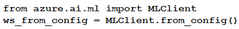

# Question 158

Note: This question is part of a series of questions that present the same scenario. Each question in the series contains a unique solution that might meet the stated goals. Some question sets might have more than one correct solution, while others might not have a correct solution.

After you answer a question in this section, you will NOT be able to return to it. As a result, these questions will not appear in the review screen.

You have the following Azure subscriptions and Azure Machine Learning service workspaces:

You need to obtain a reference to the ml-project workspace.

Solution: Run the following Python code:

Does the solution meet the goal?

- A.Yes
- B.No

  
Show Suggested Answer

<strong>B</strong> 

  
Show Discussions

<blockquote>
<strong>Murzfam</strong> <code>(Tue 28 Jan 2025 06:30)</code> - <em>Upvotes: 1</em>

The questions is reference to ml-project workspace. The solutions is only about auth, so the answer is B.
</blockquote>
<blockquote>
<strong>jl420</strong> <code>(Thu 07 Nov 2024 14:37)</code> - <em>Upvotes: 2</em>

MLClient.from_config() can be used without explicitly providing credentials, as long as your authentication requirements are met in one of the following ways:

Default Authentication with Azure CLI Login:

If you’ve already authenticated using the Azure CLI (e.g., az login), MLClient.from_config() will use your active Azure CLI session for authentication. This is often convenient for development environments and local testing.
Managed Identity (for Azure Compute Resources):

If you’re running your code on an Azure resource with a managed identity (like an Azure Virtual Machine, Azure Kubernetes Service, or Azure Machine Learning Compute Instance), the SDK can authenticate using the managed identity associated with that resource. No additional credentials are needed, as long as the managed identity has access to the Azure ML workspace.
Environment-Based Authentication:

If environment variables for Azure credentials are set (e.g., AZURE_CLIENT_ID, AZURE_TENANT_ID, and AZURE_CLIENT_SECRET for a service principal), MLClient.from_config() will pick up these credentials automatically.
</blockquote>

<blockquote>
<strong>evangelist</strong> <code>(Sun 02 Jun 2024 01:16)</code> - <em>Upvotes: 1</em>

Answer should be Yes, it appeared previously in the exam questions
</blockquote>
<blockquote>
<strong>sl_mslconsulting</strong> <code>(Thu 16 May 2024 16:27)</code> - <em>Upvotes: 2</em>

credential is a required parameter in the from_config method . Link: https://learn.microsoft.com/en-us/python/api/azure-ai-ml/azure.ai.ml.mlclient?view=azure-python#azure-ai-ml-mlclient-from-config
</blockquote>
<blockquote>
<strong>Plb2</strong> <code>(Sat 24 Feb 2024 20:05)</code> - <em>Upvotes: 2</em>

credential-parameter is required
</blockquote>
<blockquote>
<strong>zishankamal</strong> <code>(Thu 15 Feb 2024 04:01)</code> - <em>Upvotes: 2</em>

Unsure. The credential parameter is not specified which is mandatory. Otherwise class and method is correct.
</blockquote>

---

[<< Previous Question](question_157.md) | [Home](../index.md) | [Next Question >>](question_159.md)
