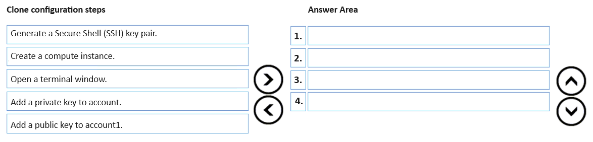
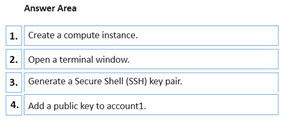

# Question 160

DRAG DROP

-

You have an Azure Machine Learning workspace named WS1 and a GitHub account named account1 that hosts a private repository named repo1.

You need to clone repo1 to make it available directly from WS1. The configuration must maximize the performance of the repo1 clone.

Which four actions should you perform in sequence?

  
Show Suggested Answer

 

  
Show Discussions

<blockquote>
<strong>f11c733</strong> <code>(Mon 17 Jun 2024 15:33)</code> - <em>Upvotes: 2</em>

Correct
</blockquote>

---

[<< Previous Question](question_159.md) | [Home](../index.md) | [Next Question >>](question_161.md)
