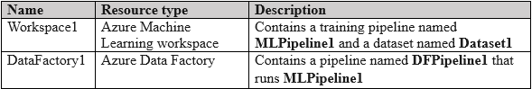
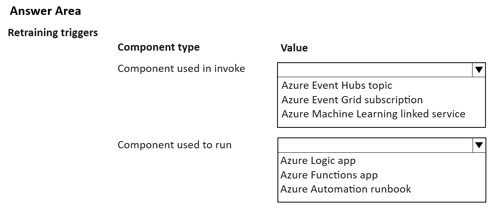
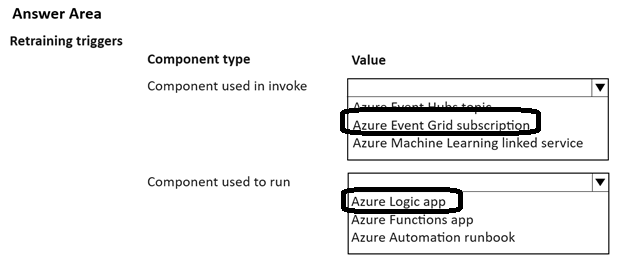

# Question 163

HOTSPOT

-

You manage an Azure subscription that contains the following resources:

You plan to implement a solution that will automatically trigger the retraining of the model implemented by MLPipeline1. The trigger must be invoked if data drift is detected in Dataset1.

You need to select the components to invoke and run the solution. The solution must minimize coding implementation and maintenance efforts.

Which components should you select? To answer, select the appropriate options in the answer area.

NOTE: Each correct selection is worth one point.

  
Show Suggested Answer

 

  
Show Discussions

<blockquote>
<strong>445f1bd</strong> <code>(Mon 21 Jul 2025 14:37)</code> - <em>Upvotes: 1</em>

Event grid

Logic apps (since it says minimal code)
</blockquote>

<blockquote>
<strong>jefimija</strong> <code>(Mon 14 Oct 2024 12:03)</code> - <em>Upvotes: 3</em>

Invoke Component: Azure Event Grid
Run Component: Azure Functions
</blockquote>
<blockquote>
<strong>jefimija</strong> <code>(Mon 28 Oct 2024 12:31)</code> - <em>Upvotes: 1</em>

Or it could be Logic Apps

Can someone explain the difference between Azure Functins and Logic Apps?
</blockquote>

<blockquote>
<strong>nposteraro</strong> <code>(Fri 27 Jun 2025 13:39)</code> - <em>Upvotes: 1</em>

I think it&#x27;s Logic App since is a visual designer with minimal or no code, whereas Functions is more code-centric
</blockquote>

---

[<< Previous Question](question_162.md) | [Home](../index.md) | [Next Question >>](question_164.md)
