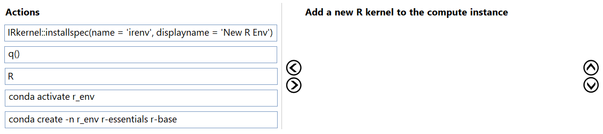
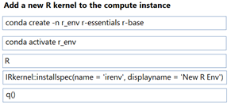

# Question 174

DRAG DROP

-

You have an Azure Machine Learning workspace.

You plan to use the terminal to configure a compute instance to run a notebook.

You need to add a new R kernel to the compute instance.

In which order should you perform the actions? To answer, move all actions from the list of actions to the answer area and arrange them in the correct order.

  
Show Suggested Answer

 

  
Show Discussions

<blockquote>
<strong>Sadhak</strong> <code>(Sun 17 Nov 2024 20:47)</code> - <em>Upvotes: 2</em>

what is R and q()
</blockquote>
<blockquote>
<strong>jefimija</strong> <code>(Mon 14 Oct 2024 13:46)</code> - <em>Upvotes: 4</em>

correct
</blockquote>

---

[<< Previous Question](question_173.md) | [Home](../index.md) | [Next Question >>](question_175.md)
