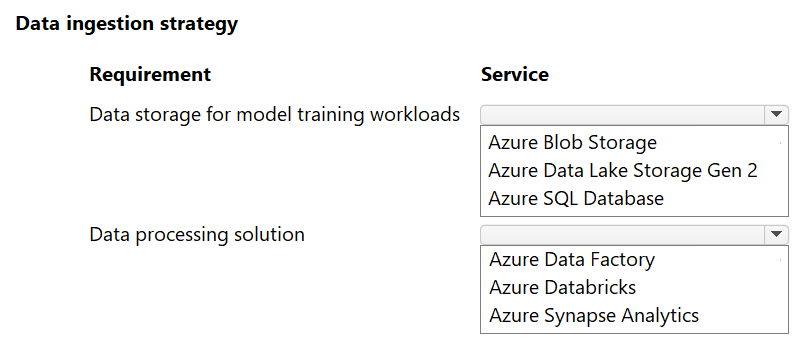
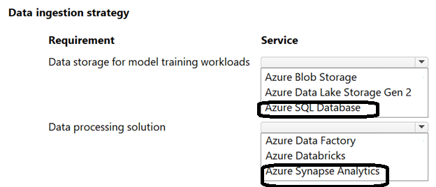

# Question 175

HOTSPOT

-

You design a data processing strategy for a machine learning project.

The data that must be processed includes unstructured flat files that must be processed in real time.

The data transformation must be executed on a serverless compute and optimized for big data analytical workloads.

You need to select the Azure services for the data science team.

Which storage and data processing service should you use? To answer, select the appropriate option in the answer area.

NOTE: Each correct selection is worth one point.

  
Show Suggested Answer

 

  
Show Discussions

<blockquote>
<strong>jefimija</strong> <code>(Mon 14 Oct 2024 13:42)</code> - <em>Upvotes: 12</em>

Data storage for model training workloads: Azure Data Lake Storage Gen 2
Data processing solution: Azure Databricks
</blockquote>
<blockquote>
<strong>f82411e</strong> <code>(Tue 03 Jun 2025 10:37)</code> - <em>Upvotes: 1</em>

Almacenamiento: Azure Data Lake Storage Gen2
Procesamiento: Azure Databricks
</blockquote>
<blockquote>
<strong>MiteshKachhatiya</strong> <code>(Thu 06 Mar 2025 08:02)</code> - <em>Upvotes: 2</em>

&quot;Flat files&quot; -&gt; blob storage
&quot;Serverless&quot; Data Processing -&gt; Data Factory
</blockquote>
<blockquote>
<strong>D0ktor</strong> <code>(Mon 18 Nov 2024 23:07)</code> - <em>Upvotes: 2</em>

Here SERVERLESS is the key word so it should be Azure Data Factory
</blockquote>

---

[<< Previous Question](question_174.md) | [Home](../index.md) | [Next Question >>](question_176.md)
