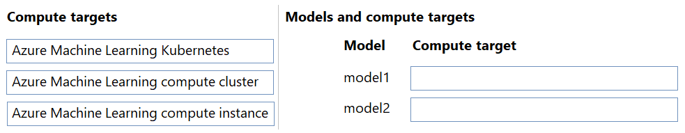
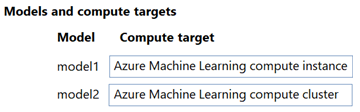

# Question 176

DRAG DROP

-

You have an Azure Machine Learning workspace named WS1.

You plan to use WS1 to train two models named model1 and model2. For model1, you plan to use automated machine learning. For model2, you plan to use Azure Machine Learning designer.

You need to determine the compute targets you should use to train each model. Your solution must ensure the following:

• The compute target for model1 supports auto-shutdown/auto-start based on a schedule.

• The compute target for model2 supports the use of low-priority Azure Virtual Machines.

Which compute targets should you use? To answer, move the appropriate compute targets to the correct model. You may use each compute target once, more than once, or not at all. You may need to move the split bar between panes or scroll to view content.

NOTE: Each correct selection is worth one point.

  
Show Suggested Answer

 

  
Show Discussions

<blockquote>
<strong>f82411e</strong> <code>(Tue 03 Jun 2025 10:51)</code> - <em>Upvotes: 1</em>

Cluster compute 1 and 2
</blockquote>
<blockquote>
<strong>gunn_m</strong> <code>(Sat 23 Nov 2024 19:53)</code> - <em>Upvotes: 3</em>

1 Azure Machine Learning compute cluster
2 Azure Machine Learning compute cluster
</blockquote>
<blockquote>
<strong>gunn_m</strong> <code>(Tue 10 Dec 2024 21:19)</code> - <em>Upvotes: 1</em>

I did a mistake...
1 Azure Machine Learning compute cluster
2 Azure Machine Learning compute instace (azure virtual machines)
</blockquote>
<blockquote>
<strong>Arvindu89</strong> <code>(Sun 27 Oct 2024 04:43)</code> - <em>Upvotes: 3</em>

The answer is correct
</blockquote>

---

[<< Previous Question](question_175.md) | [Home](/index.md) | [Next Question >>](question_177.md)
