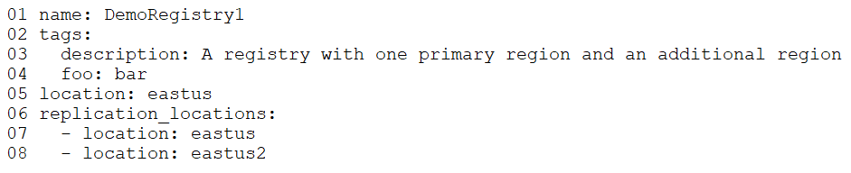
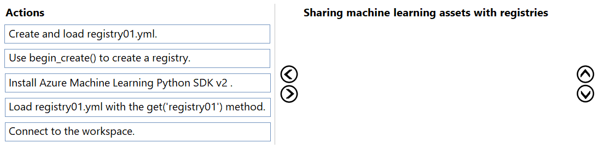
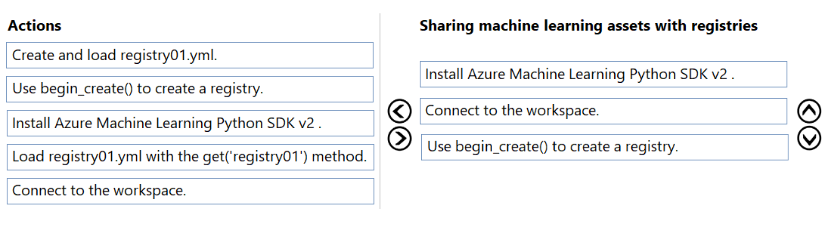

# Question 178

DRAG DROP -

You manage an Azure Machine Learning workspace named workspace1.

You plan to create a registry named registry01 with the help of the following registry.yml (line numbers are used for reference only):

You need to use Azure Machine Learning Python SDK v2 with Python 3.10 in a notebook to interact with workspace1.

Which three actions should you perform in sequence? To answer, move the appropriate actions from the list of actions to the answer area and arrange them in the correct order.

  
Show Suggested Answer

 

  
Show Discussions

<blockquote>
<strong>gunn_m</strong> <code>(Sat 23 Nov 2024 19:47)</code> - <em>Upvotes: 4</em>

The answer is wrong
Install Azure Machine Learning Python SDK v2.
Connect to the workspace.
Use begin_create() to create a registry.
</blockquote>
<blockquote>
<strong>Arvindu89</strong> <code>(Sun 27 Oct 2024 04:16)</code> - <em>Upvotes: 2</em>

Actions
1. Install Azure machine Learning python ADK v2
2. Connect to workspace
3. User begin_create() to create a registry
</blockquote>
<blockquote>
<strong>jefimija</strong> <code>(Mon 14 Oct 2024 13:44)</code> - <em>Upvotes: 3</em>

1. install
2. connect
3. use begin create
</blockquote>

---

[<< Previous Question](question_177.md) | [Home](/index.md) | [Next Question >>](question_179.md)
