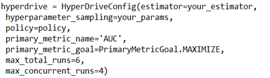
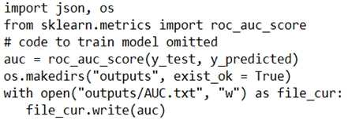

# Question 183

Note: This question is part of a series of questions that present the same scenario. Each question in the series contains a unique solution that might meet the stated goals. Some question sets might have more than one correct solution, while others might not have a correct solution.

After you answer a question in this section, you will NOT be able to return to it. As a result, these questions will not appear in the review screen.

You are using Azure Machine Learning to run an experiment that trains a classification model.

You want to use Hyperdrive to find parameters that optimize the AUC metric for the model. You configure a HyperDriveConfig for the experiment by running the following code:

You plan to use this configuration to run a script that trains a random forest model and then tests it with validation data. The label values for the validation data are stored in a variable named y_test variable, and the predicted probabilities from the model are stored in a variable named y_predicted.

You need to add logging to the script to allow Hyperdrive to optimize hyperparameters for the AUC metric.

Solution: Run the following code:

Does the solution meet the goal?

- A.Yes
- B.No

  
Show Suggested Answer

<strong>B</strong> 

  
Show Discussions

<blockquote>
<strong>scott_klein_12345</strong> <code>(Sat 06 Nov 2021 18:18)</code> - <em>Upvotes: 38</em>

The answer is No.
The exact question appears in the learning material provided by Microsoft. Check out this link - https://docs.microsoft.com/en-us/learn/modules/tune-hyperparameters-with-azure-machine-learning/6a-knowledge-check
</blockquote>
<blockquote>
<strong>chaudha4</strong> <code>(Fri 29 Oct 2021 20:54)</code> - <em>Upvotes: 9</em>

I think the answer is wrong. The logging is printing with &quot;AUC: &quot; while the primary_metric_name is &quot;AUC&quot;. How is hyperdrive experiment suppose to know that they are the same !! Moreover logging should be done on &quot;run&quot; instance. So many mistakes in this code !!
</blockquote>
<blockquote>
<strong>aakash_0086</strong> <code>(Sun 05 Dec 2021 13:45)</code> - <em>Upvotes: 1</em>

Have you ever used python for development , its the logging mechnism where u print any string along with generated log &quot;AUC:&quot; or &quot;XYCCC&quot; anything will be there with str(auc). the solution is correct here
</blockquote>
<blockquote>
<strong>treadst0ne</strong> <code>(Thu 23 Dec 2021 17:11)</code> - <em>Upvotes: 4</em>

Yes, but the question is asking to allow Hyperdrive to optimize hyperparameters.
You need to use: run.log(&#x27;AUC&#x27;, np.float(acc))
https://docs.microsoft.com/en-us/learn/modules/tune-hyperparameters-with-azure-machine-learning/5-hyperdrive-experiment
Correct answer is NO.
</blockquote>
<blockquote>
<strong>evangelist</strong> <code>(Mon 02 Dec 2024 06:37)</code> - <em>Upvotes: 1</em>

# Get the current run context
run = Run.get_context()

# Log the AUC score

run.log(&quot;AUC&quot;, auc)
</blockquote>

<blockquote>
<strong>phdykd</strong> <code>(Mon 07 Aug 2023 19:45)</code> - <em>Upvotes: 2</em>

B. No. The solution does not meet the goal as it only saves the AUC score to a text file in the &quot;outputs&quot; directory. It does not log the AUC metric in a way that can be monitored by Azure Machine Learning and Hyperdrive. In order to allow Hyperdrive to optimize hyperparameters for the AUC metric, the AUC score needs to be logged using the run.log method, as follows:
import json, os
from sklearn.metrics import roc_auc_score
import logging
auc=roc_auc_score(y_test, y_predicted)
run.log(&quot;AUC&quot;, auc)
</blockquote>
<blockquote>
<strong>Tj87</strong> <code>(Mon 24 Oct 2022 01:31)</code> - <em>Upvotes: 2</em>

It seems this question has been repeated for several times. Looking at section &quot;Log metrics for hyperparameter tuning&quot; of Microsoft doc(https://docs.microsoft.com/en-us/azure/machine-learning/how-to-tune-hyperparameters), we need to use the following codes:

from azureml.core.run import Run
run_logger = Run.get_context()
run_logger.log(&quot;accuracy&quot;, float(val_accuracy))
So log.info doesn&#x27;t seem to be the correct option. The hyperDrive needs to know the metric value of each run to be able to compare the values
</blockquote>

<blockquote>
<strong>zehraoneexam</strong> <code>(Fri 16 Sep 2022 06:03)</code> - <em>Upvotes: 1</em>

I think the answer is yes. logging info can print the results. We can have more than one solution...
</blockquote>
<blockquote>
<strong>synapse</strong> <code>(Tue 13 Sep 2022 09:56)</code> - <em>Upvotes: 1</em>

Answer is B. No. 
Get a reference to the Azure ML run context and use a run.log() statement to write the AUC value to the run log
https://docs.microsoft.com/en-us/learn/modules/tune-hyperparameters-with-azure-machine-learning/6a-knowledge-check
</blockquote>
<blockquote>
<strong>Krupek</strong> <code>(Wed 27 Jul 2022 21:15)</code> - <em>Upvotes: 2</em>

answer should be no
</blockquote>
<blockquote>
<strong>BlindedByScience</strong> <code>(Tue 01 Mar 2022 14:36)</code> - <em>Upvotes: 1</em>

The answer should be &#x27;YES&#x27;. The documentation says for print(val) the destination is driver logs.
</blockquote>
<blockquote>
<strong>trickerk</strong> <code>(Fri 07 Jan 2022 06:56)</code> - <em>Upvotes: 1</em>

&quot;You need to add logging&quot;, print() function doesn&#x27;t add any log. So answer is NO.
</blockquote>
<blockquote>
<strong>dtus</strong> <code>(Wed 01 Dec 2021 05:03)</code> - <em>Upvotes: 3</em>

the Answer is NO
</blockquote>

---

[<< Previous Question](question_182.md) | [Home](../index.md) | [Next Question >>](question_184.md)
