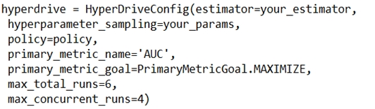
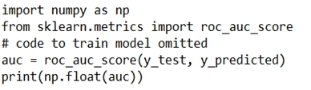

# Question 184

Note: This question is part of a series of questions that present the same scenario. Each question in the series contains a unique solution that might meet the stated goals. Some question sets might have more than one correct solution, while others might not have a correct solution.

After you answer a question in this section, you will NOT be able to return to it. As a result, these questions will not appear in the review screen.

You are using Azure Machine Learning to run an experiment that trains a classification model.

You want to use Hyperdrive to find parameters that optimize the AUC metric for the model. You configure a HyperDriveConfig for the experiment by running the following code:

You plan to use this configuration to run a script that trains a random forest model and then tests it with validation data. The label values for the validation data are stored in a variable named y_test variable, and the predicted probabilities from the model are stored in a variable named y_predicted.

You need to add logging to the script to allow Hyperdrive to optimize hyperparameters for the AUC metric.

Solution: Run the following code:

Does the solution meet the goal?

- A.Yes
- B.No

  
Show Suggested Answer

<strong>B</strong> 

Explanation -

Use a solution with logging.info(message) instead.

Note: Python printing/logging example:

logging.info(message)

Destination: Driver logs, Azure Machine Learning designer

Reference:

https://docs.microsoft.com/en-us/azure/machine-learning/how-to-debug-pipelines

  
Show Discussions

<blockquote>
<strong>chaudha4</strong> <code>(Fri 29 Oct 2021 21:04)</code> - <em>Upvotes: 18</em>

THe question is not about just logging AUC but logging to  allow Hyperdrive to optimize hyperparameters for the AUC metric. So you must log using run instance. That way the Hyperdrive has access to that metric to compare with other runs. SO the correct answer is &quot;No&quot;
</blockquote>
<blockquote>
<strong>Narendra05</strong> <code>(Mon 27 Dec 2021 16:15)</code> - <em>Upvotes: 9</em>

run.log() is the correct answer https://docs.microsoft.com/en-us/azure/machine-learning/how-to-log-view-metrics
</blockquote>
<blockquote>
<strong>evangelist</strong> <code>(Mon 02 Dec 2024 06:37)</code> - <em>Upvotes: 1</em>

# Get the current run context
run = Run.get_context()

# Log the AUC score

run.log(&quot;AUC&quot;, auc)
</blockquote>

<blockquote>
<strong>synapse</strong> <code>(Wed 14 Sep 2022 02:53)</code> - <em>Upvotes: 1</em>

Copying: THe question is not about just logging AUC but logging to allow Hyperdrive to optimize hyperparameters for the AUC metric. So you must log using run instance. That way the Hyperdrive has access to that metric to compare with other runs. SO the correct answer is &quot;No&quot;
</blockquote>
<blockquote>
<strong>azurecert2021</strong> <code>(Fri 24 Dec 2021 16:02)</code> - <em>Upvotes: 2</em>

question is about &quot;You need to add logging to the script to allow Hyperdrive to optimize hyperparameters for the AUC metric.&quot;
so if we go through following links we use run.log to log np.float(reg) whereas printf is used for general debugging.
# Train a logistic regression model
print(&#x27;Training a logistic regression model with regularization rate of&#x27;, reg)
run.log(&#x27;Regularization Rate&#x27;,  np.float(reg))
model = LogisticRegression(C=1/reg, solver=&quot;liblinear&quot;).fit(X_train, y_train)

https://github.com/MicrosoftLearning/DP100/blob/master/08A%20-%20Tuning%20Hyperparameters.ipynb
https://sites.google.com/view/raybellwaves/courses/build-ai-solutions-with-azure-machine-learning
</blockquote>

<blockquote>
<strong>anjurad</strong> <code>(Mon 01 Nov 2021 15:31)</code> - <em>Upvotes: 3</em>

for hyperdrive to optimise, it has to extract the chosen metric from the experiment run, through what has been logged.  The log name has to match the primary metric name specified in config.  The values aren&#x27;t being logged in the example script - and printing doesn&#x27;t capture the key/value pairs required to do the matching and comparison
</blockquote>
<blockquote>
<strong>levm39</strong> <code>(Fri 08 Oct 2021 07:48)</code> - <em>Upvotes: 4</em>

the print statement can be used to debug, but in this piece of code you are only printing np.float(AUC), so you are only printing the conversion of a value to float, you are not printing any debugging information from the algorithm.
</blockquote>
<blockquote>
<strong>dev2dev</strong> <code>(Mon 13 Sep 2021 04:53)</code> - <em>Upvotes: 3</em>

Answer is Yes. We can use either logger or print as per the referenced document
print(val)
logging.info(message)
</blockquote>
<blockquote>
<strong>stonefl</strong> <code>(Sat 18 Sep 2021 16:13)</code> - <em>Upvotes: 1</em>

yes, agree. Correct answer should be A.
</blockquote>
<blockquote>
<strong>Anty85</strong> <code>(Thu 23 Sep 2021 12:59)</code> - <em>Upvotes: 1</em>

Indeed. https://docs.microsoft.com/en-us/azure/machine-learning/how-to-debug-pipelines - under &quot;Logging options and behaviour&quot;.
</blockquote>
<blockquote>
<strong>cab123</strong> <code>(Wed 27 Oct 2021 22:37)</code> - <em>Upvotes: 9</em>

but this is not for debugging but to use on hyperdrive
</blockquote>
<blockquote>
<strong>VJPrakash</strong> <code>(Wed 09 Feb 2022 11:23)</code> - <em>Upvotes: 1</em>

When we are able to debug, will you not be able to extract that as well ?
documentation says, its logged to -Driver logs, Azure Machine Learning designer
</blockquote>

---

[<< Previous Question](question_183.md) | [Home](../index.md) | [Next Question >>](question_185.md)
