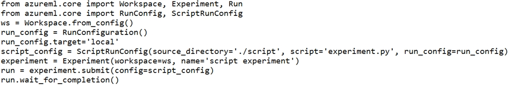

# Question 185

You use the following code to run a script as an experiment in Azure Machine Learning:

You must identify the output files that are generated by the experiment run.

You need to add code to retrieve the output file names.

Which code segment should you add to the script?

- A.files = run.get_properties()
- B.files= run.get_file_names()
- C.files = run.get_details_with_logs()
- D.files = run.get_metrics()
- E.files = run.get_details()

  
Show Suggested Answer

<strong>B</strong> 

You can list all of the files that are associated with this run record by called run.get_file_names()

Reference:

https://docs.microsoft.com/en-us/azure/machine-learning/how-to-track-experiments

  
Show Discussions

<blockquote>
<strong>Yuriy_Ch</strong> <code>(Fri 08 Mar 2024 12:14)</code> - <em>Upvotes: 5</em>

on exam 07/March/2023
</blockquote>
<blockquote>
<strong>fvil</strong> <code>(Tue 07 Nov 2023 15:42)</code> - <em>Upvotes: 5</em>

On exam 07/11/2022
</blockquote>
<blockquote>
<strong>damaldon</strong> <code>(Fri 12 Jul 2024 19:55)</code> - <em>Upvotes: 1</em>

Correct.
https://learn.microsoft.com/en-us/python/api/azureml-core/azureml.core.run.run?view=azure-ml-py
</blockquote>
<blockquote>
<strong>racnaoamo</strong> <code>(Fri 19 May 2023 07:48)</code> - <em>Upvotes: 4</em>

similar question on 18-5-22
</blockquote>
<blockquote>
<strong>synapse</strong> <code>(Tue 14 Mar 2023 04:05)</code> - <em>Upvotes: 2</em>

given answer is correct. https://docs.microsoft.com/en-us/python/api/azureml-core/azureml.core.run.run?view=azure-ml-py#get-file-names
</blockquote>
<blockquote>
<strong>hargur</strong> <code>(Thu 20 Oct 2022 09:43)</code> - <em>Upvotes: 3</em>

on 19Oct2021
</blockquote>
<blockquote>
<strong>kisskeo</strong> <code>(Tue 04 Oct 2022 22:12)</code> - <em>Upvotes: 3</em>

On Exam 01 Oct 2021
</blockquote>
<blockquote>
<strong>mthombenindhl84</strong> <code>(Sun 11 Sep 2022 21:59)</code> - <em>Upvotes: 4</em>

on exam 11/9/2021
</blockquote>
<blockquote>
<strong>dushmantha</strong> <code>(Wed 31 Aug 2022 13:14)</code> - <em>Upvotes: 3</em>

On exam 2021/08/31
</blockquote>
<blockquote>
<strong>ljljljlj</strong> <code>(Mon 11 Jul 2022 13:59)</code> - <em>Upvotes: 5</em>

On exam 2021/7/10
</blockquote>
<blockquote>
<strong>Abdulraoufhakeem</strong> <code>(Mon 04 Jul 2022 05:09)</code> - <em>Upvotes: 4</em>

100% correct.
</blockquote>
<blockquote>
<strong>azurecert2021</strong> <code>(Fri 24 Jun 2022 19:22)</code> - <em>Upvotes: 4</em>

yes given answer is correct
https://docs.microsoft.com/en-us/python/api/azureml-core/azureml.core.run.run?view=azure-ml-py#get-file-names--
</blockquote>
<blockquote>
<strong>HkIsCrazY</strong> <code>(Mon 20 Jun 2022 19:54)</code> - <em>Upvotes: 3</em>

The answer is correct! view the link: https://docs.microsoft.com/en-us/python/api/azureml-core/azureml.core.run.run?view=azure-ml-py
</blockquote>
<blockquote>
<strong>SaulG</strong> <code>(Wed 08 Jun 2022 07:27)</code> - <em>Upvotes: 3</em>

B is the correct answer!
</blockquote>

---

[<< Previous Question](question_184.md) | [Home](../index.md) | [Next Question >>](question_186.md)
