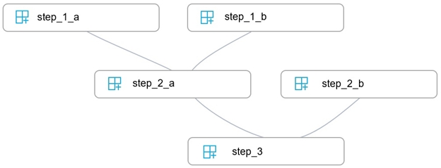
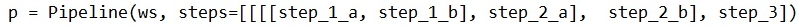
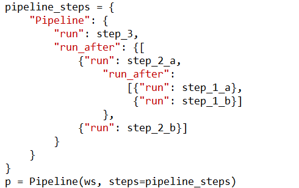
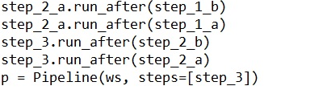
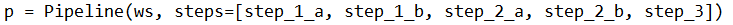

# Question 187

You write five Python scripts that must be processed in the order specified in Exhibit A `" which allows the same modules to run in parallel, but will wait for modules with dependencies.

You must create an Azure Machine Learning pipeline using the Python SDK, because you want to script to create the pipeline to be tracked in your version control system. You have created five PythonScriptSteps and have named the variables to match the module names.

You need to create the pipeline shown. Assume all relevant imports have been done.

Which Python code segment should you use?

A.

B.

C.

D.

  
Show Suggested Answer

<strong>A</strong> 

The steps parameter is an array of steps. To build pipelines that have multiple steps, place the steps in order in this array.

Reference:

https://docs.microsoft.com/en-us/azure/machine-learning/how-to-use-parallel-run-step

  
Show Discussions

<blockquote>
<strong>david_Fdz</strong> <code>(Tue 20 Apr 2021 00:31)</code> - <em>Upvotes: 33</em>

it should be D
</blockquote>
<blockquote>
<strong>chaudha4</strong> <code>(Tue 04 May 2021 13:49)</code> - <em>Upvotes: 18</em>

Correct answer is D. The dependencies of steps is implicitly defined in the step itself (via arguments parameter that could be an output from some other step). Read https://docs.microsoft.com/en-us/python/api/azureml-pipeline-core/azureml.pipeline.core.pipelinedata?view=azure-ml-py.
</blockquote>
<blockquote>
<strong>chaudha4</strong> <code>(Tue 04 May 2021 13:50)</code> - <em>Upvotes: 5</em>

You could also use StepSequence but that is not an option in this question. See https://docs.microsoft.com/en-us/python/api/azureml-pipeline-core/azureml.pipeline.core.builder.stepsequence?view=azure-ml-py
</blockquote>
<blockquote>
<strong>jpalaci22</strong> <code>(Fri 17 Feb 2023 18:50)</code> - <em>Upvotes: 1</em>

I check that same link you posted and it doesn&#x27;t show in this method. This shows as an example when there&#x27;s no flow control so this works for no flow control but this example seems to critically need A as the answer to control the flow
</blockquote>
<blockquote>
<strong>Antoh1978</strong> <code>(Sun 01 Sep 2024 00:37)</code> - <em>Upvotes: 1</em>

I would go for D
</blockquote>
<blockquote>
<strong>deyoz</strong> <code>(Fri 01 Mar 2024 05:43)</code> - <em>Upvotes: 1</em>

I go for D, chaudha4 explanation below is spot-on.
</blockquote>
<blockquote>
<strong>Plb2</strong> <code>(Sat 24 Feb 2024 22:10)</code> - <em>Upvotes: 2</em>

A would be correct if it had been
p = Pipeline(ws, steps=StepSequence(steps=[initial_steps, step4]))

https://learn.microsoft.com/en-us/python/api/azureml-pipeline-core/azureml.pipeline.core.stepsequence?view=azure-ml-py#remarks
</blockquote>

<blockquote>
<strong>vv_bb</strong> <code>(Sun 12 Nov 2023 21:05)</code> - <em>Upvotes: 5</em>

It should be C

Check these links:

1. https://learn.microsoft.com/en-us/python/api/azureml-pipeline-core/azureml.pipeline.core.builder.pipelinestep?view=azure-ml-py#azureml-pipeline-core-builder-pipelinestep-run-after

2. https://github.com/Azure/MachineLearningNotebooks/blob/master/how-to-use-azureml/machine-learning-pipelines/intro-to-pipelines/aml-pipelines-getting-started.ipynb
-&gt; section &quot;Running a few steps in sequence&quot;
</blockquote>
<blockquote>
<strong>phdykd</strong> <code>(Mon 10 Jul 2023 01:55)</code> - <em>Upvotes: 3</em>

C could be
</blockquote>
<blockquote>
<strong>iai</strong> <code>(Sun 28 May 2023 13:24)</code> - <em>Upvotes: 1</em>

A. is also wrong because it creates a non documented dependency of step_2_b on step_2_a
</blockquote>
<blockquote>
<strong>ajay0011</strong> <code>(Thu 06 Apr 2023 00:43)</code> - <em>Upvotes: 1</em>

I will definitely go with D
</blockquote>
<blockquote>
<strong>esimsek</strong> <code>(Thu 23 Mar 2023 12:44)</code> - <em>Upvotes: 2</em>

it should be C
</blockquote>
<blockquote>
<strong>STEVTRANCE</strong> <code>(Fri 06 Jan 2023 03:10)</code> - <em>Upvotes: 4</em>

I don&#x27;t want to create confusion but I was unable to find documentation about this, so I used chatGCP and it provides code samples, it seems that A is not an option cause the steps parameter should be a list of steps, not a nested list of steps. Option C the pipeline definition is missing the steps that step3 depends on, so like chaudha4 explains the dependencies are implicitly and I would go for option D
</blockquote>
<blockquote>
<strong>jpalaci22</strong> <code>(Fri 17 Feb 2023 18:49)</code> - <em>Upvotes: 1</em>

I agree. I checked it with ChatGPT (for fun as well) but also verified with the https://docs.microsoft.com/en-us/python/api/azureml-pipeline-core/azureml.pipeline.core.pipelinedata?view=azure-ml-py which is funny  because someone used it earlier to justify D, which it doesn&#x27;t seem to be correct via the documentation and Microsoft&#x27;s Jupyter notebooks
</blockquote>
<blockquote>
<strong>michaelmorar</strong> <code>(Sat 31 Dec 2022 12:44)</code> - <em>Upvotes: 2</em>

A gets my vote. D has absolutely no sequence and C fails to run step 2_a.
</blockquote>
<blockquote>
<strong>FlexingD</strong> <code>(Sat 05 Nov 2022 08:00)</code> - <em>Upvotes: 1</em>

see the graph, so it&#x27;s A
</blockquote>
<blockquote>
<strong>ning</strong> <code>(Thu 19 May 2022 16:06)</code> - <em>Upvotes: 8</em>

A is correct, that is the syntax I used for years!
</blockquote>
<blockquote>
<strong>JTWang</strong> <code>(Mon 17 Oct 2022 06:39)</code> - <em>Upvotes: 1</em>

Agree!
</blockquote>
<blockquote>
<strong>Tj87</strong> <code>(Sun 24 Apr 2022 01:49)</code> - <em>Upvotes: 4</em>

D misses the StepSequence and it means it runs all the steps in parallel. Then C seems to be a better option. The only problem with C is that it doesn&#x27;t run 1_a and 1_b in parallel and it runs them sequentially.
</blockquote>
<blockquote>
<strong>JTWang</strong> <code>(Wed 30 Mar 2022 09:32)</code> - <em>Upvotes: 3</em>

it should be C
Running a few steps in sequence
https://github.com/Azure/MachineLearningNotebooks/blob/master/how-to-use-azureml/machine-learning-pipelines/intro-to-pipelines/aml-pipelines-getting-started.ipynb
</blockquote>
<blockquote>
<strong>synapse</strong> <code>(Mon 14 Mar 2022 04:29)</code> - <em>Upvotes: 1</em>

I think the answer is D
I think the key here is this sentence: &quot;but will wait for modules with dependencies.&quot;  This means the lines indicate data dependencies between steps not just the sequence. run_after() or any such constructs are for sequencing where there are no data dependencies between the steps. 
Text from the notebook linked below:
We will reuse step1, step2, step3, but build the pipeline in such a way that we chain step3 after step2 and step2 after step1. Note that there is no explicit data dependency between these steps, but still steps can be made dependent by using the run_after construct.
https://github.com/Azure/MachineLearningNotebooks/blob/master/how-to-use-azureml/machine-learning-pipelines/intro-to-pipelines/aml-pipelines-getting-started.ipynb
</blockquote>

---

[<< Previous Question](question_186.md) | [Home](/index.md) | [Next Question >>](question_188.md)
