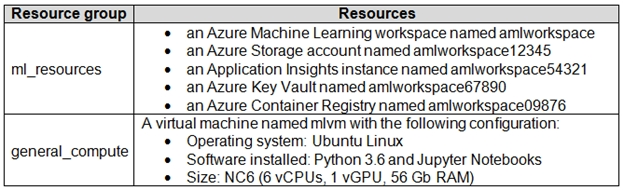

# Question 189

Note: This question is part of a series of questions that present the same scenario. Each question in the series contains a unique solution that might meet the stated goals. Some question sets might have more than one correct solution, while others might not have a correct solution.

After you answer a question in this section, you will NOT be able to return to it. As a result, these questions will not appear in the review screen.

An IT department creates the following Azure resource groups and resources:

The IT department creates an Azure Kubernetes Service (AKS)-based inference compute target named aks-cluster in the Azure Machine Learning workspace.

You have a Microsoft Surface Book computer with a GPU. Python 3.6 and Visual Studio Code are installed.

You need to run a script that trains a deep neural network (DNN) model and logs the loss and accuracy metrics.

Solution: Attach the mlvm virtual machine as a compute target in the Azure Machine Learning workspace. Install the Azure ML SDK on the Surface Book and run

Python code to connect to the workspace. Run the training script as an experiment on the mlvm remote compute resource.

Does the solution meet the goal?

- A.Yes
- B.No

  
Show Suggested Answer

<strong>A</strong> 

  
Show Discussions

<blockquote>
<strong>bkuchi</strong> <code>(Wed 15 Dec 2021 15:04)</code> - <em>Upvotes: 9</em>

Question was there in June 2021 Exam
</blockquote>
<blockquote>
<strong>Yuriy_Ch</strong> <code>(Fri 08 Sep 2023 11:15)</code> - <em>Upvotes: 5</em>

Exactly this question was on exam 07/March/2023
</blockquote>
<blockquote>
<strong>sl_mslconsulting</strong> <code>(Sun 17 Nov 2024 02:55)</code> - <em>Upvotes: 1</em>

Remote VMs are considered as a unmanaged and can require extra steps for you to maintain or to improve performance for machine learning workloads. I interpret this as you won&#x27;t be able to log the metrics out-of-the box. Link: require extra steps for you to maintain or to improve performance for machine learning workloads. https://learn.microsoft.com/en-us/azure/machine-learning/concept-compute-target?view=azureml-api-2#unmanaged-compute
</blockquote>
<blockquote>
<strong>MarinaMijailovic</strong> <code>(Wed 13 Dec 2023 16:04)</code> - <em>Upvotes: 2</em>

Isn&#x27;t inference cluster used for deployment and not for training?
</blockquote>
<blockquote>
<strong>Deathking15</strong> <code>(Mon 13 May 2024 20:42)</code> - <em>Upvotes: 3</em>

I believe what&#x27;s currently recommended as the compute resource for deployment is a Kubernetes compute, but the question is simply asking if the given compute can work, not whether it&#x27;s the most optimal.
</blockquote>
<blockquote>
<strong>krishna1818</strong> <code>(Wed 29 Nov 2023 11:02)</code> - <em>Upvotes: 1</em>

existing VM has to be attached
</blockquote>
<blockquote>
<strong>ahson0124</strong> <code>(Tue 15 Aug 2023 12:42)</code> - <em>Upvotes: 3</em>

In exam on 2023-02-15
</blockquote>
<blockquote>
<strong>robotcop</strong> <code>(Sun 28 May 2023 14:50)</code> - <em>Upvotes: 1</em>

no objection
</blockquote>
<blockquote>
<strong>ning</strong> <code>(Fri 18 Nov 2022 13:42)</code> - <em>Upvotes: 1</em>

Attach existing VM as a target, sounds correct
</blockquote>
<blockquote>
<strong>synapse</strong> <code>(Wed 14 Sep 2022 03:33)</code> - <em>Upvotes: 1</em>

Given answer is correct
</blockquote>
<blockquote>
<strong>ranjsi01</strong> <code>(Sun 17 Jul 2022 03:37)</code> - <em>Upvotes: 1</em>

correct
</blockquote>
<blockquote>
<strong>TheCyanideLancer</strong> <code>(Tue 21 Jun 2022 07:26)</code> - <em>Upvotes: 2</em>

Is the given answer correct?
</blockquote>
<blockquote>
<strong>hargur</strong> <code>(Wed 20 Apr 2022 09:43)</code> - <em>Upvotes: 2</em>

on 19Oct2021
</blockquote>
<blockquote>
<strong>snsnsnsn</strong> <code>(Thu 03 Mar 2022 08:28)</code> - <em>Upvotes: 3</em>

on exam 2/9/21
</blockquote>
<blockquote>
<strong>dushmantha</strong> <code>(Mon 28 Feb 2022 14:15)</code> - <em>Upvotes: 3</em>

On exam 2021/08/31
</blockquote>

---

[<< Previous Question](question_188.md) | [Home](/index.md) | [Next Question >>](question_190.md)
