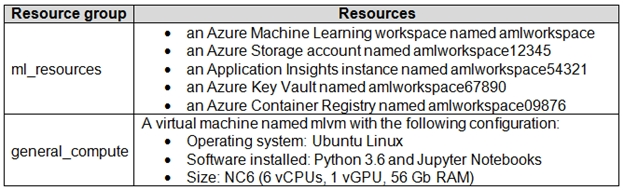

# Question 191

Note: This question is part of a series of questions that present the same scenario. Each question in the series contains a unique solution that might meet the stated goals. Some question sets might have more than one correct solution, while others might not have a correct solution.

After you answer a question in this section, you will NOT be able to return to it. As a result, these questions will not appear in the review screen.

An IT department creates the following Azure resource groups and resources:

The IT department creates an Azure Kubernetes Service (AKS)-based inference compute target named aks-cluster in the Azure Machine Learning workspace.

You have a Microsoft Surface Book computer with a GPU. Python 3.6 and Visual Studio Code are installed.

You need to run a script that trains a deep neural network (DNN) model and logs the loss and accuracy metrics.

Solution: Install the Azure ML SDK on the Surface Book. Run Python code to connect to the workspace and then run the training script as an experiment on local compute.

Does the solution meet the goal?

- A.Yes
- B.No

  
Show Suggested Answer

<strong>A</strong> 

  
Show Discussions

<blockquote>
<strong>dev2dev</strong> <code>(Fri 17 Sep 2021 04:44)</code> - <em>Upvotes: 24</em>

we can run locally. anwer is yes
</blockquote>
<blockquote>
<strong>Manishi_VBA</strong> <code>(Sat 06 Nov 2021 03:21)</code> - <em>Upvotes: 10</em>

The answer should be yes. The local machine does have the capability to run DNN
</blockquote>
<blockquote>
<strong>f82411e</strong> <code>(Tue 03 Jun 2025 11:46)</code> - <em>Upvotes: 1</em>

la respuesta es no
</blockquote>
<blockquote>
<strong>evangelist</strong> <code>(Mon 02 Dec 2024 11:15)</code> - <em>Upvotes: 1</em>

answer is A, yes, AKS is used as inference compute target, inference means hosting and deploying the model not training the model
</blockquote>
<blockquote>
<strong>sl_mslconsulting</strong> <code>(Sun 17 Nov 2024 03:00)</code> - <em>Upvotes: 1</em>

Even the doc says you can use Local computer as a training target, but I can&#x27;t find any detailed steps to do this. Besides, it will still be unmanaged compute and I doubt you can log the metrics that can be utilized to improve the performance of the model.
</blockquote>
<blockquote>
<strong>sl_mslconsulting</strong> <code>(Sun 17 Nov 2024 03:04)</code> - <em>Upvotes: 1</em>

ChatGPT said I was wrong. The answer should be A.
</blockquote>
<blockquote>
<strong>PI_Team</strong> <code>(Sat 27 Jan 2024 12:28)</code> - <em>Upvotes: 1</em>

The question only asks about running a script that trains a DNN model and logs the loss and accuracy metrics. In that case, the solution does meet the goal. Installing the Azure ML SDK on the Surface Book and running the training script as an experiment on local compute would allow you to train a DNN model and log the loss and accuracy metrics.

SaM
</blockquote>

<blockquote>
<strong>krishna1818</strong> <code>(Wed 29 Nov 2023 11:07)</code> - <em>Upvotes: 2</em>

yes we can run the DNN locally
</blockquote>
<blockquote>
<strong>Yuriy_Ch</strong> <code>(Fri 08 Sep 2023 11:15)</code> - <em>Upvotes: 2</em>

Exactly this question was on exam 07/March/2023
</blockquote>
<blockquote>
<strong>ahson0124</strong> <code>(Tue 15 Aug 2023 12:42)</code> - <em>Upvotes: 3</em>

In exam on 2023-02-15
</blockquote>
<blockquote>
<strong>slcheng</strong> <code>(Thu 27 Apr 2023 11:57)</code> - <em>Upvotes: 1</em>

Ans : A
</blockquote>
<blockquote>
<strong>majma</strong> <code>(Wed 30 Nov 2022 14:52)</code> - <em>Upvotes: 1</em>

if we should log the metrics into the workspace then answer is correct
</blockquote>
<blockquote>
<strong>ning</strong> <code>(Fri 18 Nov 2022 13:45)</code> - <em>Upvotes: 2</em>

This question is so poorly written ...
Can we run local DNN, yes, we can ...
Does that use the VM listed, no it is not ...
As question is asking for whether we can run ...
So I will vote for YES
</blockquote>
<blockquote>
<strong>JoshuaXu</strong> <code>(Fri 06 May 2022 21:46)</code> - <em>Upvotes: 3</em>

on 6 Nov 2021, the answer should be &quot;yes&quot;
</blockquote>
<blockquote>
<strong>hargur</strong> <code>(Wed 20 Apr 2022 09:43)</code> - <em>Upvotes: 1</em>

on 19Oct2021
</blockquote>
<blockquote>
<strong>kail85</strong> <code>(Tue 28 Dec 2021 10:21)</code> - <em>Upvotes: 3</em>

No indication if cudatoolkit is installed. Just have python and gpu is not enough to run dnn.
</blockquote>
<blockquote>
<strong>lewitt</strong> <code>(Wed 15 Mar 2023 12:51)</code> - <em>Upvotes: 2</em>

technically you don&#x27;t even need a GPU to run a DNN. Its just faster with one, but having python and a cpu is enough to run a DNN in normal cases.
</blockquote>
<blockquote>
<strong>treadst0ne</strong> <code>(Mon 20 Dec 2021 19:46)</code> - <em>Upvotes: 4</em>

The answer should be YES, you can log metrics running locally without attaching the computer.
The only case to attach your computer, is to make it available as a ComputeTarget when running experiments.
</blockquote>
<blockquote>
<strong>chaudha4</strong> <code>(Thu 04 Nov 2021 17:42)</code> - <em>Upvotes: 4</em>

The answer is Yes. The surface book has a GPU and even though there is no mention of RAM, it seems like the surface book is capable of training a DNN model.
</blockquote>

---

[<< Previous Question](question_190.md) | [Home](/index.md) | [Next Question >>](question_192.md)
