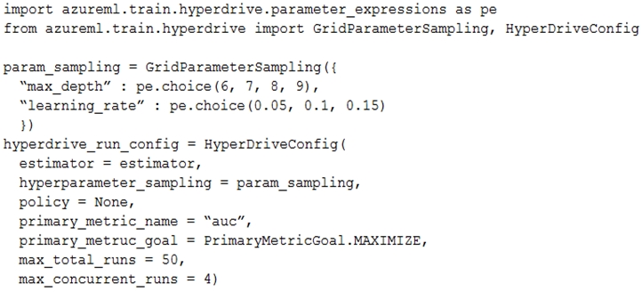
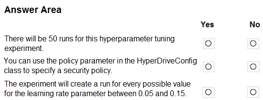
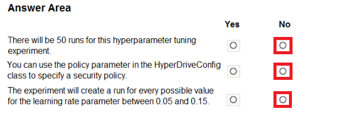

# Question 192

HOTSPOT -

You plan to use Hyperdrive to optimize the hyperparameters selected when training a model. You create the following code to define options for the hyperparameter experiment:

For each of the following statements, select Yes if the statement is true. Otherwise, select No.

NOTE: Each correct selection is worth one point.

Hot Area:

  
Show Suggested Answer

 

  
Show Discussions

<blockquote>
<strong>ExamTaker177</strong> <code>(Tue 14 Sep 2021 18:09)</code> - <em>Upvotes: 40</em>

Box 2 should be NO as &#x27;Policy&#x27; parameter is for early termination policy not security policy.
</blockquote>
<blockquote>
<strong>kty</strong> <code>(Thu 23 Sep 2021 20:05)</code> - <em>Upvotes: 14</em>

agree 3 NO
</blockquote>
<blockquote>
<strong>JB246</strong> <code>(Sun 24 Oct 2021 09:41)</code> - <em>Upvotes: 16</em>

So Answer could be 3 NO s
</blockquote>
<blockquote>
<strong>NullVoider_0</strong> <code>(Tue 18 Jun 2024 11:23)</code> - <em>Upvotes: 4</em>

Please verify the information in the solution section to this question. The actual answer is 
1. Yes. The max_total_runs parameter is set to 50, so the hyperparameter tuning experiment will have up to 50 total iterations.
2. No. The policy parameter in HyperDriveConfig relates to the early termination policy, not security policies. It defines stopping rules for low-performing runs.
3. No. The learning rate parameter uses GridParameterSampling with discrete values specified (0.05, 0.1, 0.15). So only 3 options listed would be searched, not the full range.
</blockquote>
<blockquote>
<strong>MarinaMijailovic</strong> <code>(Wed 27 Dec 2023 16:17)</code> - <em>Upvotes: 1</em>

Can someone explain why thrid box is a no when grid sampling tries every possible option?
</blockquote>
<blockquote>
<strong>Lapiduse</strong> <code>(Tue 23 Jan 2024 03:25)</code> - <em>Upvotes: 1</em>

because there are only three options defined: 0.05, 0.1, 0.15 and they will be tested. Otherwise, there is an infinite number of options between 0.05 and 0.15
</blockquote>
<blockquote>
<strong>vish9</strong> <code>(Mon 20 Nov 2023 11:52)</code> - <em>Upvotes: 1</em>

First box Yes. Second Box No, Third Box No. 
For the first box, the total number of combinations of max_depth and learning rate is 81. However runs will be capped to 50, by max_runs parameter.
</blockquote>
<blockquote>
<strong>deyoz</strong> <code>(Sun 01 Sep 2024 05:04)</code> - <em>Upvotes: 1</em>

how it is 81 combinations, shouldn&#x27;t be just 12 (4*3)
</blockquote>
<blockquote>
<strong>ZIMARAKI</strong> <code>(Tue 25 Jul 2023 14:31)</code> - <em>Upvotes: 2</em>

Its No, No and No
</blockquote>
<blockquote>
<strong>ning</strong> <code>(Sun 20 Nov 2022 14:18)</code> - <em>Upvotes: 4</em>

No, No, No, Policy = Early Termination Policy
</blockquote>
<blockquote>
<strong>racnaoamo</strong> <code>(Sat 19 Nov 2022 08:49)</code> - <em>Upvotes: 1</em>

similar question on 18-5-22
</blockquote>
<blockquote>
<strong>kevinvbc</strong> <code>(Tue 25 Oct 2022 19:02)</code> - <em>Upvotes: 1</em>

Box 2 should be NO
</blockquote>
<blockquote>
<strong>TheYazan</strong> <code>(Sat 10 Sep 2022 04:51)</code> - <em>Upvotes: 3</em>

On march 2022
</blockquote>
<blockquote>
<strong>tom2hoso</strong> <code>(Wed 23 Mar 2022 04:44)</code> - <em>Upvotes: 8</em>

Box1 No
Box2 No
Box3 No
</blockquote>
<blockquote>
<strong>dev2dev</strong> <code>(Fri 17 Sep 2021 05:25)</code> - <em>Upvotes: 10</em>

very funny answer. box 1 is yes, 2 is no, 3 is no
</blockquote>
<blockquote>
<strong>dev2dev</strong> <code>(Fri 24 Sep 2021 11:46)</code> - <em>Upvotes: 7</em>

box 1 is no which is correct, because its max limit, expierment can finish before that
</blockquote>
<blockquote>
<strong>Dasist</strong> <code>(Mon 27 Sep 2021 13:57)</code> - <em>Upvotes: 8</em>

Box 1 should be yes as no early termination policy has been set.
</blockquote>
<blockquote>
<strong>Anty85</strong> <code>(Tue 28 Sep 2021 17:49)</code> - <em>Upvotes: 14</em>

Yet there are only 12 options to test for the grid sampling.
</blockquote>
<blockquote>
<strong>gamezone25</strong> <code>(Wed 20 Oct 2021 19:28)</code> - <em>Upvotes: 5</em>

Correct, since there are only 12 options to test, there will only be 12 options (sample space is smaller than the max_total_runs).
https://docs.microsoft.com/en-us/python/api/azureml-train-core/azureml.train.hyperdrive.hyperdriveconfig?view=azure-ml-py#parameters
</blockquote>
<blockquote>
<strong>BleadFast</strong> <code>(Mon 13 Sep 2021 17:34)</code> - <em>Upvotes: 5</em>

box 2 is No
https://docs.microsoft.com/en-us/python/api/azureml-train-core/azureml.train.hyperdrive.hyperdriveconfig?view=azure-ml-py
Policy: The early termination policy to use. If None - the default, no early termination policy will be used.
</blockquote>

---

[<< Previous Question](question_191.md) | [Home](../index.md) | [Next Question >>](question_193.md)
