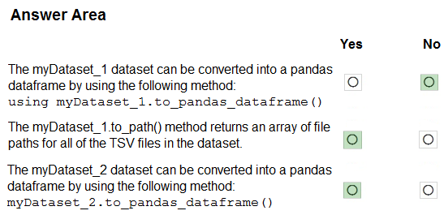

# Question 193

HOTSPOT -

You have an Azure blob container that contains a set of TSV files. The Azure blob container is registered as a datastore for an Azure Machine Learning service workspace. Each TSV file uses the same data schema.

You plan to aggregate data for all of the TSV files together and then register the aggregated data as a dataset in an Azure Machine Learning workspace by using the Azure Machine Learning SDK for Python.

You run the following code.

For each of the following statements, select Yes if the statement is true. Otherwise, select No.

NOTE: Each correct selection is worth one point.

Hot Area:

  
Show Suggested Answer

 

Box 1: No -

FileDataset references single or multiple files in datastores or from public URLs. The TSV files need to be parsed.

Box 2: Yes -

to_path() gets a list of file paths for each file stream defined by the dataset.

Box 3: Yes -

TabularDataset.to_pandas_dataframe loads all records from the dataset into a pandas DataFrame.

TabularDataset represents data in a tabular format created by parsing the provided file or list of files.

Note: TSV is a file extension for a tab-delimited file used with spreadsheet software. TSV stands for Tab Separated Values. TSV files are used for raw data and can be imported into and exported from spreadsheet software. TSV files are essentially text files, and the raw data can be viewed by text editors, though they are often used when moving raw data between spreadsheets.

Reference:

https://docs.microsoft.com/en-us/python/api/azureml-core/azureml.data.tabulardataset

  
Show Discussions

<blockquote>
<strong>SaulG</strong> <code>(Fri 09 Dec 2022 07:12)</code> - <em>Upvotes: 18</em>

Answer No, Yes, Yes is correct!
</blockquote>
<blockquote>
<strong>Dilesha</strong> <code>(Mon 19 Aug 2024 00:39)</code> - <em>Upvotes: 4</em>

On Exam 17 Feb 2023
</blockquote>
<blockquote>
<strong>majma</strong> <code>(Thu 30 Nov 2023 14:55)</code> - <em>Upvotes: 1</em>

Should be 3 No
</blockquote>
<blockquote>
<strong>kkkk_jjjj</strong> <code>(Mon 18 Sep 2023 08:41)</code> - <em>Upvotes: 3</em>

on exam 18/03/2022
</blockquote>
<blockquote>
<strong>TheYazan</strong> <code>(Sun 10 Sep 2023 04:52)</code> - <em>Upvotes: 2</em>

On march 2022
</blockquote>
<blockquote>
<strong>JoshuaXu</strong> <code>(Sat 06 May 2023 21:47)</code> - <em>Upvotes: 1</em>

on exam 6 Nov 2021
</blockquote>
<blockquote>
<strong>AI247</strong> <code>(Sat 06 May 2023 11:18)</code> - <em>Upvotes: 1</em>

Was in exam 11/05/2021
</blockquote>
<blockquote>
<strong>pkal</strong> <code>(Sat 25 Mar 2023 00:10)</code> - <em>Upvotes: 1</em>

on exam 9/24/2021
</blockquote>
<blockquote>
<strong>ljljljlj</strong> <code>(Wed 11 Jan 2023 15:00)</code> - <em>Upvotes: 4</em>

On exam 2021/7/10
</blockquote>
<blockquote>
<strong>slash_nyk</strong> <code>(Mon 16 Jan 2023 04:37)</code> - <em>Upvotes: 5</em>

how many questions came from this dump ?
</blockquote>

---

[<< Previous Question](question_192.md) | [Home](/index.md) | [Next Question >>](question_194.md)
