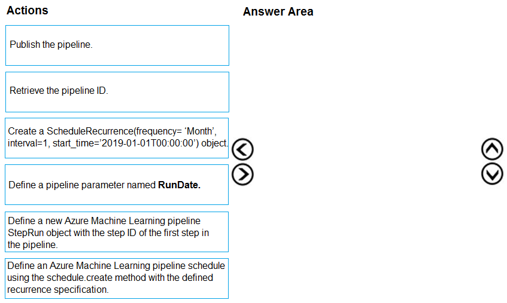
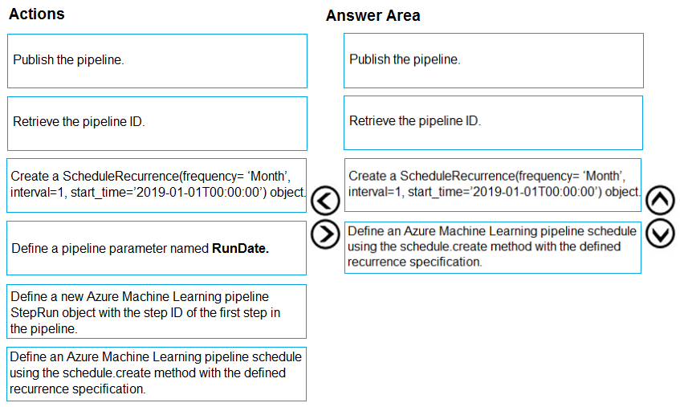

# Question 194

DRAG DROP -

You create a multi-class image classification deep learning model.

The model must be retrained monthly with the new image data fetched from a public web portal. You create an Azure Machine Learning pipeline to fetch new data, standardize the size of images, and retrain the model.

You need to use the Azure Machine Learning SDK to configure the schedule for the pipeline.

Which four actions should you perform in sequence? To answer, move the appropriate actions from the list of actions to the answer area and arrange them in the correct order.

Select and Place:

  
Show Suggested Answer

 

Step 1: Publish the pipeline.

To schedule a pipeline, you&#x27;ll need a reference to your workspace, the identifier of your published pipeline, and the name of the experiment in which you wish to create the schedule.

Step 2: Retrieve the pipeline ID.

Needed for the schedule.

Step 3: Create a ScheduleRecurrence..

To run a pipeline on a recurring basis, you&#x27;ll create a schedule. A Schedule associates a pipeline, an experiment, and a trigger.

First create a schedule. Example: Create a Schedule that begins a run every 15 minutes: recurrence = ScheduleRecurrence(frequency=&quot;Minute&quot;, interval=15)

Step 4: Define an Azure Machine Learning pipeline schedule..

Example, continued:

recurring_schedule = Schedule.create(ws, name=&quot;MyRecurringSchedule&quot;, description=&quot;Based on time&quot;, pipeline_id=pipeline_id, experiment_name=experiment_name, recurrence=recurrence)

Reference:

https://docs.microsoft.com/en-us/azure/machine-learning/how-to-schedule-pipelines

  
Show Discussions

<blockquote>
<strong>BilJon</strong> <code>(Tue 28 Sep 2021 16:37)</code> - <em>Upvotes: 17</em>

Answer is corrrect
</blockquote>
<blockquote>
<strong>evangelist</strong> <code>(Mon 02 Dec 2024 13:34)</code> - <em>Upvotes: 1</em>

Answer is correct and also the sequence
</blockquote>
<blockquote>
<strong>ning</strong> <code>(Sun 20 Nov 2022 14:32)</code> - <em>Upvotes: 1</em>

Correct, given that you have the model and pipeline ready, and you want to schedule a run
</blockquote>
<blockquote>
<strong>racnaoamo</strong> <code>(Sat 19 Nov 2022 08:50)</code> - <em>Upvotes: 4</em>

on exam 18-5-22
</blockquote>
<blockquote>
<strong>snsnsnsn</strong> <code>(Thu 03 Mar 2022 08:29)</code> - <em>Upvotes: 2</em>

on 2/9/21
</blockquote>
<blockquote>
<strong>datamijn</strong> <code>(Wed 02 Feb 2022 09:46)</code> - <em>Upvotes: 4</em>

on 2/8/2021
</blockquote>
<blockquote>
<strong>azurecert2021</strong> <code>(Sat 25 Dec 2021 16:12)</code> - <em>Upvotes: 4</em>

given answer is correct
so that you can initiate the scheduled runs of a pipeline, the pipelinemust be created and published first. Then you have to create a ScheduleRecurrence (trigger) objectand, finally the Schedule itself, connecting the pipeline (via its id) and the trigger object must becreated and run. You can watch the scheduled pipelines in the Endpoints section of the ML Studio.
https://docs.microsoft.com/en-us/azure/machine-learning/how-to-schedule-pipelines
https://github.com/Azure/MachineLearningNotebooks/blob/master/how-to-use-azureml/machine-learning-pipelines/intro-to-pipelines/aml-pipelines-setup-schedule-for-a-published-pipeline.ipynb
</blockquote>

---

[<< Previous Question](question_193.md) | [Home](../index.md) | [Next Question >>](question_195.md)
