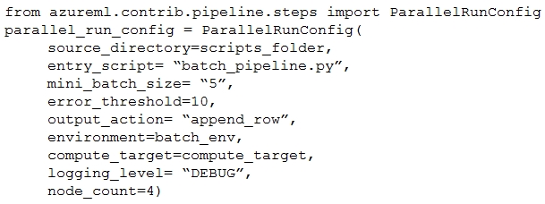

# Question 195

You create a batch inference pipeline by using the Azure ML SDK. You configure the pipeline parameters by executing the following code:

You need to obtain the output from the pipeline execution.

Where will you find the output?

- A.the digit_identification.py script
- B.the debug log
- C.the Activity Log in the Azure portal for the Machine Learning workspace
- D.the Inference Clusters tab in Machine Learning studio
- E.a file named parallel_run_step.txt located in the output folder

  
Show Suggested Answer

<strong>E</strong> 

  
Show Discussions

<blockquote>
<strong>ljljljlj</strong> <code>(Mon 11 Jul 2022 14:01)</code> - <em>Upvotes: 11</em>

On exam 2021/7/10
</blockquote>
<blockquote>
<strong>PI_Team</strong> <code>(Sat 27 Jul 2024 12:15)</code> - <em>Upvotes: 2</em>

By default, the ParallelRunStep class writes its output to a file named parallel_run_step.txt in the specified output directory. This file contains the concatenated output from all the mini-batches processed by the pipeline. Each line in the file represents the output from a single mini-batch.
</blockquote>
<blockquote>
<strong>ahson0124</strong> <code>(Thu 15 Feb 2024 13:43)</code> - <em>Upvotes: 4</em>

In exam on 2023-02-15
</blockquote>
<blockquote>
<strong>Edriv</strong> <code>(Sat 16 Dec 2023 11:35)</code> - <em>Upvotes: 1</em>

https://learn.microsoft.com/en-us/azure/machine-learning/migrate-to-v2-execution-parallel-run-step
</blockquote>
<blockquote>
<strong>Edriv</strong> <code>(Mon 08 Jan 2024 17:42)</code> - <em>Upvotes: 2</em>

https://learn.microsoft.com/en-us/python/api/azureml-pipeline-steps/azureml.pipeline.steps.parallelrunconfig?view=azure-ml-py
</blockquote>
<blockquote>
<strong>JTWang</strong> <code>(Sat 22 Apr 2023 10:46)</code> - <em>Upvotes: 3</em>

on exam 04/22/2022
</blockquote>
<blockquote>
<strong>synapse</strong> <code>(Tue 14 Mar 2023 05:15)</code> - <em>Upvotes: 2</em>

Given answer is correct
</blockquote>
<blockquote>
<strong>TheYazan</strong> <code>(Tue 14 Feb 2023 09:18)</code> - <em>Upvotes: 2</em>

Correct
</blockquote>

---

[<< Previous Question](question_194.md) | [Home](../index.md) | [Next Question >>](question_196.md)
